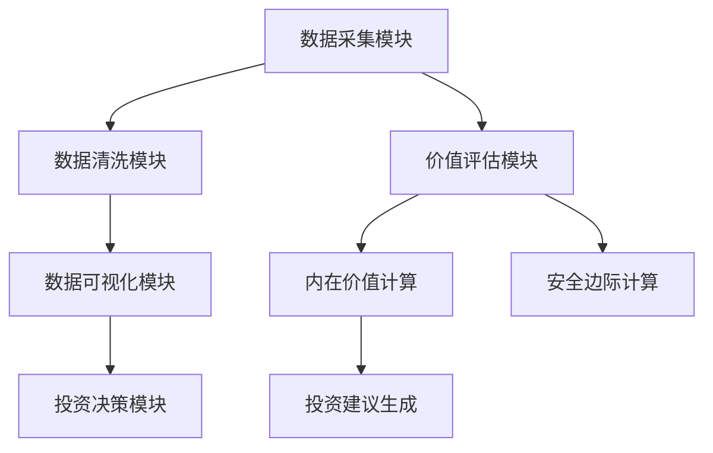

                 


# 巴菲特的价格与价值区分

## 关键词：价值投资，巴菲特，价格与价值，内在价值，市场价值，安全边际

## 摘要：  
巴菲特的价格与价值区分是价值投资的核心理念之一。他强调投资的本质是购买企业的一部分，而不是单纯地关注市场价格的波动。本文将从巴菲特的投资哲学出发，详细阐述价格与价值区分的核心概念、数学模型、系统分析方法以及实际案例。通过本文的分析，读者将能够理解巴菲特如何通过区分价格与价值来实现长期稳定的收益。

---

# 第1章 巴菲特投资哲学与价值投资概述

## 1.1 价值投资的核心理念  
### 1.1.1 投资的本质  
价值投资的核心理念是将股票视为企业的一部分，而不是市场的纸片。巴菲特认为，投资的本质是通过分析企业的基本面，找到具有持续竞争优势和良好管理团队的企业，然后以合理的价格买入并长期持有。

### 1.1.2 价格与价值的定义  
- **价值（Intrinsic Value）**：指股票的内在价值，即企业未来现金流的现值，反映了企业的实际价值。  
- **价格（Market Price）**：指股票在市场上的交易价格，受市场情绪和供需关系影响。  

### 1.1.3 价格与价值区分的意义  
巴菲特强调，价格与价值的区分是投资成功的关键。当市场价格低于内在价值时，投资者可以买入并长期持有，反之则应卖出或避免买入。

---

## 1.2 巴菲特的价值投资策略  
### 1.2.1 长期投资与复利效应  
巴菲特倡导长期投资，通过复利效应实现财富的稳步增长。他认为，短期的价格波动是市场的噪音，而长期的价格走势最终由企业的内在价值决定。

### 1.2.2 安全边际的概念  
安全边际是指内在价值与市场价格之间的差距。巴菲特认为，安全边际的存在能够降低投资的风险，确保在市场价格波动时仍能获得收益。

### 1.2.3 企业的竞争优势  
巴菲特倾向于投资具有持续竞争优势的企业，例如可口可乐和IBM。他认为，这些企业能够在长期的竞争中保持优势，并为股东创造持续的收益。

---

## 1.3 巴菲特投资成功的关键因素  
### 1.3.1 独特的思维方式  
巴菲特的思维方式以“逆向投资”为核心，即在市场恐慌时寻找机会，在市场狂热时保持冷静。  

### 1.3.2 严格的投资纪律  
巴菲特强调遵循价值投资的原则，避免被市场情绪左右。他通过制定严格的投资纪律，确保在市场价格波动时仍能保持理性决策。

### 1.3.3 对企业的深入分析  
巴菲特通过对企业的财务报表、管理层能力和行业地位的深入分析，找到具有长期竞争优势的企业。

---

## 1.4 本章小结  
本章从巴菲特的价值投资哲学出发，详细阐述了价格与价值区分的核心理念、投资策略以及成功的关键因素。通过理解巴菲特的投资哲学，读者可以更好地掌握价值投资的精髓。

---

# 第2章 价格与价值区分的核心概念与数学模型

## 2.1 内在价值的计算方法  
### 2.1.1 现金流折现模型（DCF）  
现金流折现模型是计算内在价值的核心方法。公式如下：  
$$ V = \frac{CF}{r - g} $$  
其中，\( V \) 是内在价值，\( CF \) 是未来现金流，\( r \) 是折现率，\( g \) 是现金流增长率。  

### 2.1.2 市盈率与市净率的比较  
- **市盈率（P/E）**：市场价格与每股收益的比率。  
- **市净率（P/B）**：市场价格与每股净资产的比率。  

### 2.1.3 股息率与股票价值的关系  
股息率是市场价格与每股股息的比率，反映了股票的分红能力。  

---

## 2.2 市场价格波动的规律与影响因素  
### 2.2.1 市场情绪对价格的影响  
市场情绪是市场价格波动的重要因素。当市场情绪乐观时，市场价格可能高于内在价值；当市场情绪悲观时，市场价格可能低于内在价值。

### 2.2.2 市场周期与投资机会  
市场价格的波动具有周期性，投资者可以通过对市场周期的分析，找到投资机会。

### 2.2.3 安全边际的数学模型  
安全边际可以通过以下公式计算：  
$$ \text{安全边际} = V - P $$  
其中，\( V \) 是内在价值，\( P \) 是市场价格。

---

## 2.3 核心概念对比表格  
| 概念       | 定义                                                                 |
|------------|----------------------------------------------------------------------|
| 内在价值    | 股票未来现金流的现值，反映企业的真实价值                                 |
| 市场价格    | 当前市场上的股票交易价格，受市场情绪和供需关系影响                     |
| 安全边际    | 内在价值与市场价格的差值，衡量投资的安全性                             |

---

## 2.4 本章小结  
本章详细解释了内在价值、市场价格和安全边际的核心概念，并通过数学模型和公式，展示了价格与价值区分的内在逻辑。

---

# 第3章 巴菲特投资策略的系统分析与架构设计

## 3.1 投资决策模型的构建  
### 3.1.1 数据收集与处理  
投资者需要收集企业的财务数据、行业数据和市场数据，进行清洗和预处理。

### 3.1.2 模型构建与验证  
通过现金流折现模型（DCF）计算内在价值，并与市场价格进行对比，验证模型的有效性。

### 3.1.3 系统架构设计  
- 数据采集模块：负责收集企业财务数据和市场数据。  
- 价值评估模块：通过DCF模型计算内在价值。  
- 投资决策模块：根据内在价值与市场价格的对比，生成投资建议。

---

## 3.2 系统功能设计  
### 3.2.1 数据分析模块  
- 数据清洗：去除无效数据，处理异常值。  
- 数据可视化：通过图表展示企业财务数据和市场数据。  

### 3.2.2 价值评估模块  
- 内在价值计算：使用DCF模型计算股票的内在价值。  
- 安全边际计算：对比内在价值与市场价格，计算安全边际。  

### 3.2.3 投资决策模块  
- 投资建议生成：根据安全边际和市场周期，生成买入、持有或卖出的投资建议。

---

## 3.3 系统架构图（mermaid）  


---

## 3.4 本章小结  
本章通过系统分析的方法，构建了投资决策模型，并通过mermaid图展示了系统的架构设计。投资者可以通过该模型，实现对股票价格与价值的系统化分析。

---

# 第4章 巴菲特投资策略的实际应用与案例分析

## 4.1 实际案例分析  
### 4.1.1 可口可乐案例  
巴菲特于1988年投资可口可乐，当时市场价格远低于内在价值。通过长期持有，他获得了丰厚的回报。

### 4.1.2 IBM案例  
巴菲特于2011年投资IBM，当时市场价格低于内在价值。通过长期持有，他实现了资本增值。

---

## 4.2 投资策略的代码实现  
```python
def calculate_intrinsic_value(cf, r, g):
    return cf / (r - g)

def calculate_market_price(stock_data):
    return stock_data['close'].iloc[-1]

def calculate_margin_of_safety(iv, mp):
    return iv - mp

# 示例数据
cf = 100000000  # 未来现金流
r = 0.12        # 折现率
g = 0.05        # 现金流增长率
iv = calculate_intrinsic_value(cf, r, g)
mp = calculate_market_price(stock_data)
mos = calculate_margin_of_safety(iv, mp)

print(f"内在价值: {iv}")
print(f"市场价格: {mp}")
print(f"安全边际: {mos}")
```

---

## 4.3 本章小结  
本章通过实际案例分析和代码实现，展示了巴菲特投资策略的实际应用。投资者可以通过对企业的内在价值和市场价格的分析，找到具有安全边际的投资机会。

---

# 第5章 巴菲特投资策略的优化与拓展

## 5.1 投资策略的优化  
### 5.1.1 动态调整模型参数  
根据市场变化，动态调整DCF模型的参数，提高模型的准确性。

### 5.1.2 结合技术分析  
将技术分析与基本面分析相结合，提高投资决策的准确性。

---

## 5.2 拓展阅读  
### 5.2.1 巴菲特的书籍  
- 《聪明的投资者》  
- 《巴菲特致股东的信》  

### 5.2.2 相关研究文献  
- Graham, B. (1949). *The Intelligent Investor*  
- Fama, E. (1970). *Efficient Capital Markets*  

---

## 5.3 本章小结  
本章探讨了巴菲特投资策略的优化与拓展，为投资者提供了进一步研究的方向。

---

# 作者：AI天才研究院/AI Genius Institute & 禅与计算机程序设计艺术/Zen And The Art of Computer Programming

---

通过本文的详细分析，读者可以深入理解巴菲特的价格与价值区分理念，并将其应用于实际投资中。

