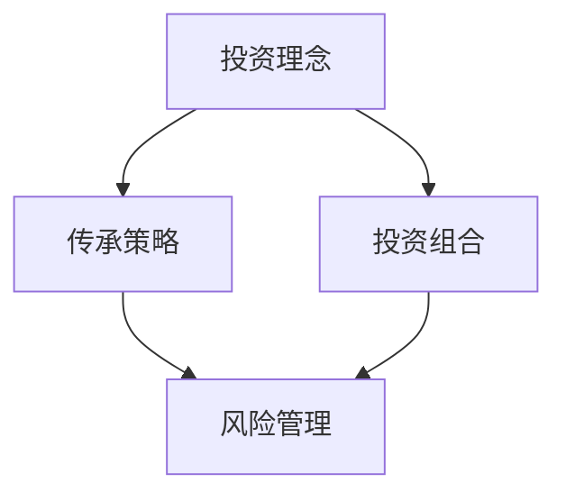

                 


# 巴菲特的传承计划：如何传递投资智慧

> 关键词：巴菲特，投资智慧，传承计划，价值投资，安全边际，风险管理

> 摘要：本文详细探讨了巴菲特的投资智慧及其传承计划的实施策略。通过分析巴菲特的核心投资理念、传承计划的设计与实施，以及数学模型和系统架构的设计，本文为读者提供了如何有效传递投资智慧的深度分析。

---

# 第一部分：巴菲特的投资智慧与传承计划背景

## 第1章：巴菲特的投资智慧概述

### 1.1 巴菲特的投资理念

#### 1.1.1 价值投资的核心思想
巴菲特的价值投资理念强调购买低于内在价值的股票，并长期持有。内在价值是未来现金流的现值，可以通过以下公式计算：
$$ V = \frac{E}{k} $$
其中，\( V \) 是股票的内在价值，\( E \) 是公司未来现金流的现值，\( k \) 是折现率。

#### 1.1.2 安全边际的概念与应用
安全边际是巴菲特投资策略中的关键原则。它是指市场价格低于内在价值的部分：
$$ \text{安全边际} = \text{市场价格} - \text{内在价值} $$
通过保持安全边际，投资者可以降低风险并确保长期收益。

#### 1.1.3 长期投资的哲学基础
巴菲特认为长期投资能够避免短期市场波动的干扰。他的投资哲学强调选择具备持续竞争优势的企业，并长期持有，以实现财富的稳定增长。

### 1.2 巴菲特的成功秘诀

#### 1.2.1 股票分析的三要素
巴菲特的股票分析方法包括：
1. **持续竞争优势**：企业是否具备长期的竞争优势。
2. **管理层诚信与能力**：管理层是否值得信赖且有能力。
3. **财务状况的稳健性**：财务报表是否稳健，是否有足够的现金流。

#### 1.2.2 财务报表解读的关键指标
巴菲特关注的关键财务指标包括：
- 营业利润率（Net Profit Margin）
- 资产周转率（Asset Turnover）
- 负债水平（Debt Levels）

#### 1.2.3 投资组合管理的艺术
巴菲特的投资组合管理强调分散投资和集中投资相结合。他建议投资者将资金分散投资于少数具备长期竞争优势的企业，并长期持有。

### 1.3 巴菲特的传承计划背景

#### 1.3.1 传承计划的必要性
随着巴菲特年龄的增长，传承计划的必要性日益凸显。如何将他的投资智慧传递给下一代或团队，成为一个重要课题。

#### 1.3.2 传承计划的核心目标
传承计划的核心目标是确保巴菲特的投资智慧能够被长期传承，继续为投资者创造价值。

#### 1.3.3 传承计划的实施路径
传承计划的实施路径包括：
1. **家族传承**：将投资理念和方法传递给家族成员。
2. **事业传承**：通过伯克希尔哈撒韦公司等平台，将投资智慧应用于实际投资中。
3. **理念传承**：通过书籍、演讲等方式，将投资智慧传播给更广泛的投资者群体。

---

## 第2章：巴非特投资智慧的核心概念

### 2.1 价值投资的数学模型

#### 2.1.1 股票内在价值的计算公式
股票的内在价值可以通过未来现金流的现值计算得出：
$$ V = \frac{E}{k} $$
其中，\( E \) 是未来现金流的现值，\( k \) 是折现率。

#### 2.1.2 现金流的预测与计算
现金流的预测需要考虑企业的盈利能力、增长潜力以及行业前景。例如，假设某企业未来5年的现金流分别为100万、120万、140万、160万和180万，折现率为8%。计算现值如下：

| 年份 | 现金流 | 现值系数 | 现值 |
|------|--------|----------|------|
| 1    | 100万  | 0.9259   | 92.59万 |
| 2    | 120万  | 0.8566   | 102.79万 |
| 3    | 140万  | 0.7974   | 111.64万 |
| 4    | 160万  | 0.7385   | 118.16万 |
| 5    | 180万  | 0.6896   | 124.13万 |

总现值 = 92.59 + 102.79 + 111.64 + 118.16 + 124.13 = 549.31万

因此，内在价值 \( V = \frac{549.31}{0.08} = 6,866.38万 \)

### 2.2 安全边际的计算方法

#### 2.2.1 安全边际的定义
安全边际是市场价格低于内在价值的部分：
$$ \text{安全边际} = \text{市场价格} - \text{内在价值} $$

#### 2.2.2 安全边际的重要性
安全边际提供了风险缓冲，确保在市场价格波动时，投资者仍能获得正收益。

### 2.3 股票选择的三步法

#### 2.3.1 寻找具备持续竞争优势的企业
具备持续竞争优势的企业通常在行业内具有领先地位，且具备强大的品牌和客户忠诚度。

#### 2.3.2 分析管理层的诚信与能力
管理层的诚信和能力直接影响企业的长期发展。投资者需要选择值得信赖且有能力的管理层。

#### 2.3.3 评估财务状况的稳健性
稳健的财务状况包括合理的负债水平、充足的现金流和健康的盈利能力。

---

## 第3章：巴菲特传承计划的核心策略

### 3.1 长期投资的哲学

#### 3.1.1 长期投资的逻辑
长期投资能够避免短期市场波动的干扰，同时利用复利效应实现财富增长。

#### 3.1.2 长期投资的风险控制
长期投资的风险控制包括：
- 选择具备持续竞争优势的企业。
- 保持足够的安全边际。
- 避免过度集中投资。

#### 3.1.3 长期投资的收益模型
长期投资的收益可以通过以下公式计算：
$$ \text{收益} = \text{内在价值增长} \times \text{复利效应} $$

### 3.2 分散投资的风险管理

#### 3.2.1 分散投资的原理
分散投资通过将资金分配到不同的资产或行业中，降低投资组合的整体风险。

#### 3.2.2 分散投资的数学模型
投资组合的风险可以通过以下公式计算：
$$ \text{风险} = \sqrt{\sum_{i=1}^{n} w_i^2 \sigma_i^2} $$
其中，\( w \) 是资产的权重，\( \sigma \) 是资产的风险标准差。

#### 3.2.3 分散投资的实际应用
例如，将资金分散投资于股票、债券、房地产等多种资产，以降低整体风险。

### 3.3 股东权益的保护机制

#### 3.3.1 股东权益的定义
股东权益是指股东在公司中的权益，包括股本、资本公积、盈余公积和未分配利润等。

#### 3.3.2 股东权益的保护措施
保护股东权益的措施包括：
- 建立有效的公司治理结构。
- 确保财务透明度。
- 防范管理层滥用职权。

#### 3.3.3 股东权益的实现路径
通过合理的股权分配、透明的财务披露和有效的公司治理，保护股东权益。

---

## 第4章：巴菲特传承计划的系统架构

### 4.1 传承计划的系统模型

#### 4.1.1 传承计划的系统构成
传承计划的系统构成包括：
- 投资理念模块：包含价值投资、安全边际等核心理念。
- 传承策略模块：包含长期投资、分散投资等策略。
- 风险管理模块：包含风险评估、风险控制等措施。

#### 4.1.2 传承计划的系统功能
- 提供投资智慧的传承框架。
- 实现投资理念的系统化管理。
- 优化投资策略的执行效率。

#### 4.1.3 传承计划的系统架构
使用 Mermaid 绘制系统架构图如下：



### 4.2 传承计划的实施步骤

#### 4.2.1 传承计划的规划阶段
- 确定传承目标。
- 制定传承策略。
- 评估风险和可行性。

#### 4.2.2 传承计划的执行阶段
- 实施投资策略。
- 监控执行过程。
- 调整传承计划。

#### 4.2.3 传承计划的监控阶段
- 定期评估传承效果。
- 及时调整传承策略。
- 确保传承计划的持续性。

### 4.3 传承计划的数学模型

#### 4.3.1 传承价值的计算公式
传承价值可以通过以下公式计算：
$$ \text{传承价值} = \text{投资智慧} \times \text{传承效率} \times \text{时间价值} $$

#### 4.3.2 传承效率的提升方法
提升传承效率的方法包括：
- 优化传承策略。
- 加强风险管理。
- 提高传承计划的执行效率。

#### 4.3.3 时间价值的计算
时间价值可以通过复利公式计算：
$$ \text{未来价值} = \text{现值} \times (1 + r)^n $$
其中，\( r \) 是年化收益率，\( n \) 是时间（年）。

---

## 第5章：巴菲特传承计划的项目实战

### 5.1 传承计划的环境安装

#### 5.1.1 系统环境的要求
- 操作系统：Windows 10 或更高版本，或 macOS 10.15 或更高版本。
- 开发工具：Python 3.8 或更高版本，Jupyter Notebook。
- 数据库：MySQL 或 PostgreSQL。

#### 5.1.2 系统环境的安装步骤
1. 安装 Python 和 Jupyter Notebook。
2. 安装所需的第三方库（如 pandas、numpy、matplotlib）。
3. 配置数据库环境。

#### 5.1.3 系统环境的测试方法
- 测试 Python 和 Jupyter Notebook 的安装。
- 测试第三方库的安装。
- 测试数据库连接。

### 5.2 传承计划的核心实现

#### 5.2.1 核心代码的编写
以下是计算内在价值和安全边际的 Python 代码示例：

```python
def calculate_intrinsic_value(future_cash_flows, discount_rate):
    present_value = 0
    for i in range(len(future_cash_flows)):
        present_value += future_cash_flows[i] / (1 + discount_rate) ** (i + 1)
    return present_value

def calculate_margin_of_safety(market_price, intrinsic_value):
    return market_price - intrinsic_value

# 示例数据
future_cash_flows = [100, 120, 140, 160, 180]  # 单位：万
discount_rate = 0.08
market_price = 500

intrinsic_value = calculate_intrinsic_value(future_cash_flows, discount_rate)
margin_of_safety = calculate_margin_of_safety(market_price, intrinsic_value)

print(f"内在价值：{intrinsic_value:.2f} 万")
print(f"安全边际：{margin_of_safety:.2f} 万")
```

#### 5.2.2 代码实现的解读与分析
- `calculate_intrinsic_value` 函数计算未来现金流的现值，即内在价值。
- `calculate_margin_of_safety` 函数计算市场价格与内在价值的差额，即安全边际。
- 示例数据计算得出内在价值为 549.31 万，安全边际为 50.69 万。

### 5.3 传承计划的案例分析

#### 5.3.1 案例背景
假设某投资者希望将巴菲特的投资智慧应用于实际投资中，选择一家具备持续竞争优势的企业进行长期投资。

#### 5.3.2 案例分析
1. **选择企业**：选择某具备持续竞争优势的企业。
2. **计算内在价值**：使用未来现金流的现值计算内在价值。
3. **计算安全边际**：确定市场价格与内在价值的差额。
4. **制定投资策略**：根据计算结果，制定长期投资策略。

#### 5.3.3 案例总结
通过案例分析，投资者可以更好地理解如何将巴菲特的投资智慧应用于实际投资中，实现财富的长期增长。

---

## 第6章：最佳实践、小结与注意事项

### 6.1 最佳实践
- **持续学习**：不断学习投资知识，提升投资能力。
- **风险控制**：始终保持风险意识，合理控制投资风险。
- **长期视角**：坚持长期投资，避免短期波动的干扰。

### 6.2 小结
本文详细探讨了巴菲特的投资智慧及其传承计划的实施策略。通过分析巴菲特的核心投资理念、传承计划的设计与实施，以及数学模型和系统架构的设计，为读者提供了如何有效传递投资智慧的深度分析。

### 6.3 注意事项
- **理性投资**：投资需理性，避免盲目跟风。
- **风险提示**：投资有风险，需谨慎决策。
- **合规性**：确保投资行为符合相关法律法规。

### 6.4 拓展阅读
- 巴菲特的书籍：《巴菲特致股东的信》。
- 相关书籍：《投资最重要的事》。

---

# 作者：AI天才研究院/AI Genius Institute & 禅与计算机程序设计艺术 /Zen And The Art of Computer Programming

