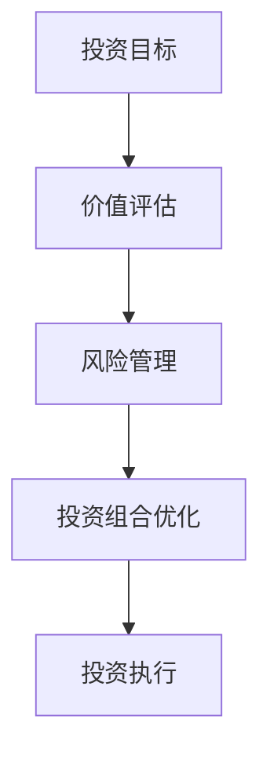

                 


# 巴菲特的传承计划：投资智慧的延续

> 关键词：巴菲特，投资智慧，传承计划，价值投资，投资系统，风险管理

> 摘要：本文从技术与投资的双重视角，深入剖析巴菲特的投资智慧及其传承计划。通过系统性分析，结合数学模型与投资系统的架构设计，展示如何将巴菲特的投资理念转化为可执行的投资策略。文章内容涵盖背景介绍、核心概念、算法原理、系统架构、项目实战等部分，旨在为投资实践者提供理论与实践相结合的深度解析。

---

# 第一部分：巴菲特投资智慧的背景与核心理念

## 第1章：巴菲特投资哲学的起源

### 1.1 价值投资的定义与核心思想

价值投资是一种以内在价值为导向的投资策略，其核心思想是通过深入分析企业的基本面，寻找市场价格低于其内在价值的股票进行投资。以下是价值投资的核心要素：

- **内在价值**：企业未来现金流的现值，是衡量企业价值的基准。
- **安全边际**：买入价格低于内在价值，以降低投资风险。
- **长期视角**：关注企业的长期盈利能力，而非短期价格波动。

### 1.2 巴菲特的投资理念与导师影响

巴菲特的投资理念深受其导师本杰明·格雷厄姆的影响。格雷厄姆是20世纪最伟大的投资思想家之一，他提出的“价值投资”理论奠定了巴菲特投资哲学的基础。以下是格雷厄姆对巴菲特的影响：

- **格雷厄姆的价值投资理论**：强调安全边际和防御性投资，寻找市场价格低于清算价值的股票。
- **巴菲特的继承与创新**：在格雷厄姆的基础上，引入了“护城河”概念，关注企业的竞争优势和可持续盈利能力。

### 1.3 巴菲特投资哲学的演变与成熟

巴菲特的投资哲学经历了从“烟蒂投资”到“护城河投资”的演变：

- **早期阶段**：专注于寻找被市场低估的“烟蒂股”，注重安全边际。
- **成熟阶段**：转向寻找具有强大竞争优势的企业，关注企业的护城河和长期盈利能力。

---

## 第2章：巴菲特传承计划的背景与意义

### 2.1 巴菲特家族传承的特殊性

巴菲特的传承计划不仅是对其投资智慧的延续，更是对投资界的重要贡献。以下是其特殊性的体现：

- **家族传承的复杂性**：巴菲特的遗产将通过信托基金分配给其家族成员，确保投资智慧的长期延续。
- **投资智慧的延续性**：通过信托基金的运作，巴菲特的投资理念得以在长期中得以实践和传承。

### 2.2 巴菲特投资智慧的系统性分析

巴菲特的投资智慧可以分解为以下几个核心要素：

- **价值评估**：通过对企业基本面的深入分析，评估其内在价值。
- **风险管理**：通过分散投资和安全边际，降低投资组合的风险。
- **长期视角**：关注企业的长期盈利能力，而非短期市场波动。

---

# 第二部分：巴菲特投资智慧的系统性框架

## 第3章：巴菲特投资模型的数学基础

### 3.1 投资回报的数学模型

投资回报的数学模型是巴菲特投资系统的核心。以下是相关公式：

- **预期回报**：$$ E[r] = r_f + \beta (r_m - r_f) $$
  - 其中，$$ r_f $$ 是无风险利率，$$ r_m $$ 是市场预期回报率，$$ \beta $$ 是股票的贝塔系数。
- **投资组合优化**：通过马科维茨的有效前沿理论，找到最优投资组合。

### 3.2 巴菲特投资模型的数学推导

以下是巴菲特投资模型的数学推导过程：

1. **确定投资目标**：最大化预期回报，同时最小化投资风险。
2. **构建投资组合**：通过优化算法，找到最优的投资组合。
3. **风险调整**：通过分散投资和安全边际，降低投资组合的整体风险。

### 3.3 巴菲特投资系统的系统架构

以下是巴菲特投资系统的系统架构图：



---

## 第4章：巴菲特投资策略的系统实现

### 4.1 投资策略的系统实现

以下是巴菲特投资策略的系统实现步骤：

1. **数据收集**：收集企业的财务数据和市场数据。
2. **价值评估**：计算企业的内在价值。
3. **风险管理**：评估投资组合的风险。
4. **投资执行**：根据优化结果执行投资。

### 4.2 投资组合优化的实战案例

以下是投资组合优化的实战案例：

- **环境安装**：安装Python和相关库（如numpy、pandas、scipy）。
- **核心代码实现**：
  ```python
  import numpy as np
  from scipy.optimize import minimize
  
  def portfolio_optimization(returns, weights):
      # 定义目标函数
      def objective(weights):
          return -np.sum(returns * weights)
      
      # 定义约束条件
      constraints = [{'type': 'eq', 'fun': lambda w: np.sum(w) - 1}]
      
      # 优化
      result = minimize(objective, weights, constraints=constraints)
      return result.x
  
  # 示例数据
  returns = np.array([0.1, 0.15, 0.08])
  weights = np.array([1/3, 1/3, 1/3])
  
  # 优化结果
  optimized_weights = portfolio_optimization(returns, weights)
  print(optimized_weights)
  ```

### 4.3 巴菲特投资模型的项目实战

以下是巴菲特投资模型的项目实战：

- **项目需求分析**：分析企业的基本面，寻找具有强大竞争优势的企业。
- **系统设计**：设计投资决策系统，包括数据收集、价值评估、风险管理等功能。
- **实现与测试**：根据系统设计实现功能，并进行测试和优化。

---

## 第5章：总结与最佳实践

### 5.1 总结

巴菲特的投资智慧不仅是投资界的经典，更是值得传承的宝贵财富。通过系统性分析和实战案例，我们可以更好地理解其投资理念，并将其应用到实际投资中。

### 5.2 最佳实践 tips

1. **长期视角**：关注企业的长期盈利能力，而非短期市场波动。
2. **风险管理**：通过分散投资和安全边际，降低投资组合的风险。
3. **持续学习**：不断学习和更新投资知识，适应市场变化。

---

作者：AI天才研究院 & 禅与计算机程序设计艺术

