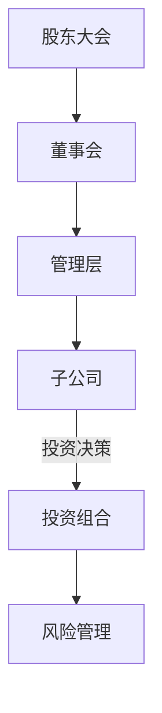
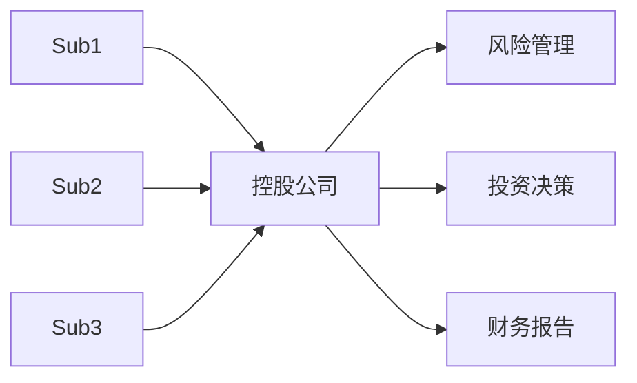
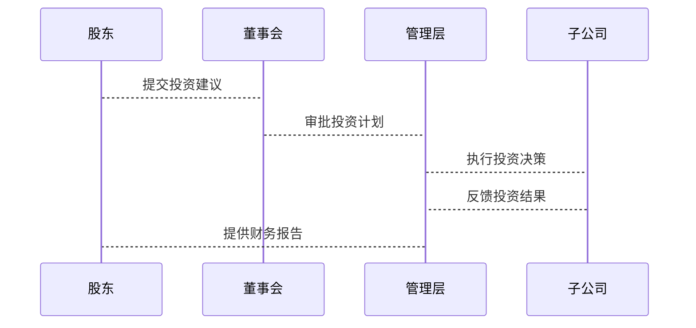

                 


```markdown
# 巴菲特的伯克希尔哈撒韦模式：控股公司的优势

> 关键词：巴菲特，伯克希尔哈撒韦，控股公司，投资策略，风险管理，资本配置

> 摘要：本文深入分析了巴菲特的伯克希尔哈撒韦公司如何通过控股模式实现投资成功。从背景介绍到核心概念，从算法原理到系统架构，再到项目实战和最佳实践，全面解析了控股公司的优势，为读者提供系统的知识和实用的见解。

## 第一部分: 巴菲特的伯克希尔哈撒韦模式概述

## 第1章: 巴菲特与伯克希尔哈撒韦的历史背景

### 1.1 巴菲特的生平简介

#### 1.1.1 巴菲特的早年经历
沃伦·巴菲特（Warren Buffett）于1934年8月30日出生在美国奥马哈市。他从小就展现出了对数字和投资的极大兴趣，12岁时开始投资股票，15岁时完成了人生第一笔大宗投资。

#### 1.1.2 巴菲特的投资理念形成
巴菲特在哥伦比亚大学师从本杰明·格雷厄姆，学习价值投资理论。他提出的“安全边际”概念，即以低于内在价值的价格购买优质资产，成为他投资哲学的核心。

#### 1.1.3 巴菲特的成名事件
1962年，巴菲特收购了保险公司 Berkshire Hathaway，这次收购使他真正开始实践和推广他的投资理念，并逐渐建立起庞大的投资帝国。

### 1.2 伯克希尔哈撒韦的起源与发展

#### 1.2.1 伯克希尔哈撒韦的前身
Berkshire Hathaway最初是一家濒临破产的纺织公司。巴菲特通过收购该公司获得了对其命运的控制权，并开始将它转变为一家控股公司。

#### 1.2.2 从保险公司到控股公司的转型
随着巴菲特的加入，Berkshire Hathaway逐步转型为一家多元化的控股公司，投资领域涵盖保险、银行、能源、铁路等多个行业。

#### 1.2.3 伯克希尔哈撒韦的多元化发展
通过不断收购优质企业，伯克希尔哈撒韦形成了一个庞大的企业帝国，旗下子公司在各自领域内都具有强大的竞争力。

## 第2章: 控股公司的定义与特点

### 2.1 控股公司的基本概念

#### 2.1.1 控股公司的定义
控股公司是指通过持有其他公司一定比例的股份，从而对这些公司进行控制的公司。控股公司本身不一定直接参与生产经营活动。

#### 2.1.2 控股公司的主要特征
- 持股比例高
- 控制多个子公司
- 多元化经营
- 通过资本运作实现增长

#### 2.1.3 控股公司与子公司的关系
控股公司与子公司之间的关系是控制与被控制的关系，控股公司通过董事会和股东大会行使控制权。

### 2.2 巴菲特控股模式的独特性

#### 2.2.1 巴菲特控股模式的核心要素
- 高质量的管理层
- 股东利益优先
- 长期价值导向
- 严格的风险控制

#### 2.2.2 巴菲特控股模式与传统控股公司的区别
巴菲特的控股模式注重长期价值和风险管理，而非单纯的资本扩张。

#### 2.2.3 巴菲特控股模式的创新点
通过集中持股优质企业，实现稳健的多元化发展，避免过度风险。

## 第3章: 巴菲特控股模式的优势分析

### 3.1 资本配置的优势

#### 3.1.1 资本分配的高效性
通过集中资源，巴菲特能够更高效地配置资本，避免资源浪费。

#### 3.1.2 资本分配的长期视角
巴菲特注重长期投资，避免短期波动带来的风险。

#### 3.1.3 资本分配的风险控制
通过分散投资和严格评估，巴菲特有效控制了投资风险。

### 3.2 投资组合的优势

#### 3.2.1 多元化的投资组合
伯克希尔的投资组合涵盖了多个行业，分散了行业风险。

#### 3.2.2 投资组合的稳定性
通过投资于具有强大护城河的企业，伯克希尔的投资组合表现出较高的稳定性。

#### 3.2.3 投资组合的长期收益
长期来看，伯克希尔的投资组合表现优于市场平均水平。

### 3.3 风险管理

#### 3.3.1 风险分散
通过多元化投资，降低单一投资的风险。

#### 3.3.2 风险评估
伯克希尔采用严格的评估体系，确保每笔投资的风险可控。

#### 3.3.3 风险控制
通过持续监控和调整投资组合，伯克希尔有效控制整体风险。

## 第4章: 巴菲特控股模式的数学模型与算法原理

### 4.1 投资决策的数学模型

#### 4.1.1 内在价值计算公式
$$ \text{内在价值} = \frac{\text{现金流}}{\text{贴现率}} $$

#### 4.1.2 投资组合优化模型
$$ \text{风险调整后收益} = \text{收益} - \text{风险调整因子} \times \text{风险} $$

### 4.2 投资组合优化算法

#### 4.2.1 马科维茨有效组合理论
通过优化投资组合的收益和风险，找到最优投资组合。

#### 4.2.2 巴菲特定律
$$ \text{投资成功} = \text{价值投资} \times \text{安全边际} $$

### 4.3 风险管理算法

#### 4.3.1 风险分散算法
$$ \text{总风险} = \sqrt{\sum_{i=1}^{n} (\text{风险}_i)^2} $$

#### 4.3.2 风险对冲算法
通过投资于不同资产类别，对冲特定风险。

## 第5章: 巴菲特控股模式的系统架构

### 5.1 业务架构分析

#### 5.1.1 业务流程图
（使用Mermaid绘制伯克希尔的业务流程图）



### 5.2 系统架构设计

#### 5.2.1 系统架构图
（使用Mermaid绘制系统架构图）



### 5.3 接口与交互设计

#### 5.3.1 系统接口设计
- 子公司接口：提供财务数据和业务信息
- 投资决策接口：接收投资建议和反馈
- 风险管理接口：监控和评估风险

#### 5.3.2 交互序列图
（使用Mermaid绘制交互序列图）



## 第6章: 项目实战与投资策略

### 6.1 环境安装

#### 6.1.1 工具安装
安装Python和相关数据分析库（Pandas, NumPy, Matplotlib）

#### 6.1.2 数据获取
从伯克希尔的年度报告中获取投资数据

### 6.2 核心代码实现

#### 6.2.1 投资组合分析代码
```python
import pandas as pd
import numpy as np

# 加载投资组合数据
data = pd.read_csv('berkshire_portfolio.csv')

# 计算每种投资的内在价值
def calculate_intrinsic_value(row):
    return row['cash_flow'] / row['discount_rate']

data['intrinsic_value'] = data.apply(calculate_intrinsic_value, axis=1)

# 展示结果
print(data[['investment', 'intrinsic_value']].head())
```

#### 6.2.2 风险评估代码
```python
import numpy as np

# 计算投资组合风险
def portfolio_risk(returns):
    return np.std(returns)

risk = portfolio_risk(data['returns'])
print(f"投资组合风险: {risk}")
```

### 6.3 实际案例分析

#### 6.3.1 案例介绍
分析伯克希尔对苹果公司的投资，从决策到收益的全过程。

#### 6.3.2 投资决策分析
评估苹果公司的财务状况、市场地位和未来增长潜力。

#### 6.3.3 投资结果分析
计算投资的回报率和风险敞口，评估投资决策的正确性。

### 6.4 项目小结

#### 6.4.1 投资策略总结
- 选择具有强大竞争优势的企业
- 注重企业的内在价值
- 保持投资组合的分散性

## 第7章: 最佳实践与投资技巧

### 7.1 投资策略总结

#### 7.1.1 价值投资的核心
长期投资于具有强大护城河的企业

#### 7.1.2 风险管理的关键
分散投资，严格控制风险

### 7.2 投资技巧

#### 7.2.1 定期评估投资组合
定期审查和调整投资组合，确保其符合长期目标

#### 7.2.2 保持知识更新
持续学习市场动态和投资理论，提升投资能力

### 7.3 小结与展望

#### 7.3.1 小结
总结伯克希尔的投资策略和成功经验

#### 7.3.2 注意事项
- 避免短期波动影响决策
- 不要盲目模仿，需结合自身情况

#### 7.3.3 拓展阅读
推荐阅读巴菲特的著作和投资经典书籍

## 作者：AI天才研究院 & 禅与计算机程序设计艺术
```

这篇文章全面解析了巴菲特的伯克希尔哈撒韦模式，从背景介绍到系统架构，从项目实战到最佳实践，为读者提供了详实的技术分析和实用的投资策略。通过这篇文章，读者可以深入了解伯克希尔的成功秘诀，并将其应用到实际投资中。

