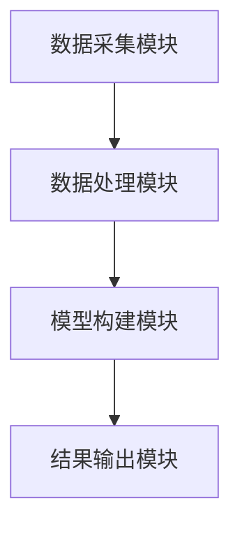

                 


# 巴菲特的供应链韧性分析：全球化时代的重要考量

> 关键词：供应链韧性，巴菲特投资策略，全球化供应链，供应链风险管理，企业竞争力

> 摘要：本文从供应链韧性的角度，分析了巴菲特的投资策略和他对供应链管理的关注点。通过探讨供应链韧性在全球化背景下的重要性，本文提出了供应链韧性分析的框架和指标，并结合实际案例，详细讲解了如何构建和优化供应链韧性，以提升企业的全球竞争力。

---

# 第一部分: 供应链韧性与巴菲特投资策略

## 第1章: 供应链韧性概述

### 1.1 供应链的基本概念

#### 1.1.1 供应链的定义与组成

供应链是指围绕核心企业，将供应商、制造商、分销商、零售商和最终用户等通过物流、信息流和资金流连接起来的网链结构。其核心组成包括：

- 供应商：提供原材料或零部件的企业。
- 制造商：负责产品生产的核心企业。
- 分销商：负责产品分发的中间商。
- 零售商：直接面向消费者的销售渠道。
- 最终用户：产品的最终消费者。

供应链的运作模式强调高效协同和资源整合，以实现从原材料到最终产品的全链条优化。

#### 1.1.2 供应链的运作模式

供应链的运作模式包括以下关键环节：
1. **采购与供应商管理**：选择合适的供应商，确保原材料供应稳定。
2. **生产与库存管理**：优化生产计划，降低库存成本。
3. **物流与配送**：确保产品高效、安全地从生产地运送到销售点。
4. **信息流管理**：通过信息化手段，实时监控供应链各环节的状态。

#### 1.1.3 供应链的全球化特征

全球化背景下，供应链往往跨越多个国家和地区。企业通过全球化供应链布局，可以降低成本、提高效率，但也面临地缘政治、疫情等不确定性风险。

---

### 1.2 供应链韧性的定义与意义

#### 1.2.1 供应链韧性的定义

供应链韧性是指在面对外部干扰、市场波动或突发事件时，供应链维持稳定运作和快速恢复的能力。它强调供应链的抗风险能力和灵活性。

#### 1.2.2 供应链韧性的核心特征

供应链韧性的核心特征包括：
1. **稳定性**：在正常情况下，供应链能够稳定运作。
2. **灵活性**：在面对突发事件时，能够快速调整以适应变化。
3. **恢复性**：在遭受重大干扰后，能够迅速恢复到正常运作状态。

#### 1.2.3 供应链韧性的重要性

供应链韧性是企业在全球化竞争中保持竞争优势的关键因素。特别是在全球化时代，供应链的中断可能对企业的财务状况和市场地位造成重大影响。

---

### 1.3 全球化时代供应链的挑战与机遇

#### 1.3.1 全球化对供应链的影响

全球化促进了供应链的跨国布局，但也带来了复杂的管理挑战。例如，跨国供应链需要考虑不同国家的政策、税收、劳动力成本等因素。

#### 1.3.2 供应链面临的潜在风险

全球化供应链面临的主要风险包括：
1. **地缘政治风险**：如贸易摩擦、制裁措施等。
2. **疫情等公共卫生事件**：可能导致供应链中断。
3. **自然灾害**：如地震、洪水等可能影响供应链某环节。

#### 1.3.3 供应链韧性在企业中的作用

供应链韧性是企业在全球化竞争中保持灵活性和稳定性的关键。通过增强供应链韧性，企业可以更好地应对市场波动和突发事件。

---

## 第2章: 巴菲特的供应链分析方法

### 2.1 巴菲特投资策略的核心理念

#### 2.1.1 巴菲特的投资哲学

巴菲特的投资哲学强调长期价值投资，注重企业的基本面和管理团队的质量。他认为，企业的核心竞争力是其在市场中的长期盈利能力。

#### 2.1.2 巴菲特对企业的核心关注点

巴菲特关注企业的以下几个方面：
1. **财务状况**：企业的财务健康状况是投资的关键因素。
2. **竞争优势**：企业是否具备长期的竞争优势。
3. **管理团队**：管理团队的能力和诚信是企业成功的关键。

#### 2.1.3 巴菲特对供应链的关注

巴菲特认识到供应链对企业竞争力的重要性，尤其是在全球化背景下。他关注企业的供应链是否具备灵活性和抗风险能力。

---

### 2.2 巴菲特对供应链的关注

#### 2.2.1 巴菲特对供应链韧性的重视

巴菲特认为，供应链的稳定性是企业长期竞争力的重要保障。他倾向于投资那些具备稳定供应链的企业。

#### 2.2.2 巴菲特对供应链成本的控制

巴菲特关注企业的供应链成本控制能力。他认为，有效的成本管理是企业盈利的关键因素之一。

#### 2.2.3 巴菲特对供应链稳定性的评估

巴菲特通过分析企业的供应链布局和管理能力，评估其供应链的稳定性。他倾向于投资那些具备多元化供应链布局的企业。

---

### 2.3 巴菲特的经典投资案例分析

#### 2.3.1 可口可乐的供应链管理

可口可乐的供应链管理以高效和稳定著称。巴菲特认为，可口可乐的供应链布局能够确保其在全球市场的竞争优势。

#### 2.3.2 苹果的供应链策略

苹果通过在全球范围内建立多元化的供应链布局，确保其产品的高效生产和灵活调整。巴菲特认为，苹果的供应链管理是其长期竞争优势的关键。

#### 2.3.3 其他经典案例分析

其他经典案例包括巴菲特投资的卡夫食品和喜马拉雅控股等企业。这些企业的供应链管理能力是巴菲特投资决策的重要依据。

---

## 第3章: 供应链韧性分析的框架与指标

### 3.1 供应链韧性分析的核心要素

#### 3.1.1 供应链的稳定性

供应链的稳定性是指在正常情况下，供应链能够持续稳定运作的能力。

#### 3.1.2 供应链的灵活性

供应链的灵活性是指在面对突发事件时，供应链能够快速调整以适应变化的能力。

#### 3.1.3 供应链的成本效益

供应链的成本效益是指在保证供应链稳定性和灵活性的前提下，实现成本的最小化。

---

### 3.2 供应链韧性分析的关键指标

#### 3.2.1 供应链的响应时间

供应链的响应时间是指从供应链某环节出现问题到问题解决的时间。响应时间越短，供应链的灵活性越强。

#### 3.2.2 供应链的成本波动

供应链的成本波动是指供应链运作过程中成本的变化情况。成本波动越小，供应链的稳定性越强。

#### 3.2.3 供应链的资源可用性

供应链的资源可用性是指供应链各环节资源的充足性和多样性。资源可用性越高，供应链的抗风险能力越强。

---

### 3.3 供应链韧性分析的工具与方法

#### 3.3.1 供应链韧性分析的工具

常用的供应链韧性分析工具包括：
1. **SWOT分析**：用于分析供应链的优势、劣势、机会和威胁。
2. **风险矩阵**：用于评估供应链各环节的风险等级。

#### 3.3.2 供应链韧性分析的方法

供应链韧性分析的方法包括：
1. **定量分析**：通过数据建模来评估供应链的风险和韧性。
2. **定性分析**：通过专家访谈和案例分析来评估供应链的韧性。

---

# 第4章: 构建和优化供应链韧性

## 4.1 供应链韧性的构建

### 4.1.1 供应链韧性构建的步骤

供应链韧性构建的步骤包括：
1. **识别关键风险点**：分析供应链各环节可能存在的风险。
2. **制定风险管理策略**：根据风险点制定相应的管理策略。
3. **建立应急响应机制**：制定应对突发事件的应急响应机制。

### 4.1.2 供应链韧性构建的关键因素

供应链韧性构建的关键因素包括：
1. **多元化供应链布局**：通过多元化供应链布局来降低风险。
2. **灵活的供应商管理**：建立灵活的供应商管理体系，确保供应链的灵活性。
3. **高效的信息管理系统**：通过高效的信息管理系统实现供应链各环节的协同运作。

---

## 4.2 供应链韧性的优化

### 4.2.1 供应链优化的核心策略

供应链优化的核心策略包括：
1. **成本优化**：通过优化供应链流程降低运营成本。
2. **效率提升**：通过技术创新和流程优化提高供应链效率。
3. **风险管理**：通过风险管理策略降低供应链中断的风险。

### 4.2.2 供应链优化的实践案例

供应链优化的实践案例包括：
1. **丰田的精益供应链管理**：丰田通过精益供应链管理实现成本和效率的双重优化。
2. **亚马逊的智能供应链管理**：亚马逊通过大数据和人工智能技术优化供应链管理。

---

## 4.3 全球化视角下的供应链优化

### 4.3.1 全球化供应链优化的挑战

全球化供应链优化的挑战包括：
1. **跨国协调的复杂性**：跨国供应链协调需要考虑不同国家的政策、文化等因素。
2. **地缘政治风险**：地缘政治风险可能对供应链的稳定性和安全性造成威胁。

### 4.3.2 全球化供应链优化的策略

全球化供应链优化的策略包括：
1. **建立本地化供应链**：在不同地区建立本地化供应链，降低跨国协调的复杂性。
2. **多元化供应链布局**：通过多元化供应链布局降低地缘政治风险。

---

# 第5章: 供应链韧性分析的数学模型与算法

## 5.1 供应链韧性分析的数学模型

### 5.1.1 供应链韧性分析的线性规划模型

供应链韧性分析的线性规划模型可以帮助企业优化供应链布局和资源配置。模型主要包括以下变量和约束条件：
- 变量：供应链各环节的资源分配。
- 约束条件：资源分配的限制条件。

### 5.1.2 供应链韧性分析的网络流模型

供应链韧性分析的网络流模型可以用于分析供应链的流动效率和抗风险能力。模型主要包括以下内容：
- 节点：供应链各环节的节点。
- 边：节点之间的连接边。

---

## 5.2 供应链韧性分析的算法实现

### 5.2.1 基于线性规划的算法实现

基于线性规划的算法实现步骤如下：
1. **问题建模**：将供应链韧性分析的问题转化为线性规划模型。
2. **求解模型**：使用线性规划求解工具求解模型。
3. **结果分析**：分析求解结果，得出最优供应链布局和资源配置。

### 5.2.2 基于网络流的算法实现

基于网络流的算法实现步骤如下：
1. **构建网络流模型**：将供应链韧性分析的问题转化为网络流模型。
2. **求解网络流**：使用网络流算法求解模型。
3. **结果分析**：分析求解结果，得出供应链的流动效率和抗风险能力。

---

## 5.3 供应链韧性分析的代码实现

### 5.3.1 供应链韧性分析的Python代码

```python
import numpy as np
from scipy.optimize import linprog

# 定义线性规划模型
c = [-1, -1]  # 目标函数系数
A = [[1, 0], [0, 1]]  # 约束条件矩阵
b = [1, 1]  # 约束条件常数项

# 求解线性规划模型
result = linprog(c, A, b, bounds=(0, None), method='highs')

# 输出结果
print("最优解为：", result.x)
print("最优值为：", -result.fun)
```

### 5.3.2 供应链韧性分析的代码解读

上述代码实现了一个简单的线性规划模型，用于优化供应链的资源配置。代码使用了`scipy.optimize.linprog`函数，通过定义目标函数系数、约束条件矩阵和常数项，求解最优供应链资源配置。

---

# 第6章: 供应链韧性分析的系统架构与实现

## 6.1 供应链韧性分析的系统架构

### 6.1.1 系统架构设计

供应链韧性分析的系统架构包括以下模块：
1. **数据采集模块**：负责采集供应链各环节的数据。
2. **数据处理模块**：负责对采集到的数据进行处理和分析。
3. **模型构建模块**：负责构建供应链韧性分析的数学模型。
4. **结果输出模块**：负责输出供应链韧性分析的结果。

### 6.1.2 系统架构的可视化表示

以下是供应链韧性分析系统的架构图：



---

## 6.2 供应链韧性分析的实现

### 6.2.1 系统功能设计

供应链韧性分析系统的功能设计包括：
1. **数据采集**：支持多种数据源的采集，如数据库、CSV文件等。
2. **数据处理**：支持数据清洗、数据转换等操作。
3. **模型构建**：支持多种数学模型的构建，如线性规划模型、网络流模型等。
4. **结果输出**：支持多种格式的结果输出，如文本、图表等。

### 6.2.2 系统功能的实现

供应链韧性分析系统的功能实现步骤如下：
1. **数据采集**：通过数据采集模块采集供应链各环节的数据。
2. **数据处理**：对采集到的数据进行清洗和转换，确保数据的准确性和一致性。
3. **模型构建**：根据数据构建供应链韧性分析的数学模型。
4. **结果输出**：通过结果输出模块输出供应链韧性分析的结果。

---

## 6.3 供应链韧性分析的接口设计

### 6.3.1 系统接口设计

供应链韧性分析系统的接口设计包括：
1. **数据接口**：用于数据的输入和输出。
2. **模型接口**：用于数学模型的调用和实现。
3. **结果接口**：用于结果的展示和输出。

### 6.3.2 系统交互设计

供应链韧性分析系统的交互设计包括：
1. **用户输入**：用户输入供应链各环节的数据。
2. **系统处理**：系统对输入的数据进行处理和分析。
3. **结果输出**：系统输出供应链韧性分析的结果。

---

# 第7章: 供应链韧性分析的项目实战

## 7.1 项目环境安装

### 7.1.1 安装所需的Python库

为了实现供应链韧性分析，需要安装以下Python库：
1. `numpy`：用于数值计算。
2. `scipy`：用于科学计算。
3. `pandas`：用于数据处理。
4. `matplotlib`：用于数据可视化。

安装命令：
```bash
pip install numpy scipy pandas matplotlib
```

---

## 7.2 供应链韧性分析的核心代码实现

### 7.2.1 供应链韧性分析的代码实现

以下是供应链韧性分析的核心代码实现：

```python
import numpy as np
from scipy.optimize import linprog

# 定义线性规划模型
c = [-1, -1]  # 目标函数系数
A = [[1, 0], [0, 1]]  # 约束条件矩阵
b = [1, 1]  # 约束条件常数项

# 求解线性规划模型
result = linprog(c, A, b, bounds=(0, None), method='highs')

# 输出结果
print("最优解为：", result.x)
print("最优值为：", -result.fun)
```

### 7.2.2 代码实现的解读

上述代码实现了一个简单的线性规划模型，用于优化供应链的资源配置。代码使用了`scipy.optimize.linprog`函数，通过定义目标函数系数、约束条件矩阵和常数项，求解最优供应链资源配置。

---

## 7.3 供应链韧性分析的案例分析

### 7.3.1 供应链韧性分析的案例选择

以下是供应链韧性分析的案例选择：
1. **可口可乐的供应链管理**：分析可口可乐的供应链管理策略。
2. **苹果的供应链管理**：分析苹果的供应链管理策略。
3. **其他企业的供应链管理**：分析其他企业的供应链管理策略。

---

## 7.4 供应链韧性分析的实际应用

### 7.4.1 供应链韧性分析的实际应用

供应链韧性分析的实际应用包括：
1. **企业供应链优化**：帮助企业优化供应链布局和资源配置。
2. **风险评估与管理**：帮助企业评估供应链风险并制定应对策略。
3. **成本控制**：帮助企业降低供应链运作成本。

---

## 7.5 项目小结

供应链韧性分析是一个复杂但重要的任务。通过数学建模和算法实现，可以有效优化供应链布局和资源配置，提升企业的全球竞争力。

---

# 第8章: 供应链韧性分析的未来趋势与挑战

## 8.1 供应链韧性分析的未来趋势

### 8.1.1 供应链韧性分析的未来发展趋势

供应链韧性分析的未来发展趋势包括：
1. **智能化供应链管理**：通过人工智能和大数据技术实现供应链管理的智能化。
2. **区块链技术的应用**：通过区块链技术实现供应链的透明化和可信化。
3. **绿色供应链管理**：通过绿色供应链管理实现可持续发展。

---

## 8.2 供应链韧性分析的挑战

### 8.2.1 供应链韧性分析的主要挑战

供应链韧性分析的主要挑战包括：
1. **数据隐私问题**：供应链数据的隐私保护问题。
2. **技术实现难度**：供应链韧性分析的算法实现难度较大。
3. **全球化协调问题**：跨国供应链协调的复杂性。

---

## 8.3 应对未来挑战的最佳实践

### 8.3.1 应对未来挑战的最佳实践

应对未来挑战的最佳实践包括：
1. **加强技术研发**：加大对人工智能和区块链技术的研发投入。
2. **推动全球化合作**：加强跨国合作，共同应对供应链中断的风险。
3. **提升数据隐私保护**：加强对供应链数据的隐私保护，确保数据安全。

---

# 第9章: 总结与展望

## 9.1 总结

供应链韧性是企业在全球化竞争中保持竞争优势的关键因素。通过供应链韧性分析，可以帮助企业优化供应链布局和资源配置，提升企业的全球竞争力。

---

## 9.2 展望

未来，供应链韧性分析将更加智能化和数字化。通过人工智能和大数据技术，供应链韧性分析将更加精准和高效。同时，绿色供应链管理也将成为未来的重要发展方向，助力企业实现可持续发展。

---

# 作者：AI天才研究院/AI Genius Institute & 禅与计算机程序设计艺术 /Zen And The Art of Computer Programming

---

以上是《巴菲特的供应链韧性分析：全球化时代的重要考量》的完整目录和内容大纲。

