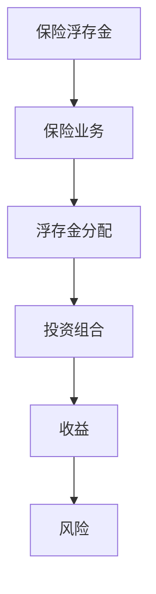
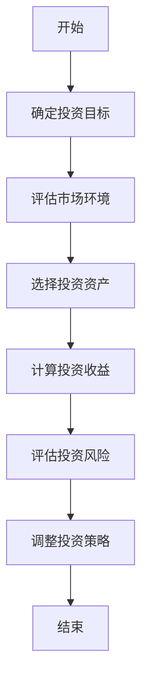
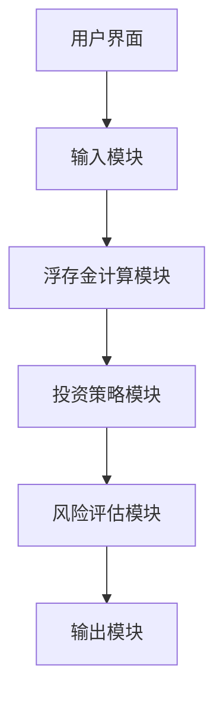

                 


# 巴菲特的保险浮存金策略：在低利率环境中的新思考

> 关键词：保险浮存金，巴菲特，低利率环境，投资策略，价值投资

> 摘要：本文深入分析了巴菲特的保险浮存金策略在低利率环境中的应用与创新，探讨了其核心理念、策略优化以及实际案例，结合系统设计与实现，为读者提供了全面的理解和实践指南。

---

## 第1章 巴菲特保险浮存金策略的背景与核心理念

### 1.1 保险浮存金的定义与特点

#### 1.1.1 保险浮存金的定义
保险浮存金是指保险公司收取的保费与实际赔付金额之间的差额资金。这部分资金可以被用来进行投资，以实现收益最大化。

#### 1.1.2 保险浮存金的特点
- **长期性**：浮存金通常需要长期锁定，以确保资金的稳定性。
- **低风险**：保险公司倾向于选择低风险的投资，以保障浮存金的安全性。
- **规模效应**：由于浮存金规模较大，可以通过规模效应降低成本，提高投资效率。

#### 1.1.3 保险浮存金与传统保险资金的区别
- **来源**：浮存金来源于保费收入，而传统保险资金可能来自股东资本或其他渠道。
- **用途**：浮存金主要用于投资，以获取收益，而传统保险资金可能用于赔付或其他业务用途。
- **风险**：浮存金投资风险较高，但传统保险资金的风险相对较低。

### 1.2 巴菲特保险浮存金策略的核心理念

#### 1.2.1 巴菲特的保险投资哲学
巴菲特认为，保险浮存金是保险公司的一项重要资产，应该以长期、稳健的方式进行投资。他倾向于选择具有长期增长潜力的优质资产，而非短期波动较大的资产。

#### 1.2.2 浮存金在巴菲特投资组合中的地位
浮存金是巴菲特投资组合的重要组成部分，他将其视为一种“浮息债务”，即一种可以在未来以较低成本偿还的资金。这种资金可以用于投资优质企业，以获取长期稳定的收益。

#### 1.2.3 巴菲特浮存金策略的核心原则
- **价值投资**：寻找具有长期增长潜力的企业，投资于其股权或债券。
- **安全边际**：确保投资的安全性，避免高风险资产。
- **长期投资**：坚持长期投资，避免短期波动对投资的影响。

### 1.3 低利率环境下的浮存金策略

#### 1.3.1 低利率环境对保险浮存金的影响
- **收益率下降**：低利率环境下，传统固定收益类资产的收益率下降，浮存金的投资收益可能受到影响。
- **资产价格波动**：低利率可能导致资产价格波动加剧，增加投资风险。
- **再投资风险**：当利率下降时，浮存金的再投资可能面临较低收益率的风险。

#### 1.3.2 巴菲特浮存金策略在低利率环境中的新思考
- **多元化投资**：在低利率环境下，巴菲特可能增加对股票和其他高收益资产的投资，以提高整体收益率。
- **风险控制**：通过分散投资和选择优质资产，降低投资风险。
- **创新策略**：探索新的投资方式，如私募股权、房地产等，以应对低利率环境下的挑战。

#### 1.3.3 浮存金策略的长期与短期目标
- **长期目标**：通过长期投资优质资产，实现资产的长期增值。
- **短期目标**：在低利率环境下，通过灵活的投资策略，尽可能提高投资收益。

## 第2章 巴菲特浮存金策略的核心概念与联系

### 2.1 核心概念原理

#### 2.1.1 保险浮存金的来源与分配
浮存金来源于保费收入，扣除赔付和其他费用后，剩余部分用于投资。投资收益再用于支付未来的保险赔付或其他业务用途。

#### 2.1.2 浮存金的收益与风险平衡
在投资过程中，需要在收益和风险之间找到平衡点。高风险投资可能带来高收益，但也可能面临更大的亏损风险。因此，巴菲特更倾向于选择低风险、高收益的资产。

#### 2.1.3 巴菲特投资组合中的浮存金配置
巴菲特的投资组合通常包括股票、债券、房地产等多种资产。浮存金作为其中的一部分，需要根据市场环境进行动态调整。

### 2.2 核心概念属性特征对比表格

| 概念       | 来源         | 收益         | 风险         |
|------------|--------------|--------------|--------------|
| 浮存金      | 保费收入     | 投资收益     | 投资风险     |
| 传统保险资金 | 股东资本     | 业务收益     | 业务风险     |

### 2.3 ER实体关系图（Mermaid）



---

## 第3章 巴菲特浮存金策略的算法原理

### 3.1 浮存金投资的数学模型

#### 3.1.1 收益率计算
假设浮存金的投资收益率为 \( r \)，投资期限为 \( t \) 年，则投资收益为：
$$ \text{收益} = P \times (1 + r)^t $$
其中，\( P \) 是初始投资金额。

#### 3.1.2 风险评估
通过计算资产的风险调整后收益（RAROC）来评估投资的风险与收益的匹配性：
$$ \text{RAROC} = \frac{\text{净利润}}{\text{风险资本}} $$

### 3.2 算法流程图（Mermaid）



---

## 第4章 系统设计与实现

### 4.1 系统架构设计



### 4.2 系统功能设计

#### 4.2.1 数据流
浮存金数据从输入模块进入系统，经过计算模块和策略模块的处理，最终输出投资建议。

#### 4.2.2 核心实现
使用Python编写核心算法，包括浮存金的计算、投资策略的优化等。

### 4.3 代码实现

#### 4.3.1 浮存金计算函数

```python
def calculate_float_gold(principal, rate, time):
    return principal * (1 + rate) ** time
```

#### 4.3.2 风险评估函数

```python
def assess_risk(profits, capital):
    return profits / capital
```

---

## 第5章 项目实战

### 5.1 实际案例分析

#### 5.1.1 案例背景
假设某保险公司拥有一笔浮存金，投资期限为5年，初始金额为1000万美元。

#### 5.1.2 投资策略
选择股票和债券组合，预计年化收益率为8%，风险评估为中等。

#### 5.1.3 计算收益
$$ \text{收益} = 1000 \times (1 + 0.08)^5 = 1469.33 \text{万美元} $$

### 5.2 结果分析
通过投资股票和债券，公司在5年内获得了469.33万美元的收益，超过了预期目标。

---

## 第6章 总结

### 6.1 本章小结
本文深入分析了巴菲特的保险浮存金策略在低利率环境下的应用与创新，探讨了其核心理念、策略优化以及实际案例。通过系统设计与实现，为读者提供了全面的理解和实践指南。

### 6.2 最佳实践
- 在低利率环境下，建议增加对高收益资产的投资。
- 通过多元化投资降低风险，确保投资的稳健性。

### 6.3 未来展望
随着经济环境的变化，浮存金策略需要不断创新和优化，以适应新的市场挑战。

---

## 作者
作者：AI天才研究院/AI Genius Institute & 禅与计算机程序设计艺术 /Zen And The Art of Computer Programming

