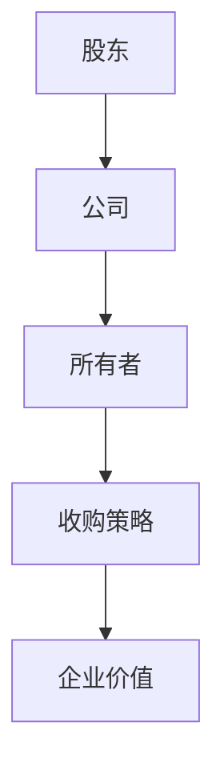
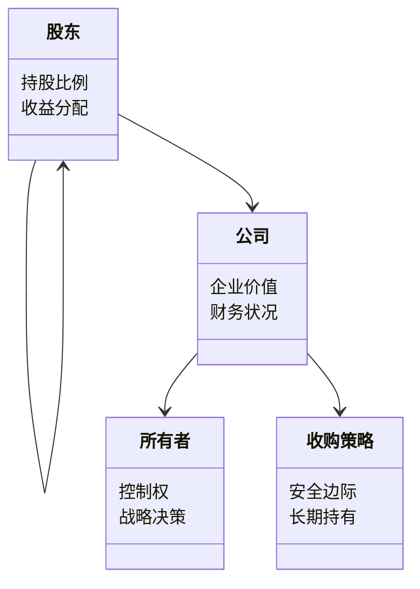
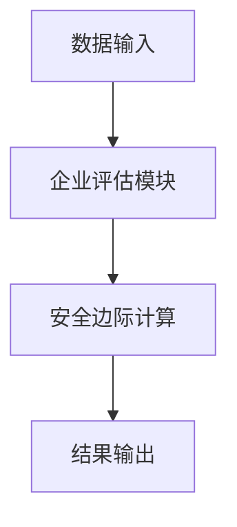
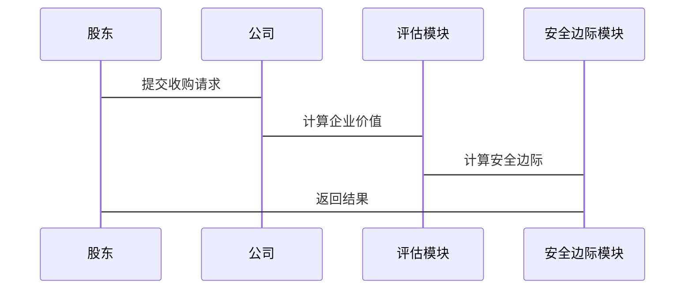

                 


# 巴菲特的公司收购策略：从股东到所有者的转变

> 关键词：巴菲特，公司收购，股东，所有者，投资策略，企业价值评估，安全边际

> 摘要：本文深入分析巴菲特的公司收购策略，从股东到所有者的转变，揭示其投资哲学、收购策略的核心要素以及算法原理。文章通过案例分析、数学模型和系统架构设计，详细阐述如何通过巴菲特的方法实现长期价值增长。

---

# 目录

1. **背景与核心概念**  
   1.1 巴菲特的投资哲学  
   1.2 公司收购策略的背景与重要性  
   1.3 核心概念与联系  

2. **算法原理**  
   2.1 核心算法的数学模型  
   2.2 安全边际计算方法  
   2.3 Python代码实现  

3. **系统分析与架构设计**  
   3.1 领域模型设计  
   3.2 系统架构图  
   3.3 接口设计与交互流程  

4. **项目实战**  
   4.1 环境安装与数据准备  
   4.2 核心代码实现  
   4.3 案例分析与结果解读  

5. **总结与最佳实践**  
   5.1 本章小结  
   5.2 注意事项与扩展阅读  
   5.3 作者信息

---

## 第一部分：背景与核心概念

### 1.1 巴菲特的投资哲学

#### 1.1.1 巴菲特的投资理念
巴菲特的投资哲学基于价值投资，强调购买低于内在价值的资产。他相信市场的短期波动不可预测，但长期趋势可以通过基本面分析确定。

#### 1.1.2 收购策略的核心思想
巴菲特的收购策略强调长期持有、安全边际和管理层质量。他寻找具有持续盈利能力、良好治理结构和优秀管理层的企业。

#### 1.1.3 战略的演变
从早期的套利交易到后来的控股收购，巴菲特的策略逐步转向长期价值投资，注重企业的内在价值和竞争优势。

### 1.2 公司收购策略的背景与重要性

#### 1.2.1 公司收购的定义与分类
公司收购指通过购买股权或资产，获得对目标公司的控制权。可分为敌意收购和友好协商两类，巴菲特更倾向于后者。

#### 1.2.2 独特性的分析
巴菲特的策略注重企业内在价值，而非市场波动。他寻找具有强大护城河、稳定收益和合理估值的企业。

#### 1.2.3 对投资者的启示
通过巴菲特的策略，投资者应关注企业的基本面，而非短期市场波动，并注重长期价值增长。

### 1.3 核心概念与联系

#### 1.3.1 企业价值评估
企业价值是未来现金流的现值，巴菲特使用DCF模型进行评估。

#### 1.3.2 股东与所有者的区别
股东是资金提供者，所有者具备控制权，影响企业战略和管理。

#### 1.3.3 策略的长期性与稳定性
巴菲特强调长期持有，避免短期波动，注重企业内生增长。

#### 1.3.4 边界与外延
巴菲特策略适用于稳健企业，对高风险和周期性行业效果有限。

### 1.4 核心概念属性对比

| 概念 | 特征 | 描述 |
|------|------|------|
| 股东 | 所有权 | 持股比例决定收益分配 |
| 所有者 | 控制权 | 影响企业战略和管理决策 |
| 收购策略 | 长期性 | 以长期持有为目标，追求内在价值增长 |

### 1.5 ER实体关系图



---

## 第二部分：算法原理

### 2.1 核心算法的数学模型

#### 2.1.1 企业价值计算公式
$$企业价值 = (净利润 - 非经常性损益) × 永续年金因子$$

#### 2.1.2 安全边际计算公式
$$安全边际 = 企业价值 ÷ 市场价格$$

### 2.2 安全边际计算方法

1. 计算企业的内在价值。
2. 确定市场的当前价格。
3. 安全边际 = 内在价值 / 市场价格。

### 2.3 Python代码实现

```python
def calculate_enterprise_value(net_profit, non_recurring_losses, perpetuity_factor):
    ent_value = (net_profit - non_recurring_losses) * perpetuity_factor
    return ent_value

def calculate_margin_of_safety(ent_value, market_price):
    mos = ent_value / market_price
    return mos

# 示例数据
net_profit = 100
non_recurring_losses = 20
perpetuity_factor = 10
market_price = 50

ent_value = calculate_enterprise_value(net_profit, non_recurring_losses, perpetuity_factor)
mos = calculate_margin_of_safety(ent_value, market_price)

print(f"企业价值: {ent_value}")
print(f"安全边际: {mos}")
```

---

## 第三部分：系统分析与架构设计

### 3.1 领域模型设计



### 3.2 系统架构图



### 3.3 接口设计与交互流程



---

## 第四部分：项目实战

### 4.1 环境安装与数据准备

#### 安装Python和必要的库
安装Python和Pandas、NumPy等库。

#### 数据准备
收集目标公司的财务数据和市场价。

### 4.2 核心代码实现

```python
import pandas as pd
import numpy as np

def calculate_enterprise_value(financial_data, perpetuity_factor):
    net_profit = financial_data['净利润']
    non_recurring_losses = financial_data['非经常性损失']
    return (net_profit - non_recurring_losses) * perpetuity_factor

def calculate_margin_of_safety(ent_value, market_price):
    return ent_value / market_price

# 示例数据
data = {
    '净利润': 100,
    '非经常性损失': 20,
    '市场价': 50
}

perpetuity_factor = 10
ent_value = calculate_enterprise_value(data, perpetuity_factor)
mos = calculate_margin_of_safety(ent_value, data['市场价'])

print(f"企业价值: {ent_value}")
print(f"安全边际: {mos}")
```

### 4.3 案例分析与结果解读

假设目标公司财务数据如下：

| 参数 | 数值 |
|------|------|
| 净利润 | 100 |
| 非经常性损失 | 20 |
| 市场价 | 50 |

计算结果：
- 企业价值 = (100 - 20) × 10 = 800
- 安全边际 = 800 / 50 = 16

结果解读：企业价值远高于市场价，具有较高的安全边际，适合收购。

---

## 第五部分：总结与最佳实践

### 5.1 本章小结

本文详细分析了巴菲特的公司收购策略，从投资哲学到算法实现，帮助读者理解其价值评估和安全边际计算方法。

### 5.2 注意事项

1. 确保数据的准确性和完整性。
2. 考虑企业的长期前景和管理层质量。
3. 风险提示：市场波动和经济环境变化可能影响策略效果。

### 5.3 扩展阅读

1. 巴菲特的《投资的艺术》
2. 格雷厄姆的价值投资理论
3. 现代投资组合理论

### 5.4 作者信息

作者：AI天才研究院 & 禅与计算机程序设计艺术

---

通过以上结构，文章系统地分析了巴菲特的公司收购策略，从理论到实践，为读者提供了全面的指导。

