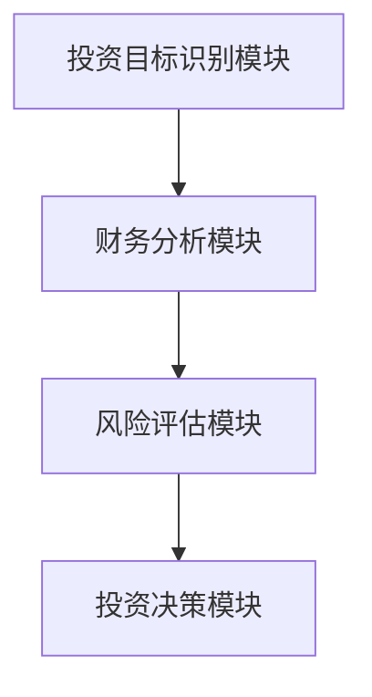

                 


# 巴菲特的公司收购策略：全资控股的魅力

## 关键词：
巴菲特, 公司收购, 全资控股, 投资策略, 价值投资, 财务分析, 竞争优势

## 摘要：
本文详细探讨了巴菲特的公司收购策略，特别是全资控股的魅力。文章从巴菲特的投资哲学出发，分析了全资控股的优势与风险，并通过数学模型和实际案例展示了其收购策略的核心方法。

---

## 第一部分: 巴菲特的公司收购策略概述

### 第1章: 巴菲特的收购策略与投资哲学

#### 1.1 巴菲特的收购策略概述
##### 1.1.1 巴菲特的收购理念与原则
巴菲特的收购策略以“价值投资”为核心，注重企业的内在价值和长期盈利能力。他倾向于收购那些具有强大竞争优势、稳定的管理层和良好财务状况的企业。

##### 1.1.2 全资控股在巴菲特投资中的地位
全资控股是巴菲特实现对目标企业绝对控制权的重要手段，确保他对企业的战略、财务和管理拥有完全的决策权。

##### 1.1.3 巴菲特收购策略的核心目标
通过全资控股，巴菲特旨在实现资本的长期增值，同时避免部分控股可能带来的管理冲突和利益分配问题。

#### 1.2 巴菲特的投资哲学
##### 1.2.1 价值投资的基本原理
价值投资强调以低于内在价值的价格购买优质资产。巴菲特通过深入分析企业的财务状况、竞争优势和管理层能力，寻找被市场低估的投资机会。

##### 1.2.2 巴菲特的“护城河”理论
企业竞争优势的核心在于其“护城河”，即企业独特的能力或资源，使其能够长期保持竞争优势并抵御竞争对手。

##### 1.2.3 长期投资与股东价值最大化
巴菲特倡导长期投资，通过持有优质资产，实现股东价值的最大化。

---

### 第2章: 全资控股的魅力与优势

#### 2.1 全资控股的定义与特点
##### 2.1.1 全资控股的定义
全资控股是指投资者完全拥有目标企业的股权，从而对企业的经营、管理和财务拥有绝对控制权。

##### 2.1.2 全资控股的核心特征
- **完全控制权**：投资者可以自由决定企业的战略方向、管理层任命和财务决策。
- **利益一致性**：全资控股确保了投资者与企业管理层的利益高度一致。
- **灵活性**：投资者可以根据市场变化和企业需求，灵活调整经营策略。

##### 2.1.3 全资控股与部分控股的对比
| 特性                | 全资控股          | 部分控股          |
|---------------------|-------------------|-------------------|
| 控制权              | 完全控制          | 部分控制          |
| 利益一致性          | 高                | 较低              |
| 灵活性              | 高                | 低                |

#### 2.2 全资控股的优势
##### 2.2.1 对公司控制权的全面掌握
全资控股使投资者能够完全主导企业的战略决策，确保企业按照既定目标发展。

##### 2.2.2 对公司战略的完全主导
投资者可以自由制定和调整企业战略，无需与其它股东协商，确保战略的高效实施。

##### 2.2.3 对公司财务的绝对支配
全资控股使投资者能够完全控制企业的财务资源，确保资金的合理分配和使用。

#### 2.3 全资控股的风险与挑战
##### 2.3.1 财务风险的集中
全资控股意味着投资者需要承担企业的全部财务风险，包括债务和亏损。

##### 2.3.2 管理风险的增加
完全控制权可能带来管理上的挑战，需要投资者具备强大的管理能力或依赖高效的管理层。

##### 2.3.3 市场波动的影响
市场波动可能对全资控股的企业造成更大的影响，投资者需要具备应对市场变化的能力。

---

### 第3章: 巴菲特收购策略的核心分析方法

#### 3.1 财务分析方法
##### 3.1.1 财务报表分析的基本框架
巴菲特通过分析企业的财务报表（资产负债表、利润表、现金流量表）来评估企业的财务健康状况和盈利能力。

##### 3.1.2 估值模型与企业价值评估
巴菲特使用现金流折现模型（DCF）对企业进行估值，计算企业的内在价值。

##### 3.1.3 现金流分析与投资回报计算
通过现金流分析，巴菲特评估企业的盈利能力和投资回报潜力。

#### 3.2 企业竞争优势分析
##### 3.2.1 核心竞争力的识别
识别企业的核心竞争力，包括产品、技术、品牌、渠道等方面的优势。

##### 3.2.2 市场地位与竞争优势
评估企业在市场中的地位，包括市场份额、竞争对手分析和市场进入壁垒。

##### 3.2.3 企业护城河的构建与维护
构建和维护企业的护城河，确保企业在长期竞争中保持优势。

#### 3.3 管理层评估与信任
##### 3.3.1 管理层能力与道德标准
评估企业管理层的能力和道德标准，确保管理层能够为企业创造长期价值。

##### 3.3.2 管理层决策对企业价值的影响
分析管理层的决策对企业价值的影响，确保管理层与投资者的利益一致。

##### 3.3.3 巴菲特与管理层的合作模式
巴菲特与管理层建立信任合作关系，确保管理层能够高效执行企业战略。

---

### 第4章: 巴菲特收购策略的数学模型与算法原理

#### 4.1 企业价值评估的数学模型
##### 4.1.1 现金流折现模型（DCF）
现金流折现模型通过将未来现金流折现为企业价值，计算企业内在价值。

公式：
$$
\text{企业价值} = \sum_{t=1}^{n} \frac{\text{现金流}_t}{(1 + r)^t}
$$
其中，\( r \) 是折现率，\( n \) 是预测期数。

##### 4.1.2 市盈率与市净率分析
市盈率（P/E）= 股价 / 每股收益  
市净率（P/B）= 股价 / 每股净资产

##### 4.1.3 内部收益率（IRR）计算
IRR 是使净现值为零的折现率，用于评估投资项目的回报率。

公式：
$$
\text{净现值} = \sum_{t=0}^{n} \frac{\text{现金流}_t}{(1 + \text{IRR})^t} = 0
$$

#### 4.2 投资组合优化的算法原理
##### 4.2.1 马科维茨投资组合理论
马科维茨理论通过优化投资组合的风险和收益，实现风险最小化或收益最大化。

##### 4.2.2 风险与收益的平衡优化
通过调整投资组合中不同资产的比例，实现风险与收益的最佳平衡。

##### 4.2.3 巴菲特风格的投资组合构建
巴菲特的投资组合以优质资产为主，注重长期稳定回报。

#### 4.3 企业估值的公式与应用
##### 4.3.1 市盈率估值公式
$$
\text{合理股价} = \text{市盈率} \times \text{每股收益}
$$

##### 4.3.2 市净率估值公式
$$
\text{合理股价} = \text{市净率} \times \text{每股净资产}
$$

##### 4.3.3 自由现金流模型的应用
通过自由现金流模型，计算企业的内在价值，指导投资决策。

---

### 第5章: 巴菲特收购策略的系统分析与架构设计

#### 5.1 投资决策系统的功能设计
##### 5.1.1 投资目标识别模块
识别具有投资价值的目标企业，分析其财务状况和竞争优势。

##### 5.1.2 财务分析模块
对目标企业的财务报表进行详细分析，评估其内在价值和投资回报潜力。

##### 5.1.3 风险评估模块
评估投资的风险，包括市场风险、财务风险和管理风险。

##### 5.1.4 投资决策模块
综合分析结果，制定投资决策，确定是否进行全资控股。

#### 5.2 系统架构设计
##### 5.2.1 系统功能模块
- 投资目标识别模块
- 财务分析模块
- 风险评估模块
- 投资决策模块

##### 5.2.2 系统架构图


---

### 第6章: 项目实战

#### 6.1 环境安装
安装必要的金融分析工具和编程环境，例如Python、Pandas、Matplotlib等。

#### 6.2 系统核心实现源代码
以下是现金流折现模型的Python实现代码：
```python
import numpy as np
import pandas as pd

def discounted_cash_flow(cash_flows, discount_rate):
    return np.sum(cash_flows / (1 + discount_rate) ** np.arange(len(cash_flows)))

# 示例数据
cash_flows = [100, 150, 200, 250]
discount_rate = 0.1

# 计算企业价值
enterprise_value = discounted_cash_flow(cash_flows, discount_rate)
print(f"企业价值为：{enterprise_value}")
```

#### 6.3 代码应用解读与分析
通过上述代码，我们可以计算企业的内在价值，为投资决策提供依据。

#### 6.4 实际案例分析
以可口可乐为例，分析巴菲特的收购策略及其全资控股的实际效果。

#### 6.5 项目小结
通过实际案例分析，验证巴菲特的收购策略的有效性，并总结经验教训。

---

## 第七章: 最佳实践 tips、小结、注意事项、拓展阅读

### 7.1 小结
巴菲特的全资控股策略通过对企业绝对控制权的掌握，实现长期稳定的资本增值。然而，也需要注意其中的风险和挑战，确保投资决策的科学性和可行性。

### 7.2 注意事项
- **风险控制**：在进行全资控股时，需充分评估企业的财务风险和管理风险。
- **持续学习**：投资者需要不断学习和更新知识，以应对市场变化和企业需求。
- **分散投资**：尽管巴菲特偏好奇全资控股，但投资者可以考虑分散投资以降低风险。

### 7.3 拓展阅读
- 《巴菲特传》：了解巴菲特的投资哲学和成功经验。
- 《价值投资入门》：掌握价值投资的基本原理和实践方法。
- 《企业财务分析》：深入学习企业财务分析的技巧和方法。

---

## 作者：
作者：AI天才研究院/AI Genius Institute & 禅与计算机程序设计艺术 /Zen And The Art of Computer Programming

