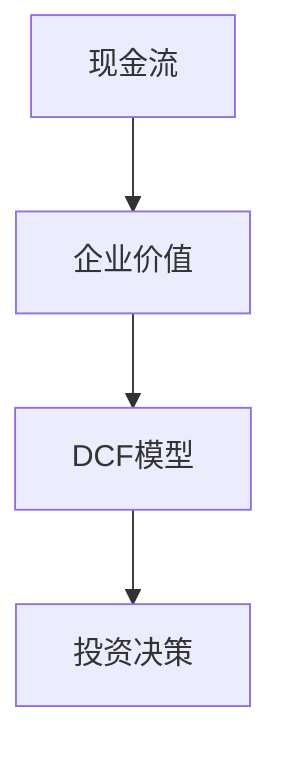
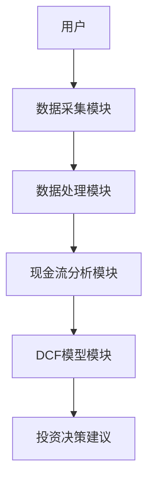
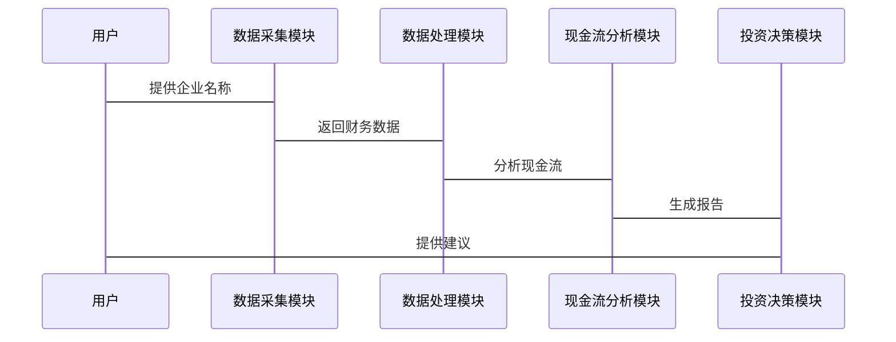

                 


# 巴菲特的公用事业投资策略：稳定现金流的魅力

## 关键词：巴菲特, 公用事业投资, 现金流, 价值投资, DCF模型, 投资策略

## 摘要：本文深入探讨巴菲特在公用事业领域的投资策略，重点分析其对稳定现金流的重视。通过详细阐述现金流分析、DCF模型的应用以及实际投资案例，揭示稳定现金流在投资决策中的关键作用。文章结合技术语言与实际案例，为投资者提供实用的分析工具和策略建议。

---

## 第一部分：背景介绍

### 1. 巴菲特的投资理念与公用事业行业的结合

#### 1.1 问题背景
公用事业行业作为基础性产业，具有高门槛、高收益、高风险的特点。巴菲特的投资理念强调长期稳定和价值投资，如何将其应用于公用事业行业，是本文探讨的核心问题。

#### 1.2 问题描述
公用事业行业受经济波动影响较小，但其现金流稳定性是关键。本文分析巴菲特如何通过现金流评估企业价值。

#### 1.3 问题解决
通过现金流分析和DCF模型，巴菲特识别出具有稳定现金流的企业，实现长期价值增长。

#### 1.4 边界与外延
仅分析巴菲特的策略，不涉及其他投资者的方法。

### 1.5 核心概念与联系

#### 1.5.1 现金流分类对比

| 类型       | 定义                         | 特点               |
|------------|------------------------------|--------------------|
| 经营活动现金流 | 日常运营产生的现金流       | 主要来源          |
| 投资活动现金流 | 资产购买与出售产生的现金流 | 支出或收益         |
| 筹资活动现金流 | 股权融资或债务融资产生的现金流 | 资金流入或流出 |

#### 1.5.2 实体关系图



---

## 第2章：现金流分析与估值模型

### 2.1 现金流的基本概念与分类

#### 2.1.1 现金流的定义与重要性
现金流是企业运营中的资金流动，反映企业的财务健康状况。

#### 2.1.2 现金流类型
经营、投资、筹资三类，每类对企业价值的影响不同。

### 2.2 现金流稳定性分析

#### 2.2.1 现金流波动性的影响因素
市场需求、成本变化、政策调整等。

#### 2.2.2 现金流预测与风险评估
通过历史数据分析和情景模拟，评估现金流的波动风险。

### 2.3 巴菲特DCF估值模型

#### 2.3.1 DCF模型的基本原理
通过未来现金流的现值计算企业价值。

#### 2.3.2 现金流贴现率的计算
贴现率反映资金的时间价值和风险溢价。

公式：
$$
\text{贴现率} = \text{无风险利率} + \text{风险溢价}
$$

#### 2.3.3 企业价值的现值计算公式
$$
\text{企业价值} = \sum_{t=1}^{n} \frac{\text{现金流}_t}{(1 + r)^t}
$$

### 2.4 实例分析：巴菲特如何评估公用事业企业的现金流

#### 2.4.1 某公用事业企业的现金流分析
分析其经营活动、投资活动的现金流情况。

#### 2.4.2 应用DCF模型进行估值
计算未来现金流的现值，评估企业潜在价值。

---

## 第3章：系统分析与架构设计

### 3.1 问题场景介绍

#### 3.1.1 投资决策支持系统
开发一个基于现金流分析的投资决策工具。

### 3.2 系统功能设计

#### 3.2.1 数据采集模块
收集企业的财务数据。

#### 3.2.2 现金流分析模块
计算各类现金流，并评估其稳定性。

### 3.3 系统架构设计



### 3.4 接口设计

#### 3.4.1 数据接口
与数据库交互，获取企业财务数据。

#### 3.4.2 用户接口
展示分析结果，提供投资建议。

### 3.5 交互流程图



---

## 第4章：项目实战

### 4.1 环境安装

#### 4.1.1 工具安装
安装Python和相关库（pandas、numpy）。

#### 4.1.2 数据获取
从可靠来源获取公用事业企业的财务数据。

### 4.2 核心代码实现

#### 4.2.1 现金流计算代码

```python
import pandas as pd

# 假设df为包含财务数据的DataFrame，'现金流'列为'cash_flow'
cash_flow = df['cash_flow'].values
discount_rate = 0.1  # 假设贴现率为10%

# 计算现值
pv = sum(cash_flow / (1 + discount_rate)**i for i in range(len(cash_flow)))
print(pv)
```

#### 4.2.2 DCF模型实现

```python
def calculateenterprise_value(cash_flows, discount_rate, perpetuity_growth=0):
    terminal_value = cash_flows[-1] * (1 + perpetuity_growth) / discount_rate
    enterprise_value = terminal_value / (1 + discount_rate)**(len(cash_flows))
    return enterprise_value

# 示例数据
cash_flows = [100, 120, 150, 200]
discount_rate = 0.1
print(calculateenterprise_value(cash_flows, discount_rate))
```

### 4.3 实例分析与代码解读

#### 4.3.1 数据分析
分析某公用事业企业的历史现金流，预测未来现金流。

#### 4.3.2 投资决策
基于DCF模型计算企业价值，评估是否值得投资。

### 4.4 项目小结

#### 4.4.1 成功经验
现金流分析和DCF模型的有效性。

#### 4.4.2 注意事项
数据准确性、模型假设合理性的重要性。

---

## 第5章：总结与展望

### 5.1 总结
本文详细分析了巴菲特的公用事业投资策略，展示了现金流稳定性和DCF模型的应用。

### 5.2 展望
未来可结合AI技术，提升现金流预测和投资决策的准确性。

---

## 作者：AI天才研究院/AI Genius Institute & 禅与计算机程序设计艺术 /Zen And The Art of Computer Programming

