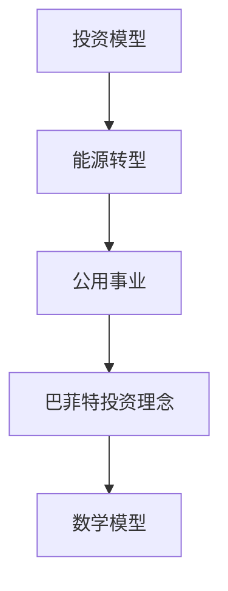
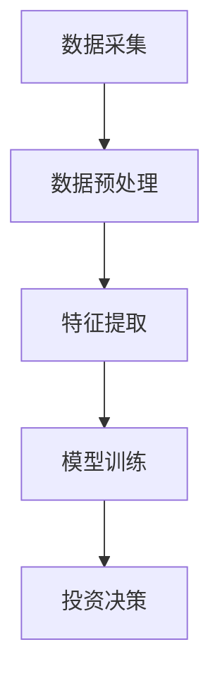
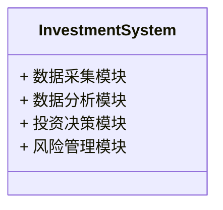
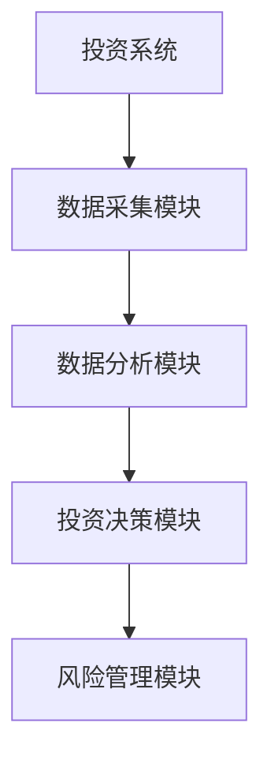

                 


```markdown
# 巴菲特的公用事业投资：能源转型背景下的新策略

## 关键词：巴菲特、公用事业投资、能源转型、能源投资策略、价值投资、风险管理

## 摘要：  
能源转型正在重塑全球公用事业行业的格局，而巴菲特作为全球顶级投资者，其投资策略也在不断演变。本文深入分析了巴菲特在公用事业领域的投资理念，探讨了能源转型背景下其投资策略的变化，并结合实际案例，提出了新的投资策略。通过详细的技术分析和数学建模，本文为投资者提供了实用的工具和方法，帮助其在能源转型中捕捉投资机会。

---

## 第一部分: 能源转型背景下的巴菲特公用事业投资

### 第1章: 能源转型的背景与挑战

#### 1.1 能源转型的定义与目标
能源转型是指从依赖化石燃料转向可再生能源的过程，旨在减少碳排放、应对气候变化并实现可持续发展。其核心目标包括提高能源效率、减少对化石燃料的依赖以及推动清洁能源技术的发展。

#### 1.2 传统能源与新能源的对比
- **传统能源的优劣势**：传统能源（如煤炭、石油、天然气）具有稳定性高、技术成熟等优势，但其高碳排放对环境造成严重威胁。
- **新能源的优劣势**：新能源（如风能、太阳能、生物质能）具有清洁、可再生的优势，但存在成本高、技术不稳定等问题。
- **能源转型对公用事业投资的影响**：能源转型加速了对新能源的投资，传统公用事业公司面临转型压力，但也催生了新的投资机会。

#### 1.3 巴菲特投资理念的演变
- **巴菲特投资理念的核心**：巴菲特始终坚持价值投资，注重企业的基本面、财务状况和长期盈利能力。
- **能源转型对巴菲特投资策略的影响**：能源转型背景下，巴菲特开始关注新能源领域的投资机会，尤其是那些具有技术优势和长期增长潜力的企业。
- **巴菲特公用事业投资的成功案例**：如巴菲特对伯克希尔哈撒韦（Berkshire Hathaway）的投资，该公司通过多元化布局，成功转型为一家能源巨头。

---

### 第2章: 巴菲特公用事业投资的核心概念

#### 2.1 巴菲特投资模型的构建
- **投资模型的核心要素**：包括企业财务状况、行业前景、政策支持、技术优势和管理层能力。
- **投资模型的数学表达**：通过量化指标（如市盈率、ROE、现金流等）评估企业的投资价值。
- **投资模型的验证与优化**：通过历史数据验证模型的有效性，并根据市场变化进行调整。

#### 2.2 巴菲特投资模型的属性特征对比
- **投资模型的稳定性对比**：传统能源投资模型在能源转型中稳定性下降，而新能源投资模型更具灵活性。
- **投资模型的收益性对比**：新能源投资模型的收益潜力更大，但风险也更高。
- **投资模型的风险性对比**：传统能源投资模型的风险主要来自政策和价格波动，而新能源投资模型的风险来自技术不确定性和市场波动。

#### 2.3 巴菲特投资模型的ER实体关系图


---

### 第3章: 巴菲特投资模型的算法原理

#### 3.1 巴菲特投资模型的算法流程


#### 3.2 巴菲特投资模型的Python实现
```python
def investment_model(data):
    # 数据预处理
    data_processed = preprocess(data)
    # 特征提取
    features = extract_features(data_processed)
    # 模型训练
    model = train_model(features)
    # 投资决策
    decision = make_investment_decision(model, features)
    return decision

def preprocess(data):
    # 数据清洗和标准化
    return data_cleaned

def extract_features(data):
    # 提取关键特征，如市盈率、ROE等
    return features_dict

def train_model(features):
    # 训练机器学习模型，评估企业价值
    return trained_model

def make_investment_decision(model, features):
    # 根据模型预测结果做出投资决策
    return decision
```

#### 3.3 巴菲特投资模型的数学模型和公式
- 投资价值评分公式：
  $$ \text{投资价值} = \frac{\text{净利润} \times \text{ROE}}{\text{市盈率}} $$
- 投资风险评估公式：
  $$ \text{风险评分} = \frac{\text{行业波动} + \text{政策风险}}{2} $$

---

### 第4章: 数学模型的构建与应用

#### 4.1 投资价值评分系统
- **评分系统的设计**：基于巴菲特的投资理念，构建一个评分系统，量化企业的投资价值。
- **评分系统的实现**：
  ```python
  def calculate_score(finance_data):
      # 计算投资价值评分
      score = (finance_data['净利润'] * finance_data['ROE']) / finance_data['市盈率']
      return score
  ```

#### 4.2 投资风险评估模型
- **风险模型的设计**：通过分析企业的财务状况、行业风险和政策风险，构建风险评估模型。
- **风险模型的实现**：
  ```python
  def calculate_risk(finance_data):
      # 计算投资风险评分
      risk = (finance_data['行业波动'] + finance_data['政策风险']) / 2
      return risk
  ```

---

### 第5章: 系统分析与架构设计方案

#### 5.1 投资系统的需求分析
- **需求背景**：能源转型背景下，投资者需要实时监控能源市场动态，评估企业投资价值。
- **需求分析**：系统需要具备数据采集、分析、预测和决策支持功能。

#### 5.2 投资系统的功能设计


#### 5.3 投资系统的架构设计


---

### 第6章: 项目实战

#### 6.1 环境配置
- **工具安装**：安装Python、Pandas、Scikit-learn等工具。
- **数据源**：获取公用事业企业的财务数据和市场数据。

#### 6.2 核心代码实现
```python
import pandas as pd
from sklearn.linear_model import LinearRegression

# 数据加载
data = pd.read_csv('public_utility_data.csv')

# 特征工程
X = data[['净利润', 'ROE', '市盈率']]
y = data['投资价值']

# 模型训练
model = LinearRegression()
model.fit(X, y)

# 投资决策
def make_decision(new_data):
    predicted_value = model.predict(new_data)
    if predicted_value > 0.8 * y.mean():
        return "买入"
    else:
        return "观望"
```

#### 6.3 案例分析
- **案例选择**：选择一家新能源公司进行分析。
- **分析结果**：根据模型预测，该公司的投资价值较高，建议买入。

---

### 第7章: 总结与展望

#### 7.1 总结
- **主要结论**：能源转型背景下，巴菲特的投资策略从传统能源转向新能源，但仍注重企业的基本面和技术优势。
- **实践经验**：通过数学建模和系统设计，投资者可以更科学地进行投资决策。

#### 7.2 展望
- **未来趋势**：随着技术进步，新能源投资将占据更大的比重。
- **研究方向**：进一步优化投资模型，探索更多能源转型中的投资机会。

---

## 作者：AI天才研究院/AI Genius Institute & 禅与计算机程序设计艺术 /Zen And The Art of Computer Programming
```

