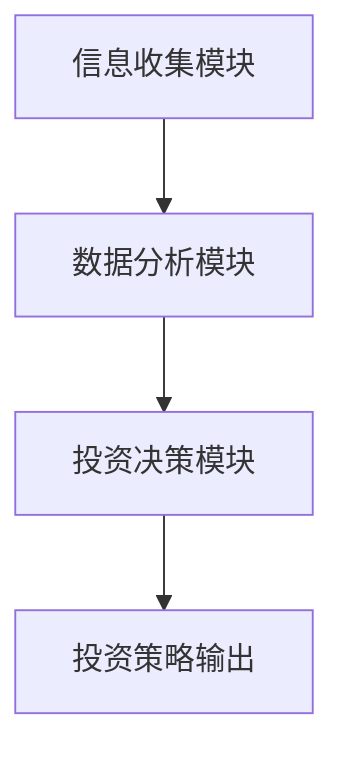
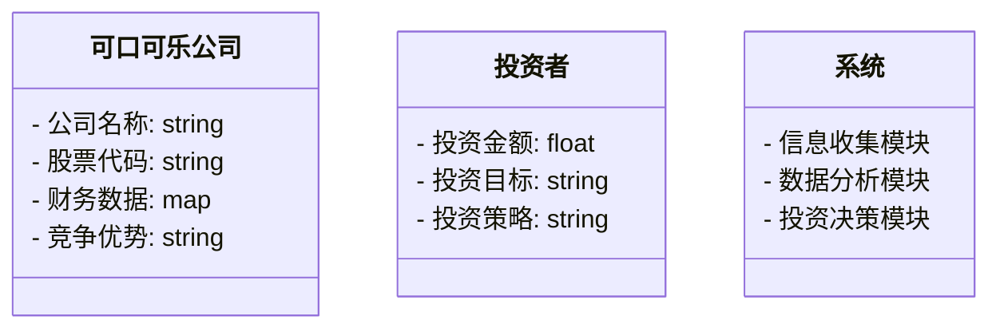

                 


---

# 巴菲特的可口可乐投资案例分析

> 关键词：巴菲特，价值投资，可口可乐，投资策略，财务分析，系统架构

> 摘要：本文通过分析巴菲特投资可口可乐的案例，探讨价值投资的核心理念、选股标准和投资策略。结合可口可乐的财务数据、行业地位和竞争优势，详细解读巴菲特的投资决策过程。同时，通过系统架构设计和数学模型分析，揭示投资决策的科学方法。

---

## 第一部分: 巴菲特的投资理念与价值投资原则

### 第1章: 巴菲特的投资哲学

#### 1.1 价值投资的核心理念

##### 1.1.1 价值投资的定义与原则
价值投资是一种长期投资策略，强调以低于内在价值的价格买入优质资产。巴菲特的价值投资原则包括以下几点：
- **安全边际**：买入价格低于内在价值。
- **长期视角**：关注企业的长期盈利能力。
- **优质企业**：投资具有强大竞争优势的企业。

##### 1.1.2 巴菲特的投资策略与风格
巴菲特的投资策略以“买入并持有”为核心，注重企业的基本面分析和长期价值。他的投资风格包括：
- **集中投资**：将资金集中在少数优质企业上。
- **逆向投资**：在市场恐慌时买入，市场狂热时卖出。

##### 1.1.3 价值投资的长期视角
巴菲特强调长期投资，认为短期市场波动不应影响长期投资决策。他通过持有优质企业股票，分享企业的长期增长。

#### 1.2 巴菲特的成功案例

##### 1.2.1 巴菲特的经典投资案例
巴菲特的投资案例包括美国运通、华盛顿邮报和可口可乐等。这些案例展示了他对企业基本面和长期价值的精准判断。

##### 1.2.2 可口可乐投资的背景与动机
1988年，巴菲特开始投资可口可乐，当时的可口可乐正处于增长期，品牌价值高，市场地位稳固。

##### 1.2.3 巴菲特投资决策的关键因素
- **品牌价值**：可口可乐作为全球知名品牌，具有强大的市场影响力。
- **财务健康**：公司财务状况稳健，现金流充裕。
- **管理层**：管理层优秀，注重股东价值。

### 第2章: 可口可乐公司的财务状况

#### 2.1 财务报表分析

##### 2.1.1 利润表分析
可口可乐的利润表显示公司具有稳定的收入和利润增长。例如，2022年公司实现营业收入371.5亿美元，净利润为94.7亿美元。

##### 2.1.2 资产负债表分析
公司资产主要包括流动资产和非流动资产，负债主要包括短期债务和长期债务。可口可乐的资产负债表显示公司财务状况稳健。

##### 2.1.3 现金流量表分析
可口可乐的现金流量表显示公司现金流充裕，经营活动产生的现金流为正，投资活动和筹资活动对现金流影响较小。

#### 2.2 财务比率分析

##### 2.2.1 股东权益回报率（ROE）
ROE = 净利润 / 平均股东权益
例如，可口可乐的ROE约为25%，表明公司股东权益回报率较高。

##### 2.2.2 资产回报率（ROA）
ROA = 净利润 / 平均总资产
可口可乐的ROA约为12%，表明公司资产利用效率较高。

##### 2.2.3 负债与股东权益比率
负债与股东权益比率 = 总负债 / 总股东权益
可口可乐的该比率约为0.4，表明公司负债水平较低，财务风险可控。

### 第3章: 可口可乐的行业地位与竞争优势

#### 3.1 可口可乐的行业地位

##### 3.1.1 饮料行业的市场结构
饮料行业是一个竞争激烈的行业，主要竞争对手包括百事可乐、雀巢等。可口可乐在碳酸饮料市场占据领先地位。

##### 3.1.2 可口可乐的市场份额
可口可乐在全球碳酸饮料市场占有率约为42%，显示出强大的市场地位。

##### 3.1.3 行业趋势与未来展望
行业趋势包括健康饮料需求增长、新兴市场扩张等。可口可乐通过产品创新和市场扩展应对行业变化。

#### 3.2 可口可乐的竞争优势

##### 3.2.1 品牌价值与品牌忠诚度
可口可乐拥有强大的品牌价值，品牌忠诚度高，消费者粘性强。

##### 3.2.2 全球化布局与供应链优势
可口可乐在全球拥有广泛的销售网络和高效的供应链，能够快速响应市场需求。

##### 3.2.3 创新能力与产品线扩展
可口可乐不断推出新产品，如零糖可乐、健怡可乐等，满足多样化消费需求。

### 第4章: 巴菲特的选股标准

#### 4.1 核心指标分析

##### 4.1.1 财务健康状况
巴菲特关注企业的财务健康状况，包括盈利能力、现金流和资产负债表健康。

##### 4.1.2 盈利能力
盈利能力是巴菲特选股的重要指标，他关注企业的净利润率、ROE等指标。

##### 4.1.3 现金流状况
现金流是企业健康的重要指标，巴菲特偏好现金流充裕的企业。

#### 4.2 行业分析与企业竞争力

##### 4.2.1 行业前景
巴菲特关注企业的行业前景，选择处于增长期的行业。

##### 4.2.2 企业竞争优势
他关注企业的竞争优势，包括品牌、技术、成本优势等。

##### 4.2.3 管理团队与企业治理
管理团队的素质和企业治理结构也是巴菲特选股的重要因素。

### 第5章: 投资决策的系统架构

#### 5.1 系统架构设计

##### 5.1.1 信息收集模块
信息收集模块负责收集企业的财务数据、行业信息和市场动态。

##### 5.1.2 数据分析模块
数据分析模块对收集到的数据进行清洗、整理和分析，包括财务比率分析、行业对比分析等。

##### 5.1.3 投资决策模块
投资决策模块基于数据分析结果，制定投资策略，包括买入、持有或卖出决策。

#### 5.2 系统流程图



---

## 第二部分: 巴菲特投资可口可乐的系统分析

### 第6章: 系统功能设计

#### 6.1 领域模型设计



#### 6.2 系统架构设计


---

## 第三部分: 项目实战与最佳实践

### 第7章: 项目实战

#### 7.1 环境安装

```bash
pip install mermaid
pip install matplotlib
```

#### 7.2 核心实现代码

```python
def calculate_roe(net_profit, equity):
    return net_profit / equity

def calculate_roa(net_profit, total_assets):
    return net_profit / total_assets

def main():
    # 输入财务数据
    net_profit = 94.7  # 单位：亿美元
    equity = 300.0     # 单位：亿美元
    total_assets = 450.0  # 单位：亿美元

    # 计算ROE和ROA
    roe = calculate_roe(net_profit, equity)
    roa = calculate_roa(net_profit, total_assets)

    print(f"ROE: {roe:.2f}%")
    print(f"ROA: {roa:.2f}%")

if __name__ == "__main__":
    main()
```

#### 7.3 应用解读与分析
通过上述代码，我们可以计算可口可乐的ROE和ROA，帮助我们评估公司的财务健康状况。

### 第8章: 总结与最佳实践

#### 8.1 总结
巴菲特的投资理念和方法为投资者提供了宝贵的借鉴。通过系统的分析和科学的决策，我们可以更好地进行投资决策。

#### 8.2 最佳实践
- **长期视角**：关注企业的长期价值。
- **优质企业**：选择具有强大竞争优势的企业。
- **风险管理**：合理控制投资风险。

#### 8.3 小结
巴菲特的可口可乐投资案例展示了价值投资的核心理念和成功策略。通过系统的分析和科学的决策，投资者可以在复杂多变的市场中找到优质的投资标的。

---

## 作者：AI天才研究院 & 禅与计算机程序设计艺术

