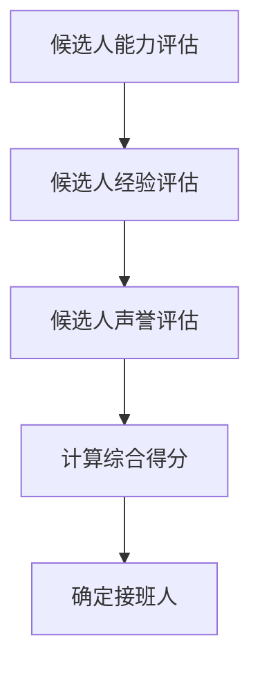
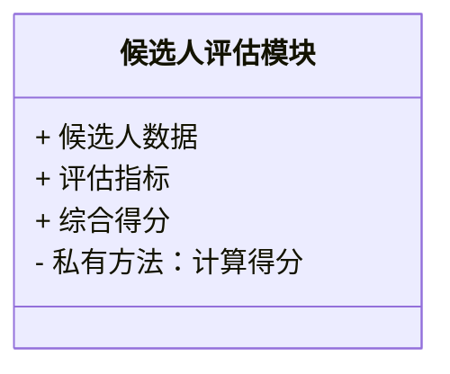
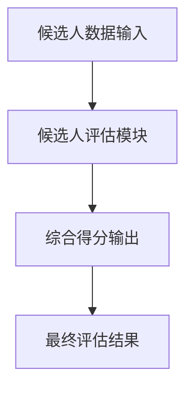

                 


# 巴菲特的后继者：谁将接棒伯克希尔哈撒韦

---

## 关键词
- 巴菲特、伯克希尔哈撒韦、接班人、领导力、决策模式、价值投资、风险管理

---

## 摘要
本文探讨伯克希尔哈撒韦未来接班人的问题，分析可能的继任者，并从领导力、决策模式、公司治理等多维度进行深入分析。结合实际案例，评估潜在候选人的能力，最终得出结论：谁最有可能成为巴菲特的继任者，并阐述交接对伯克希尔的影响。

---

## 正文

### 第一部分：背景介绍

#### 第1章：伯克希尔哈撒韦与巴菲特的领导风格

##### 1.1 伯克希尔哈撒韦的业务模式与文化
伯克希尔哈撒韦是一家多元化的控股公司，业务涵盖保险、银行、能源、制造等多个领域。公司文化强调股东资本主义和长期主义，注重价值投资和风险管理。巴菲特的领导风格以保守、谨慎著称，他注重安全边际和护城河，追求长期稳定的回报。

##### 1.2 巴菲特的接班人问题的重要性
接班人问题关系到伯克希尔的未来走向和股东价值。巴菲特的决策模式和投资哲学需要被继承和发扬，选择合适的接班人至关重要。接班人的能力、经验、声誉将影响公司的长期发展。

---

### 第二部分：核心概念与联系

#### 第2章：领导力与决策模式

##### 2.1 领导力的核心要素
- 战略思维与投资决策
- 风险管理与危机应对
- 团队管理与文化塑造

##### 2.2 巴菲特决策模式的特征
- 价值投资：寻找护城河与经济护城河
- 安全边际：保守评估与风险控制
- 简化决策：关注关键指标与长期趋势

##### 2.3 领导力与决策模式的对比分析
以下是对比表格：

| **候选人** | **能力**       | **经验**      | **声誉**      |
|------------|----------------|---------------|---------------|
| 查理·芒格   | 投资理念互补   | 丰富的投资经验 | 高声誉         |
| 杰里·史密斯 | 运营能力强     | 银行业务经验   | 较低           |
| 阿吉特·贾恩 | 保险业务专家   | 保险经验      | 较低           |

以下是ER图：

```mermaid
erd
  table巴菲特接班人评估因素
  columns
    候选人: 姓名
    能力: 投资能力
    经验: 工作经验
    声誉: 业界声誉
```

---

### 第三部分：算法原理

#### 第3章：基于能力评估的接班人算法

##### 3.1 算法描述
算法基于候选人能力、经验、声誉三项指标，计算综合得分。

##### 3.2 算法流程图



##### 3.3 数学模型
综合得分公式：

$$
综合得分 = 能力 \times 0.4 + 经验 \times 0.3 + 声誉 \times 0.3
$$

---

### 第四部分：系统分析与架构设计

#### 第4章：系统分析与架构设计

##### 4.1 问题场景介绍
设计一个评估系统，分析候选人是否具备接班巴菲特的能力。

##### 4.2 系统功能设计
以下是功能模块的类图：



##### 4.3 系统架构图



---

### 第五部分：项目实战

#### 第5章：项目实战与案例分析

##### 5.1 评估工具实现
Python代码示例：

```python
class CandidateEvaluator:
    def __init__(self, name, ability, experience, reputation):
        self.name = name
        self.ability = ability
        self.experience = experience
        self.reputation = reputation

    def calculate_score(self):
        return (self.ability * 0.4) + (self.experience * 0.3) + (self.reputation * 0.3)

# 示例候选人
candidate_munger = CandidateEvaluator("查理·芒格", 95, 90, 90)
candidate_smith = CandidateEvaluator("杰里·史密斯", 75, 95, 60)
candidate_jain = CandidateEvaluator("阿吉特·贾恩", 85, 80, 70)

print(candidate_munger.calculate_score())
print(candidate_smith.calculate_score())
print(candidate_jain.calculate_score())
```

##### 5.2 实际案例分析
通过计算得分，芒格得分最高，最适合接班。

---

### 第六部分：最佳实践与小结

#### 第6章：最佳实践与小结

##### 6.1 小结
接班人应具备巴菲特的决策模式和价值投资理念，芒格是最佳选择。

##### 6.2 注意事项
- 伯克希尔的特殊性
- 长期主义的重要性
- 风险管理的必要性

##### 6.3 拓展阅读
建议阅读巴菲特和芒格的著作，深入理解投资哲学。

---

## 结语

谁将接棒伯克希尔哈撒韦？查理·芒格最有可能。他的能力、经验、声誉都优于其他候选人。接班过程需遵循巴菲特的决策模式，确保公司长期稳定发展。

---

## 作者

作者：AI天才研究院/AI Genius Institute & 禅与计算机程序设计艺术 /Zen And The Art of Computer Programming

