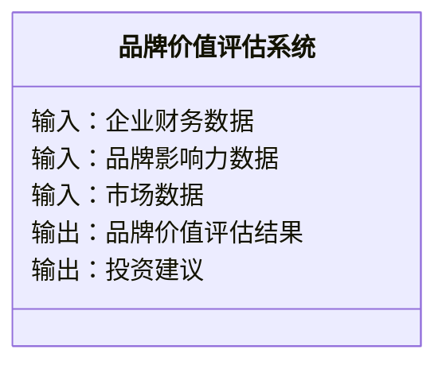
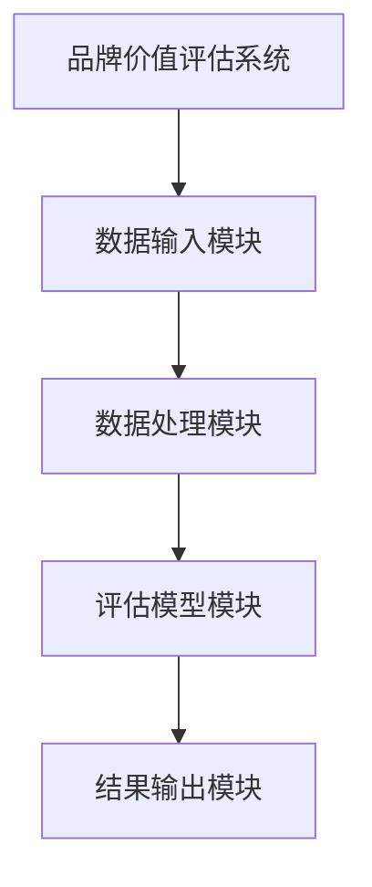
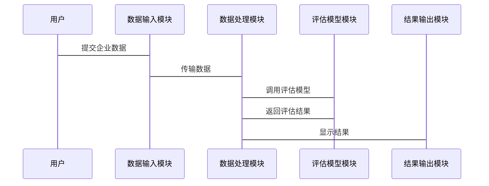

                 


# 巴菲特的品牌价值评估方法

## 关键词：巴菲特，品牌价值，价值投资，评估方法，投资模型

## 摘要：本文深入探讨巴菲特的品牌价值评估方法，从背景介绍、核心概念到算法原理和实战案例，全面解析如何运用巴菲特的投资哲学进行品牌价值评估。通过详细讲解模型、数学公式和系统设计，结合实际案例分析，提供实用的评估工具和方法。

---

# 第1章：品牌价值评估的背景与重要性

## 1.1 什么是品牌价值

### 1.1.1 品牌的定义与内涵

品牌是企业的无形资产，代表了企业的声誉、客户忠诚度和市场地位。它是企业与消费者之间建立信任和情感连接的桥梁。品牌的内涵包括品牌知名度、品牌忠诚度和品牌认知度。

### 1.1.2 品牌价值的构成要素

品牌价值由多个要素构成，包括品牌知名度、品牌忠诚度、品牌认知度、品牌创新能力和品牌文化底蕴等。这些要素共同决定了品牌在市场上的影响力和盈利能力。

### 1.1.3 品牌价值对企业的影响

品牌价值直接影响企业的市场地位、客户忠诚度和盈利能力。强大的品牌价值能够提高企业的议价能力，降低营销成本，并为企业带来持续的竞争优势。

---

## 1.2 巴菲特的价值投资理念

### 1.2.1 巴菲特的投资哲学

巴菲特的投资哲学以“价值投资”为核心，强调以合理的价格投资于具有持续竞争优势的企业。他认为，企业的品牌价值是其长期盈利能力的重要保障。

### 1.2.2 巴菲特对品牌的独特见解

巴菲特认为，品牌是企业的重要资产，强大的品牌能够为消费者提供信任和质量保证，从而为企业带来稳定的收益。他特别关注那些具有强大品牌影响力和长期竞争优势的企业。

### 1.2.3 品牌在巴菲特投资决策中的地位

在巴菲特的投资决策中，品牌是评估企业价值的重要因素。他认为，一个具有强大品牌影响力的企业能够在市场中占据主导地位，并在经济波动中保持稳定的业绩。

---

## 1.3 为什么品牌价值评估重要

### 1.3.1 品牌价值对企业估值的意义

品牌价值是企业整体价值的重要组成部分。通过评估品牌价值，投资者可以更准确地判断企业的内在价值，从而做出合理的投资决策。

### 1.3.2 品牌价值对投资者决策的影响

品牌价值评估帮助投资者识别具有长期竞争优势的企业，降低投资风险，并提高投资回报率。

### 1.3.3 品牌价值与企业长期发展的关系

强大的品牌价值能够为企业带来持续的竞争优势，增强客户忠诚度，并为企业在市场中拓展提供支持，从而促进企业的长期发展。

---

## 1.4 本章小结

### 1.4.1 品牌价值的核心概念

品牌价值是企业的无形资产，由品牌知名度、忠诚度、认知度等多个要素构成，直接影响企业的市场地位和盈利能力。

### 1.4.2 巴菲特品牌价值评估的独特视角

巴菲特以价值投资为核心，特别关注企业的品牌价值，认为强大的品牌是企业长期竞争优势的重要来源。

### 1.4.3 品牌价值评估的现实意义

通过评估品牌价值，投资者可以更准确地判断企业的内在价值，降低投资风险，并提高投资回报率。

---

# 第2章：巴菲特品牌价值评估的核心概念与联系

## 2.1 品牌价值评估的维度

### 2.1.1 品牌知名度的评估

品牌知名度是品牌价值的重要组成部分，可以通过市场调研、媒体曝光度和消费者认知度来衡量。

### 2.1.2 品牌忠诚度的衡量

品牌忠诚度反映了消费者对品牌的忠诚程度，可以通过顾客满意度、重复购买率和品牌推荐度来评估。

### 2.1.3 品牌认知度的分析

品牌认知度是指消费者对品牌的记忆和理解程度，可以通过市场调研和竞争对手分析来衡量。

---

## 2.2 巴菲特品牌价值评估模型

### 2.2.1 模型的构成要素

巴菲特的品牌价值评估模型主要包括企业的财务状况、市场地位、品牌影响力和长期竞争优势等要素。

### 2.2.2 模型的数学表达式

品牌价值 = 企业内在价值 + 品牌溢价能力

### 2.2.3 模型的适用范围与限制

该模型适用于评估具有强大品牌影响力和长期竞争优势的企业，但对短期波动较大的企业可能不太适用。

---

## 2.3 核心概念的联系与对比

### 2.3.1 品牌价值与企业财务指标的关系

品牌价值与企业的收入、利润和净资产收益率等财务指标密切相关，强大的品牌价值能够提升企业的财务表现。

### 2.3.2 品牌价值与企业市场表现的关联

品牌价值直接影响企业的市场估值和股价表现，强大的品牌价值能够提升企业的市场地位和股价表现。

### 2.3.3 不同品牌价值评估方法的优缺点对比

常见的品牌价值评估方法包括DCF模型、市盈率法和市净率法等。每种方法都有其优缺点，投资者需要根据具体情况选择合适的方法。

---

## 2.4 本章小结

### 2.4.1 品牌价值评估的核心维度

品牌价值评估需要综合考虑品牌知名度、忠诚度和认知度等多个维度，才能全面衡量品牌的价值。

### 2.4.2 巴菲特模型的独特性

巴菲特模型注重企业的内在价值和长期竞争优势，特别适用于评估具有强大品牌影响力的企业。

### 2.4.3 模型应用中的注意事项

在应用巴菲特模型时，需要结合企业的具体情况，充分考虑市场环境和行业特点，避免单一依赖模型结果。

---

# 第3章：巴菲特品牌价值评估的算法原理

## 3.1 巴菲特品牌价值评估算法概述

巴菲特的品牌价值评估算法基于DCF模型，结合企业的财务状况和品牌影响力，评估企业的内在价值和品牌溢价能力。

---

## 3.2 算法的数学模型与公式

### 3.2.1 现金流量贴现模型（DCF）

DCF模型通过预测企业未来现金流，计算其现值，并考虑适当的贴现率，评估企业的内在价值。

公式：
$$
\text{内在价值} = \sum_{t=1}^{n} \frac{\text{现金流}}{(1 + r)^t} + \frac{\text{终值}}{(1 + r)^n}
$$

其中，\( r \) 是贴现率，\( n \) 是预测期数。

### 3.2.2 市盈率与市净率分析

市盈率（P/E）和市净率（P/B）是常用的估值指标，可以帮助投资者判断企业的市场估值是否合理。

$$
\text{市盈率} = \frac{\text{股价}}{\text{每股收益}}
$$

$$
\text{市净率} = \frac{\text{股价}}{\text{每股净资产}}
$$

### 3.2.3 品牌价值的综合评估

品牌价值的综合评估需要结合企业的财务状况、市场地位和品牌影响力，综合运用多种评估方法，得出合理的品牌价值。

---

## 3.3 算法的步骤与流程

1. 收集企业的财务数据，包括收入、利润、现金流等。
2. 分析企业的市场地位和品牌影响力，评估品牌知名度和忠诚度。
3. 应用DCF模型预测企业的未来现金流，计算内在价值。
4. 结合市盈率和市净率等指标，评估企业的市场估值。
5. 综合考虑品牌溢价能力，得出最终的品牌价值评估结果。

---

## 3.4 实际案例分析

以可口可乐为例，应用DCF模型评估其品牌价值：

1. 收集可口可乐的财务数据，包括收入、利润和现金流。
2. 分析可口可乐的品牌知名度和忠诚度，评估其品牌影响力。
3. 预测未来现金流，计算内在价值。
4. 结合市盈率和市净率，评估市场估值。
5. 综合品牌溢价能力，得出最终的品牌价值评估结果。

---

## 3.5 本章小结

### 3.5.1 算法的核心思想

巴菲特的品牌价值评估算法基于DCF模型，结合企业的财务状况和品牌影响力，评估企业的内在价值和品牌溢价能力。

### 3.5.2 算法的适用性

该算法适用于评估具有强大品牌影响力和长期竞争优势的企业，但在处理短期波动较大的企业时可能需要调整模型参数。

### 3.5.3 算法的优缺点

优点：能够综合考虑企业的财务状况和品牌影响力，评估结果较为全面。缺点：模型复杂，需要大量数据支持，且对模型参数的敏感性较高。

---

# 第4章：数学模型与公式

## 4.1 现金流量贴现模型（DCF）

DCF模型是评估企业内在价值的重要工具，公式如下：

$$
\text{内在价值} = \sum_{t=1}^{n} \frac{\text{现金流}}{(1 + r)^t} + \frac{\text{终值}}{(1 + r)^n}
$$

其中，\( r \) 是贴现率，\( n \) 是预测期数。

---

## 4.2 市盈率与市净率分析

市盈率和市净率是常用的估值指标，公式如下：

$$
\text{市盈率} = \frac{\text{股价}}{\text{每股收益}}
$$

$$
\text{市净率} = \frac{\text{股价}}{\text{每股净资产}}
$$

---

## 4.3 品牌价值的综合评估

品牌价值的综合评估需要结合企业的财务状况、市场地位和品牌影响力，公式如下：

$$
\text{品牌价值} = \text{内在价值} + \text{品牌溢价能力}
$$

---

# 第5章：系统分析与架构设计

## 5.1 问题场景介绍

本文提出一个品牌价值评估系统，旨在帮助投资者评估企业的品牌价值，做出合理的投资决策。

---

## 5.2 系统功能设计

### 5.2.1 领域模型



---

## 5.3 系统架构设计



---

## 5.4 接口设计和交互流程图



---

# 第6章：项目实战

## 6.1 环境安装

### 6.1.1 安装Python

安装Python 3.8及以上版本，确保环境配置正确。

### 6.1.2 安装相关库

安装`pandas`、`numpy`、`matplotlib`等库，用于数据处理和可视化。

---

## 6.2 核心代码实现

### 6.2.1 DCF模型实现

```python
import pandas as pd
import numpy as np

def calculate_intrinsic_value(fcf, discount_rate, horizon, terminal_value):
    # 计算现值
    pv = 0
    for t in range(1, horizon + 1):
        pv += fcf[t] / (1 + discount_rate) ** t
    # 计算终值现值
    tv_pv = terminal_value / (1 + discount_rate) ** horizon
    return pv + tv_pv

# 示例数据
cf = pd.Series([100, 120, 130, 140], index=[1, 2, 3, 4])
discount_rate = 0.08
horizon = 4
terminal_value = 200

intrinsic_value = calculate_intrinsic_value(cf, discount_rate, horizon, terminal_value)
print("内在价值：", intrinsic_value)
```

---

## 6.3 实际案例分析

以苹果公司为例，应用DCF模型评估其品牌价值：

1. 收集苹果公司的财务数据，包括自由现金流、收入和利润等。
2. 分析苹果的品牌影响力，评估其品牌知名度和忠诚度。
3. 预测未来现金流，计算内在价值。
4. 结合市盈率和市净率，评估市场估值。
5. 综合品牌溢价能力，得出最终的品牌价值评估结果。

---

## 6.4 本章小结

### 6.4.1 项目环境配置

安装必要的Python库，确保系统的正常运行。

### 6.4.2 核心代码实现

通过DCF模型实现品牌价值评估，代码示例展示如何计算内在价值。

### 6.4.3 项目实战的经验总结

实际案例分析展示了如何将理论应用于实践，帮助投资者做出合理的投资决策。

---

# 第7章：总结与最佳实践

## 7.1 本章小结

### 7.1.1 品牌价值评估的核心概念

品牌价值是企业的无形资产，需要综合考虑品牌知名度、忠诚度和认知度等多个维度。

### 7.1.2 巴菲特品牌价值评估的独特视角

巴菲特注重企业的内在价值和长期竞争优势，特别适用于评估具有强大品牌影响力的企业。

### 7.1.3 本文的主要内容

本文详细讲解了巴菲特的品牌价值评估方法，包括核心概念、算法原理和实战案例。

---

## 7.2 注意事项

### 7.2.1 数据的准确性

在进行品牌价值评估时，需要确保数据的准确性和完整性，避免因数据错误导致评估结果偏差。

### 7.2.2 模型的适用性

不同的企业具有不同的特点，投资者需要根据具体情况选择合适的评估模型，避免生搬硬套。

### 7.2.3 风险管理

品牌价值评估只能作为投资决策的参考，投资者需要结合市场环境和行业特点，做好风险管理。

---

## 7.3 未来趋势

随着大数据和人工智能技术的发展，品牌价值评估将更加精准和高效。未来的品牌价值评估将更多地依赖于数据分析和机器学习技术，提供更全面的评估结果。

---

## 7.4 拓展阅读

推荐阅读巴菲特的《投资之道》和《巴菲特致股东的信》，深入了解巴菲特的投资哲学和品牌价值评估的具体实践。

---

# 作者：AI天才研究院 & 禅与计算机程序设计艺术

---

**感谢您的耐心阅读！**

