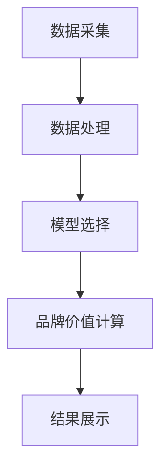
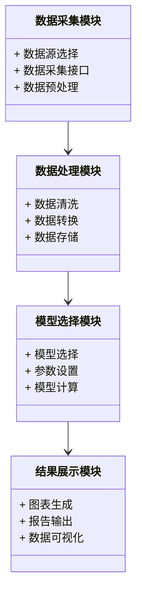

                 


# 巴菲特的品牌价值评估：无形资产在企业价值中的重要性

## 关键词：巴菲特，品牌价值，无形资产，企业价值，价值投资

## 摘要：
本文探讨了巴菲特在品牌价值评估中的独特见解，分析了无形资产在企业价值中的重要性。通过理论分析、模型构建、案例研究和实战指导，本文详细阐述了品牌价值评估的方法和策略，帮助读者理解和应用这些原则。

---

## 第一部分: 巴菲特的投资理念与品牌价值概述

### 第1章: 巴菲特投资理念与品牌价值概述

#### 1.1 巴菲特的投资理念
##### 1.1.1 价值投资的核心原则
- 价值投资的核心在于寻找被市场低估的企业。
- 巴菲特强调企业基本面分析和长期价值。
- 价值投资的关键是寻找具有持续竞争优势的企业。

##### 1.1.2 巴菲特对品牌价值的重视
- 品牌价值是企业长期竞争优势的重要来源。
- 品牌价值反映在企业的定价能力、客户忠诚度和市场影响力。
- 巴菲特认为品牌价值是企业内在价值的重要组成部分。

##### 1.1.3 品牌价值在企业长期成功中的作用
- 品牌价值影响企业的市场地位和盈利能力。
- 强大的品牌价值能够为企业带来溢价能力。
- 品牌价值是企业抵御市场竞争的核心竞争力。

#### 1.2 品牌价值的定义与特征
##### 1.2.1 品牌的定义
- 品牌是企业与消费者之间的纽带。
- 品牌是企业的无形资产，包括名称、标志、声誉等。
- 品牌是消费者对企业产品或服务的总体认知和评价。

##### 1.2.2 品牌价值的核心特征
- 品牌价值具有长期性和累积性。
- 品牌价值与消费者认知和市场行为密切相关。
- 品牌价值是企业竞争力的重要组成部分。

##### 1.2.3 品牌与企业价值的关系
- 品牌价值直接影响企业的市场价值。
- 品牌价值是企业财务价值的重要组成部分。
- 品牌价值是企业长期盈利能力的体现。

#### 1.3 品牌价值评估的重要性
##### 1.3.1 品牌价值对企业决策的影响
- 品牌价值影响企业的战略决策，如并购、市场扩展等。
- 品牌价值是企业制定定价策略的重要依据。
- 品牌价值影响企业的研发投入和创新方向。

##### 1.3.2 品牌价值对投资者决策的影响
- 品牌价值是投资者评估企业内在价值的重要指标。
- 品牌价值影响企业的市盈率和市净率等估值指标。
- 品牌价值是投资者长期投资决策的重要参考。

##### 1.3.3 品牌价值在企业战略中的地位
- 品牌价值是企业战略规划的核心要素。
- 品牌价值是企业风险管理的重要内容。
- 品牌价值是企业实现可持续发展的关键因素。

### 第2章: 品牌价值评估的理论基础

#### 2.1 品牌价值评估的理论模型
##### 2.1.1 品牌价值的构成要素
- 品牌知名度：品牌在市场上的认知度和曝光度。
- 品牌美誉度：品牌在消费者心中的声誉和信任度。
- 品牌忠诚度：消费者对品牌的偏好和忠诚程度。
- 品牌创新力：品牌在产品和服务上的创新能力和市场响应能力。

##### 2.1.2 品牌价值评估的主要理论
- 市场法：基于市场交易数据进行品牌价值评估。
- 成本法：基于品牌建设的投入成本进行品牌价值评估。
- 收益法：基于品牌为企业带来的超额收益进行品牌价值评估。
- 综合法：结合多种方法进行品牌价值评估。

##### 2.1.3 不同理论的优缺点对比
- 市场法的优点是客观、可比性高，缺点是难以量化品牌独特价值。
- 成本法的优点是可操作性强，缺点是忽视了品牌市场价值。
- 收益法的优点是考虑了品牌对企业收益的影响，缺点是需要准确预测未来收益。
- 综合法的优点是综合考虑多种因素，缺点是操作复杂性高。

#### 2.2 品牌价值评估的核心概念
##### 2.2.1 品牌忠诚度
- 品牌忠诚度的定义和衡量标准。
- 品牌忠诚度对企业市场稳定性和收益能力的影响。
- 如何通过品牌忠诚度评估品牌价值。

##### 2.2.2 品牌认知度
- 品牌认知度的定义和衡量方法。
- 品牌认知度与市场占有率的关系。
- 如何通过品牌认知度提升品牌价值。

##### 2.2.3 品牌联想与品牌资产
- 品牌联想的定义和作用。
- 品牌联想对品牌资产的影响。
- 如何通过品牌联想提升品牌价值。

#### 2.3 品牌价值评估的边界与外延
##### 2.3.1 品牌价值评估的适用范围
- 品牌价值评估适用于哪些类型的企业。
- 品牌价值评估在不同行业中的应用差异。
- 品牌价值评估的局限性和适用场景。

##### 2.3.2 品牌价值与其他无形资产的关系
- 品牌价值与企业商誉的关系。
- 品牌价值与企业专利、商标等其他无形资产的关系。
- 如何在企业整体价值评估中综合考虑品牌价值和其他无形资产。

##### 2.3.3 品牌价值评估的局限性
- 品牌价值评估的主观性和不确定性。
- 品牌价值评估受到市场环境和消费者行为的影响。
- 品牌价值评估的动态性和时间性。

### 第3章: 品牌价值评估的关键影响因素

#### 3.1 品牌认知度与市场地位
##### 3.1.1 品牌认知度的测量方法
- 市场调研法：通过问卷调查、焦点小组等方式测量品牌认知度。
- 数据分析法：通过市场数据和消费者行为分析品牌认知度。
- 对比分析法：通过与竞争对手的对比分析品牌认知度。

##### 3.1.2 品牌认知度与市场地位的关系
- 市场地位高的品牌通常具有较高的品牌认知度。
- 品牌认知度高的品牌更容易占据市场主导地位。
- 品牌认知度与市场占有率呈正相关关系。

##### 3.1.3 如何通过品牌认知度提升品牌价值
- 加强品牌宣传和推广，提高品牌知名度。
- 提供优质产品和服务，增强品牌美誉度。
- 持续创新和改进，保持品牌竞争力。

#### 3.2 品牌忠诚度与客户关系
##### 3.2.1 品牌忠诚度的衡量标准
- 重复购买率：消费者是否持续购买该品牌产品。
- 品牌偏好度：消费者在多个品牌中选择该品牌的倾向性。
- 品牌拥护度：消费者对品牌的认同感和忠诚度。

##### 3.2.2 品牌忠诚度与客户关系管理
- 品牌忠诚度高的客户通常具有较高的客户满意度和忠诚度。
- 品牌忠诚度与客户生命周期价值的关系。
- 如何通过客户关系管理提升品牌忠诚度。

##### 3.2.3 如何通过品牌忠诚度提升品牌价值
- 提供优质产品和服务，增强客户满意度。
- 建立长期客户关系，提高客户忠诚度。
- 通过会员制度、忠诚度计划等方式增强客户粘性。

#### 3.3 市场竞争力与品牌差异化
##### 3.3.1 市场竞争力的定义与衡量
- 市场竞争力是指企业在市场上与其他竞争对手相比的优势。
- 市场竞争力通常通过市场份额、市场增长率、市场占有率等指标衡量。
- 市场竞争力强的企业通常具有较高的品牌价值。

##### 3.3.2 品牌差异化与市场竞争
- 品牌差异化是指品牌在市场中独特的定位和特点。
- 品牌差异化是企业在市场竞争中脱颖而出的关键。
- 如何通过品牌差异化提升品牌价值。

##### 3.3.3 如何通过市场竞争力提升品牌价值
- 加强产品研发和创新，保持技术领先。
- 提高产品质量和服务水平，增强市场竞争力。
- 通过差异化营销策略，提升品牌独特性。

#### 3.4 行业发展趋势与品牌适应性
##### 3.4.1 行业发展趋势的定义与影响
- 行业发展趋势是指行业内长期的发展方向和趋势。
- 行业发展趋势对品牌价值的影响。
- 行业发展趋势是品牌战略制定的重要依据。

##### 3.4.2 品牌适应性与行业发展趋势的关系
- 品牌适应性强的企业能够更好地应对行业变化。
- 品牌适应性是企业在行业发展趋势中保持竞争力的关键。
- 如何通过品牌适应性提升品牌价值。

##### 3.4.3 如何通过行业发展趋势提升品牌价值
- 加强市场调研和趋势分析，把握行业发展方向。
- 根据行业发展趋势调整品牌战略，提升品牌适应性。
- 通过技术创新和产品升级，适应行业发展趋势。

---

## 第二部分: 品牌价值评估的数学模型与实战分析

### 第4章: 品牌价值评估的数学模型

#### 4.1 品牌价值评估的数学模型概述
##### 4.1.1 品牌价值评估模型的选择与应用
- 选择合适的模型是品牌价值评估的关键。
- 不同模型的适用场景和应用方法。
- 如何根据企业实际情况选择合适的模型。

##### 4.1.2 品牌价值评估模型的优缺点对比
- 市场法模型：优点是客观、可比性高，缺点是难以量化品牌独特价值。
- 成本法模型：优点是可操作性强，缺点是忽视了品牌市场价值。
- 收益法模型：优点是考虑了品牌为企业带来的超额收益，缺点是需要准确预测未来收益。
- 综合法模型：优点是综合考虑多种因素，缺点是操作复杂性高。

#### 4.2 品牌价值评估的核心算法
##### 4.2.1 品牌价值评估的数学公式
- 品牌价值 = 品牌忠诚度 × 品牌认知度 × 市场占有率
- 品牌价值 = 品牌资产 × 品牌影响力 × 品牌创新力

##### 4.2.2 品牌忠诚度的计算方法
- 品牌忠诚度指数（CLI）= （重复购买率 × 品牌偏好度）/ 市场占有率
- 品牌忠诚度评分（CLS）= （客户满意度 × 品牌认知度）/ 竞争对手品牌忠诚度

##### 4.2.3 品牌认知度的计算方法
- 品牌认知度指数（BCI）= （品牌提及率 × 品牌知名度） / 市场总品牌数
- 品牌认知度评分（CRS）= （品牌识别度 × 品牌记忆度） / 品牌总数

##### 4.2.4 市场占有率的计算方法
- 市场占有率 = （企业销售额 / 市场总销售额） × 100%
- 市场占有率指数（MRI）= （企业市场占有率 × 市场增长率） / 行业平均市场占有率

#### 4.3 品牌价值评估的数学模型实现
##### 4.3.1 品牌价值评估的步骤
1. 确定评估目标和范围。
2. 收集相关数据，包括品牌忠诚度、品牌认知度、市场占有率等。
3. 选择合适的评估模型。
4. 计算品牌价值，调整和验证模型。
5. 输出评估结果，并进行分析和总结。

##### 4.3.2 品牌价值评估的Python代码实现
```python
# 品牌价值评估的Python代码实现
import pandas as pd
import numpy as np

# 数据输入
brand_data = {
    '品牌忠诚度': [0.8, 0.7, 0.9],
    '品牌认知度': [0.75, 0.6, 0.85],
    '市场占有率': [0.25, 0.15, 0.3]
}

df = pd.DataFrame(brand_data)

# 计算品牌价值
df['品牌价值'] = df['品牌忠诚度'] * df['品牌认知度'] * df['市场占有率']

print("品牌价值评估结果：")
print(df)
```

##### 4.3.3 品牌价值评估的可视化分析
- 使用Matplotlib绘制品牌价值分布图。
- 使用Seaborn绘制品牌价值与市场占有率的散点图。
- 使用Tableau进行品牌价值的多维度可视化分析。

### 第5章: 品牌价值评估的系统架构设计

#### 5.1 系统功能设计
##### 5.1.1 系统功能模块划分
- 数据采集与处理模块：负责收集和处理品牌相关数据。
- 模型选择与计算模块：负责选择合适的模型并进行计算。
- 结果展示与分析模块：负责展示评估结果并进行分析。

##### 5.1.2 系统功能设计的细节
- 数据采集模块：支持多种数据源，包括问卷调查数据、市场调研数据等。
- 模型选择模块：提供多种评估模型供用户选择，并支持自定义模型。
- 结果展示模块：以图表和报告形式展示评估结果，支持多维度分析。

##### 5.1.3 系统功能设计的流程图


#### 5.2 系统架构设计
##### 5.2.1 系统架构的总体设计
- 采用分层架构，包括数据层、业务逻辑层和表现层。
- 数据层：负责数据的存储和管理。
- 业务逻辑层：负责业务逻辑的实现和模型计算。
- 表现层：负责用户界面和结果展示。

##### 5.2.2 系统架构的详细设计
- 数据层：使用数据库技术存储品牌数据，支持多种数据格式。
- 业务逻辑层：实现品牌价值评估的核心算法，支持多种评估模型。
- 表现层：提供友好的用户界面，支持多维度结果展示和交互。

##### 5.2.3 系统架构设计的类图


### 第6章: 品牌价值评估的项目实战

#### 6.1 项目背景与目标
##### 6.1.1 项目背景介绍
- 假设我们是一家科技公司，致力于为企业提供品牌价值评估服务。
- 项目目标是开发一个品牌价值评估系统，帮助企业准确评估品牌价值，制定科学的品牌战略。

##### 6.1.2 项目目标与范围
- 开发一个品牌价值评估系统，支持多种评估模型和数据源。
- 提供品牌价值评估报告，帮助企业制定品牌战略。
- 实现品牌价值的动态监测和分析，支持企业实时调整品牌策略。

#### 6.2 项目核心实现
##### 6.2.1 环境安装与配置
- 安装Python、Pandas、NumPy、Matplotlib等工具。
- 配置数据库和数据存储环境。
- 安装并配置开发框架，如Django或Flask。

##### 6.2.2 核心代码实现
```python
# 品牌价值评估系统核心代码
import pandas as pd
import numpy as np
from sklearn.metrics import mean_squared_error

def calculate_brand_value(loyalty, recognition, market_share):
    return loyalty * recognition * market_share

# 数据加载
data = pd.read_csv('brand_data.csv')

# 品牌价值计算
data['品牌价值'] = calculate_brand_value(data['品牌忠诚度'], data['品牌认知度'], data['市场占有率'])

# 模型训练与评估
X = data[['品牌忠诚度', '品牌认知度', '市场占有率']]
y = data['品牌价值']

from sklearn.model_selection import train_test_split
X_train, X_test, y_train, y_test = train_test_split(X, y, test_size=0.2, random_state=42)

# 使用线性回归模型进行预测
from sklearn.linear_model import LinearRegression
model = LinearRegression()
model.fit(X_train, y_train)
y_pred = model.predict(X_test)

# 模型评估
rmse = np.sqrt(mean_squared_error(y_test, y_pred))
print(f'均方根误差: {rmse}')
print(f'决定系数: {model.score(X_test, y_test)}')
```

##### 6.2.3 系统功能实现
- 数据采集与处理功能：支持多种数据格式，提供数据清洗和预处理功能。
- 模型选择与计算功能：提供多种品牌价值评估模型，支持自定义模型。
- 结果展示与分析功能：以图表和报告形式展示评估结果，支持多维度分析。

#### 6.3 项目实战分析
##### 6.3.1 案例分析与解读
- 通过具体案例分析，展示品牌价值评估的过程和结果。
- 对比不同模型的评估结果，分析其优缺点和适用场景。

##### 6.3.2 项目总结与反思
- 总结项目实施过程中的经验和教训。
- 提出改进建议和未来优化方向。
- 总结品牌价值评估在企业实践中的应用价值。

---

## 第三部分: 品牌价值评估的策略与最佳实践

### 第7章: 品牌价值评估的策略与最佳实践

#### 7.1 品牌价值评估的策略制定
##### 7.1.1 确定评估目标与范围
- 明确评估目标：是进行全面评估还是局部评估？
- 确定评估范围：是针对单个品牌还是多个品牌？
- 设定评估时间：是定期评估还是实时评估？

##### 7.1.2 选择合适的评估方法
- 根据企业实际情况选择合适的评估模型。
- 结合行业特点和品牌特性选择评估方法。
- 考虑数据 availability 和成本效益。

##### 7.1.3 建立评估指标体系
- 确定核心评估指标，如品牌忠诚度、品牌认知度、市场占有率等。
- 设定指标权重，反映其对品牌价值的影响程度。
- 建立动态评估指标，适应市场环境和消费者行为的变化。

#### 7.2 品牌价值评估的最佳实践
##### 7.2.1 数据驱动的品牌管理
- 通过数据分析指导品牌战略制定。
- 利用大数据技术监测品牌表现。
- 借助数据可视化工具提升品牌管理效率。

##### 7.2.2 持续优化的品牌策略
- 定期评估品牌价值，及时调整品牌战略。
- 根据市场反馈和消费者行为优化品牌定位。
- 通过持续创新提升品牌竞争力。

##### 7.2.3 风险管理与品牌保护
- 建立品牌风险管理机制，防范品牌危机。
- 做好品牌危机公关，维护品牌声誉。
- 加强品牌法律保护，防止品牌价值损失。

#### 7.3 品牌价值评估的注意事项
##### 7.3.1 数据质量的重要性
- 数据质量直接影响评估结果的准确性。
- 确保数据的完整性和准确性。
- 处理数据偏差和异常值。

##### 7.3.2 模型选择的合理性
- 根据实际情况选择合适的评估模型。
- 避免盲目追求复杂模型，选择简单有效的模型。
- 及时验证和调整模型，确保其适用性。

##### 7.3.3 结果解释的清晰性
- 清晰解释评估结果，避免误解。
- 提供详细的结果分析和建议。
- 做好结果沟通和反馈，确保决策的有效性。

### 第8章: 品牌价值评估的未来趋势与挑战

#### 8.1 品牌价值评估的未来发展趋势
##### 8.1.1 数字化与智能化的品牌评估
- 人工智能和大数据技术的应用将推动品牌价值评估的智能化。
- 自然语言处理和计算机视觉技术将提升品牌评估的准确性。
- 在线评估工具和实时监测系统的普及将推动品牌评估的便捷性。

##### 8.1.2 可持续发展与绿色品牌评估
- 可持续发展理念对品牌价值的影响。
- 绿色品牌评估将成为品牌价值评估的重要组成部分。
- 环保和社会责任对品牌价值的提升作用。

##### 8.1.3 全球化与跨文化品牌评估
- 全球化背景下品牌价值评估的复杂性。
- 跨文化品牌评估的挑战与机遇。
- 如何在全球市场中准确评估品牌价值。

#### 8.2 品牌价值评估的主要挑战
##### 8.2.1 数据获取的困难性
- 数据获取成本高，数据来源多样化。
- 数据质量和完整性问题。
- 数据隐私和安全问题。

##### 8.2.2 模型选择的复杂性
- 不同模型的优缺点和适用场景。
- 模型参数的设定和调整。
- 模型的可解释性和透明度。

##### 8.2.3 市场环境的不确定性
- 市场环境变化对品牌价值的影响。
- 消费者行为变化对品牌评估的挑战。
- 全球经济和政治环境对品牌价值的影响。

#### 8.3 应对挑战的策略与建议
##### 8.3.1 加强数据管理和分析能力
- 建立完善的数据管理体系。
- 提升数据分析能力和技术水平。
- 加强数据安全和隐私保护。

##### 8.3.2 优化模型和评估方法
- 不断优化评估模型，提升评估结果的准确性。
- 探索新的评估方法，适应市场变化。
- 加强模型的可解释性和透明度。

##### 8.3.3 建立风险管理和预警机制
- 建立品牌风险管理机制，防范品牌危机。
- 做好品牌危机公关，维护品牌声誉。
- 加强市场监测和预警，及时应对市场变化。

---

## 第四部分: 总结与展望

### 第9章: 总结与展望

#### 9.1 章节回顾与总结
##### 9.1.1 品牌价值评估的核心内容
- 品牌价值是企业内在价值的重要组成部分。
- 品牌价值评估是企业决策和投资者决策的重要依据。
- 品牌价值评估需要结合定性和定量方法，综合考虑多种因素。

##### 9.1.2 品牌价值评估的关键点
- 品牌价值评估需要准确的数据和科学的模型。
- 品牌价值评估需要结合企业实际情况和市场环境。
- 品牌价值评估需要持续优化和动态调整。

##### 9.1.3 品牌价值评估的未来发展方向
- 品牌价值评估将更加智能化和数字化。
- 品牌价值评估将更加注重可持续发展和社会责任。
- 品牌价值评估将更加全球化和跨文化。

#### 9.2 对未来的展望与建议
##### 9.2.1 提升品牌价值评估的技术水平
- 加强人工智能和大数据技术的应用，推动品牌价值评估的智能化。
- 推动自然语言处理和计算机视觉技术在品牌评估中的应用。
- 开发更加精准和动态的品牌价值评估模型。

##### 9.2.2 加强品牌价值评估的理论研究
- 深入研究品牌价值评估的理论基础，完善评估模型。
- 探索品牌价值与其他无形资产的关系，推动理论创新。
- 加强跨学科研究，提升品牌价值评估的学术水平。

##### 9.2.3 促进品牌价值评估的实践应用
- 推动品牌价值评估在企业战略中的应用。
- 提高投资者对品牌价值评估的关注和应用。
- 加强品牌价值评估的教育和培训，提升专业水平。

---

## 作者：AI天才研究院/AI Genius Institute & 禅与计算机程序设计艺术 /Zen And The Art of Computer Programming

---

**注**：由于篇幅限制，以上目录仅为概要，具体内容需要根据每个章节进行详细阐述。

