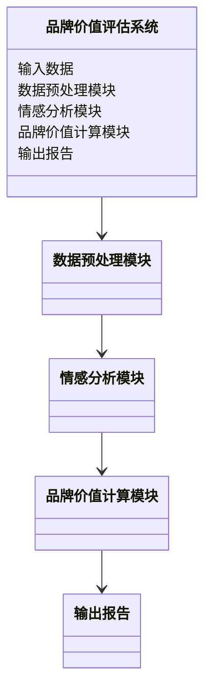
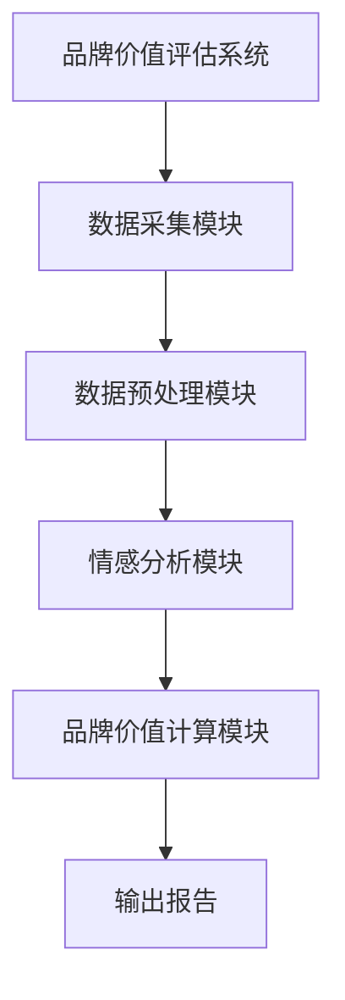
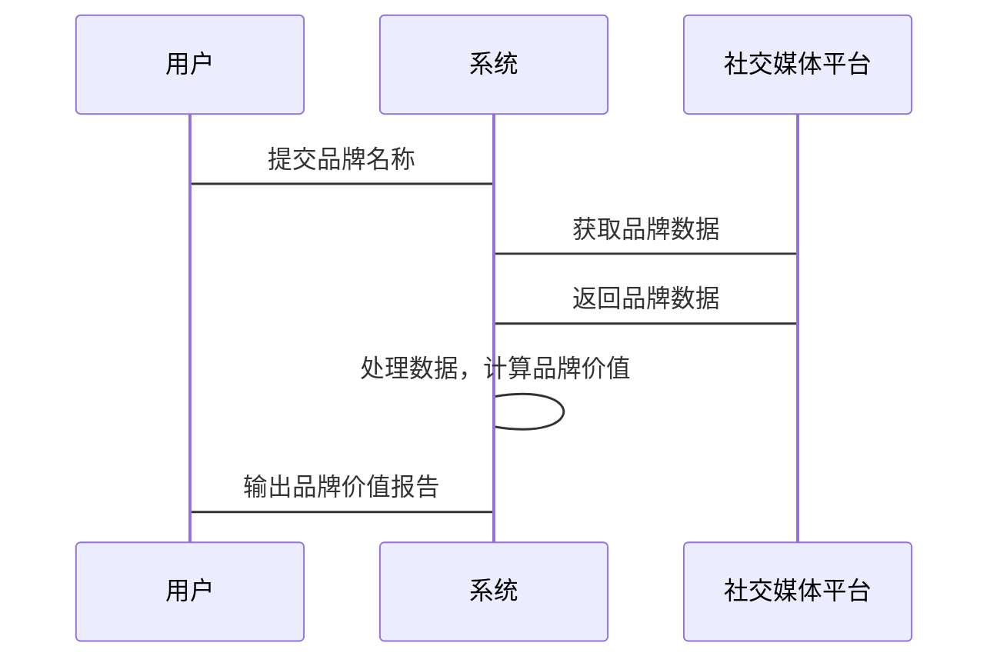

                 


# 巴菲特的品牌投资策略：社交媒体时代的品牌价值评估

> 关键词：巴菲特，品牌价值，社交媒体，投资策略，数据挖掘，机器学习，品牌忠诚度

> 摘要：本文将深入探讨巴菲特的品牌投资策略在社交媒体时代的应用与演变。通过分析品牌价值评估的历史演变、社交媒体时代品牌价值的量化方法，结合巴菲特的投资理念，提出一种基于数据挖掘和机器学习的品牌价值评估模型。本文将从理论到实践，详细阐述品牌价值评估的核心算法与技术实现，并通过实际案例分析，展示如何在社交媒体时代应用巴菲特的品牌投资策略。

---

## 第1章: 品牌价值评估的历史演变与巴菲特的投资理念

### 1.1 品牌价值评估的历史演变

#### 1.1.1 传统品牌价值评估方法的局限性
传统的品牌价值评估方法主要依赖于财务数据和市场表现，例如销售额、净利润率和市场份额等。然而，这些方法往往忽略了品牌的核心价值和消费者情感因素。品牌不仅仅是财务数据的反映，更是消费者认知和忠诚度的体现。

#### 1.1.2 社交媒体时代品牌价值评估新维度
社交媒体的兴起为品牌价值评估提供了新的维度。通过社交媒体数据，可以量化品牌的情感价值、传播效率和用户参与度。例如，通过分析社交媒体上的用户评论、点赞和分享数据，可以更准确地衡量品牌在消费者心中的地位。

#### 1.1.3 巴菲特投资理念中的品牌价值观
巴菲特的投资理念以“长期价值投资”为核心，他特别注重品牌的价值和稳定性。他认为，一个强大的品牌能够为企业带来长期的利润和市场优势。品牌不仅是企业的资产，更是消费者信任的象征。

### 1.2 巴菲特投资策略的核心要素

#### 1.2.1 巴菲特的价值投资理念
巴菲特的价值投资理念强调寻找那些具有强大品牌、稳定财务状况和长期竞争优势的企业。他认为，品牌是企业长期价值的核心驱动力之一。

#### 1.2.2 巴菲特对品牌忠诚度的重视
巴菲特非常重视品牌忠诚度。他认为，具有高品牌忠诚度的消费者会持续选择该品牌，从而为企业带来稳定的收入和利润。

#### 1.2.3 巴菲特品牌投资策略的长期性与稳定性
巴菲特的投资策略注重长期性和稳定性。他认为，品牌价值的评估需要考虑企业的长期发展趋势和市场环境的变化。

---

## 第2章: 社交媒体时代的品牌价值评估方法

### 2.1 社交媒体对品牌价值的影响

#### 2.1.1 社交媒体时代品牌传播的新特点
社交媒体时代，品牌传播不再是单向的信息传递，而是通过用户的互动和参与形成品牌影响力。品牌可以通过社交媒体与消费者进行实时互动，了解消费者的需求和反馈。

#### 2.1.2 社交媒体数据对品牌价值的量化作用
社交媒体数据可以量化品牌的情感价值和传播效率。例如，通过分析社交媒体上的用户评论和互动数据，可以计算出品牌的情感指数和传播指数。

#### 2.1.3 社交媒体时代品牌忠诚度的衡量指标
社交媒体时代，品牌忠诚度可以通过用户的行为数据来衡量，例如用户的回头率、分享率和点赞率等。

### 2.2 基于社交媒体数据的品牌价值评估模型

#### 2.2.1 数据采集与处理方法
品牌价值评估的第一步是数据采集。可以通过社交媒体API获取品牌相关的数据，包括用户评论、点赞、分享和关注数等。数据采集后需要进行清洗和预处理，以确保数据的准确性和完整性。

#### 2.2.2 品牌情感分析与语义理解
品牌情感分析是基于自然语言处理技术，对社交媒体上的用户评论进行情感分类。通过情感分析可以量化品牌在消费者心中的情感价值。

#### 2.2.3 品牌影响力指数的计算公式
品牌影响力指数可以通过以下公式计算：

$$
\text{品牌影响力指数} = \frac{\text{情感正向数} - \text{情感负向数}}{\text{总评论数}} \times 100
$$

---

## 第3章: 巴菲特品牌投资策略的现代应用

### 3.1 巴菲特品牌投资策略的核心要素

#### 3.1.1 品牌的长期价值与稳定性
巴菲特注重品牌的价值和稳定性。他认为，品牌价值的评估需要考虑企业的长期发展趋势和市场环境的变化。

#### 3.1.2 品牌的竞争优势与市场地位
巴菲特认为，品牌竞争优势和市场地位是品牌价值的重要组成部分。强大的品牌可以在竞争中占据优势地位，从而为企业带来更多的利润。

#### 3.1.3 品牌的财务健康状况与盈利能力
品牌的财务健康状况和盈利能力是品牌价值的重要指标。巴菲特认为，只有财务健康、盈利能力强的品牌才具有长期投资价值。

### 3.2 巴菲特品牌投资策略的数字化转型

#### 3.2.1 数据驱动的品牌价值评估
通过数据驱动的品牌价值评估，可以更准确地衡量品牌的价值。例如，通过分析社交媒体数据，可以量化品牌的情感价值和传播效率。

#### 3.2.2 基于社交媒体数据的品牌投资决策
社交媒体数据可以帮助投资者更好地了解品牌的市场表现和消费者需求。通过分析社交媒体数据，投资者可以更科学地做出品牌投资决策。

#### 3.2.3 数字化品牌价值评估工具的应用
数字化品牌价值评估工具可以帮助投资者快速、准确地评估品牌价值。例如，通过大数据分析和机器学习技术，可以自动化地计算品牌影响力指数和品牌忠诚度指数。

---

## 第4章: 品牌价值评估的算法原理

### 4.1 基于协同过滤的品牌价值评估算法

#### 4.1.1 算法原理与流程
协同过滤算法通过分析用户的行为数据，找到与目标品牌相似的其他品牌。通过比较品牌之间的相似性，可以预测目标品牌的市场表现。

#### 4.1.2 算法实现步骤
1. 数据预处理：清洗和归一化数据。
2. 计算相似性：使用余弦相似性计算品牌之间的相似性。
3. 品牌推荐：根据相似性进行品牌推荐。

#### 4.1.3 算法的优缺点分析
优点：协同过滤算法能够有效地发现品牌之间的相似性，帮助投资者找到具有相似市场表现的品牌。
缺点：协同过滤算法需要大量的数据支持，计算复杂度较高。

### 4.2 基于机器学习的品牌价值预测模型

#### 4.2.1 算法选择与优化
选择合适的机器学习算法，例如随机森林和梯度提升树，进行品牌价值预测模型的训练。

#### 4.2.2 算法实现的数学模型
随机森林算法的数学模型如下：

$$
y = \sum_{i=1}^{n} \left( a_i x_i + b_i \right)
$$

其中，$a_i$ 是特征系数，$x_i$ 是特征向量，$b_i$ 是截距项。

#### 4.2.3 算法的性能评估与优化
通过交叉验证和网格搜索优化算法的参数，提高模型的准确率和稳定性。

---

## 第5章: 品牌价值评估的系统架构设计

### 5.1 系统功能设计

#### 5.1.1 领域模型


#### 5.1.2 系统架构设计


#### 5.1.3 系统接口设计
系统接口设计包括数据接口和用户接口。数据接口用于与社交媒体平台对接，获取品牌相关的数据。用户接口用于展示品牌价值评估的结果。

#### 5.1.4 系统交互设计


---

## 第6章: 项目实战

### 6.1 项目介绍
本项目旨在通过社交媒体数据，评估某品牌的品牌价值。我们选择了一家知名的快消品牌作为案例，分析其在社交媒体上的表现。

### 6.2 环境安装与数据采集
安装Python和相关库（如requests、pandas、numpy、textblob）。通过社交媒体API获取品牌相关的数据，包括用户评论、点赞和分享数。

### 6.3 核心实现
1. 数据清洗与预处理：
```python
import pandas as pd
import numpy as np

# 读取数据
data = pd.read_csv('brand_comments.csv')

# 删除缺失值
data.dropna(inplace=True)

# 转换为数值型数据
data['likes'] = pd.to_numeric(data['likes'])
```

2. 情感分析：
```python
from textblob import TextBlob

def get_sentiment(text):
    blob = TextBlob(text)
    return blob.sentiment.polarity

data['sentiment'] = data['comments'].apply(get_sentiment)
```

3. 品牌价值计算：
```python
from sklearn.linear_model import LinearRegression

# 训练模型
model = LinearRegression()
model.fit(data[['likes', 'sentiment']], data['value'])

# 预测品牌价值
new_data = pd.DataFrame({'likes': [1000], 'sentiment': [0.8]})
predicted_value = model.predict(new_data)
```

### 6.4 实际案例分析
通过分析某品牌在社交媒体上的评论数据，我们可以计算出其品牌影响力指数和品牌忠诚度指数。根据模型预测，该品牌的未来市场表现将稳步增长。

### 6.5 项目小结
通过本项目，我们验证了基于社交媒体数据的品牌价值评估方法的有效性。这种方法可以帮助投资者更科学地评估品牌价值，做出更明智的投资决策。

---

## 第7章: 最佳实践与总结

### 7.1 最佳实践
- 定期更新品牌价值评估模型，以适应市场环境的变化。
- 结合多种数据源，全面评估品牌价值。
- 注重品牌忠诚度的培养，提升品牌长期价值。

### 7.2 总结
在社交媒体时代，品牌价值评估的方法和工具正在不断演变。通过结合巴菲特的投资理念和现代技术手段，我们可以更准确地评估品牌价值，做出更科学的投资决策。

---

## 作者：AI天才研究院/AI Genius Institute & 禅与计算机程序设计艺术 /Zen And The Art of Computer Programming

