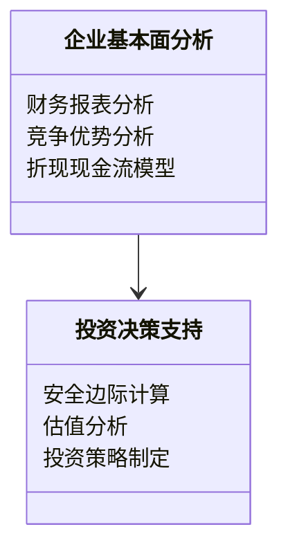
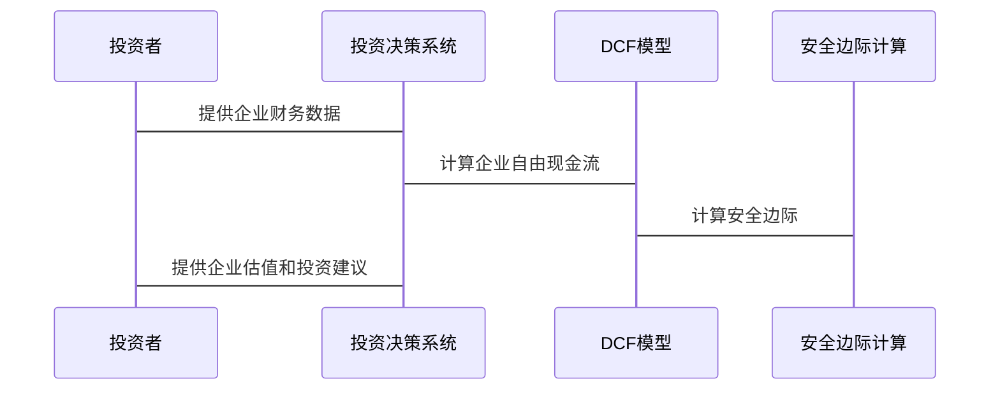

                 


# 巴菲特的商业分析方法论

> **关键词**：巴菲特，商业分析，投资方法论，价值投资，长期投资，安全边际，财务分析  
>
> **摘要**：本文深入探讨了巴菲特的商业分析方法论，从其核心理念、分析工具到实际应用，结合技术语言和逻辑推理，详细解读其投资哲学和实践策略，为读者提供系统化的学习和应用指南。

---

## 第1章 巴菲特投资方法论概述

### 1.1 巴菲特投资方法论的起源与发展

#### 1.1.1 价值投资的起源与发展
价值投资是一种基于对企业内在价值评估的投资策略，起源于20世纪初。本杰明·格雷厄姆是该领域的先驱，他提出了“安全边际”和“内在价值”等核心概念。巴菲特师承格雷厄姆，进一步发展和完善了这一理论，形成了独特的投资方法论。

#### 1.1.2 巴菲特投资方法论的核心理念
巴菲特的方法论以“长期投资、价值导向”为核心，强调通过对企业基本面的深入分析，寻找具有持续竞争优势和合理估值的企业进行投资。他主张以合理的价格买入优质的公司，长期持有，分享企业的成长收益。

#### 1.1.3 巴菲特方法论在现代投资中的地位
巴菲特的投资方法论不仅在学术界和实践中具有重要地位，还对全球投资者产生了深远影响。他的理念强调基本面分析、安全边际和长期投资，为投资者提供了可靠的指导框架。

### 1.2 巴菲特投资方法的核心要素

#### 1.2.1 企业基本面分析的重要性
巴菲特认为，企业的内在价值是投资决策的核心依据。他通过分析财务报表、行业地位、竞争优势等因素，评估企业的盈利能力和成长潜力。

#### 1.2.2 财务报表分析的关键指标
- **净利润率**：衡量企业盈利能力的重要指标。
- **ROE（净资产收益率）**：反映企业资产使用效率的核心指标。
- **负债率**：评估企业财务健康状况的关键指标。

#### 1.2.3 市场情绪与安全边际的概念
巴菲特强调安全边际的重要性，认为市场价格往往偏离企业内在价值。他通过分析市场情绪和估值水平，寻找低估的投资标的。

### 1.3 巴菲特投资方法论的哲学基础

#### 1.3.1 投资的长期性与稳定性
巴菲特认为，投资是一项长期性的事业，短期波动不应影响投资决策。他主张以长期视角看待企业的成长，避免频繁交易和短期波动的干扰。

#### 1.3.2 风险控制与安全边际
巴菲特将风险控制视为投资的核心要素，强调通过安全边际降低投资风险。他主张以低于内在价值的价格买入优质资产，确保投资的安全性。

#### 1.3.3 企业竞争优势与护城河
巴菲特注重企业的竞争优势，尤其是那些具有宽护城河（如品牌、技术、成本优势等）的企业。他认为，具有竞争优势的企业能够持续创造超额利润，为投资者带来长期收益。

### 1.4 巴菲特投资方法论的适用场景与局限性

#### 1.4.1 适合长期投资者的策略
巴菲特的方法论特别适合长期投资者，通过持有优质资产分享企业的长期增长。然而，短期投资者可能难以适应其策略，因为这种方法需要时间和耐心。

#### 1.4.2 在不同市场环境下的表现
巴菲特的方法论在市场低迷时表现尤为突出，因为其强调的安全边际能够在市场低估时提供更大的投资机会。然而，在市场过热时，可能会面临估值过高的挑战，导致短期表现不佳。

#### 1.4.3 方法论的局限性与改进方向
巴菲特的方法论主要适用于传统行业和实体经济，对新兴行业（如科技、互联网）的适用性较低。此外，其方法论依赖于对企业基本面的分析，可能在数据不透明或企业转型频繁的情况下面临挑战。

### 1.5 本章小结
本章介绍了巴菲特投资方法论的起源、核心理念、核心要素及其哲学基础。同时，我们还分析了其适用场景和局限性，为后续的深入探讨奠定了基础。

---

## 第2章 巴菲特商业分析的核心工具与方法

### 2.1 财务报表分析的核心指标

#### 2.1.1 收入与利润分析
- **收入分析**：关注企业的收入来源和增长趋势，判断企业的市场地位和盈利能力。
- **利润分析**：通过分析净利润、毛利率等指标，评估企业的盈利能力和成本控制能力。

#### 2.1.2 资产负债表分析
- **资产分析**：关注企业的资产结构和质量，判断企业的财务健康状况。
- **负债分析**：评估企业的债务负担和偿债能力，判断企业的财务风险。

#### 2.1.3 现金流量表分析
- **经营活动现金流**：反映企业主营业务的现金流情况，判断企业的盈利能力和现金流健康状况。
- **投资活动现金流**：分析企业投资活动的现金流，判断企业的投资策略和资本支出情况。

### 2.2 折现现金流模型（DCF）的原理与应用

#### 2.2.1 DCF模型的基本原理
DCF模型通过将未来现金流折现为现值，评估企业的内在价值。其核心假设是：企业的价值等于未来自由现金流的现值。

#### 2.2.2 企业自由现金流的计算
$$ \text{FCF} = \text{EBIT} \times (1 - \text{税率}) + \text{折旧} - \text{资本支出} $$

#### 2.2.3 折现率的确定与应用
折现率通常包括无风险利率、市场风险溢价和企业特定风险溢价。其计算公式为：
$$ r = \text{无风险利率} + \beta \times (\text{市场风险溢价}) $$

#### 2.2.4 股权价值的计算
$$ \text{股权价值} = \frac{\text{FCF}_1}{(1 + r)^1} + \frac{\text{FCF}_2}{(1 + r)^2} + \cdots + \frac{\text{FCF}_n}{(1 + r)^n} $$

### 2.3 企业竞争优势的分析框架

#### 2.3.1 护城河的五种类型
- **成本优势**：企业通过规模经济或技术创新降低成本。
- **品牌优势**：强大的品牌形象和客户忠诚度。
- **技术优势**：拥有独特的技术或专利。
- **网络效应**：用户越多，企业价值越大。
- **政策优势**：受益于政府政策支持或行业准入壁垒。

#### 2.3.2 企业竞争优势的评估方法
- **竞争优势强度**：评估企业竞争优势的宽窄程度。
- **竞争优势可持续性**：判断企业竞争优势的长期性。

#### 2.3.3 竞争优势的持续性分析
通过分析行业趋势、竞争对手策略和技术进步，评估企业的竞争优势是否能够持续。

### 2.4 市场情绪与安全边际的量化

#### 2.4.1 市场情绪的周期性波动
市场情绪受投资者心理和市场环境的影响，呈现周期性波动。巴菲特认为，市场情绪可以通过历史数据分析和市场估值水平进行量化。

#### 2.4.2 安全边际的计算方法
安全边际 = 内在价值 - 市场价格

#### 2.4.3 安全边际在投资决策中的应用
通过安全边际的量化，投资者可以在市场价格低于内在价值时买入，降低投资风险。

### 2.5 本章小结
本章详细介绍了巴菲特商业分析的核心工具与方法，包括财务报表分析、DCF模型、企业竞争优势分析和市场情绪与安全边际的量化。这些工具和方法为投资者提供了科学的分析框架。

---

## 第3章 巴菲特投资方法论的数学模型与公式

### 3.1 折现现金流模型（DCF）的数学公式

#### 3.1.1 企业自由现金流公式
$$ \text{FCF} = \text{EBIT} \times (1 - \text{税率}) + \text{折旧} - \text{资本支出} $$

#### 3.1.2 折现率计算公式
$$ r = \text{无风险利率} + \beta \times (\text{市场风险溢价}) $$

#### 3.1.3 股权价值计算公式
$$ \text{股权价值} = \sum_{t=1}^{n} \frac{\text{FCF}_t}{(1 + r)^t} $$

### 3.2 企业竞争优势的量化指标

#### 3.2.1 净利润率公式
$$ \text{净利润率} = \frac{\text{净利润}}{\text{营业收入}} $$

#### 3.2.2 ROE（净资产收益率）公式
$$ \text{ROE} = \frac{\text{净利润}}{\text{股东权益}} $$

#### 3.2.3 负债率公式
$$ \text{负债率} = \frac{\text{总负债}}{\text{总资产}} $$

### 3.3 安全边际的量化公式
$$ \text{安全边际} = \text{内在价值} - \text{市场价格} $$

---

## 第4章 巴菲特投资方法论的系统分析与架构设计

### 4.1 问题场景介绍
巴菲特的方法论可以看作是一个投资决策支持系统，通过对企业基本面的分析，评估企业的内在价值，指导投资决策。

### 4.2 系统功能设计

#### 4.2.1 领域模型（Mermaid 类图）


### 4.3 系统架构设计

#### 4.3.1 系统架构（Mermaid 架构图）
```mermaid
archi
    节点 投资决策系统 {
        组件 企业基本面分析
        组件 DCF模型
        组件 安全边际计算
    }
    边 企业基本面分析 --> DCF模型
    边 DCF模型 --> 安全边际计算
```

### 4.4 系统接口设计
- **输入接口**：企业财务数据、市场数据。
- **输出接口**：企业估值、投资建议。

### 4.5 系统交互设计

#### 4.5.1 系统交互流程（Mermaid 序列图）


---

## 第5章 巴菲特投资方法论的项目实战

### 5.1 环境安装
- **工具安装**：安装Python、Pandas、NumPy等工具。
- **数据获取**：获取目标企业的财务数据和市场数据。

### 5.2 系统核心实现源代码

#### 5.2.1 DCF模型实现代码
```python
import pandas as pd
import numpy as np

def calculate_dcf(revenue, cogs, operating_expenses, tax_rate, beta, market_risk_premium, discount_rate):
    ebit = revenue - cogs - operating_expenses
    tax = ebit * tax_rate
    fcf = ebit - tax + np.mean([revenue * 0.02, cogs * 0.03])
    present_value = fcf / (1 + discount_rate)
    return present_value

# 示例数据
revenue = 100000000
cogs = 60000000
operating_expenses = 20000000
tax_rate = 0.21
beta = 1.2
market_risk_premium = 0.05

discount_rate = beta * market_risk_premium
dcf_value = calculate_dcf(revenue, cogs, operating_expenses, tax_rate, beta, market_risk_premium, discount_rate)
print(f"DCF Value: {dcf_value}")
```

### 5.3 代码应用解读与分析
- **代码功能**：计算企业的自由现金流，并通过DCF模型评估企业的内在价值。
- **关键参数**：收入、成本、经营费用、税率、贝塔值和市场风险溢价。

### 5.4 实际案例分析
以某公司为例，通过DCF模型计算其内在价值，并与市场价格进行对比，评估其安全边际。

### 5.5 项目小结
通过项目实战，我们深入理解了巴菲特方法论的应用过程，掌握了DCF模型的实现方法，并能够将理论应用于实际投资决策。

---

## 第6章 巴菲特投资方法论的最佳实践

### 6.1 核心要点总结
- 重视企业基本面分析。
- 理解DCF模型的原理和应用。
- 确保安全边际的存在。

### 6.2 小结
巴菲特的方法论为投资者提供了科学的投资框架，通过深入分析企业的基本面和市场环境，帮助投资者做出明智的投资决策。

### 6.3 注意事项
- 避免过度依赖单一模型。
- 留意市场环境的变化。
- 定期复盘和调整投资策略。

### 6.4 拓展阅读
- 《巴菲特致股东的信》
- 《证券分析》（本杰明·格雷厄姆）

---

## 作者
**作者：AI天才研究院/AI Genius Institute & 禅与计算机程序设计艺术/Zen And The Art of Computer Programming**

---

通过以上详细的内容框架和示例，我们可以看到，巴菲特的商业分析方法论不仅是一种投资策略，更是一种系统化的分析方法。结合技术语言和逻辑推理，我们可以更好地理解和应用这一方法论，实现长期稳定的收益。

