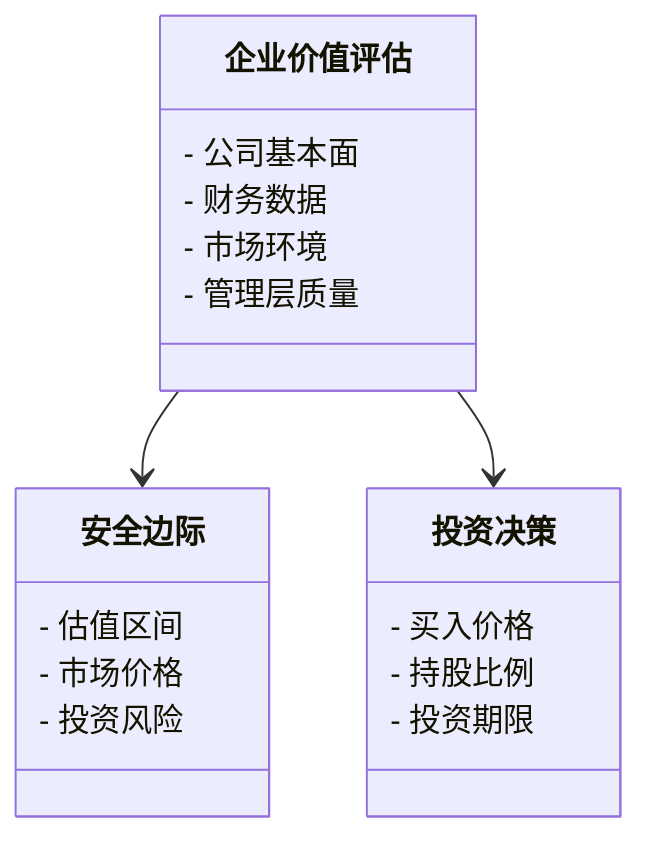
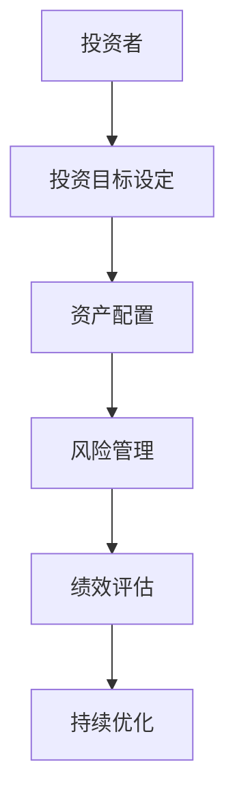

                 

# 巴菲特的商业模式分析

> 关键词：巴菲特、价值投资、股票估值、投资策略、投资模型、投资回报  
> 摘要：本文深入分析了巴菲特的商业模式，探讨了其核心理念、数学模型、系统架构以及实际案例，揭示了巴菲特投资成功的关键因素和方法。

## 第1章: 巴菲特的商业模式概述

### 1.1 巴菲特商业模式的背景与意义
巴菲特作为投资界的传奇人物，他的商业模式以价值投资为核心，强调通过深入分析企业的基本面，寻找具有长期竞争优势的企业进行投资。这种模式不仅帮助巴菲特取得了巨大的投资成功，也为投资者提供了一种稳健的投资方法。

#### 1.1.1 投资界的现状与挑战
投资市场充满了不确定性和波动性，投资者需要面对市场的短期波动和长期趋势的挑战。传统的投资方法往往依赖于技术分析或短期市场预测，而这些方法在长期投资中表现不稳定。

#### 1.1.2 巴菲特商业模式的核心价值
巴菲特的商业模式强调长期投资和价值发现，通过对企业内在价值的深入分析，找到那些具有持续竞争优势和良好管理的企业进行投资。这种方法能够帮助投资者在长期获得稳定的回报。

#### 1.1.3 巴菲特商业模式的现实意义
在当前的投资环境下，巴菲特的商业模式为投资者提供了一种稳健的投资方法，尤其是在面对市场波动和经济不确定性时，其长期投资策略能够帮助投资者规避短期风险，实现财富的长期增长。

### 1.2 巴菲特商业模式的基本概念
巴菲特的商业模式基于价值投资理念，强调安全边际和企业内在价值的评估。

#### 1.2.1 价值投资的定义与特征
价值投资是一种以低于内在价值的价格购买优秀企业的投资策略。其核心特征包括：
- 长期投资视角
- 深入的企业基本面分析
- 重视企业的竞争优势和管理层质量
- 以合理的价格买入并长期持有

#### 1.2.2 安全边际的概念与作用
安全边际是指股票市场价格低于其内在价值的部分。通过购买低于内在价值的股票，投资者能够降低投资风险，并在市场波动时获得额外的安全空间。

#### 1.2.3 长期投资与复利效应
巴菲特强调长期投资的重要性，认为通过复利效应，投资者能够实现财富的长期增长。长期投资不仅能够避免短期市场的波动，还能够充分利用复利效应，实现资产的持续增值。

## 第2章: 巴菲特商业模式的核心理念

### 2.1 价值投资的核心原则
价值投资的核心原则包括对企业内在价值的评估、安全边际的计算以及长期投资的策略。

#### 2.1.1 企业内在价值的定义
企业内在价值是指企业在未来经营中能够产生的现金流的现值。巴菲特认为，内在价值是股票投资的唯一标准，投资者应该以低于内在价值的价格买入股票。

#### 2.1.2 市场先生与投资者心理
巴菲特将市场波动比作“市场先生”，认为市场的短期波动往往反映了投资者的非理性心理。投资者应该避免被市场情绪左右，而是应该关注企业的内在价值。

#### 2.1.3 安全边际的计算方法
安全边际 = 内在价值 - 市场价格

通过计算安全边际，投资者可以确定股票是否具有足够的安全空间。通常，巴菲特建议投资者选择安全边际较大的股票进行投资。

### 2.2 股票估值的关键指标
股票估值是巴菲特商业模式的重要组成部分，涉及多个关键指标的计算和应用。

#### 2.2.1 市盈率（P/E）的计算与应用
市盈率 = 股价 / 每股收益（EPS）

市盈率反映了股票价格相对于每股收益的高低。通常，低市盈率的股票可能具有较高的投资价值，而高市盈率的股票可能被市场高估。

#### 2.2.2 市净率（P/B）的计算与应用
市净率 = 股价 / 每股净资产（BPS）

市净率反映了股票价格相对于每股净资产的高低。通常，低市净率的股票可能具有较高的投资价值，而高市净率的股票可能被市场高估。

#### 2.2.3 股息率的计算与应用
股息率 = 每股股息（DIV） / 股价

股息率反映了股票的分红能力。通常，高股息率的股票可能具有较高的投资价值，但需要注意企业的盈利能力和股息支付能力。

## 第3章: 巴菲特商业模式的数学模型与公式

### 3.1 股票估值的核心公式
股票估值是巴菲特商业模式的重要组成部分，涉及多个数学模型和公式的应用。

#### 3.1.1 内在价值公式
$$ V = \frac{CF}{r - g} $$

其中：
- \( V \) 表示内在价值
- \( CF \) 表示未来现金流
- \( r \) 表示折现率
- \( g \) 表示现金流增长率

#### 3.1.2 市盈率公式
$$ P/E = \frac{P}{E} $$

其中：
- \( P \) 表示股票价格
- \( E \) 表示每股收益（EPS）

#### 3.1.3 市净率公式
$$ P/B = \frac{P}{B} $$

其中：
- \( P \) 表示股票价格
- \( B \) 表示每股净资产（BPS）

### 3.2 股息率与投资回报的数学模型
#### 3.2.1 股息率公式
$$ \text{股息率} = \frac{\text{股息}}{\text{股价}} $$

#### 3.2.2 投资回报率公式
$$ \text{回报率} = \frac{\text{股息 + 股价增长}}{\text{初始投资}} $$

通过这些数学模型和公式，投资者可以更好地理解和应用巴菲特的商业模式。

## 第4章: 巴菲特商业模式的系统分析与架构设计

### 4.1 企业价值评估的系统模型
企业价值评估是巴菲特商业模式的核心部分，涉及多个方面的分析和评估。

#### 4.1.1 企业价值评估的领域模型（Mermaid 类图）

#### 4.1.2 企业价值评估的架构图（Mermaid 架构图）

### 4.2 投资组合管理的架构设计
投资组合管理是巴菲特商业模式的重要组成部分，涉及系统的架构设计和优化。

#### 4.2.1 投资组合管理的架构图（Mermaid 架构图）

## 第5章: 巴菲特商业模式的项目实战

### 5.1 项目背景与目标
本项目旨在通过实际案例分析，验证巴菲特商业模式的有效性和应用性。以可口可乐为例，分析巴菲特的投资策略和模型的应用。

### 5.2 数据收集与分析
#### 5.2.1 数据收集
收集可口可乐的历史财务数据、市场数据和行业分析报告。

#### 5.2.2 数据分析
分析可口可乐的财务数据，计算其内在价值、市盈率、市净率和股息率。

### 5.3 模型应用与结果解读
#### 5.3.1 内在价值计算
$$ V = \frac{CF}{r - g} $$

#### 5.3.2 安全边际计算
安全边际 = 内在价值 - 市场价格

#### 5.3.3 投资决策
基于计算结果，确定是否以当前价格买入可口可乐股票。

### 5.4 项目小结
通过实际案例分析，验证了巴菲特商业模式的有效性和应用性。投资者可以通过对企业内在价值的深入分析和安全边际的计算，做出更为明智的投资决策。

## 作者：AI天才研究院/AI Genius Institute & 禅与计算机程序设计艺术 /Zen And The Art of Computer Programming

---

这篇文章通过详细分析巴菲特的商业模式，探讨了其核心理念、数学模型、系统架构以及实际案例，揭示了巴菲特投资成功的关键因素和方法。希望对投资者和相关领域的人士有所帮助。

