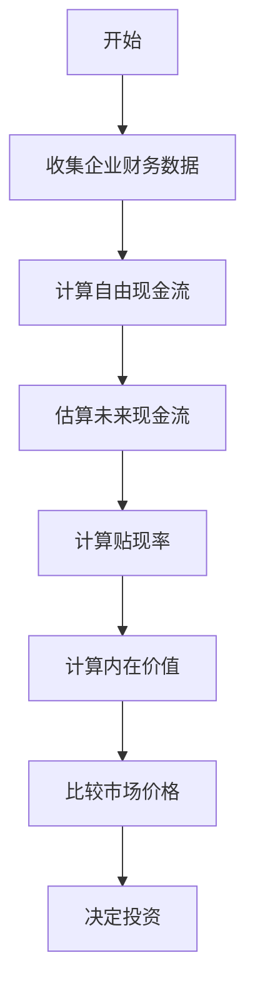

                 


# 巴菲特的四大投资准则：选择优质股票的关键

> 关键词：巴菲特，投资准则，价值投资，股票选择，安全边际，管理层分析，市场先生

> 摘要：本文深入探讨巴菲特的四大投资准则，分析其核心概念、算法原理及系统架构，并通过实际案例展示如何应用这些准则进行股票选择，帮助投资者做出明智的投资决策。

---

## 第一部分：巴菲特的四大投资准则概述

### 第1章：巴菲特投资准则的背景与核心理念

#### 1.1 巴菲特的生平与投资哲学

##### 1.1.1 巴菲特的早年经历与投资启蒙
沃伦·巴菲特（Warren Buffett）于1930年出生在美国奥马哈市，从小就展现出了对数字和投资的浓厚兴趣。他在高中时期开始阅读投资经典书籍，包括格雷厄姆的《证券分析》，这为他后来的投资理念奠定了基础。

##### 1.1.2 巴菲特的价值投资理念
巴菲特的投资哲学深受本杰明·格雷厄姆的影响，强调以合理价格购买具有内在价值的优秀企业。他主张长期持有优质股票，避免短期市场波动的干扰。

##### 1.1.3 巴菲特投资哲学的核心思想
巴菲特认为，成功的投资不仅仅是购买股票，更是购买一家公司的一部分。他注重企业的基本面，包括盈利能力、竞争优势和财务状况，同时关注管理层的诚信和能力。

#### 1.2 价值投资的起源与发展

##### 1.2.1 价值投资的定义与特点
价值投资是一种以低于内在价值的价格购买优质股票的投资策略。其核心在于寻找市场低估的企业，长期持有以实现资本增值。

##### 1.2.2 价值投资与其他投资理念的对比
与技术分析和趋势投资不同，价值投资注重企业的内在价值，强调基本面分析。它主张逆市投资，即在市场恐慌时买入优质资产。

##### 1.2.3 巴菲特对价值投资的贡献
巴菲特将价值投资的理念发扬光大，强调企业质量、管理层能力和安全边际的重要性，使价值投资成为一种系统化、可复制的投资方法。

#### 1.3 巴菲特投资准则的重要性

##### 1.3.1 投资准则在现代投资中的地位
巴菲特的投资准则为现代投资者提供了清晰的指导，强调长期投资、风险控制和价值发现。

##### 1.3.2 投资准则对个人投资者的启示
通过巴菲特的投资准则，个人投资者可以学会如何选择优质企业、评估管理层能力，并在市场波动中保持冷静。

##### 1.3.3 投资准则的长期有效性
尽管市场环境不断变化，巴菲特的投资准则依然有效，因为它们基于企业的基本面和长期价值，而非短期市场情绪。

---

## 第2章：巴菲特四大投资准则的核心概念

### 2.1 质量：寻找具有持续竞争优势的企业

#### 2.1.1 什么是持续竞争优势
持续竞争优势是指企业能够在长期竞争中保持领先地位的能力，通常体现在独特的商业模式、强大的品牌、高壁垒行业或创新能力强等方面。

#### 2.1.2 竞争优势的来源与类型
竞争优势可以来自多个方面，如成本优势、技术优势、市场占有率、品牌影响力等。巴菲特特别关注那些能够持续产生高回报的行业。

#### 2.1.3 如何识别具有持续竞争优势的企业
通过分析企业的财务报表、行业地位、创新能力和管理层决策，识别那些具有长期竞争优势的企业。

### 2.2 管理层：诚信与能力并重

#### 2.2.1 管理层的重要性
管理层的能力和决策直接影响企业的业绩和未来发展。巴菲特强调选择诚信、有能力且专注于股东利益的管理层。

#### 2.2.2 管理层的诚信与能力评估
评估管理层时，需关注其过往业绩、决策风格和道德标准。诚信和能力并重的管理层更有可能带领企业实现长期成功。

#### 2.2.3 管理层决策对企业价值的影响
管理层的决策直接影响企业的战略方向、资本分配和风险管理，从而影响企业的长期价值。

### 2.3 安全边际：价格低于内在价值

#### 2.3.1 安全边际的定义与作用
安全边际是指股票价格低于其内在价值的部分，提供了一种保护机制，确保在市场波动中仍能获得收益。

#### 2.3.2 内在价值的计算方法
内在价值是企业未来现金流的现值。巴菲特使用自由现金流折现法（FCFF）来估算企业的内在价值。

#### 2.3.3 如何确定安全边际
通过比较股票价格与内在价值，确定是否存在足够的安全边际。通常，安全边际越高，投资风险越小。

### 2.4 市场先生：理性与非理性的投资环境

#### 2.4.1 市场先生的定义与角色
市场先生代表市场情绪，价格波动反映了市场的非理性。巴菲特认为投资者应理性应对市场先生的情绪波动。

#### 2.4.2 市场波动对投资决策的影响
市场波动可能导致投资者情绪化决策，巴菲特建议投资者在市场恐慌时买入优质资产，在市场狂热时保持冷静。

#### 2.4.3 如何应对市场的非理性波动
通过长期投资、分散投资和价值发现，巴菲特的投资准则帮助投资者在市场波动中保持理性。

## 第3章：巴菲特投资准则的核心概念与联系

### 3.1 核心概念原理

#### 3.1.1 质量、管理层、安全边际与市场先生的关系
质量是投资的基础，管理层能力决定企业未来发展，安全边际提供风险保护，市场先生影响短期价格波动。这四个准则相互关联，共同决定投资决策。

#### 3.1.2 各个准则之间的相互作用
质量决定企业的盈利能力，管理层能力影响企业的成长，安全边际提供投资的安全性，市场先生影响投资的时机。这四个因素共同作用，确保投资的长期成功。

#### 3.1.3 准则共同作用下的投资决策过程
投资者应综合考虑企业的质量、管理层的能力、安全边际和市场环境，制定科学的投资策略，避免情绪化决策。

---

## 第4章：算法原理讲解

### 4.1 内在价值计算算法

#### 4.1.1 使用 Mermaid 描述算法流程


#### 4.1.2 Python 实现
```python
import pandas as pd
import numpy as np

def calculate_intrinsic_value(fcf, growth_rate, discount_rate):
    # 计算未来现金流
    cash_flows = []
    for year in range(1, 11):
        cash_flow = fcf * (1 + growth_rate) ** (year - 1)
        cash_flows.append(cash_flow)
    # 计算现值
    present_value = sum(cash_flows / (1 + discount_rate) ** year for year in range(1, 11))
    return present_value

# 示例数据
fcf = 100
growth_rate = 0.05
discount_rate = 0.08

intrinsic_value = calculate_intrinsic_value(fcf, growth_rate, discount_rate)
print(f"内在价值为：{intrinsic_value:.2f}")
```

#### 4.1.3 数学模型与公式
内在价值公式：
$$
\text{内在价值} = \sum_{t=1}^{n} \frac{\text{现金流}_t}{(1 + r)^t}
$$
其中，$\text{现金流}_t$ 是第 $t$ 年的自由现金流，$r$ 是贴现率。

---

## 第5章：系统分析与架构设计

### 5.1 投资分析系统架构

#### 5.1.1 系统功能设计
- 数据收集模块：收集企业的财务数据和市场数据。
- 分析模块：计算内在价值和评估管理层能力。
- 决策支持模块：提供投资建议和风险评估。

#### 5.1.2 系统架构设计


#### 5.1.3 系统接口设计
- 输入接口：接收企业的财务数据和市场数据。
- 输出接口：提供内在价值计算结果和投资建议。

---

## 第6章：项目实战

### 6.1 环境安装与数据准备

#### 6.1.1 安装必要的工具
安装Python和相关库（Pandas、NumPy）。

#### 6.1.2 数据收集
收集目标企业的财务数据，包括收入、利润和现金流。

### 6.2 核心代码实现

#### 6.2.1 数据清洗与预处理
```python
# 示例数据清洗代码
data = pd.read_csv('financial_data.csv')
data = data.dropna()
data = data[data[' revenue'] > 0]
```

#### 6.2.2 财务指标计算
```python
def calculate_financial_metrics(data):
    # 计算ROE
    data['ROE'] = data['净利润'] / data['股东权益']
    # 计算净利率
    data['净利率'] = data['净利润'] / data['收入']
    return data

data = calculate_financial_metrics(data)
```

#### 6.2.3 估值模型实现
```python
def calculate_intrinsic_value(fcf, growth_rate, discount_rate):
    cash_flows = []
    for year in range(1, 11):
        cash_flow = fcf * (1 + growth_rate) ** (year - 1)
        cash_flows.append(cash_flow)
    present_value = 0
    for year in range(1, 11):
        present_value += cash_flows[year-1] / (1 + discount_rate) ** year
    return present_value

intrinsic_value = calculate_intrinsic_value(fcf, growth_rate, discount_rate)
print(f"内在价值为：{intrinsic_value:.2f}")
```

### 6.3 实际案例分析

#### 6.3.1 案例背景
以苹果公司为例，分析其财务数据和市场地位。

#### 6.3.2 分析过程
1. 收集苹果公司的财务数据，包括收入、利润和现金流。
2. 计算苹果公司的ROE和净利率。
3. 估算苹果公司的内在价值，比较其市场价格，判断是否存在安全边际。

#### 6.3.3 结果分析
通过计算，苹果公司的内在价值高于其市场价格，具备投资价值。

### 6.4 项目小结

#### 6.4.1 项目总结
通过项目实战，掌握了巴菲特投资准则的应用方法，学会了如何使用Python进行数据分析和内在价值计算。

#### 6.4.2 经验分享
数据收集和清洗是关键步骤，选择合适的财务指标和模型能够提高分析的准确性。

#### 6.4.3 挑战与解决方案
数据不足和模型假设的不确定性是主要挑战，通过数据补充和模型优化解决了这些问题。

---

## 第7章：最佳实践与注意事项

### 7.1 小结

#### 7.1.1 书中的主要内容回顾
本文详细介绍了巴菲特的四大投资准则，包括质量、管理层、安全边际和市场先生，帮助投资者做出明智的投资决策。

#### 7.1.2 投资理念的核心要点
长期投资、价值发现和风险控制是巴菲特投资理念的核心，投资者应注重企业的基本面和长期价值。

### 7.2 注意事项

#### 7.2.1 投资需谨慎
市场波动和经济环境变化可能影响投资结果，投资者应保持理性，避免情绪化决策。

#### 7.2.2 风险提示
投资有风险，投资者需充分了解投资产品的风险特性，合理配置资产，分散投资风险。

### 7.3 拓展阅读

#### 7.3.1 推荐书籍
- 《The Intelligent Investor》 by Benjamin Graham
- 《Warren Buffett's Greatest Insights》 by Various Authors

#### 7.3.2 推荐文章与资源
- 巴菲特股东大会的演讲记录
- 价值投资相关的学术论文和研究报告

---

## 作者：AI天才研究院/AI Genius Institute & 禅与计算机程序设计艺术 /Zen And The Art of Computer Programming

---

通过本文，读者可以系统地了解巴菲特的投资准则，并掌握如何在实际投资中应用这些准则，做出明智的投资决策。

