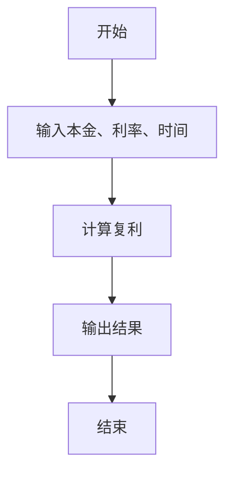
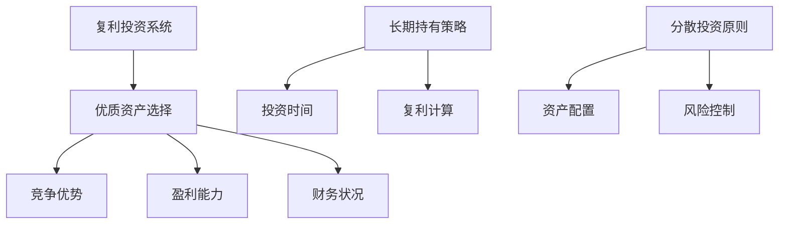
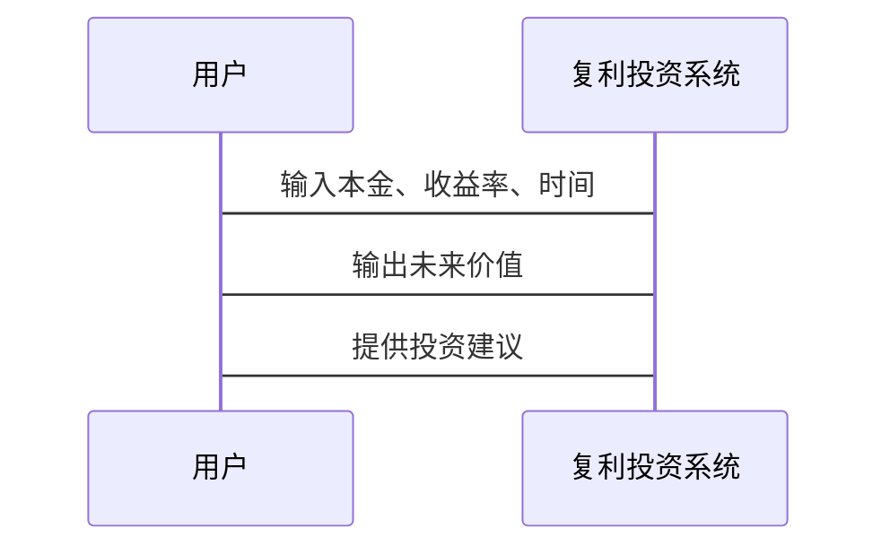

                 


# 巴菲特的复利效应投资观

## 关键词：巴菲特、复利效应、投资哲学、长期投资、价值投资、投资策略

## 摘要：本文深入探讨了巴菲特的复利效应投资观，从复利效应的基本概念到其在投资中的应用，结合数学模型和算法原理，分析了巴菲特的投资策略和哲学，最后通过实际案例展示了复利效应在投资中的巨大威力。

---

# 第1章: 复利效应的基本概念

## 1.1 复利效应的定义与特点

### 1.1.1 复利效应的定义

复利效应是指在投资中，本金和产生的利息（或收益）在每一期（如每年）结束时滚入下一期，从而在下一期继续计算利息的效应。简单来说，复利效应就是“利滚利”，即利息也会生息。

### 1.1.2 复利效应的核心特点

1. **时间的幂次方效应**：复利效应的威力随着时间的延长呈指数级增长，即时间越长，复利效应的收益增长越快。
2. **滚雪球效应**：复利效应的核心思想是通过长期持有优质资产，让收益不断滚雪球式增长，实现财富的几何级数增长。
3. **无风险投资的放大器**：在无风险的情况下，复利效应可以将初始本金通过时间的积累，转化为巨大的财富。

### 1.1.3 复利效应与简单利息的对比

| 对比维度       | 复利效应                          | 简单利息                          |
|----------------|-----------------------------------|-----------------------------------|
| 计算方式       | 本金和利息一起生息               | 只有本金生息                     |
| 收益增长方式   | 指数级增长                       | 线性增长                         |
| 时间价值       | 时间越长，收益增长越快           | 时间与收益增长无明显关系       |
| 投资哲学       | 强调长期持有和复利的滚雪球效应   | 强调短期收益                     |

---

## 1.2 巴菲特投资哲学的背景

### 1.2.1 巴菲特的投资理念概述

巴菲特的投资哲学以价值投资为核心，强调寻找具有持续竞争优势的优质企业，长期持有，通过复利效应实现财富的稳步增长。他的投资理念可以概括为“买优质资产，长期持有，耐心等待”。

### 1.2.2 巴菲特对复利效应的重视

巴菲特认为，复利效应是投资中最重要的力量。他曾经说过：“复利是世界第八大奇迹，会让人变成富人。”他认为，复利效应的核心在于时间，越长的时间跨度，复利效应的威力越大。

### 1.2.3 巴菲特投资哲学的核心要素

1. **价值投资**：寻找具有内在价值的优质企业，关注企业的基本面，如盈利能力、财务状况、竞争优势等。
2. **长期持有**：通过长期持有优质资产，让复利效应充分发挥，实现财富的几何级数增长。
3. **分散投资**：通过分散投资降低风险，避免将所有资金投入到单一资产中。

---

## 1.3 复利效应在投资中的重要性

### 1.3.1 复利效应的数学模型

复利效应的数学模型可以用以下公式表示：

$$ FV = PV \times (1 + r)^n $$

其中：
- $FV$ 表示终值（未来价值）
- $PV$ 表示现值（本金）
- $r$ 表示年化收益率
- $n$ 表示投资时间（年）

### 1.3.2 复利效应在长期投资中的优势

复利效应在长期投资中的优势在于，它可以通过时间的积累，将初始本金转化为巨大的财富。例如，如果以10%的年化收益率投资30年，初始本金可以增长到约8倍：

$$ FV = 1 \times (1 + 0.10)^{30} \approx 17.45 $$

这意味着，通过复利效应，初始本金可以在30年内增长17.45倍。

### 1.3.3 复利效应的边界与外延

复利效应的边界在于：
1. **收益率的可持续性**：如果收益率不稳定或无法持续，复利效应将无法充分发挥。
2. **投资时间跨度**：复利效应的效果与投资时间成正比，时间越长，效果越显著。
3. **风险控制**：如果投资存在较高的风险，复利效应可能无法实现，甚至导致本金损失。

复利效应的外延包括：
1. **资产配置**：通过合理的资产配置，最大化复利效应的收益。
2. **税收优化**：通过税收优化策略，降低复利效应的税收负担。
3. **杠杆效应**：合理使用杠杆效应，放大复利效应的收益。

---

# 第2章: 巴菲特的投资策略与复利效应

## 2.1 巴菲特的投资策略概述

### 2.1.1 巴菲特的价值投资理念

巴菲特的价值投资理念强调寻找具有持续竞争优势的优质企业，关注企业的内在价值，而不是市场的短期波动。他认为，市场短期是投票器，长期是称重机。

### 2.1.2 巴菲特的长期投资策略

巴菲特的长期投资策略强调长期持有优质资产，避免频繁交易，通过时间的积累，让复利效应充分发挥。他认为，投资的秘诀在于“买的便宜，然后等待”。

### 2.1.3 巴菲特的分散投资原则

巴菲特的分散投资原则强调通过分散投资降低风险，避免将所有资金投入到单一资产中。他认为，分散投资可以降低特定资产的风险，同时通过复利效应实现财富的增长。

---

## 2.2 复利效应在巴菲特投资策略中的应用

### 2.2.1 复利效应与巴菲特的价值投资

巴菲特的价值投资理念与复利效应密不可分。他通过寻找具有持续竞争优势的优质企业，确保收益率的可持续性，从而让复利效应充分发挥。

### 2.2.2 复利效应与巴菲特的长期投资

巴菲特的长期投资策略为复利效应提供了充足的时间跨度。他通过长期持有优质资产，让收益不断滚雪球式增长，实现财富的几何级数增长。

### 2.2.3 复利效应与巴菲特的分散投资

巴菲特的分散投资原则通过降低风险，确保复利效应的稳定性。他通过分散投资，避免单一资产的风险，从而实现长期稳定的复利增长。

---

## 2.3 巴菲特投资策略的核心要素

### 2.3.1 优质企业的选择标准

巴菲特选择优质企业的标准包括：
1. **持续竞争优势**：企业具有强大的竞争优势，能够在长期的市场竞争中保持领先地位。
2. **盈利能力**：企业具有稳定的盈利能力，能够为股东创造持续的收益。
3. **财务健康**：企业财务状况健康，负债低，现金流充裕。
4. **管理团队**：企业管理团队优秀，具有长期的愿景和执行力。

### 2.3.2 长期持有与复利效应的关系

长期持有是复利效应的核心，巴菲特通过长期持有优质资产，让收益不断滚雪球式增长。他强调，投资的秘诀在于“买的便宜，然后等待”。

### 2.3.3 分散投资与复利效应的平衡

分散投资是巴菲特降低风险的重要策略，通过分散投资，避免单一资产的风险，从而实现长期稳定的复利增长。他通过分散投资，确保在不同资产之间实现风险的均衡。

---

# 第3章: 复利效应的数学模型与算法原理

## 3.1 复利效应的数学公式

### 3.1.1 复利计算公式

复利计算公式可以表示为：

$$ FV = PV \times (1 + r)^n $$

其中：
- $FV$ 表示未来价值
- $PV$ 表示现值（本金）
- $r$ 表示年化收益率
- $n$ 表示投资时间（年）

### 3.1.2 复利的年金公式

复利的年金公式可以表示为：

$$ FV = PV \times \frac{(1 + r)^n - 1}{r} $$

其中：
- $FV$ 表示未来年金价值
- $PV$ 表示年金现值
- $r$ 表示年化收益率
- $n$ 表示年金支付的期数

---

## 3.2 复利效应的算法原理

### 3.2.1 复利计算的流程图



---

## 3.3 复利效应的数学模型

### 3.3.1 复利计算的公式推导

复利计算的公式推导如下：

假设初始本金为 $PV$，年化收益率为 $r$，投资时间为 $n$ 年，则每年的收益分别为：

- 第一年：$PV \times r$
- 第二年：$(PV + PV \times r) \times r = PV \times (1 + r)^2$
- 第三年：$(PV + PV \times r + PV \times r^2) \times r = PV \times (1 + r)^3$
- ...
- 第 $n$ 年：$PV \times (1 + r)^n$

因此，未来价值 $FV$ 可以表示为：

$$ FV = PV \times (1 + r)^n $$

---

## 3.4 复利效应的算法实现

### 3.4.1 复利计算的Python代码实现

```python
def compound_interest(pv, r, n):
    fv = pv * (1 + r) ** n
    return fv

# 示例计算
pv = 10000  # 初始本金
r = 0.10    # 年化收益率
n = 30      # 投资时间（年）

fv = compound_interest(pv, r, n)
print(f"未来价值: {fv:.2f}")
```

### 3.4.2 复利计算的详细步骤

1. **输入初始本金、年化收益率和投资时间**。
2. **计算未来价值**：使用复利公式 $FV = PV \times (1 + r)^n$。
3. **输出结果**：打印未来价值。

---

## 3.5 复利效应的数学模型与算法原理总结

复利效应的核心在于时间，越长的时间跨度，复利效应的威力越大。通过数学公式和算法实现，我们可以清晰地看到复利效应在投资中的巨大威力。

---

# 第4章: 系统分析与架构设计

## 4.1 系统功能设计

### 4.1.1 问题场景介绍

我们希望通过构建一个复利效应的投资系统，实现对优质资产的长期持有，通过复利效应实现财富的增长。

### 4.1.2 领域模型


---

## 4.2 系统架构设计

### 4.2.1 系统架构图



---

## 4.3 系统接口设计

### 4.3.1 系统接口

1. **输入接口**：接收初始本金、年化收益率和投资时间。
2. **输出接口**：输出未来价值和投资建议。

---

## 4.4 系统交互设计

### 4.4.1 系统交互图



---

# 第5章: 项目实战

## 5.1 环境安装

### 5.1.1 投资分析工具安装

安装Python和必要的库：

```bash
pip install numpy pandas matplotlib
```

---

## 5.2 系统核心实现

### 5.2.1 复利计算核心代码

```python
import numpy as np
import matplotlib.pyplot as plt

def compound_interest(pv, r, n):
    fv = pv * (1 + r) ** n
    return fv

# 示例计算
pv = 10000
r = 0.10
n = 30

fv = compound_interest(pv, r, n)
print(f"未来价值: {fv:.2f}")
```

---

## 5.3 代码应用解读与分析

### 5.3.1 代码功能解读

上述代码实现了复利计算的核心功能，输入初始本金、年化收益率和投资时间，输出未来价值。

---

## 5.4 实际案例分析

### 5.4.1 巴菲特投资案例分析

以巴菲特投资可口可乐为例：

- 初始本金：1000美元
- 年化收益率：10%
- 投资时间：30年

未来价值：

$$ FV = 1000 \times (1 + 0.10)^{30} \approx 17450.64 $$

---

## 5.5 项目小结

通过实际案例分析，我们可以看到复利效应在投资中的巨大威力。通过长期持有优质资产，我们可以实现财富的几何级数增长。

---

# 第6章: 最佳实践

## 6.1 投资策略总结

### 6.1.1 巴菲特投资策略的核心要素

1. **优质资产选择**：寻找具有持续竞争优势的优质企业。
2. **长期持有**：通过长期持有实现复利效应。
3. **分散投资**：通过分散投资降低风险。

### 6.1.2 投资的注意事项

1. **风险控制**：避免高风险投资，确保收益率的可持续性。
2. **时间管理**：选择合适的时间跨度，确保复利效应的充分发挥。
3. **持续学习**：关注市场变化，及时调整投资策略。

---

## 6.2 小结

复利效应是投资中最重要的力量，通过长期持有优质资产，我们可以实现财富的几何级数增长。巴菲特的投资策略为我们提供了一个优秀的范例，值得我们深入学习和借鉴。

---

## 6.3 注意事项

1. **避免短期波动**：市场短期波动不可预测，但长期趋势是可预测的。
2. **注重风险管理**：通过分散投资降低风险，避免单一资产的风险。
3. **持续优化策略**：根据市场变化和自身情况，及时优化投资策略。

---

## 6.4 拓展阅读

1. 巴菲特的《致股东的信》
2. 《证券分析》（Benjamin Graham）
3. 《投资学精要》（Paul W. Miller）

---

# 作者：AI天才研究院/AI Genius Institute & 禅与计算机程序设计艺术/Zen And The Art of Computer Programming

---

通过以上详细的内容，我们可以看到复利效应在投资中的巨大威力。巴菲特的投资策略为我们提供了一个优秀的范例，值得我们深入学习和借鉴。希望本文能帮助读者更好地理解复利效应的投资观，并在实际投资中取得成功。

