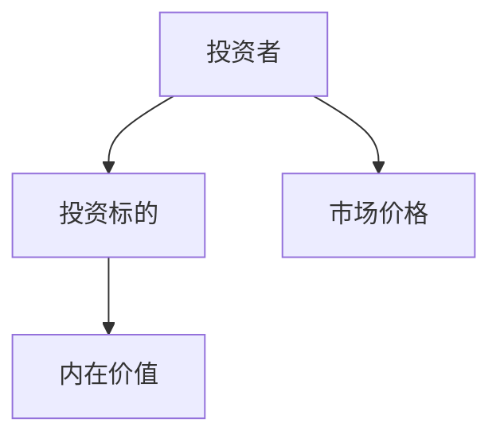
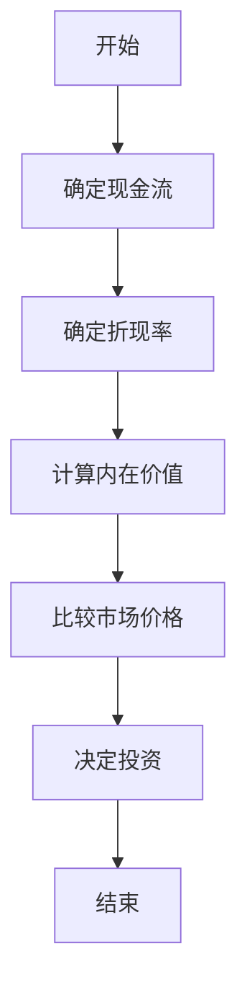
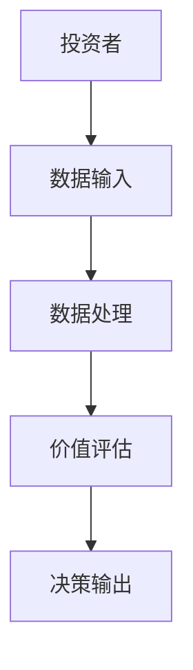

                 


# 巴菲特的年度股东信：投资智慧的精华总结

> 关键词：巴菲特，投资智慧，价值投资，安全边际，股东信，投资策略，投资哲学

> 摘要：本文深入总结巴菲特的年度股东信中蕴含的投资智慧，从核心概念、算法原理、系统分析、项目实战等多维度进行详细解读。文章结构紧凑，逻辑清晰，结合实际案例，剖析巴菲特的投资哲学和策略，为投资者提供实用的指导和启发。

---

## 第一部分：背景介绍

### 第1章：巴菲特投资智慧的背景

#### 1.1 问题背景与核心概念
- **传统投资方法的局限性**：传统投资方法往往依赖短期市场波动和高频交易，忽视了企业的内在价值和长期增长潜力。
- **巴菲特投资智慧的提出背景**：20世纪末，巴菲特通过长期价值投资策略，取得了卓越的投资业绩，成为全球最受尊敬的投资大师之一。
- **问题解决思路**：巴菲特的投资智慧提供了一种基于企业内在价值的长期投资方法，强调安全边际和价值纪律。

#### 1.2 核心概念与问题描述
- **价值投资的定义与特点**：价值投资是以低于企业内在价值的价格买入优质企业，长期持有，分享企业成长的收益。
- **投资智慧的边界与外延**：巴菲特的投资智慧不仅适用于股票投资，还可扩展到企业管理和决策中。
- **核心要素**：内在价值、安全边际、长期持有、价值纪律。

---

## 第二部分：核心概念与联系

### 第2章：核心概念原理

#### 2.1 价值投资的核心原理
- **内在价值**：企业的内在价值是其未来现金流的现值，计算公式为：
  $$ V = \sum_{t=1}^{\infty} \frac{CF_t}{(1+r)^t} $$
  其中，$CF_t$ 是第 $t$ 年的现金流，$r$ 是折现率。
- **安全边际**：买入价格低于内在价值，确保投资的安全性。

#### 2.2 核心概念属性特征对比表格
| 概念         | 特性             | 描述                                   |
|--------------|------------------|--------------------------------------|
| 内在价值     | 客观评估         | 企业未来现金流的现值，与市场波动无关。 |
| 安全边际     | 风险控制         | 购买价格低于内在价值，降低投资风险。   |
| 市场心理      | 行为影响         | 市场情绪波动影响短期价格，但不影响长期价值。 |

#### 2.3 实体关系图（Mermaid）


---

## 第三部分：算法原理

### 第3章：价值评估模型

#### 3.1 算法原理
- **价值评估步骤**：
  1. 确定企业的未来现金流。
  2. 选择合适的折现率。
  3. 计算内在价值。
  4. 比较市场价格与内在价值，决定是否投资。

#### 3.2 价值评估流程图（Mermaid）


#### 3.3 价值评估代码实现
```python
def calculate_intrinsic_value(cash_flows, discount_rate):
    intrinsic_value = 0
    for t in range(len(cash_flows)):
        cf = cash_flows[t]
        intrinsic_value += cf / (1 + discount_rate) ** t
    return intrinsic_value

# 示例
cash_flows = [100, 200, 300]  # 前三年现金流
discount_rate = 0.1  # 折现率
iv = calculate_intrinsic_value(cash_flows, discount_rate)
print(f"内在价值：{iv}")
```

---

## 第四部分：系统分析与架构设计

### 第4章：系统分析与架构设计

#### 4.1 问题场景介绍
- 投资者需要基于巴菲特的投资智慧，构建一个价值投资决策支持系统。

#### 4.2 系统架构设计（Mermaid）


---

## 第五部分：项目实战

### 第5章：价值投资实战

#### 5.1 环境安装与配置
- 安装必要的Python库，如Pandas、NumPy。

#### 5.2 核心代码实现
```python
import pandas as pd
import numpy as np

def calculate_intrinsic_value(cash_flows, discount_rate, periods):
    iv = 0
    for t in range(periods):
        iv += cash_flows[t] / (1 + discount_rate) ** t
    return iv

# 示例数据
cash_flows = [100, 200, 300]
discount_rate = 0.1
periods = 3

iv = calculate_intrinsic_value(cash_flows, discount_rate, periods)
print(f"内在价值：{iv}")
```

#### 5.3 案例分析
- 以可口可乐为例，计算其内在价值，判断是否值得投资。

---

## 第六部分：总结与展望

### 第6章：总结与展望

#### 6.1 最佳实践
- 长期持有优质企业。
- 保持安全边际。
- 理解并应用巴菲特的投资哲学。

#### 6.2 小结
- 巴菲特的投资智慧为投资者提供了长期稳健的投资方法，值得深入研究和实践。

#### 6.3 注意事项
- 投资需谨慎，避免盲目跟风。
- 确保对企业基本面有充分了解。

#### 6.4 拓展阅读
- 《巴菲特致股东的信》
- 《穷爸爸富爸爸》

---

作者：AI天才研究院/AI Genius Institute & 禅与计算机程序设计艺术 /Zen And The Art of Computer Programming

