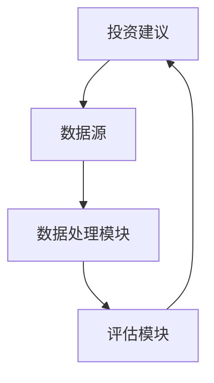

                 

# 巴菲特的并购投资策略

## 关键词：巴菲特，并购，投资策略，企业价值，安全边际，竞争优势

## 摘要：本文深入分析了巴菲特的并购投资策略，从其核心理念到具体实施方法，结合经典案例和系统架构，揭示了巴菲特成功投资的奥秘。通过技术化的分析方式，我们将巴菲特的投资哲学转化为可理解、可操作的系统模型，为投资者提供深度的理论支持和实践指导。

---

# 第一部分：背景介绍

## 第1章：巴菲特并购投资策略的背景与核心概念

### 1.1 并购投资的重要性

#### 1.1.1 并购在企业扩张中的作用
企业并购是企业快速扩张、实现规模经济的重要手段。通过并购，企业可以迅速获得新的市场、技术、产品线或客户资源，避免了从零开始发展的高成本和高风险。

#### 1.1.2 巴菲特投资哲学的核心理念
巴菲特的投资哲学以“价值投资”为核心，强调以低于内在价值的价格买入优质资产。他注重企业的基本面分析，尤其是企业的竞争优势和管理层质量。

#### 1.1.3 并购与传统投资策略的区别
传统的投资策略更关注短期价格波动，而巴菲特的并购策略更注重长期价值创造。他倾向于寻找具有强大护城河的企业，并通过长期持有实现财富增长。

---

## 第2章：巴菲特并购投资的核心标准

### 2.1 企业护城河的定义与分类

#### 2.1.1 企业护城河的定义
企业护城河是指企业在行业内具备的独特竞争优势，使其能够长期保持高利润率和市场地位。常见的护城河包括品牌优势、成本优势、技术壁垒、网络效应等。

#### 2.1.2 企业护城河的分类
- **成本优势**：如制造业企业的规模效应。
- **品牌优势**：如可口可乐的品牌影响力。
- **技术壁垒**：如专利技术。
- **网络效应**：如社交平台的用户粘性。

### 2.2 企业竞争优势的评估方法

#### 2.2.1 市场地位
企业是否在行业内占据领先地位？是否具有定价权？

#### 2.2.2 财务健康度
企业的盈利能力、资产负债率、现金流状况如何？

#### 2.2.3 管理层能力
管理层是否具备诚信、智慧和决策能力？

### 2.3 管理层质量与企业价值的关系

#### 2.3.1 管理层的诚信与决策能力
巴菲特认为，优秀的管理层能够为企业创造价值，并在逆境中做出正确的决策。

#### 2.3.2 管理层的长期视野
管理层是否注重长期价值创造，而非短期利益？

---

## 第3章：巴菲特并购投资的估值方法

### 3.1 企业价值的评估模型

#### 3.1.1 自由现金流模型
$$\text{企业价值} = \sum_{t=1}^{n} \frac{\text{自由现金流}}{(1 + r)^t} + \frac{\text{终值}}{(1 + r)^n}$$
其中，r为折现率，n为预测年限。

#### 3.1.2 市盈率与市净率的局限性
市盈率和市净率只能反映企业的相对估值，不能完全体现企业的内在价值。

### 3.2 安全边际的概念与应用

#### 3.2.1 安全边际的定义
$$\text{安全边际} = \text{内在价值} - \text{市场价格}$$
安全边际越大，投资风险越小。

#### 3.2.2 安全边际的应用
在并购中，巴菲特通常以低于企业内在价值的价格买入，确保安全边际的存在。

---

## 第4章：巴菲特并购投资的案例分析

### 4.1 可口可乐的收购与管理

#### 4.1.1 收购背景
1985年，巴菲特通过可可可乐的股票回购计划，以低于内在价值的价格增持其股票。

#### 4.1.2 投资回报
可口可乐的股价长期稳健增长，为巴菲特带来了丰厚的回报。

### 4.2 喜诗糖果的收购与整合

#### 4.2.1 收购背景
巴菲特通过收购喜诗糖果，获得了稳定的现金流和强大的管理层。

#### 4.2.2 收购后的整合
巴菲特保留了企业的原有管理层，并通过优化管理进一步提升企业价值。

---

## 第5章：巴菲特并购投资策略的技术化分析

### 5.1 投资模型的构建

#### 5.1.1 投资模型的输入变量
- 企业基本面数据
- 管理层质量评分
- 市场环境分析

#### 5.1.2 投资模型的输出结果
- 企业内在价值
- 安全边际
- 投资建议

### 5.2 投资策略的系统架构

#### 5.2.1 系统功能设计
- 数据采集与处理
- 企业价值评估
- 投资决策支持

#### 5.2.2 系统架构设计

---

## 第6章：巴菲特并购投资策略的现代应用

### 6.1 现代并购市场的挑战

#### 6.1.1 竞争加剧
企业需要不断创新以保持竞争优势。

#### 6.1.2 技术变革
技术进步使得企业护城河更容易被打破。

### 6.2 巴菲特策略的现代改进

#### 6.2.1 结合技术创新
在传统并购策略中融入技术创新评估。

#### 6.2.2 数据驱动决策
利用大数据分析提升企业价值评估的准确性。

---

## 第7章：总结与展望

### 7.1 本文总结
巴菲特的并购投资策略以价值投资为核心，强调企业竞争优势和管理层质量。通过系统的分析和实践，投资者可以更好地把握并购机会，实现长期价值创造。

### 7.2 对未来研究的展望
未来的研究可以进一步结合人工智能和大数据技术，优化企业价值评估模型，提升并购决策的科学性。

---

作者：AI天才研究院 & 禅与计算机程序设计艺术

---

通过上述思考过程，我们可以看到，巴菲特的并购投资策略不仅是一种投资方法，更是一种系统化的价值评估和风险管理的科学。结合技术化的分析方法，投资者可以更好地理解和应用这一策略，实现长期的财富增长。

