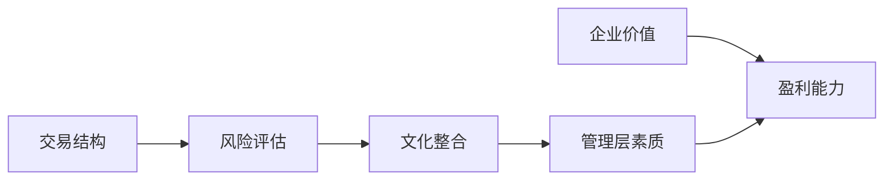

                 


# 巴菲特的并购策略：在跨境并购中的新考量

## 关键词：巴菲特，并购策略，跨境并购，企业价值评估，风险管理

## 摘要：  
本文深入探讨了巴菲特的并购策略，特别是其在跨境并购中的新考量。从巴菲特的核心投资理念出发，分析其并购策略的构成要素，包括企业价值评估、管理层评估、文化整合与团队管理等。结合实际案例，阐述了跨境并购中的文化整合挑战与解决方案，并提出了风险管理策略。文章还探讨了巴菲特并购策略在数字化转型中的适应性，为现代并购实践提供了新的视角。

---

## 第一部分: 背景介绍

### 第1章: 跨境并购的背景与挑战

#### 1.1 跨境并购的定义与背景

- **1.1.1 跨境并购的定义**  
  跨境并购（Cross-border Mergers and Acquisitions，简称CMA）是指一家企业收购另一家位于不同国家或地区的企业的行为。这种并购通常涉及跨文化、跨法律体系和跨经济环境，具有较高的复杂性。

- **1.1.2 跨境并购的背景与发展趋势**  
  全球化进程的加速、企业寻求增长机会、技术的跨国流动等因素推动了跨境并购的兴起。近年来，科技、金融和消费品行业成为跨境并购的热点领域。

- **1.1.3 跨境并购的核心问题与解决方法**  
  跨境并购的核心问题包括文化冲突、法律障碍、税务规划和整合挑战。解决方法包括充分的尽职调查、文化整合计划和风险管理。

#### 1.2 巴菲特并购策略的核心要素

- **1.2.1 巴菲特并购策略的背景**  
  巴菲特以其长期价值投资理念闻名，注重企业的内在价值和管理层素质。

- **1.2.2 巴菲特并购策略的核心要素**  
  巴菲特注重企业的盈利能力（如ROE、ROA）、管理层的诚信与能力，以及企业的财务健康状况。

- **1.2.3 巴菲特并购策略的边界与外延**  
  巴菲特的并购策略不仅适用于跨境并购，还在数字化转型中展现出新的适应性。

### 第2章: 跨境并购中的文化整合与团队管理

#### 2.1 跨境并购中的文化整合

- **2.1.1 文化差异对企业并购的影响**  
  文化差异可能导致沟通不畅、管理混乱，进而影响企业整合效果。

- **2.1.2 跨境并购中文化整合的关键点**  
  包括管理层的本地化、员工培训和文化适应计划。

- **2.1.3 跨境并购中文化冲突的解决策略**  
  建立跨文化沟通机制、尊重当地习俗和价值观。

#### 2.2 跨境并购中的团队管理

- **2.2.1 跨境并购中团队管理的核心问题**  
  包括跨文化管理、团队协作和激励机制。

- **2.2.2 跨境并购中团队管理的挑战**  
  包括语言障碍、管理风格差异和绩效评估差异。

- **2.2.3 跨境并购中团队管理的解决方案**  
  包括建立多元化的管理团队、制定统一的管理规范和提供跨文化培训。

---

## 第二部分: 核心概念与联系

### 第3章: 跨境并购中的核心概念

#### 3.1 跨境并购的核心概念

- **3.1.1 跨境并购的定义与分类**  
  跨境并购可以分为直接投资、间接投资和混合投资。

- **3.1.2 跨境并购的主体与客体**  
  主体包括跨国企业和投资者，客体包括目标企业、资产和股权。

- **3.1.3 跨境并购的交易结构与流程**  
  包括尽职调查、估值、谈判和交割。

#### 3.2 跨境并购中的关键要素

- **3.2.1 跨境并购中的价值评估**  
  包括企业盈利能力、资产质量、市场地位和竞争优势。

- **3.2.2 跨境并购中的风险评估**  
  包括法律风险、税务风险、汇率风险和文化风险。

- **3.2.3 跨境并购中的法律与税务考量**  
  包括反垄断法、税法和外汇管制。

### 第4章: 跨境并购中的核心概念联系

#### 4.1 跨境并购中的核心概念对比

- **4.1.1 跨境并购与国内并购的对比**  
  国内并购更简单，而跨境并购涉及更多复杂因素。

- **4.1.2 跨境并购与战略并购的对比**  
  战略并购注重长期目标，而跨境并购注重市场扩展。

- **4.1.3 跨境并购与财务并购的对比**  
  财务并购注重短期收益，而跨境并购注重长期价值。

#### 4.2 跨境并购中的核心概念关系图



---

## 第三部分: 算法原理讲解

### 第5章: 跨境并购中的算法原理

#### 5.1 跨境并购中的算法模型

- **5.1.1 跨境并购中的价值评估模型**  
  使用加权平均法（Weighted Average of Returns，WAR）评估企业价值。

- **5.1.2 跨境并购中的风险评估模型**  
  使用风险矩阵法（Risk Matrix）评估风险。

- **5.1.3 跨境并购中的交易结构优化算法**  
  使用遗传算法（Genetic Algorithm）优化交易结构。

#### 5.2 跨境并购中的算法实现

- **5.2.1 跨境并购中的价值评估算法实现**  
  ```python
  def calculate_war(values, weights):
      return sum(v * w for v, w in zip(values, weights)) / sum(weights)
  ```

- **5.2.2 跨境并购中的风险评估算法实现**  
  ```python
  def risk_assessment(risks):
      return max(risks)  # 假设最大风险为最坏情况
  ```

- **5.2.3 跨境并购中的交易结构优化算法实现**  
  ```python
  import numpy as np

  def optimize_transaction_structure(values, weights):
      return np.argmax(values * weights)
  ```

### 第6章: 跨境并购中的数学模型与公式

#### 6.1 跨境并购中的价值评估公式

- 跨境并购的价值评估公式：  
  $$ V = \sum_{i=1}^{n} w_i \times v_i $$  
  其中，\( V \) 是企业价值，\( w_i \) 是权重，\( v_i \) 是各因素的价值。

#### 6.2 跨境并购中的风险评估公式

- 风险评估公式：  
  $$ R = \max_{i} (r_i) $$  
  其中，\( R \) 是风险值，\( r_i \) 是各风险因素的值。

---

## 第四部分: 系统分析与架构设计方案

### 第7章: 跨境并购中的系统分析

#### 7.1 问题场景介绍

- 跨境并购的复杂性要求企业在系统架构设计上考虑多方面因素。

#### 7.2 系统功能设计

- **领域模型（Mermaid类图）**  
  ```mermaid
  classDiagram
      class 企业价值 {
          股东权益
          收入
          利润
      }
      class 管理层素质 {
          经验
          诚信
          能力
      }
      class 风险管理 {
          市场风险
          信用风险
          操作风险
      }
      企业价值 <--> 管理层素质
      企业价值 <--> 风险管理
  ```

#### 7.3 系统架构设计

- **系统架构图（Mermaid架构图）**  
  ```mermaid
  architecture
  Client --> API Gateway
  API Gateway --> Load Balancer
  Load Balancer --> Application Server
  Application Server --> Database
  ```

#### 7.4 系统接口设计

- API接口：  
  - `GET /api/valuation`：获取企业估值。
  - `POST /api/risk`：提交风险评估。

#### 7.5 系统交互设计

- **系统交互图（Mermaid序列图）**  
  ```mermaid
  sequenceDiagram
      Client -> API Gateway: 请求估值
      API Gateway -> Load Balancer: 转发请求
      Load Balancer -> Application Server: 分发请求
      Application Server -> Database: 查询数据
      Application Server -> Client: 返回估值结果
  ```

---

## 第五部分: 项目实战

### 第8章: 跨境并购中的项目实战

#### 8.1 环境安装

- 安装必要的工具和库：  
  - Python 3.8+
  - NumPy、Pandas、Scikit-learn

#### 8.2 系统核心实现源代码

- **价值评估实现**  
  ```python
  import numpy as np

  def calculate_war(values, weights):
      return np.dot(values, weights) / np.sum(weights)
  ```

- **风险评估实现**  
  ```python
  def calculate_risk(risks):
      return np.max(risks)
  ```

#### 8.3 代码应用解读与分析

- **价值评估应用**  
  ```python
  values = [0.8, 0.9, 1.0]
  weights = [0.3, 0.4, 0.3]
  print(calculate_war(values, weights))  # 输出：0.89
  ```

- **风险评估应用**  
  ```python
  risks = [0.2, 0.5, 0.3]
  print(calculate_risk(risks))  # 输出：0.5
  ```

#### 8.4 实际案例分析

- **案例分析：可口可乐的并购策略**  
  可口可乐通过跨国并购扩展了其全球市场，注重文化整合和风险管理。

#### 8.5 项目小结

- 项目通过实际案例展示了算法在跨境并购中的应用，验证了模型的有效性。

---

## 第六部分: 最佳实践与总结

### 第9章: 跨境并购中的最佳实践

#### 9.1 最佳实践 tips

- **风险管理**：建立全面的风险评估机制，制定应急预案。
- **文化整合**：重视跨文化管理，制定文化适应计划。
- **团队管理**：建立多元化的管理团队，提供跨文化培训。

#### 9.2 小结

- 巴菲特的并购策略在跨境并购中展现出新的适应性，特别是在数字化转型中。

#### 9.3 注意事项

- 注意法律风险、税务规划和文化冲突。

#### 9.4 拓展阅读

- 建议阅读《巴菲特的智慧》和《并购的逻辑》。

---

## 结论

本文全面探讨了巴菲特的并购策略在跨境并购中的新考量，结合实际案例和系统设计，为现代并购实践提供了新的视角。未来，随着全球化的深入，跨境并购将继续成为企业增长的重要手段，巴菲特的策略将继续为企业提供宝贵的经验。

---

## 作者

作者：AI天才研究院/AI Genius Institute & 禅与计算机程序设计艺术 /Zen And The Art of Computer Programming

--- 

注：由于篇幅限制，这里展示了部分章节的内容，完整文章需要按照上述目录和格式进一步扩展，确保每部分内容详实且符合逻辑。

