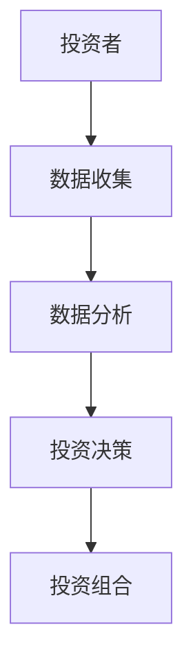

                 


# 巴菲特的成功秘诀：长期价值投资策略

> 关键词：巴菲特，价值投资，长期投资，投资策略，投资哲学

> 摘要：本文详细分析了巴菲特的成功秘诀，重点介绍了他的长期价值投资策略。文章从巴菲特的投资哲学、价值投资的核心概念、算法原理、系统架构、项目实战等方面展开，结合实际案例和数学模型，深入剖析了巴菲特的投资方法和成功背后的逻辑。

---

## 第1章: 巴菲特的投资哲学与成功案例

### 1.1 巴菲特的生平与投资理念

#### 1.1.1 巴菲特的早年经历与投资起步
沃伦·巴菲特（Warren Buffett）出生于1930年8月31日，美国堪萨斯州奥马哈市。他从小就展现出对数字和金融的天赋，12岁时便开始投资股票。巴菲特的父亲是一位律师，同时也是一位国会议员，这使他从小就接触到政治和商业事务。巴菲特在高中时期就阅读了格雷厄姆的《证券分析》，并开始研究股票投资。

巴菲特在哥伦比亚大学学习期间，师从本杰明·格雷厄姆（Benjamin Graham），格雷厄姆的价值投资理念对巴菲特的影响深远。巴菲特在毕业后进入父亲的朋友费雷德·巴菲特的公司，开始了他的职业生涯。他最初的投资哲学是基于格雷厄姆的“价值投资”理念，即寻找被市场低估的股票，并长期持有。

#### 1.1.2 巴菲特的价值投资哲学
巴菲特的价值投资哲学的核心在于寻找那些具有持续竞争优势、良好管理和强大财务状况的企业。他强调投资于企业的内在价值，而不是市场的短期波动。巴菲特认为，市场先生（市场情绪）往往是不理性的，而投资者应该利用市场的非理性来寻找投资机会。

巴菲特的“护城河”理论是其投资哲学的重要组成部分。他认为，具有强大竞争优势的企业能够长期保持高盈利能力，这些竞争优势包括专利、品牌、成本优势、技术壁垒等。

#### 1.1.3 巴菲特的成功案例分析
巴菲特最著名的投资案例之一是可口可乐公司。他在1988年开始投资可口可乐，认为其强大的品牌和分销网络是公司的核心竞争力。巴菲特的投资策略是长期持有，耐心等待企业的内在价值增长，而不是频繁交易以追逐短期收益。

---

### 1.2 巴菲特的投资策略与长期视角

#### 1.2.1 长期投资的重要性
巴菲特强调长期投资的重要性，他认为短期市场的波动是无法预测的，而长期投资则能够平滑短期波动的影响，最终获得企业的成长收益。长期投资不仅能够分散风险，还能让投资者充分享受企业成长的成果。

#### 1.2.2 巴菲特的投资组合管理
巴菲特的投资组合通常是高度分散的，但重点集中在少数具有强大竞争优势的企业上。他倾向于投资那些他能够理解的企业，避免投资于自己不了解的行业。巴菲特的投资组合管理遵循“集中投资”的原则，即将大部分资金投向少数几家企业，这些企业具有长期的竞争优势和稳定的盈利能力。

#### 1.2.3 巴菲特对市场的看法
巴菲特认为，市场并不是定价的依据，而是企业内在价值的定价工具。他强调投资者应该关注企业的基本面，而不是市场的短期波动。巴菲特在市场恐慌时买入，而在市场狂热时卖出，这种逆向投资策略是其成功的重要原因之一。

---

## 第2章: 价值投资的核心概念与背景

### 2.1 价值投资的定义与特征

#### 2.1.1 价值投资的定义
价值投资是一种投资策略，旨在通过寻找市场价格低于其内在价值的股票，进行长期持有，以实现资本增值。价值投资的核心在于识别市场低估的股票，并长期持有，等待其价值回归。

#### 2.1.2 价值投资的核心特征对比表格
以下是价值投资与其他投资策略的核心特征对比：

| 投资策略 | 投资目标 | 投资期限 | 风险承受 | 主要关注点 |
|----------|----------|----------|----------|------------|
| 价值投资 | 内在价值 | 长期 | 低风险 | 企业基本面 |
| 成长投资 | 高成长 | 中长期 | 高风险 | 企业成长潜力 |
| 趋势投资 | 市场趋势 | 短期 | 中风险 | 市场趋势 |

#### 2.1.3 价值投资的ER实体关系图
以下是一个简化的价值投资的ER实体关系图：

```mermaid
erDiagram
    investor {
        inv_id
        inv_name
        inv_strategy
    }
    investment {
        inv_id
        stock_id
        investment_amount
        investment_date
    }
    stock {
        stock_id
        company_name
        market_value
        intrinsic_value
    }
    investor --> investment: owns
    investment --> stock: holds
```

---

### 2.2 价值投资与其他投资策略的联系

#### 2.2.1 价值投资与成长投资的区别
价值投资关注企业的内在价值，而成长投资关注企业的成长潜力。价值投资者寻找被市场低估的企业，而成长投资者寻找具有高成长潜力的企业。两者的区别在于投资目标和关注点的不同。

#### 2.2.2 价值投资与趋势投资的对比
趋势投资关注市场的短期趋势，而价值投资关注企业的长期价值。趋势投资者可能频繁交易，而价值投资者则长期持有。两者在风险承受和投资期限上有所不同。

#### 2.2.3 价值投资与套利投资的联系
套利投资利用市场的价格差异进行投资，而价值投资则寻找市场价格低于内在价值的企业。两者都关注价格与价值的关系，但套利投资更注重短期机会，而价值投资更注重长期价值。

---

## 第3章: 巴菲特价值投资的算法原理

### 3.1 巴菲特价值投资的选股标准

#### 3.1.1 企业的财务指标分析
巴菲特在选股时注重企业的财务健康状况，重点关注以下几个指标：

1. **ROE（净资产收益率）**：ROE越高，说明企业利用股东资产创造利润的能力越强。
2. **净利率**：净利率高意味着企业盈利能力强。
3. **负债率**：负债率低的企业财务风险较小。
4. **现金流**：正向现金流表明企业有稳定的盈利能力和良好的财务状况。

#### 3.1.2 企业的竞争优势评估
巴菲特注重企业的竞争优势，即企业的“护城河”。护城河可以是成本优势、品牌优势、技术壁垒、市场准入壁垒等。企业具有强大的竞争优势，能够长期保持高盈利能力。

#### 3.1.3 企业的管理团队评价
巴菲特认为，优秀的管理团队是企业成功的关键。他倾向于投资那些由有能力、有诚信的管理团队领导的企业。

---

### 3.2 巴菲特价值投资的数学模型

#### 3.2.1 价值投资的DCF模型
DCF模型（Discounted Cash Flow Model）是评估企业内在价值的重要工具。以下是DCF模型的公式：

$$
\text{内在价值} = \sum_{t=1}^{n} \frac{\text{现金流}}{(1 + r)^t} + \frac{\text{终值}}{(1 + r)^n}
$$

其中，\( r \) 是折现率，\( n \) 是预计的持有期限。

#### 3.2.2 价值投资的安全边际计算
安全边际是巴菲特投资策略中的重要概念。安全边际 = 内在价值 - 市场价格。以下是安全边际的计算公式：

$$
\text{安全边际} = \text{内在价值} - \text{市场价格}
$$

巴菲特建议投资者寻找安全边际较高的股票，即市场价格显著低于内在价值的股票。

#### 3.2.3 价值投资的内在价值公式
内在价值是企业未来现金流的现值。以下是内在价值的计算公式：

$$
\text{内在价值} = \frac{\text{净利润} \times (1 + g)}{r - g}
$$

其中，\( g \) 是净利润增长率，\( r \) 是折现率。

---

## 第4章: 价值投资的系统分析与架构设计

### 4.1 投资系统的整体架构

#### 4.1.1 投资系统的模块划分
投资系统可以分为以下几个模块：

1. 数据收集模块：收集企业的财务数据、行业信息等。
2. 数据分析模块：分析企业的财务指标、竞争优势等。
3. 投资决策模块：根据分析结果制定投资策略。

#### 4.1.2 投资系统的功能流程图
以下是一个简化的投资系统功能流程图：



#### 4.1.3 投资系统的数据流图
以下是一个简化的数据流图：


---

### 4.2 投资系统的具体实现

#### 4.2.1 数据收集模块的设计
数据收集模块需要收集企业的财务数据、行业信息等。以下是数据收集模块的实现步骤：

1. 确定数据来源：包括公司财报、行业报告等。
2. 数据清洗：去除无效数据，确保数据的准确性。
3. 数据存储：将数据存储到数据库中，以便后续分析。

#### 4.2.2 数据分析模块的实现
数据分析模块需要分析企业的财务指标、竞争优势等。以下是数据分析模块的实现步骤：

1. 计算财务指标：ROE、净利率、负债率等。
2. 评估竞争优势：分析企业的护城河。
3. 生成分析报告：总结分析结果，为投资决策提供依据。

#### 4.2.3 投资决策模块的优化
投资决策模块需要根据分析结果制定投资策略。以下是投资决策模块的实现步骤：

1. 确定投资目标：寻找市场价格低于内在价值的企业。
2. 制定投资计划：根据分析结果制定投资组合。
3. 监测投资效果：定期评估投资组合的表现。

---

## 第5章: 巴菲特价值投资的项目实战

### 5.1 项目环境与工具安装

#### 5.1.1 投资分析工具的安装
投资者需要安装一些投资分析工具，如Excel、Python等。以下是安装步骤：

1. 下载并安装Excel或Python。
2. 安装必要的库：如Pandas、NumPy等。

#### 5.1.2 数据源的获取与处理
投资者可以通过以下途径获取数据：

1. 公司财报：从公司官网或财务报表中获取。
2. 行业报告：从行业分析机构获取。

#### 5.1.3 投资环境的配置
投资者需要配置投资环境，包括选择投资平台、开立证券账户等。

---

### 5.2 项目核心实现

#### 5.2.1 数据收集与清洗
以下是数据收集与清洗的代码示例：

```python
import pandas as pd
import numpy as np

# 数据收集
data = pd.read_csv('stock_data.csv')

# 数据清洗
data.dropna(inplace=True)
data = data[~data['price'].isin(['', np.nan])]
```

#### 5.2.2 数据分析与建模
以下是数据分析与建模的代码示例：

```python
# 计算ROE
data['ROE'] = data['净利润'] / data['净资产']

# 评估竞争优势
data['竞争优势'] = data['ROE'].rank()
```

#### 5.2.3 投资决策与实施
以下是投资决策与实施的代码示例：

```python
# 确定投资目标
data['安全边际'] = data['内在价值'] - data['市场价格']

# 制定投资计划
selected_stocks = data[data['安全边际'] > 0].sort_values('安全边际', ascending=False)
```

---

### 5.3 项目小结

通过以上步骤，投资者可以系统地应用巴菲特的价值投资策略，从数据收集到投资决策，实现长期价值投资的目标。

---

## 第6章: 最佳实践、小结、注意事项与拓展阅读

### 6.1 最佳实践

1. **长期持有**：巴菲特的成功离不开长期持有优质企业。
2. **分散投资**：集中投资于少数具有强大竞争优势的企业。
3. **逆向投资**：在市场恐慌时买入，市场狂热时卖出。

### 6.2 小结

本文详细介绍了巴菲特的成功秘诀，重点分析了其长期价值投资策略。通过系统的分析和实战案例，读者可以更好地理解巴菲特的投资哲学和方法。

### 6.3 注意事项

1. **风险控制**：投资者需要关注市场的波动和企业的财务状况。
2. **持续学习**：投资需要不断学习和适应市场变化。
3. **耐心与纪律**：长期投资需要耐心和纪律，避免短期波动的干扰。

### 6.4 拓展阅读

1. **《证券分析》**：本杰明·格雷厄姆的著作，介绍了价值投资的基本原理。
2. **《巴菲特致股东的信》**：巴菲特每年致股东的信，提供了丰富的投资见解。
3. **《投资之道》**：彼得·林奇的著作，介绍了成长投资策略。

---

## 作者信息

作者：AI天才研究院/AI Genius Institute & 禅与计算机程序设计艺术 /Zen And The Art of Computer Programming

---

以上是《巴菲特的成功秘诀：长期价值投资策略》的技术博客文章的完整大纲和内容。希望这篇文章能够帮助读者更好地理解巴菲特的投资哲学和长期价值投资策略。

