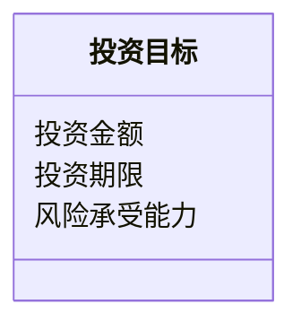
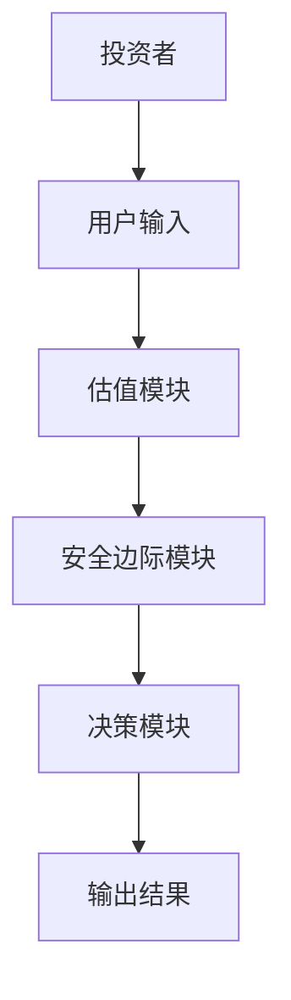
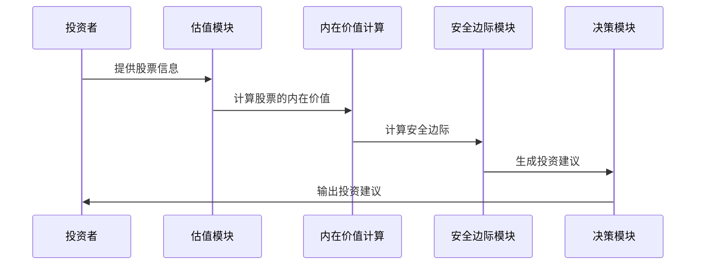

                 


# 巴菲特的投资决策框架

---

## 关键词：
巴菲特，价值投资，投资决策，安全边际，股票估值，投资策略

---

## 摘要：
本文深入分析了巴菲特的投资决策框架，从其核心理念到具体操作策略，结合数学模型和实际案例，详细阐述了巴菲特如何通过价值投资、安全边际和内在价值评估来做出投资决策。文章还探讨了巴菲特投资框架的系统性、风险管理和长期思维，并为读者提供了实践建议和启示。

---

# 第一部分：引言

## 1.1 投资的基本概念
投资是通过将资金投入到能够产生收益的资产中，以实现财富增值的过程。投资的核心在于识别具有潜力的资产，并在合适的时间和价格下进行买卖。投资可以分为股票、债券、房地产等多种形式，其中股票投资因其高增长潜力而备受关注。

## 1.2 巴菲特的背景
沃伦·巴菲特（Warren Buffett）是全球最著名的职业投资者之一，被誉为“股神”。他出生于1934年，早年通过阅读和实践积累了丰富的投资知识。巴菲特的投资理念以价值投资为核心，强调寻找具有长期竞争优势的企业，并以合理的价格买入。

## 1.3 本文的目的
本文旨在揭示巴菲特的投资决策框架，分析其背后的逻辑和方法，为投资者提供实用的指导。通过结合理论与实践，帮助读者理解如何在实际投资中应用巴菲特的策略。

---

# 第二部分：巴菲特的投资原则

## 2.1 价值投资的核心原则
### 2.1.1 买入低于内在价值的股票
巴菲特强调以低于企业内在价值的价格买入股票。内在价值是企业未来现金流的现值，可以通过数学模型进行估算。例如，使用股利折现模型（DDM）计算股票的内在价值。

### 2.1.2 长期持有的投资策略
巴菲特认为，频繁交易会增加交易成本，并分散投资的专注度。因此，他倡导长期持有优质股票，以分享企业的长期增长。

### 2.1.3 集中投资的重要性
巴菲特主张将大部分资金集中在少数具有强大竞争优势的企业上，而不是分散投资。他认为，集中投资可以减少风险，并提高投资收益。

## 2.2 安全边际的概念与应用
### 2.2.1 安全边际的定义
安全边际是指股票的市场价格低于其内在价值的部分。巴菲特认为，安全边际是保护投资者免受市场波动影响的重要屏障。

### 2.2.2 安全边际在投资中的作用
通过计算安全边际，投资者可以确保以合理的价格买入股票，并在市场波动中保持投资的稳定性。

### 2.2.3 如何计算安全边际
假设某股票的内在价值为50美元，市场价格为40美元，则安全边际为10美元。公式如下：
$$ \text{安全边际} = \text{内在价值} - \text{市场价格} $$

## 2.3 股票估值的基本方法
### 2.3.1 市盈率与市净率的定义
- 市盈率（P/E）= 股价 / 每股收益
- 市净率（P/B）= 股价 / 每股净资产

### 2.3.2 股息率与股息支付率的分析
- 股息率 = 每股股息 / 股价
- 股息支付率 = 股息 / 净利润

### 2.3.3 内在价值的估算方法
巴菲特使用股利折现模型（DDM）估算内在价值：
$$ V = \frac{D}{k - g} $$
其中，\( D \) 为股息，\( k \) 为折现率，\( g \) 为股息增长率。

---

# 第三部分：巴菲特的决策框架分析

## 3.1 投资决策的基本步骤
### 3.1.1 确定投资目标与策略
投资者需要明确自己的投资目标（如保值、增值）和投资策略（如价值投资、成长投资）。

### 3.1.2 选择投资标的
通过基本面分析和财务指标筛选，选择具有长期竞争优势的企业。

### 3.1.3 评估投资风险与收益
综合考虑市场风险、行业风险和公司风险，评估投资的预期收益与潜在风险。

## 3.2 巴菲特的选股标准
### 3.2.1 公司基本面分析
分析企业的盈利能力、财务状况和竞争优势。例如，使用财务指标如ROE（净资产收益率）和毛利率评估企业的盈利能力。

### 3.2.2 财务指标的筛选
- 净利润增长率
- 资产负债率
- 现金流状况

### 3.2.3 管理层的评估
巴菲特强调管理层的诚信和能力，认为优秀的管理层能够为股东创造长期价值。

## 3.3 投资组合的构建与管理
### 3.3.1 投资组合的分散化原则
通过分散投资降低风险，避免过度集中于单一行业或企业。

### 3.3.2 个股权重的分配策略
根据企业的内在价值和安全边际，合理分配各股票的权重。

### 3.3.3 定期审视与调整投资组合
定期评估投资组合的表现，并根据市场变化和企业情况调整持仓。

---

# 第四部分：巴菲特投资框架的数学模型

## 4.1 股票内在价值的计算公式
### 4.1.1 内在价值的公式推导
$$ V = \frac{CF}{r - g} $$
其中，\( CF \) 为未来现金流，\( r \) 为折现率，\( g \) 为现金流增长率。

### 4.1.2 公式中变量的定义与解释
- \( CF \)：未来现金流，可以通过企业历史业绩和行业增长预测得出。
- \( r \)：折现率，通常基于市场利率和风险偏好确定。
- \( g \)：现金流增长率，基于企业的竞争优势和行业前景确定。

### 4.1.3 公式的实际应用案例
假设某企业未来现金流为1000万美元，折现率为10%，增长率5%，则内在价值为：
$$ V = \frac{1000}{0.10 - 0.05} = 20000 \text{万美元} $$

## 4.2 安全边际的量化方法
### 4.2.1 安全边际的计算公式
$$ \text{安全边际} = \text{内在价值} - \text{市场价格} $$

### 4.2.2 如何确定合理的安全边际比例
通常，巴菲特建议的安全边际比例为内在价值的20%至30%。

### 4.2.3 安全边际在不同市场环境下的应用
在牛市中，安全边际较小，投资者需更加谨慎；在熊市中，安全边际较大，为买入提供了更好的机会。

## 4.3 股票估值的对比分析
### 4.3.1 不同估值方法的对比表格
| 方法 | 定义 | 适用场景 |
|------|------|----------|
| 市盈率 | P/E比率 | 判断成长型企业估值 |
| 市净率 | P/B比率 | 适用于金融等资产型企业 |
| 股息率 | Dividend Yield | 评估收益稳定性 |

---

# 第五部分：巴菲特投资框架的系统分析

## 5.1 投资系统的构成要素
### 5.1.1 投资目标的确定
- 投资目标可以是财富增值、资产保值或追求股息收入。
- 通过设定具体的投资目标，投资者可以更有针对性地选择投资标的。

### 5.1.2 投资策略的选择
- 价值投资策略：寻找低估股票。
- 成长投资策略：投资于高成长企业。
- 组合投资策略：分散投资以降低风险。

### 5.1.3 投资工具的使用
- 股票：成长性和稳定性并重。
- 债券：提供稳定收益。
- 其他资产：如房地产、黄金等。

## 5.2 投资系统的功能设计
### 5.2.1 投资目标的领域模型


### 5.2.2 系统架构设计


### 5.2.3 系统交互流程


---

# 第六部分：项目实战

## 6.1 环境安装
- Python编程环境
- 数据分析库（如Pandas、NumPy）
- 可视化工具（如Matplotlib）

## 6.2 核心实现源代码
```python
import pandas as pd

def calculate_intrinsic_value(enterprise_value, cash_flow, discount_rate, growth_rate):
    return cash_flow / (discount_rate - growth_rate)

def calculate_margin_of_safety(intrinsic_value, market_price):
    return intrinsic_value - market_price

# 示例数据
cash_flow = 10000000
discount_rate = 0.10
growth_rate = 0.05
market_price = 20

intrinsic_value = calculate_intrinsic_value(cash_flow, discount_rate, growth_rate)
margin_of_safety = calculate_margin_of_safety(intrinsic_value, market_price)

print(f"内在价值: {intrinsic_value}")
print(f"安全边际: {margin_of_safety}")
```

## 6.3 代码应用解读
- 代码实现了内在价值和安全边际的计算。
- 通过输入企业未来现金流、折现率和增长率，计算出股票的内在价值。
- 再通过市场价格计算安全边际，为投资者提供买入建议。

## 6.4 实际案例分析
假设某股票的未来现金流为1000万美元，折现率为10%，增长率为5%，市场价格为20美元。计算结果如下：
- 内在价值：20000万美元
- 安全边际：20000 - 20 = 1980美元

---

# 第七部分：总结与启示

## 7.1 巴菲特的投资哲学
- 长期思维：关注企业的长期价值，而非短期波动。
- 风险管理：通过安全边际和分散投资降低风险。
- 知识积累：持续学习和研究，提升投资能力。

## 7.2 对投资者的启示
- 坚持价值投资，避免盲目跟风。
- 保持耐心，长期持有优质资产。
- 定期审视投资组合，及时调整。

## 7.3 风险提示
- 投资有风险，需谨慎评估企业的基本面和市场环境。
- 避免过度杠杆，控制风险敞口。

## 7.4 拓展阅读
- 巴菲特的《巴菲特致股东的信》
- 价值投资经典书籍：《投资之道》、《聪明的投资者》

---

# 作者：AI天才研究院/AI Genius Institute & 禅与计算机程序设计艺术 /Zen And The Art of Computer Programming

