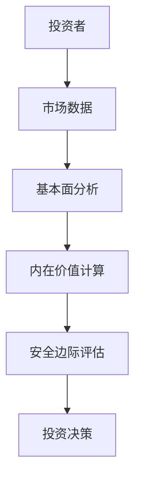

                 

# 巴菲特的投资策略：如何应对市场泡沫

> **关键词**：巴菲特、投资策略、价值投资、市场泡沫、安全边际  
> **摘要**：本文深入分析了巴菲特的投资策略，重点探讨了如何在市场泡沫中保持稳健投资。通过系统化的方法，结合技术分析和基本面分析，提出了应对市场泡沫的具体策略，包括价值投资、安全边际、逆向思维等核心概念，并通过实际案例和数学模型进行详细阐述。

---

## 正文

### 第一部分：巴菲特的投资策略概述

#### 第1章：巴菲特的投资理念与核心思想

##### 1.1 巴菲特投资策略的背景与核心概念

###### 1.1.1 投资的长期价值导向

巴菲特的投资理念以“长期价值投资”为核心，强调买入并持有优质资产，而非短期交易。他认为市场的短期波动不可预测，但优质企业的长期价值可以通过基本面分析确定。

###### 1.1.2 巴菲特投资哲学的形成与演变

巴菲特的投资哲学深受本杰明·格雷厄姆的影响，专注于寻找具有安全边际的企业，即市场价格低于其内在价值的企业。这种投资策略在20世纪70年代逐步成熟，并在之后的几十年中不断完善。

###### 1.1.3 安全边际与价值评估的核心要素

安全边际是巴菲特策略的核心要素之一，它通过比较市场价格与内在价值的差异，确保投资者在市场波动中能够获得超额收益。

##### 1.2 巴菲特投资策略的关键特征

###### 1.2.1 长期价值投资的定义与特点

长期价值投资强调对企业内在价值的深入分析，而非市场短期波动。以下是其特点：
- **长期持有**：避免频繁交易，降低交易成本。
- **价值导向**：寻找市场价格低于内在价值的企业。
- **优质企业**：选择具有强大竞争优势和良好财务状况的企业。

###### 1.2.2 集中投资与分散投资的平衡

巴菲特主张集中投资，即将大部分资金投入到少数优质企业中，但这种集中投资需要建立在对企业深刻理解的基础上。他反对盲目分散投资，认为这会稀释投资收益。

###### 1.2.3 企业基本面分析的核心要素

基本面分析是巴菲特投资策略的核心，包括对企业财务状况、盈利能力、竞争优势和管理层质量的全面评估。

##### 1.3 巴菲特投资策略的数学模型

###### 1.3.1 内在价值计算公式

巴菲特的内在价值计算公式基于现金流折现模型：

$$ V = \frac{CF}{r - g} $$

其中：
- \( V \) 为内在价值
- \( CF \) 为自由现金流
- \( r \) 为折现率
- \( g \) 为现金流增长率

###### 1.3.2 安全边际计算公式

安全边际是内在价值与市场价格之间的差额，公式为：

$$ \text{安全边际} = \text{内在价值} \times (1 - \text{安全边际率}) $$

例如，若安全边际率为20%，则市场价格应为内在价值的80%。

###### 1.3.3 企业财务状况评估的指标

以下是巴菲特常用的关键财务指标：

| 指标名称       | 定义与作用                           |
|----------------|------------------------------------|
| 每股收益（EPS） | 衡量企业盈利能力                   |
| 净利润率        | 衡量企业盈利效率                   |
| 债务与资本比    | 衡量企业财务杠杆与风险           |
| 自由现金流      | 衡量企业产生现金流的能力         |

##### 1.4 巴菲特投资策略的系统架构

---

#### 第2章：市场泡沫的形成与识别

##### 2.1 市场泡沫的定义与特征

###### 2.1.1 泡沫的经济学定义

市场泡沫是指资产价格远高于其内在价值的现象，通常由过度投机和市场情绪推动。

###### 2.1.2 市场泡沫的常见特征

| 特征        | 描述                               |
|-------------|------------------------------------|
| 高价低值     | 资产价格远高于其实际价值           |
| 投机交易     | 投资者基于市场情绪而非基本面决策   |
| 资金涌入     | 大量资金流入特定资产类别           |

##### 2.2 市场泡沫的识别指标

###### 2.2.1 市盈率（P/E）

市盈率 = 市场价格 / 每股收益

当市盈率远高于行业平均水平时，可能是市场泡沫的信号。

###### 2.2.2 市净率（P/B）

市净率 = 市场价格 / 每股净资产

当市净率远高于1时，可能表明资产被高估。

##### 2.3 应对市场泡沫的策略

###### 2.3.1 逆向思维

在市场泡沫期间，巴菲特倾向于逆向投资，买入被市场抛弃的优质资产。

###### 2.3.2 安全边际的放大

在高估值市场中，巴菲特会降低安全边际要求，寻找价格接近内在价值的资产。

---

### 第二部分：应对市场泡沫的巴菲特策略

#### 第3章：逆向思维与安全边际

##### 3.1 逆向投资的核心思想

逆向投资是指在市场恐慌时买入，在市场狂热时卖出。巴菲特认为，这种策略能够在市场底部获得廉价资产，在市场顶部减少损失。

##### 3.2 安全边际的动态调整

在市场泡沫期间，巴菲特会动态调整安全边际，以应对资产价格的波动。

#### 第4章：风险管理与组合优化

##### 4.1 风险管理的核心要素

###### 4.1.1 投资组合的分散化

尽管巴菲特倡导集中投资，但在市场波动期间，分散化可以降低整体风险。

###### 4.1.2 风险控制的数学模型

风险调整后的收益可以通过以下公式计算：

$$ R = R_{\text{市场}} \times \beta + \alpha $$

其中：
- \( R \) 为投资组合的收益
- \( \beta \) 为投资组合的beta值（系统性风险）
- \( \alpha \) 为alpha值（特异性风险）

##### 4.2 投资组合优化的步骤

1. 确定投资目标与风险承受能力
2. 选择优质资产构建投资组合
3. 定期评估并调整投资组合

---

### 第三部分：系统化投资策略

#### 第5章：系统化投资策略的实现

##### 5.1 数据处理与特征提取

###### 5.1.1 数据来源

从股票市场获取历史数据，包括收盘价、成交量、财务指标等。

###### 5.1.2 数据清洗

去除缺失值和异常值，确保数据质量。

##### 5.2 机器学习模型的构建

###### 5.2.1 模型选择

使用回归模型预测股票价格，基于财务指标和市场数据。

###### 5.2.2 模型训练

利用历史数据训练模型，评估其预测能力。

##### 5.3 策略回测与优化

###### 5.3.1 回测步骤

1. 选择回测区间
2. 计算回测收益
3. 评估策略的有效性

---

### 第四部分：实际案例分析

#### 第6章：巴菲特策略的实际应用

##### 6.1 苹果公司投资案例

分析苹果公司的财务状况和市场表现，验证巴菲特策略的有效性。

---

### 总结与展望

巴菲特的投资策略以长期价值投资为核心，强调安全边际和逆向思维。在应对市场泡沫时，投资者应结合基本面分析和系统化策略，保持理性与耐心。

---

### 作者

作者：AI天才研究院/AI Genius Institute & 禅与计算机程序设计艺术 /Zen And The Art of Computer Programming

