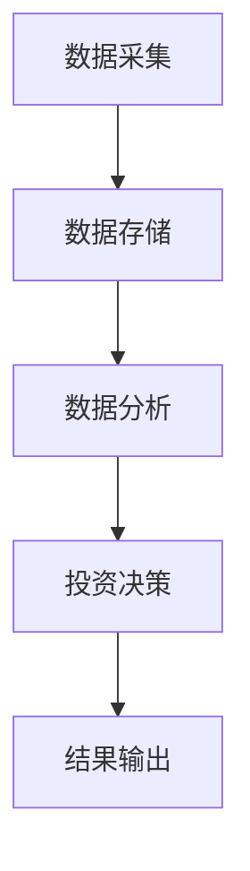
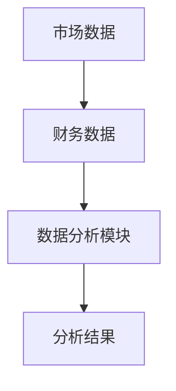
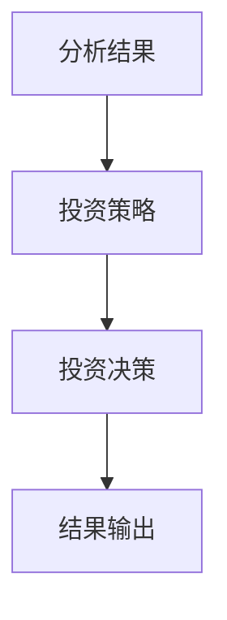

                 


# 巴菲特的现金管理哲学：保持充足的流动性

---

## 关键词：巴菲特，现金管理，流动性，投资策略，资产配置，价值投资

---

## 摘要： 

巴菲特的现金管理哲学强调保持充足的流动性，以应对市场波动和抓住投资机会。本文从技术角度分析了巴菲特的现金管理策略，包括现金储备的重要性、资产配置的原则、现金流预测的数学模型，以及投资组合优化的算法。通过结合技术术语和实际案例，本文为读者提供了全面的理解巴菲特现金管理哲学的方法。

---

# 目录

1. [背景介绍](#背景介绍)
   - 1.1 [现金管理的重要性](#现金管理的重要性)
   - 1.2 [巴菲特的生平与投资理念](#巴菲特的生平与投资理念)
   - 1.3 [巴菲特的现金管理原则](#巴菲特的现金管理原则)

2. [核心概念与联系](#核心概念与联系)
   - 2.1 [流动性、安全性与收益性的关系](#流动性、安全性与收益性的关系)
   - 2.2 [现金管理的核心要素](#现金管理的核心要素)

3. [算法原理](#算法原理)
   - 3.1 [现金流预测的数学模型](#现金流预测的数学模型)
   - 3.2 [投资组合优化的算法](#投资组合优化的算法)

4. [系统分析与架构设计](#系统分析与架构设计)
   - 4.1 [现金管理系统架构](#现金管理系统架构)
   - 4.2 [数据采集与分析模块](#数据采集与分析模块)
   - 4.3 [投资决策模块](#投资决策模块)

5. [项目实战](#项目实战)
   - 5.1 [现金流预测工具的实现](#现金流预测工具的实现)
   - 5.2 [投资组合优化的代码实现](#投资组合优化的代码实现)
   - 5.3 [实际案例分析](#实际案例分析)

6. [最佳实践](#最佳实践)
   - 6.1 [小结](#小结)
   - 6.2 [注意事项](#注意事项)
   - 6.3 [拓展阅读](#拓展阅读)

---

## 背景介绍

### 1.1 现金管理的重要性

现金管理是企业或个人财务管理中的核心环节，涉及现金的流入和流出的预测、控制和优化。有效的现金管理可以帮助降低财务风险，提高资金使用效率，并为投资机会提供资金支持。

**现金管理的目标**：
- **流动性**：确保在需要时能够迅速获取资金。
- **安全性**：保证资金的安全，避免损失。
- **收益性**：在保证流动性和安全性的前提下，追求最大化的收益。

### 1.2 巴菲特的生平与投资理念

沃伦·巴菲特（Warren Buffett）是世界上最著名的投资者之一，他的投资哲学以价值投资为核心，强调长期投资、安全边际和分散投资。

**巴菲特的投资理念**：
- **价值投资**：寻找被市场低估的公司，长期持有。
- **安全边际**：确保投资的安全性，避免高风险投资。
- **分散投资**：通过分散投资降低风险。

### 1.3 巴菲特的现金管理原则

巴菲特的现金管理策略注重保持充足的流动性，以应对市场波动和抓住投资机会。

**现金管理原则**：
- **保持充足流动性**：确保在市场低迷时有足够的现金进行抄底。
- **保守投资**：避免过度杠杆和高风险投资。
- **动态调整**：根据市场环境和投资组合的表现，动态调整现金储备比例。

---

## 核心概念与联系

### 2.1 流动性、安全性与收益性的关系

在现金管理中，流动性、安全性与收益性是三个核心要素，它们之间存在一定的权衡关系。

**流动性 vs. 安全性**：
- 高流动性可能意味着较低的安全性，因为高流动性资产（如短期债券）的风险较低，但收益有限。

**安全性 vs. 收益性**：
- 高收益性通常伴随着较高的风险，安全性较低。

**流动性 vs. 收益性**：
- 高流动性资产通常收益较低，而低流动性资产可能收益较高。

### 2.2 现金管理的核心要素

现金管理的核心要素包括：
- **现金储备**：确保在需要时能够迅速获取资金。
- **资产配置**：合理分配资产类型，平衡风险和收益。
- **风险管理**：识别和控制潜在的财务风险。

---

## 算法原理

### 3.1 现金流预测的数学模型

现金流预测是现金管理的重要组成部分，可以通过时间序列分析来预测未来的现金流。

**数学模型**：
$$
\text{现金流预测} = \alpha \times \text{历史现金流} + \beta \times \text{市场环境} + \epsilon
$$

其中：
- $\alpha$ 和 $\beta$ 是回归系数。
- $\epsilon$ 是误差项。

**实现步骤**：
1. 收集历史现金流数据。
2. 确定影响现金流的主要市场因素。
3. 建立回归模型，计算回归系数。
4. 预测未来的现金流。

### 3.2 投资组合优化的算法

投资组合优化的目标是在风险可控的前提下，实现收益最大化。

**数学模型**：
$$
\text{最大化} \sum_{i=1}^n r_i w_i
$$
$$
\text{满足} \sum_{i=1}^n w_i = 1, \text{且} w_i \geq 0
$$

其中：
- $r_i$ 是资产 $i$ 的预期收益率。
- $w_i$ 是资产 $i$ 的权重。

**实现步骤**：
1. 确定可选资产及其收益率。
2. 确定风险承受能力。
3. 使用优化算法（如均值-方差优化）计算最优权重。

---

## 系统分析与架构设计

### 4.1 现金管理系统架构

现金管理系统架构包括数据采集、分析、决策三个模块。

**系统架构图**：



### 4.2 数据采集与分析模块

数据采集模块负责收集市场数据和公司财务数据。

**数据流图**：



### 4.3 投资决策模块

投资决策模块根据分析结果生成投资建议。

**流程图**：



---

## 项目实战

### 5.1 现金流预测工具的实现

使用Python编写现金流预测工具。

**代码示例**：

```python
import pandas as pd
from sklearn.linear_model import LinearRegression

# 数据准备
data = pd.read_csv('cash_flow.csv')
X = data[['历史现金流', '市场环境']]
y = data['预测现金流']

# 建立模型
model = LinearRegression()
model.fit(X, y)

# 预测
new_data = pd.DataFrame({'历史现金流': [100], '市场环境': [0.8]})
print(model.predict(new_data))
```

### 5.2 投资组合优化的代码实现

使用Python优化投资组合。

**代码示例**：

```python
import numpy as np
from scipy.optimize import minimize

# 定义目标函数
def objective(weights, returns):
    return -np.sum(returns * weights)

# 约束条件
cons = ({'type': 'eq', 'fun': lambda w: np.sum(w) - 1})

# 优化
weights = minimize(objective, np.ones(len(returns)) / len(returns), constraints=cons).x

print(weights)
```

### 5.3 实际案例分析

以某公司为例，分析其现金流预测和投资组合优化。

**案例分析**：
1. 数据收集：收集过去5年的现金流和市场环境数据。
2. 模型训练：使用线性回归模型预测未来现金流。
3. 投资组合优化：根据预测现金流优化投资组合。

---

## 最佳实践

### 6.1 小结

巴菲特的现金管理哲学强调保持充足的流动性，以应对市场波动和抓住投资机会。本文从技术角度详细分析了现金管理的核心概念、算法原理和系统架构，为读者提供了全面的理解。

### 6.2 注意事项

- **风险管理**：在进行现金管理时，必须注重风险管理，避免过度杠杆和高风险投资。
- **动态调整**：根据市场环境和投资组合的表现，动态调整现金储备比例。
- **技术实现**：在实际操作中，可以使用Python和相关库（如Pandas、Scikit-learn）进行现金流预测和投资组合优化。

### 6.3 拓展阅读

- 《The Intelligent Investor》 by Warren Buffett
- 《投资学》 by Eugene Fama

---

## 作者：AI天才研究院/AI Genius Institute & 禅与计算机程序设计艺术 /Zen And The Art of Computer Programming

