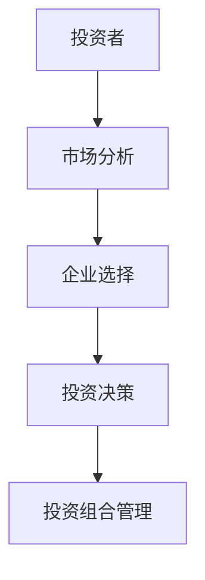
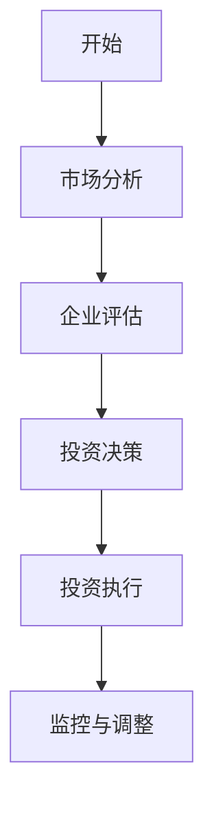

                 


# 巴菲特的现金管理策略

> 关键词：巴菲特，现金管理，投资策略，安全边际，价值投资，长期持有

> 摘要：本文深入探讨了巴菲特的现金管理策略，从他的投资哲学、核心策略到实际操作方法，结合数学模型和系统架构，提供全面的分析和实践指导。

---

## 第一部分：巴菲特投资哲学与现金管理背景

### 第1章：巴菲特的生平与投资理念

#### 1.1 巴菲特的成长经历
- 早年生活与教育背景
- 入行初期的投资理念形成

#### 1.2 巴菲特的投资哲学
- 价值投资的核心思想
- 长期投资的重要性

#### 1.3 现金管理在投资中的作用
- 现金储备的重要性
- 现金与资产配置的关系

---

## 第二部分：巴菲特的现金管理策略

### 第2章：安全边际与价值投资

#### 2.1 安全边际的概念
- 安全边际的定义
- 安全边际在投资决策中的应用

#### 2.2 价值投资的策略
- 购买廉价资产的原则
- 企业内在价值的评估方法

### 第3章：长期持有与分散投资

#### 3.1 长期持有策略
- 长期投资的优势
- 如何选择长期持有的企业

#### 3.2 分散投资的风险管理
- 分散投资的原理
- 投资组合的优化方法

---

## 第三部分：巴菲特策略的数学模型

### 第4章：企业内在价值的计算

#### 4.1 内在价值公式
$$ V = \frac{CF}{r - g} $$
其中，CF为未来现金流，r为折现率，g为增长率。

#### 4.2 安全边际的计算
$$ \text{安全边际} = \text{内在价值} - \text{市场价格} $$

### 第5章：投资组合优化的数学模型

#### 5.1 马科维茨的有效前沿理论
$$ \text{风险} = \sqrt{w^T \Sigma w} $$
其中，w为权重向量，Σ为协方差矩阵。

---

## 第四部分：系统架构与实战分析

### 第6章：投资决策的系统架构

#### 6.1 系统架构图


#### 6.2 投资决策流程


### 第7章：项目实战分析

#### 7.1 环境安装与数据准备
- 数据来源与处理方法

#### 7.2 核心代码实现
```python
def calculate_intrinsic_value(CF, r, g):
    return CF / (r - g)

CF = 1000000
r = 0.1
g = 0.05
V = calculate_intrinsic_value(CF, r, g)
print(f"企业内在价值：{V}")
```

#### 7.3 案例分析与解读
- 以某公司为例，分析内在价值与市场价格的差异

---

## 第五部分：总结与最佳实践

### 第8章：总结与启示

#### 8.1 核心策略回顾
- 价值投资与长期持有的重要性
- 安全边际的保护作用

#### 8.2 最佳实践建议
- 长期投资的重要性
- 分散投资以降低风险
- 持续学习与市场观察

### 第9章：注意事项与拓展阅读

#### 9.1 投资中的常见误区
- 过度杠杆的风险
- 情绪化决策的影响

#### 9.2 拓展阅读与学习资源
- 推荐书籍与文章
- 进一步学习的方向

---

## 作者

作者：AI天才研究院/AI Genius Institute & 禅与计算机程序设计艺术 /Zen And The Art of Computer Programming

---

通过以上目录结构，我们可以系统地学习巴菲特的现金管理策略，从理论到实践，结合数学模型和实际案例，帮助读者掌握巴菲特的投资智慧，并在实际投资中应用这些策略。

