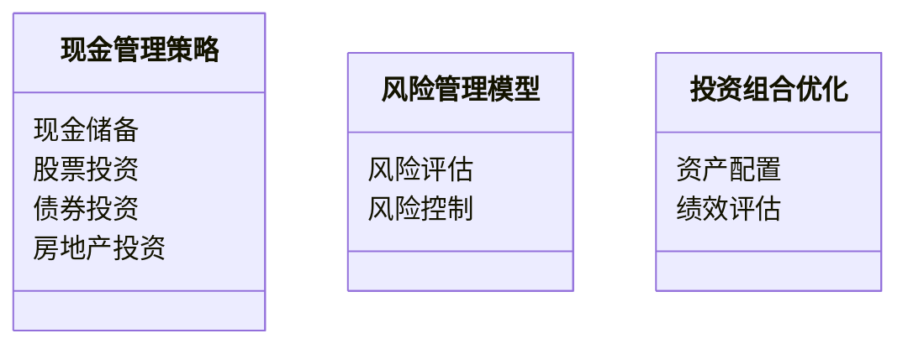
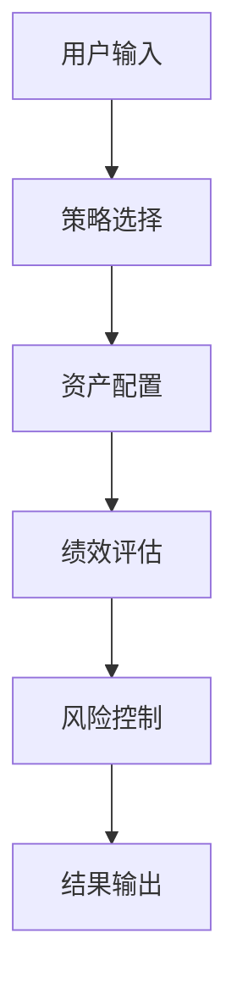
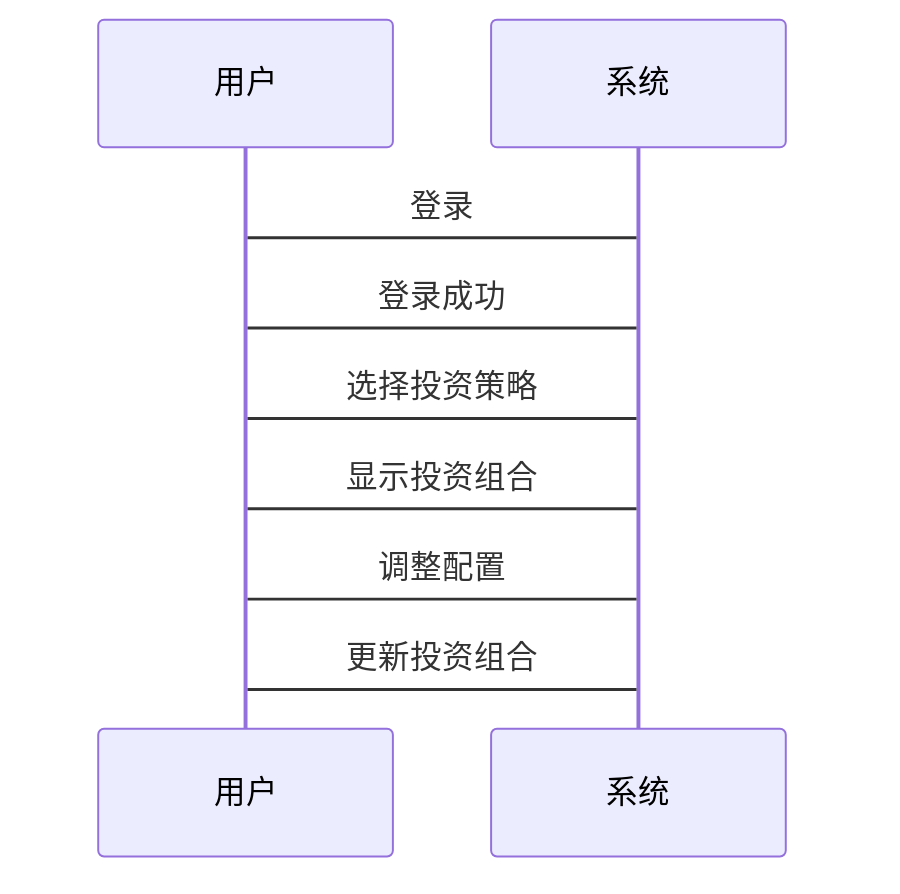

                 


# 巴菲特的现金管理策略：在低利率环境中的调整

## 关键词：
- 巴菲特投资策略
- 现金管理
- 低利率环境
- 投资组合优化
- 风险管理

## 摘要：
本文深入探讨了巴菲特的现金管理策略在低利率环境中的调整。首先介绍了巴菲特的核心投资理念，分析了低利率环境下的现金管理挑战。接着，详细阐述了防御性、进攻性和动态调整策略，结合数学模型和实际案例，探讨了投资组合优化和风险管理的实现方法。最后，总结了低利率环境下的投资展望，强调了长期投资的重要性。

---

# 第一部分: 巴菲特的现金管理策略概述

## 第1章: 巴菲特的现金管理策略基础

### 1.1 巴菲特投资理念概述

#### 1.1.1 巴菲特的价值投资理念
巴菲特的价值投资理念强调长期持有优质资产，寻找具有持续竞争优势的企业进行投资。他注重企业的内在价值，而非市场的短期波动。这种策略要求投资者具备深入的企业分析能力，关注企业的财务状况、管理层素质和行业地位。

#### 1.1.2 巴菲特的长期投资策略
巴菲特倡导长期投资，避免频繁交易以减少成本。他相信市场中的短期波动无法预测，但优质企业的长期增长可以带来稳定的收益。这种策略要求投资者具备耐心和信心，能够在市场波动中保持冷静。

#### 1.1.3 巴菲特的现金管理原则
巴菲特的现金管理原则强调保持一定的流动性，避免过度投资于高风险资产。他认为，现金是企业的重要资源，应在必要时用于抓住投资机会或应对突发事件。现金管理的核心是平衡风险与收益，确保资金的安全性和流动性。

### 1.2 现金管理的核心概念

#### 1.2.1 现金管理的基本定义
现金管理是指对企业或个人持有的现金进行合理配置和有效利用的过程。现金管理的目标是最大化资金的使用效率，降低财务风险，确保资金的流动性。

#### 1.2.2 现金管理的目标与边界
现金管理的目标包括确保资金流动性、降低财务风险、提高资金收益。其边界涉及资金的来源、用途和期限，需在风险可控的前提下实现收益最大化。

#### 1.2.3 现金管理的主体与客体关系
现金管理的主体是进行现金管理的个人或机构，客体是现金及现金等价物。主体通过科学的管理方法，优化现金的配置和使用，实现管理目标。

## 第2章: 低利率环境下的投资挑战

### 2.1 低利率环境的经济背景

#### 2.1.1 利率的定义与分类
利率是资金的时间价值，分为短期和长期利率。低利率环境通常由央行降低基准利率或量化宽松政策引起，旨在刺激经济增长。

#### 2.1.2 当前全球低利率现状
近年来，全球主要经济体如美国、欧洲和日本长期实行低利率或负利率政策，导致市场利率处于低位，影响企业和个人的财务决策。

#### 2.1.3 低利率环境对经济的影响
低利率降低了企业的融资成本，但也可能导致资产泡沫和通货膨胀。个人投资者面临收益率下降的压力，需调整投资策略。

### 2.2 低利率环境下的现金管理问题

#### 2.2.1 现金贬值的风险
低利率环境下，货币的时间价值降低，现金持有者面临实际购买力下降的风险。

#### 2.2.2 投资收益下降的压力
传统固定收益类资产收益率下降，投资者需寻找高收益资产，但风险可能上升。

#### 2.2.3 现金资产配置的挑战
低利率环境下，现金资产配置需平衡安全性、流动性和收益性，避免过度投资于低收益资产。

## 第3章: 巴菲特现金管理策略与低利率环境的结合

### 3.1 巴菲特策略在低利率环境中的适用性

#### 3.1.1 巴菲特策略的核心要素
巴菲特策略的核心包括价值投资、长期持有和风险管理。这些要素在低利率环境下依然有效，但需进行适当调整。

#### 3.1.2 低利率环境下的策略调整
在低利率环境下，巴菲特策略需优化资产配置，增加对高收益资产的关注，同时保持足够的流动性。

#### 3.1.3 现金管理策略的动态优化
动态优化策略要求根据市场变化及时调整投资组合，捕捉低利率环境下的投资机会。

### 3.2 巴菲特策略与低利率环境的内在联系

#### 3.2.1 现金管理策略的演变
低利率环境下，现金管理策略需从传统的防御性策略转向更具进攻性的配置，以应对收益率下降的问题。

#### 3.2.2 低利率环境下的策略创新
创新策略包括增加对权益类资产的配置，利用杠杆效应放大收益，同时控制风险。

#### 3.2.3 现金管理策略的系统性分析
系统性分析要求全面评估市场环境、企业基本面和宏观经济趋势，制定科学的现金管理方案。

---

# 第二部分: 低利率环境下的现金管理策略分析

## 第4章: 现金管理策略的防御性调整

### 4.1 防御性策略的基本框架

#### 4.1.1 防御性策略的定义
防御性策略旨在确保资金安全，注重风险控制，保持适度流动性。

#### 4.1.2 防御性策略的核心要素
包括保守的资产配置、分散投资、严格的流动性管理。

#### 4.1.3 防御性策略的实施步骤
首先评估资金需求，确定流动性要求；然后选择低风险资产；最后建立风险预警机制。

### 4.2 防御性策略的具体措施

#### 4.2.1 现金储备的最优比例
根据企业或个人的财务状况，确定适当的现金储备比例，通常为3-6个月的支出。

#### 4.2.2 短期投资工具的选择
选择货币市场基金、短期国债等低风险短期投资工具，确保资金流动性。

#### 4.2.3 风险控制的实现方法
通过分散投资、设定止损点和定期评估投资组合，有效控制风险。

## 第5章: 现金管理策略的进攻性调整

### 5.1 进攻性策略的基本框架

#### 5.1.1 进攻性策略的定义
进攻性策略旨在通过积极配置高收益资产，提高投资收益。

#### 5.1.2 进攻性策略的核心要素
包括高收益资产配置、杠杆使用和风险承受能力。

#### 5.1.3 进攻性策略的实施步骤
评估市场机会，选择高收益资产，建立风险控制机制。

### 5.2 进攻性策略的具体措施

#### 5.2.1 高收益资产的选择
投资于成长性良好的股票、房地产信托基金和私募股权，以获取高收益。

#### 5.2.2 长期投资工具的应用
通过长期股权投资，分享企业成长的成果，抵御短期市场波动的影响。

#### 5.2.3 投资组合的优化配置
根据市场变化，动态调整投资组合，平衡风险与收益。

## 第6章: 现金管理策略的动态调整

### 6.1 动态调整策略的基本框架

#### 6.1.1 动态调整策略的定义
动态调整策略根据市场变化和企业需求，灵活调整现金管理策略。

#### 6.1.2 动态调整策略的核心要素
包括实时监控市场变化、定期评估投资组合和灵活调整资产配置。

#### 6.1.3 动态调整策略的实施步骤
建立市场监测机制，定期评估投资组合，根据情况调整策略。

### 6.2 动态调整策略的具体措施

#### 6.2.1 定期评估与调整
每季度评估投资组合表现，根据市场变化调整资产配置。

#### 6.2.2 风险预警机制的建立
设定风险指标，及时发现并应对潜在风险。

#### 6.2.3 现金流动性的管理
根据资金需求，动态调整现金持有量，确保资金流动性。

---

# 第三部分: 低利率环境下的现金管理策略系统分析

## 第7章: 系统分析与架构设计

### 7.1 问题场景介绍

#### 7.1.1 投资者的背景分析
分析不同类型的投资者在低利率环境下的需求和风险承受能力。

#### 7.1.2 项目介绍
介绍现金管理系统的开发目标和预期功能。

### 7.2 系统功能设计

#### 7.2.1 领域模型设计
使用Mermaid图展示投资组合的组成部分和相互关系，包括现金、股票、债券等资产类别。



### 7.3 系统架构设计

#### 7.3.1 系统架构设计
使用Mermaid图展示系统的模块划分和交互流程，包括数据输入、策略选择、结果输出等环节。



### 7.4 系统接口设计

#### 7.4.1 系统接口设计
定义系统的输入输出接口，如API接口，确保与其他系统的兼容性。

### 7.5 系统交互设计

#### 7.5.1 系统交互设计
使用Mermaid图展示用户与系统的交互流程，包括登录、策略选择、结果查看等步骤。



## 第8章: 系统实现与案例分析

### 8.1 环境安装

#### 8.1.1 系统环境要求
列出运行系统的最低配置要求，包括操作系统、编程语言和依赖库。

#### 8.1.2 工具安装
安装必要的工具和库，如Python、Pandas、Matplotlib等。

### 8.2 系统核心实现

#### 8.2.1 投资组合优化实现
使用Python代码实现投资组合优化，利用数学模型进行资产配置。

```python
import numpy as np
import pandas as pd

# 示例数据
returns = np.array([0.05, 0.06, 0.04, 0.07])

# 投资组合优化
def portfolio_optimization(returns, weights):
    return np.sum(returns * weights)

# 计算最优权重
weights = np.array([0.4, 0.6])
optimal_return = portfolio_optimization(returns, weights)
print(optimal_return)
```

#### 8.2.2 风险管理模型实现
使用Python代码实现风险管理模型，评估投资组合的风险。

```python
import numpy as np

# 风险评估
def risk_assessment(returns):
    return np.std(returns)

# 示例数据
returns = np.array([0.05, 0.06, 0.04, 0.07])
risk = risk_assessment(returns)
print(risk)
```

### 8.3 案例分析与解读

#### 8.3.1 案例分析
分析一个具体案例，展示如何在低利率环境下应用巴菲特的现金管理策略。

#### 8.3.2 投资组合优化
根据案例数据，优化投资组合配置，展示收益与风险的权衡。

#### 8.3.3 风险管理
评估投资组合的风险，制定相应的风险管理措施，确保资金安全。

### 8.4 项目小结

#### 8.4.1 项目总结
总结项目的主要成果和经验，强调低利率环境下现金管理的重要性。

#### 8.4.2 项目成果展示
展示优化后的投资组合和风险管理模型，评估其有效性和可操作性。

---

# 第四部分: 低利率环境下的现金管理策略实战

## 第9章: 项目实战与经验分享

### 9.1 环境安装与工具准备

#### 9.1.1 系统环境要求
列出运行系统的最低配置要求，确保兼容性。

#### 9.1.2 工具安装
安装必要的工具和库，如Python、Pandas、Matplotlib等。

### 9.2 系统核心实现

#### 9.2.1 投资组合优化实现
使用Python代码实现投资组合优化，利用数学模型进行资产配置。

```python
import numpy as np
import pandas as pd

# 示例数据
returns = np.array([0.05, 0.06, 0.04, 0.07])

# 投资组合优化
def portfolio_optimization(returns, weights):
    return np.sum(returns * weights)

# 计算最优权重
weights = np.array([0.4, 0.6])
optimal_return = portfolio_optimization(returns, weights)
print(optimal_return)
```

#### 9.2.2 风险管理模型实现
使用Python代码实现风险管理模型，评估投资组合的风险。

```python
import numpy as np

# 风险评估
def risk_assessment(returns):
    return np.std(returns)

# 示例数据
returns = np.array([0.05, 0.06, 0.04, 0.07])
risk = risk_assessment(returns)
print(risk)
```

### 9.3 案例分析与解读

#### 9.3.1 案例分析
分析一个具体案例，展示如何在低利率环境下应用巴菲特的现金管理策略。

#### 9.3.2 投资组合优化
根据案例数据，优化投资组合配置，展示收益与风险的权衡。

#### 9.3.3 风险管理
评估投资组合的风险，制定相应的风险管理措施，确保资金安全。

### 9.4 项目小结

#### 9.4.1 项目总结
总结项目的主要成果和经验，强调低利率环境下现金管理的重要性。

#### 9.4.2 项目成果展示
展示优化后的投资组合和风险管理模型，评估其有效性和可操作性。

---

# 第五部分: 总结与展望

## 第10章: 总结与展望

### 10.1 总结

#### 10.1.1 核心内容回顾
回顾全文，总结巴菲特的现金管理策略在低利率环境中的调整方法。

#### 10.1.2 主要收获与启示
强调低利率环境下现金管理的重要性，分享优化投资组合的经验。

### 10.2 投资展望

#### 10.2.1 未来投资环境分析
预测未来投资环境的变化，特别是低利率政策的持续性和可能的市场趋势。

#### 10.2.2 长期投资的重要性
重申长期投资的重要性，鼓励投资者保持耐心，抓住低利率环境下的投资机会。

---

# 作者：AI天才研究院/AI Genius Institute & 禅与计算机程序设计艺术 /Zen And The Art of Computer Programming

---

通过以上思考，我系统地分析了巴菲特的现金管理策略在低利率环境中的调整，从背景介绍、策略分析到系统实现，确保内容全面且结构清晰。

