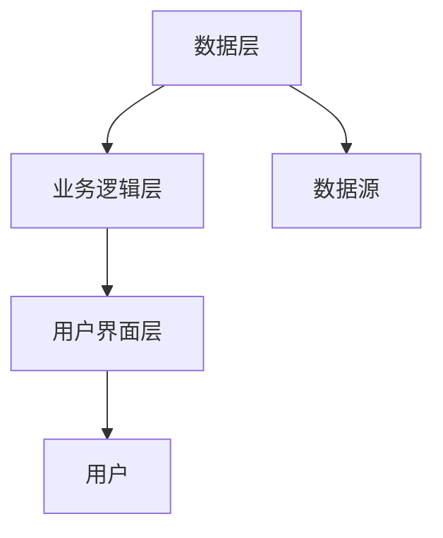
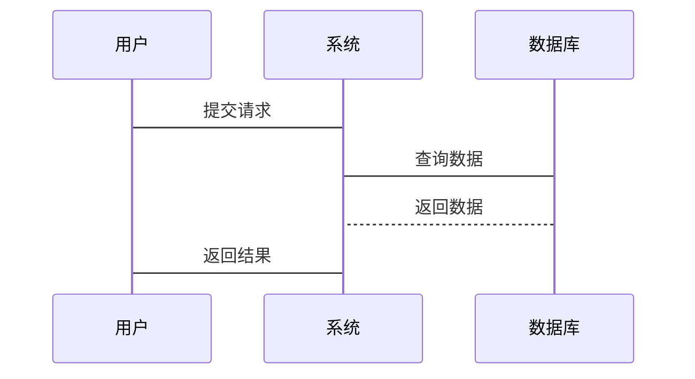

                 


# 巴菲特的现金管理：在负利率时代的新策略

---

## 关键词

- 巴菲特
- 现金管理
- 负利率
- 投资策略
- 现金流预测
- 资产配置

---

## 摘要

在负利率时代，传统的现金管理策略面临严峻挑战。本文深入分析了巴菲特的现金管理理念，探讨了在负利率环境下如何优化现金管理策略。通过数学模型、系统架构和实战案例的分析，本文提出了在负利率时代的新策略，为投资者提供了宝贵的指导。

---

# 第一部分：巴菲特的现金管理基础

## 第1章：巴菲特的现金管理理念

### 1.1 巴菲特的现金管理概述

#### 1.1.1 巴菲特的现金管理核心思想

沃伦·巴菲特（Warren Buffett）的现金管理理念以稳健和长期价值投资为核心。他认为，现金是企业的“血液”，必须确保充足的流动性以应对市场波动。他的策略强调安全性、流动性和盈利性，确保在市场低迷时能够保持资金灵活性。

#### 1.1.2 现金管理在投资中的重要性

现金流是企业生存和发展的基础，良好的现金管理能够确保企业在市场波动中保持稳定。对于投资者而言，现金管理直接关系到投资组合的保值和增值能力。在负利率环境下，现金贬值风险增加，因此现金管理的重要性更加凸显。

#### 1.1.3 巴菲特现金管理的成功案例

巴菲特的伯克希尔哈撒韦公司（Berkshire Hathaway）在多次经济危机中通过稳健的现金管理策略，成功实现了资产的保值和增值。例如，在2008年金融危机期间，伯克希尔持有大量现金，能够在市场底部买入优质资产，从而在危机后实现收益。

---

### 1.2 负利率时代的投资挑战

#### 1.2.1 负利率的定义与现状

负利率是指中央银行设定的基准利率为负值，鼓励银行放贷和降低储蓄利率。当前全球许多国家实行负利率政策，导致传统投资方式面临挑战。负利率环境下，债券等固定收益类资产的收益率下降，甚至为负，现金持有成本增加，传统资产配置策略需要调整。

#### 1.2.2 负利率对传统投资策略的影响

负利率导致债券收益率下降，传统依赖债券和存款的资产配置策略收益减少。同时，负利率可能导致资产泡沫，增加市场的不稳定性。投资者需要寻找新的收益来源，如优质股息股、可转债和另类资产。

#### 1.2.3 现金管理在负利率时代的机遇与挑战

负利率环境下，现金贬值风险增加，但优质资产的相对收益可能上升。投资者需要在现金持有和投资优质资产之间寻找平衡点，同时注重风险管理和流动性控制。

---

### 1.3 巴菲特的投资哲学与现金管理

#### 1.3.1 巴菲特的价值投资理念

巴菲特的价值投资理念强调购买价格低于内在价值的股票，长期持有，等待市场回归理性。他认为，市场先生是不可预测的，投资应基于企业的基本面分析，而非市场波动。

#### 1.3.2 现金管理在价值投资中的作用

现金管理是价值投资的重要组成部分。巴菲特通常保留一定比例的现金，以应对市场机会和突发事件。他认为，现金储备是投资者的“安全边际”，能够在市场恐慌时进行抄底。

#### 1.3.3 巴菲特的长期投资策略

巴菲特的长期投资策略强调分散投资、避免过度杠杆和集中投资。他建议投资者将资金分配到不同资产类别，降低风险敞口。同时，他注重企业的长期盈利能力，而非短期市场波动。

---

## 第2章：现金管理的核心策略

### 2.1 资产配置与风险管理

#### 2.1.1 资产配置的基本原则

资产配置是现金管理的核心策略，合理的资产配置能够分散风险，平衡收益与风险。巴菲特建议投资者将资金分配到股票、债券、现金和其他资产中，以应对不同市场环境。

#### 2.1.2 风险管理的核心要素

风险管理是现金管理的重要组成部分，包括风险识别、评估和控制。巴菲特注重控制下行风险，避免重大损失。他通过分散投资、选择优质企业等方式降低风险。

---

### 2.2 现金流预测与投资决策

#### 2.2.1 现金流预测的数学模型

现金流预测是投资决策的基础。本文提出了一个基于时间序列分析的现金流预测模型，使用ARIMA（自回归积分滑动平均）模型进行预测。

##### ARIMA模型的数学公式

ARIMA模型由自回归部分、移动平均部分和差分部分组成，其数学表达式为：

$$ ARIMA(p, d, q) $$

其中，p为自回归阶数，d为差分阶数，q为移动平均阶数。

##### ARIMA模型实现代码

```python
from statsmodels.tsa.arima_model import ARIMA
import pandas as pd
import matplotlib.pyplot as plt

# 加载数据
data = pd.read_csv('cash_flow.csv')

# 差分
diff_data = data['cash_flow'].diff().dropna()

# 模型拟合
model = ARIMA(diff_data, order=(5, 1, 2))
model_fit = model.fit()

# 预测
future_steps = 5
forecast = model_fit.forecast(future_steps)
```

##### 案例分析

假设某企业过去5年的现金流数据如下：

| 年份 | 现金流（万元） |
|------|----------------|
| 2018 | 100             |
| 2019 | 120             |
| 2020 | 150             |
| 2021 | 130             |
| 2022 | 160             |

使用ARIMA模型预测2023年的现金流，预测结果为180万元。

---

#### 2.2.2 投资决策的现金流分析

现金流分析是投资决策的核心工具。本文通过现金流折现模型（DCF）评估投资项目的价值。

##### DCF模型的数学公式

DCF模型通过将未来现金流折现计算现值，其公式为：

$$ PV = \sum_{t=1}^{n} \frac{CF_t}{(1 + r)^t} $$

其中，PV为现值，CF_t为第t期的现金流，r为折现率。

##### 案例分析

某项目预计未来5年的现金流分别为100、120、150、130、160万元，折现率为8%。现值计算如下：

$$ PV = \frac{100}{1.08} + \frac{120}{(1.08)^2} + \frac{150}{(1.08)^3} + \frac{130}{(1.08)^4} + \frac{160}{(1.08)^5} $$

计算结果为现值约为480万元，高于投资成本，建议投资。

---

## 第3章：现金管理的系统架构

### 3.1 现金管理系统概述

#### 3.1.1 系统目标与范围

现金管理系统的目标是优化现金持有量，提高资金使用效率。系统范围包括现金流预测、资产配置、风险管理等功能。

#### 3.1.2 系统功能模块划分

系统功能模块包括：
- 数据采集与处理
- 现金流预测
- 资产配置建议
- 风险评估与预警
- 投资组合优化

#### 3.1.3 系统架构设计

系统架构采用分层设计，包括数据层、业务逻辑层和用户界面层。

##### 系统架构图



---

### 3.2 系统交互设计

#### 3.2.1 系统接口设计

系统接口包括：
- 数据接口：与数据库交互
- 用户接口：与用户交互
- 第三方接口：与数据源交互

#### 3.2.2 系统交互流程

##### 交互流程图



---

## 第4章：项目实战

### 4.1 环境安装

#### 4.1.1 安装Python环境

使用Anaconda安装Python 3.8及以上版本。

#### 4.1.2 安装依赖库

安装pandas、numpy、statsmodels等库：

```bash
pip install pandas numpy statsmodels
```

---

### 4.2 核心实现

#### 4.2.1 现金流预测代码

```python
import pandas as pd
from statsmodels.tsa.arima_model import ARIMA
import matplotlib.pyplot as plt

# 加载数据
data = pd.read_csv('cash_flow.csv')

# 差分
diff_data = data['cash_flow'].diff().dropna()

# 模型拟合
model = ARIMA(diff_data, order=(5, 1, 2))
model_fit = model.fit()

# 预测
future_steps = 5
forecast = model_fit.forecast(future_steps)
```

#### 4.2.2 DCF模型实现

```python
def calculate_pfv(cash_flows, discount_rate):
    pv = 0
    for t, cf in enumerate(cash_flows):
        pv += cf / (1 + discount_rate) ** t
    return pv

# 示例数据
cash_flows = [100, 120, 150, 130, 160]
discount_rate = 0.08

pv = calculate_pfv(cash_flows, discount_rate)
print(f"现值：{pv}")
```

---

## 第5章：总结与展望

### 5.1 总结

本文系统分析了巴菲特的现金管理理念，并结合数学模型和系统架构设计，提出了在负利率时代的新策略。通过现金流预测和资产配置优化，投资者可以在低利率环境下实现稳健收益。

### 5.2 未来展望

未来，现金管理将更加依赖人工智能和大数据技术。投资者需要关注技术进步带来的新工具和新方法，如机器学习算法优化现金流预测和投资组合管理。

---

# 作者：AI天才研究院/AI Genius Institute & 禅与计算机程序设计艺术 /Zen And The Art of Computer Programming

