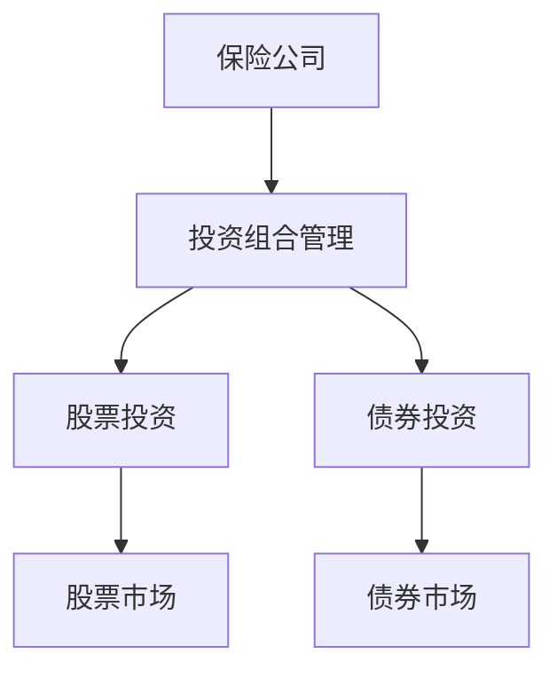
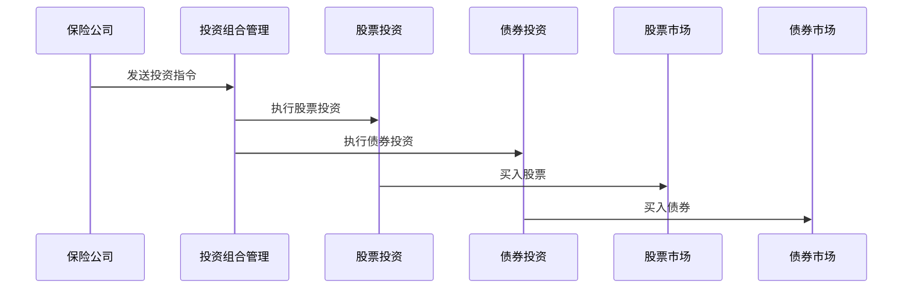

                 


# 巴菲特的看家本领：保险浮存金的魔力

## 关键词：
- 巴菲特
- 保险浮存金
- 股东权益
- 资金运作
- 长期投资

## 摘要：
本文深入探讨了巴菲特利用保险浮存金创造投资奇迹的核心机制，揭示其在保险业务中的独特作用和价值创造方式。通过详细分析保险浮存金的形成、运作机制、风险管理及护城河构建，结合实际案例，展示其如何通过低成本资金运作实现长期投资价值。

---

# 第1章: 保险浮存金的概念与背景

## 1.1 保险浮存金的定义
### 1.1.1 保险浮存金的定义
保险浮存金（Float）是保险公司收取的保费与实际赔付之间的时间差所产生的资金。这部分资金在未被赔付前，保险公司可以用于投资，创造额外收益。

$$
\text{保险浮存金} = \text{保费收入} - \text{赔付支出}
$$

### 1.1.2 保险浮存金的来源与特点
保险浮存金主要来源于保费收入，其特点是：
- **低成本**：保险公司收取的保费通常低于投资收益。
- **长期性**：浮存金的使用期限较长，适合长期投资。
- **波动性**：受保险业务波动影响，金额可能波动。

### 1.1.3 保险浮存金在保险业务中的作用
- **资金池**：为保险公司提供大量可投资资金。
- **投资收益**：通过投资优质资产，增加公司利润。
- **竞争优势**：低成本资金使保险公司更具竞争力。

## 1.2 巴菲特与保险浮存金的关联
### 1.2.1 巴菲特的保险投资策略
巴菲特通过控股保险公司（如伯克希尔 Hathaway），利用浮存金进行长期投资，实现资本增值。

### 1.2.2 巴菲特如何利用保险浮存金创造价值
- **低成本资金**：浮存金作为低成本资金来源，用于投资优质资产。
- **长期投资**：利用浮存金的长期性，投资股票、债券等资产，获取超额收益。

### 1.2.3 保险浮存金在巴菲特投资组合中的地位
浮存金是巴菲特投资的重要资金来源，为其提供了大量低成本资金，支持其多元化投资。

## 1.3 保险浮存金的重要性
### 1.3.1 保险浮存金对保险公司财务健康的影响
- **增强资本实力**：通过投资收益，增强公司资本实力。
- **提高盈利能力**：投资收益增加公司利润。

### 1.3.2 保险浮存金在经济周期中的表现
在经济下行周期，浮存金的投资收益可以弥补保费收入的下降，保持公司稳定。

### 1.3.3 保险浮存金对股东价值的贡献
- **股东权益增加**：浮存金的投资收益直接增加股东权益。
- **股东价值提升**：通过长期投资，提升公司整体价值。

---

# 第2章: 保险浮存金的核心机制

## 2.1 保险浮存金的运作机制
### 2.1.1 保险浮存金的形成过程
1. **保费收入**：客户支付保费，形成浮存金。
2. **投资收益**：将浮存金投资于优质资产，获取收益。
3. **再投资**：将投资收益再投资，滚雪球式增长。

### 2.1.2 保险浮存金的再投资过程
- **资金池**：保费收入形成资金池。
- **投资决策**：选择优质资产进行投资。
- **资本增值**：投资收益再投资，实现资本增值。

### 2.1.3 保险浮存金的收益分配机制
- **投资收益**：部分用于公司运营，部分分配给股东。

## 2.2 保险浮存金的资金来源
### 2.2.1 保险保费收入
- **主要来源**：保费是浮存金的主要来源。
- **稳定性**：保费收入相对稳定，为浮存金提供持续资金。

### 2.2.2 保险准备金
- **定义**：保险公司为赔付准备的 funds。
- **作用**：部分准备金可用于投资，增加浮存金规模。

### 2.2.3 其他资金来源
- **再保险业务**：通过再保险业务获取额外资金。
- **债务融资**：在必要时，公司可通过借款增加浮存金。

## 2.3 保险浮存金的投资策略
### 2.3.1 巴菲特的投资理念
- **价值投资**：投资具有长期竞争优势的公司。
- **分散投资**：通过多元化投资降低风险。

### 2.3.2 保险浮存金的投资组合
- **股票投资**：投资优质股票，获取股息和资本增值。
- **债券投资**：投资国债和高评级企业债，保证收益。

### 2.3.3 保险浮存金的风险管理
- **分散投资**：避免过度集中。
- **严格选股**：选择财务健康、管理优秀的公司。

## 2.4 保险浮存金的核心竞争力
### 2.4.1 保险浮存金的低成本优势
- **低融资成本**：保费收入作为资金来源，成本较低。
- **长期资金**：适合长期投资，获取更高收益。

### 2.4.2 保险浮存金的长期性优势
- **稳定投资**：长期资金适合投资股票等长期资产。
- **持续增长**：通过复利效应，实现财富增长。

### 2.4.3 保险浮存金的规模效应
- **资金池效应**：规模越大，投资收益越高。
- **成本分摊**：规模效应降低单位成本。

---

# 第3章: 保险浮存金的风险管理与护城河

## 3.1 保险浮存金的风险管理
### 3.1.1 保险浮存金的风险来源
- **市场风险**：投资资产价格波动。
- **流动性风险**：浮存金可能无法及时变现。
- **信用风险**：债券发行人违约。

### 3.1.2 保险浮存金的风险评估与控制
- **风险评估**：定期评估投资组合的风险。
- **风险控制**：设定止损点，分散投资。

### 3.1.3 巴菲特的风险管理策略
- **保守投资**：避免高风险投资。
- **严格选股**：选择财务健康的企业。

## 3.2 保险浮存金的护城河
### 3.2.1 保险浮存金的竞争优势
- **低成本资金**：保费收入成本低。
- **长期资金**：适合长期投资。

### 3.2.2 保险浮存金的市场地位
- **品牌优势**：巴菲特的品牌效应吸引客户。
- **规模效应**：大公司更具成本优势。

### 3.2.3 保险浮存金的创新优势
- **产品创新**：开发创新型保险产品，吸引客户。
- **服务创新**：提供优质客户服务，增强客户忠诚度。

---

# 第4章: 保险浮存金的数学模型与分析

## 4.1 保险浮存金的数学模型
### 4.1.1 现值计算
$$
PV = \frac{FV}{(1 + r)^n}
$$
其中，PV为现值，FV为终值，r为折现率，n为时间。

### 4.1.2 终值计算
$$
FV = PV \times (1 + r)^n
$$

### 4.1.3 内在价值计算
$$
\text{内在价值} = \sum_{t=1}^{n} \frac{CF_t}{(1 + r)^t}
$$
其中，CF_t为第t年的现金流。

## 4.2 巴菲特的浮存金公式
### 4.2.1 浮存金的年化收益率
$$
\text{年化收益率} = \left(1 + \frac{\text{投资收益}}{\text{浮存金}}\right)^{1/n} - 1
$$

### 4.2.2 浮存金的复利效应
$$
\text{复利收益} = \text{浮存金} \times (1 + r)^n
$$

---

# 第5章: 保险浮存金的系统分析与架构设计

## 5.1 保险公司的业务流程
- **保费收入**：客户支付保费，形成浮存金。
- **投资决策**：根据市场情况，决定投资方向。
- **投资管理**：管理投资组合，监控风险。
- **赔付支出**：使用浮存金支付赔付。

## 5.2 领域模型


## 5.3 系统架构


## 5.4 系统接口设计
- **保费收入接口**：接收保费收入数据。
- **投资接口**：处理投资指令。
- **赔付接口**：处理赔付支出。

## 5.5 系统交互


---

# 第6章: 保险浮存金的项目实战

## 6.1 环境配置
- **工具**：Python、Excel、Matplotlib。
- **数据来源**：历史保费收入、投资收益数据。

## 6.2 核心代码实现
```python
import matplotlib.pyplot as plt

# 示例代码：计算浮存金的年化收益率
def calculate_roe(initial, final, years):
    return (final / initial) ** (1 / years) - 1

initial = 1000000  # 初始浮存金
final = 1500000    # 最终浮存金
years = 5          # 年数

ro

