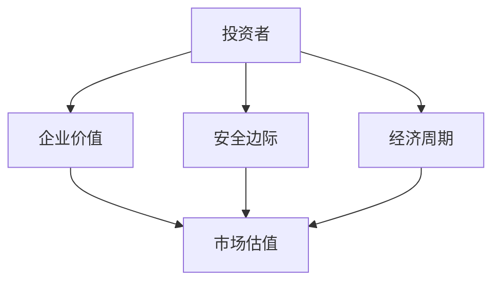
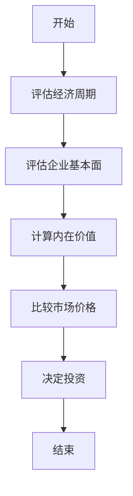
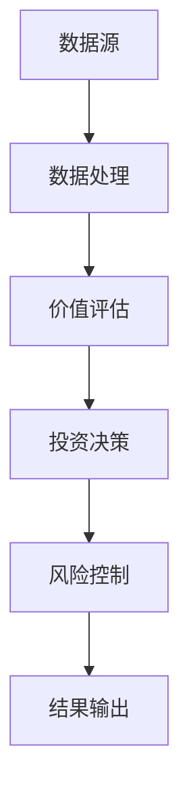

                 


# 巴菲特的经济周期投资策略

## 关键词：巴菲特、投资策略、经济周期、价值投资、安全边际、投资系统

## 摘要：
本文深入分析巴菲特的投资理念，结合经济周期波动，构建系统化的投资策略框架。通过详细阐述巴菲特的价值投资策略，安全边际概念，以及如何在不同经济周期阶段应用这些策略，本文旨在为投资者提供一套科学的投资方法论。结合实际案例分析，系统设计，数学模型和代码实现，本文为投资者在经济波动中制定合理投资策略提供指导。

---

## 第1章：经济周期与投资策略概述

### 1.1 经济周期的定义与特征

#### 1.1.1 经济周期的基本概念
经济周期是指经济活动在长时间内呈现的周期性波动，通常包括繁荣、衰退、萧条和复苏四个阶段。每个阶段的特点和市场表现不同，对投资者的决策产生重要影响。

#### 1.1.2 经济周期的阶段划分
经济周期通常分为四个阶段：
- 繁荣：经济高速增长，市场活跃，企业盈利上升。
- 衰退：经济增长放缓，企业盈利下降，市场波动加剧。
- 萧条：经济低迷，企业倒闭，失业率上升。
- 复苏：经济逐渐恢复，企业盈利回升，市场逐步稳定。

#### 1.1.3 经济周期对投资的影响
在不同的经济周期阶段，投资策略需要灵活调整。例如，在衰退期，防御性投资更为稳妥；在复苏期，进攻性投资可能带来更高收益。

### 1.2 巴菲特投资理念的核心要素

#### 1.2.1 价值投资的定义
价值投资是一种以内在价值为导向的投资方法，强调以低于内在价值的价格买入优质资产。巴菲特强调长期投资，注重企业的基本面分析。

#### 1.2.2 巴菲特的投资哲学
- 长期投资：避免频繁交易，降低交易成本。
- 买入优秀企业：选择具有强大竞争优势的企业。
- 安全边际：以低于内在价值的价格买入，降低投资风险。

#### 1.2.3 巴菲特投资策略的边界与外延
巴菲特的投资策略不仅限于股票，还包括债券、房地产等多种资产，注重资产配置和风险分散。

### 1.3 巴菲特经济周期投资策略的背景

#### 1.3.1 经济周期波动对投资决策的影响
经济周期的波动直接影响市场的估值和企业的盈利，投资者需要根据市场环境调整投资策略。

#### 1.3.2 巴菲特策略的适用场景
巴菲特的策略尤其适用于经济衰退和复苏阶段，强调在市场恐慌时寻找低估资产，在市场过热时保持谨慎。

#### 1.3.3 巴菲特策略与其他投资策略的对比
与技术分析和趋势投资不同，巴菲特的价值投资注重基本面分析，强调长期持有和安全边际。

---

## 第2章：巴菲特投资理念的核心概念与联系

### 2.1 核心概念原理

#### 2.1.1 价值投资的核心原理
价值投资的核心在于寻找市场定价低于内在价值的资产。巴菲特强调企业的竞争优势和财务健康状况。

#### 2.1.2 安全边际的定义与作用
安全边际是投资价格与内在价值之间的差距，用于降低投资风险。例如，如果内在价值为100，买入价格为80，安全边际为20%。

#### 2.1.3 股东权益与企业价值的关系
股东权益代表企业的净资产，企业价值包括股权和债权的价值。巴菲特注重企业的净资产收益率（ROE）和净利润增长率。

### 2.2 核心概念属性特征对比

| 概念       | 特征                           |
|------------|--------------------------------|
| 价值投资   | 基于内在价值，长期持有         |
| 安全边际   | 投资价格低于内在价值           |
| 股东权益   | 企业净资产，影响企业价值       |

### 2.3 ER实体关系图架构


---

## 第3章：巴菲特投资策略的算法原理

### 3.1 价值评估模型

#### 3.1.1 简单价值评估公式
$$ \text{内在价值} = \frac{\text{现金流}}{\text{折现率}} $$

#### 3.1.2 安全边际计算
$$ \text{安全边际} = \text{内在价值} - \text{市场价格} $$

### 3.2 投资组合优化策略

#### 3.2.1 简单投资组合优化
$$ \text{最优组合} = \argmin_w \left( w^T \Sigma w + \lambda \beta^T w \right) $$

其中，$w$为权重向量，$\Sigma$为协方差矩阵，$\lambda$为惩罚因子，$\beta$为目标收益向量。

### 3.3 投资决策算法流程图


---

## 第4章：系统分析与架构设计

### 4.1 项目介绍
构建一个基于巴菲特投资策略的决策支持系统，帮助投资者在不同经济周期阶段制定投资策略。

### 4.2 系统功能设计

#### 4.2.1 数据收集模块
- 数据来源：市场数据、企业财务报表。
- 数据类型：股票价格、收益、市盈率、市净率。

#### 4.2.2 价值评估模块
- 使用价值评估模型计算内在价值。
- 结合经济周期调整评估参数。

#### 4.2.3 风险控制模块
- 计算投资组合的风险敞口。
- 设置止损和止盈点。

#### 4.2.4 系统架构图


---

## 第5章：项目实战与案例分析

### 5.1 环境安装
- Python 3.8+
- 数据分析库：pandas, numpy
- 可视化库：matplotlib, seaborn

### 5.2 核心实现代码

```python
import pandas as pd
import numpy as np

def calculate_intrinsic_value(enterprise_value, earnings):
    return enterprise_value / earnings

def calculate_margin_of_safety(market_price, intrinsic_value):
    return (intrinsic_value - market_price) / intrinsic_value * 100

# 示例数据
market_price = 100
enterprise_value = 150
earnings = 50

intrinsic_value = calculate_intrinsic_value(enterprise_value, earnings)
margin_of_safety = calculate_margin_of_safety(market_price, intrinsic_value)

print(f"内在价值: {intrinsic_value}")
print(f"安全边际: {margin_of_safety}%")
```

### 5.3 实际案例分析
以2008年金融危机后的复苏阶段为例，分析巴菲特如何通过买入低估资产实现收益。

---

## 第6章：总结与展望

### 6.1 总结
巴菲特的经济周期投资策略强调长期价值投资和安全边际，适用于不同经济周期阶段。

### 6.2 优缺点
- 优点：风险控制能力强，长期收益稳定。
- 缺点：需要较高的市场分析能力，适合长期投资者。

### 6.3 展望
随着市场环境的变化，投资者需要灵活调整策略，结合新技术和工具优化投资决策。

### 6.4 最佳实践 tips
- 定期评估投资组合。
- 保持对经济周期的敏感性。
- 学习巴菲特的投资案例和教训。

---

## 作者：AI天才研究院 & 禅与计算机程序设计艺术

