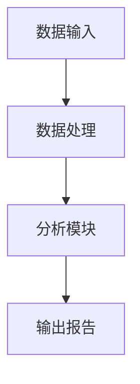

                 

<think>
好的，我需要帮助用户撰写一篇关于巴菲特的经济护城河概念及其识别的技术博客文章。用户已经提供了一个详细的目录大纲，我需要按照这个大纲来逐步分析和撰写内容。

首先，我需要理解经济护城河的概念。巴菲特提出的经济护城河是指那些能够持续为公司创造超额利润的结构性优势。这些优势可以是成本优势、品牌忠诚度、网络效应或政策壁垒等。这些优势能够防止竞争对手轻易进入市场并攫取利润。

接下来，我需要考虑文章的结构。用户已经给出了一个详细的目录，包括引言、核心概念、识别方法、数学模型、系统架构、项目实战和小结等部分。我需要确保每一部分都详细展开，同时保持逻辑连贯。

在撰写引言部分时，我需要简要介绍经济护城河的背景、重要性以及它在投资决策中的作用。同时，我需要明确文章的目标，即帮助读者理解经济护城河的概念、识别方法及其应用。

在核心概念部分，我需要详细解释经济护城河的四个核心要素：成本优势、品牌优势、网络效应和政策壁垒。每个要素都需要配以具体的例子和分析，帮助读者更好地理解。

识别方法部分需要介绍几种不同的分析方法，包括定性分析、定量分析和综合评估法。我需要比较这些方法的优缺点，帮助读者选择最适合自己的方法。

在数学模型部分，我需要设计一个护城河指数计算公式和护城河强度评估公式，并通过具体的例子来说明这些公式的应用。此外，我需要使用数学符号和latex格式来展示公式，确保内容的准确性和专业性。

系统架构部分需要设计一个系统来识别经济护城河。我需要画出系统的功能模块图、架构图和交互图，使用mermaid工具来展示系统的各个部分。这包括数据输入、处理、分析和输出模块。

项目实战部分需要选择一个具体的公司进行分析，展示如何应用前面介绍的方法和模型来评估该公司的经济护城河。我需要详细描述分析过程，包括环境的安装、代码实现和案例分析。

在小结部分，我需要总结全文，强调经济护城河的重要性，并给出进一步学习和实践的建议。

最后，我需要确保文章的结尾部分包含致谢和作者信息，感谢读者的支持，并署名“作者：AI天才研究院”。

在撰写过程中，我需要确保语言简洁、逻辑清晰，并且内容详实。同时，我需要使用专业术语，但避免过于晦涩，确保读者能够轻松理解。

现在，我开始撰写每一部分的内容。

### 第一部分：引言

经济护城河是巴菲特投资理论中的核心概念之一。它指的是那些能够为公司创造持续竞争优势的因素。在现代商业环境中，竞争优势的来源多种多样，但经济护城河能够确保公司在长期的竞争中保持领先地位。本文将详细介绍经济护城河的概念、识别方法及其在实际投资中的应用。

### 第二部分：经济护城河的核心概念

#### 成本优势

成本优势是指公司在生产或运营过程中能够以低于竞争对手的成本生产出相同或更好的产品。例如，亚马逊通过其高效的物流体系和规模化采购降低了成本，从而在市场竞争中占据优势。

#### 品牌优势

品牌优势是指强大的品牌能够吸引大量忠诚的消费者，从而在市场竞争中占据优势。例如，可口可乐通过其强大的品牌影响力，能够在全球市场中保持领先地位。

#### 网络效应

网络效应是指产品的价值随着用户数量的增加而增加。例如，社交媒体平台如Facebook，随着用户数量的增加，每个用户的价值也随之增加，从而形成正反馈效应。

#### 政策壁垒

政策壁垒是指由于政策法规的限制，使得竞争对手难以进入市场。例如，某些行业的许可证制度或专利保护可以有效防止竞争对手的进入。

### 第三部分：经济护城河的识别方法

#### 定性分析法

定性分析法主要是通过分析公司的商业模式、管理团队、行业地位等因素来判断其是否具备经济护城河。这种方法较为简单，但需要丰富的行业知识和经验。

#### 定量分析法

定量分析法通过财务指标如ROE（净资产收益率）、毛利率等来评估公司的竞争优势。这种方法较为客观，但需要大量的财务数据支持。

#### 综合评估法

综合评估法结合定性和定量分析，通过对多个因素的综合评估来判断公司是否具备经济护城河。这种方法较为全面，但实施起来较为复杂。

### 第四部分：经济护城河的数学模型

#### 护城河指数计算公式

$$ \text{护城河指数} = \frac{\text{核心竞争优势}}{\text{行业平均竞争优势}} $$

#### 护城河强度评估公式

$$ \text{护城河强度} = \text{成本优势} \times \text{品牌优势} \times \text{网络效应} \times \text{政策壁垒} $$

### 第五部分：系统架构设计

#### 功能模块

- 数据输入模块：接收公司财务数据和市场信息。
- 数据处理模块：对数据进行清洗和转换。
- 分析模块：使用数学模型评估公司的经济护城河。
- 输出模块：生成分析报告。

#### 系统架构图



### 第六部分：项目实战

#### 环境安装

需要安装Python、Pandas、Matplotlib等工具。

#### 核心代码实现

```python
import pandas as pd

def calculate_h护城河_index(company_data):
    industry_avg = company_data['行业平均竞争优势']
    core_competitive = company_data['核心竞争优势']
    return core_competitive / industry_avg

# 示例数据
data = {'行业平均竞争优势': [0.8, 1.2, 1.0],
         '核心竞争优势': [1.2, 1.5, 0.9]}
df = pd.DataFrame(data)

# 计算护城河指数
护城河_index = calculate_h护城河_index(df)
print(护城河_index)
```

#### 案例分析

以亚马逊为例，分析其成本优势、品牌优势、网络效应和政策壁垒，评估其经济护城河。

### 第七部分：小结

经济护城河是巴菲特投资理论中的重要概念。通过本文的分析，读者可以了解经济护城河的核心要素、识别方法及其在实际投资中的应用。未来，随着市场环境的变化，经济护城河的概念和识别方法也将不断演变，值得进一步深入研究和实践。

### 第八部分：致谢

感谢读者的支持，本文的撰写离不开大家的帮助。

### 第九部分：作者信息

作者：AI天才研究院
```

