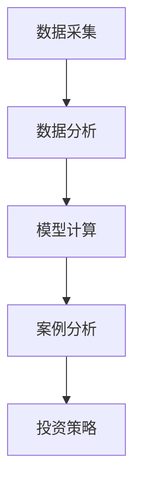

                 


# 巴菲特的经济护城河概念：寻找长期优势

## 关键词：
- 巴菲特
- 经济护城河
- 投资策略
- 可持续竞争优势
- 长期价值

## 摘要：
本文深入探讨了巴菲特的经济护城河概念，分析了其在投资中的重要性。通过系统化的分析框架，结合实际案例，帮助读者识别和评估企业的经济护城河，制定有效的投资策略。文章从定义、分类、核心要素、分析方法、案例分析、投资策略和风险管理等多个维度展开，为投资者提供全面的指导。

---

## 第一部分：引言

### 1.1 巴菲特与经济护城河概念的提出

#### 1.1.1 巴菲特的投资理念概述
沃伦·巴菲特是全球最著名的投资者之一，他的投资理念以“长期价值投资”为核心。他认为，投资的本质是寻找具有持续竞争优势的企业，这些优势能够为公司创造长期价值，并抵御竞争对手的冲击。这种竞争优势，就是我们常说的“经济护城河”。

#### 1.1.2 经济护城河的核心思想
经济护城河是巴菲特提出的一个重要概念，它指的是企业在市场上所拥有的独特优势，这种优势能够保护企业免受竞争对手的侵蚀，并为企业创造超额利润。经济护城河的存在，使得企业在行业中具有持久的竞争优势，从而能够在长期内为股东创造价值。

#### 1.1.3 本书的阅读目标与方法
本文的目标是帮助读者理解经济护城河的概念，掌握识别和评估经济护城河的方法，并将其应用于实际投资中。读者可以通过本文学会如何从企业的品牌、成本、网络效应和技术壁垒等方面分析其经济护城河，并制定相应的投资策略。

### 1.2 为什么经济护城河对投资者重要

#### 1.2.1 投资者的核心问题：寻找长期优势
投资者的核心目标是寻找那些能够持续创造价值的企业。然而，市场中的竞争往往激烈，企业如果没有独特的竞争优势，很容易被竞争对手取代。经济护城河的存在，能够帮助企业在竞争中立于不败之地，从而为投资者提供长期的收益保障。

#### 1.2.2 经济护城河的定义与分类
经济护城河是指企业通过某种方式获得的竞争优势，这种优势可以是品牌的强大影响力、成本的显著优势、网络效应的广泛覆盖，或者是技术壁垒的高度防护。经济护城河的分类主要依据其来源和表现形式，主要包括以下四种类型：品牌优势、成本优势、网络效应和技术壁垒。

#### 1.2.3 经济护城河与企业长期价值的关系
经济护城河的存在，直接关系到企业的长期价值。拥有强大经济护城河的企业，能够在行业中占据领先地位，并通过持续的盈利能力为股东创造价值。因此，识别和评估企业的经济护城河，是投资者制定投资策略的重要依据。

### 1.3 本书的结构与内容概览

#### 1.3.1 核心章节内容介绍
本文将从经济护城河的定义、分类、核心要素、分析框架、经典案例分析、投资策略和风险管理等方面展开。通过系统的分析，帮助读者全面理解经济护城河的概念，并将其应用于实际投资中。

#### 1.3.2 案例分析与实战应用
本文将结合多个经典案例，包括可口可乐、谷歌、亚马逊等，分析它们的经济护城河，帮助读者更好地理解如何识别和评估企业的经济护城河。

#### 1.3.3 投资策略与风险管理
本文还将探讨如何基于经济护城河的分析，制定有效的投资策略，并通过风险管理来应对市场中的不确定性。

---

## 第二部分：经济护城河的核心概念

### 2.1 经济护城河的定义与分类

#### 2.1.1 经济护城河的定义
经济护城河是指企业在市场上所拥有的独特优势，这种优势能够保护企业免受竞争对手的侵蚀，并为企业创造超额利润。经济护城河的存在，使得企业在行业中具有持久的竞争优势，从而能够在长期内为股东创造价值。

#### 2.1.2 经济护城河的分类
经济护城河的分类主要依据其来源和表现形式，主要包括以下四种类型：品牌优势、成本优势、网络效应和技术壁垒。

#### 2.1.3 经济护城河的边界与外延
经济护城河的边界是指其保护范围和作用领域。经济护城河的外延则包括其在不同行业中的具体表现形式。例如，在互联网行业，网络效应可能表现为用户数量的快速增长；在制造业，成本优势可能表现为规模化生产带来的成本降低。

### 2.2 经济护城河的核心要素

#### 2.2.1 核心竞争力的构成
核心竞争力是企业经济护城河的重要组成部分，它包括企业的技术优势、资源优势、品牌影响力、管理能力等多个方面。核心竞争力的存在，使得企业在市场上具有独特的竞争优势。

#### 2.2.2 可持续性的关键因素
经济护城河的可持续性是其长期存在的关键。企业的经济护城河需要具备持续性，能够在长期内为公司创造价值。例如，品牌优势的持续性取决于企业的品牌管理能力，技术壁垒的持续性取决于企业的技术创新能力。

#### 2.2.3 抵御竞争的能力
经济护城河的核心功能之一是抵御竞争对手的冲击。企业需要具备强大的竞争力，能够抵御竞争对手的攻击，并在竞争中保持领先地位。

#### 2.2.4 价值创造的机制
经济护城河的最终目标是为企业创造价值。企业需要通过其经济护城河，实现持续的价值创造，并为股东带来超额收益。

### 2.3 经济护城河的属性特征对比

#### 2.3.1 表格对比不同类型的经济护城河
以下是不同类型的经济护城河的对比表格：

| 经济护城河类型 | 定义 | 优缺点 | 持续性 | 示例企业 |
|----------------|------|--------|--------|----------|
| 品牌优势       | 企业的品牌影响力 | 优点：品牌忠诚度高；缺点：维护成本高 | 较高 | 可口可乐 |
| 成本优势       | 企业的生产成本低于竞争对手 | 优点：价格竞争力强；缺点：技术进步可能削弱成本优势 | 中等 | 沃尔玛 |
| 网络效应       | 用户数量的增加会增强企业的竞争优势 | 优点：用户粘性高；缺点：初期用户获取成本高 | 较高 | 腾讯、Facebook |
| 技术壁垒       | 企业的技术优势难以被竞争对手复制 | 优点：技术领先；缺点：技术更新快 | 较高 | 苹果 |

#### 2.3.2 图表展示经济护城河的实体关系
以下是经济护城河的实体关系图：

```mermaid
classDiagram
    class 经济护城河分析系统 {
        +核心竞争力
        +品牌优势
        +成本优势
        +网络效应
        +技术壁垒
    }
    class 企业 {
        +核心竞争力
        +品牌优势
        +成本优势
        +网络效应
        +技术壁垒
    }
    经济护城河分析系统 <-- "分析" --> 企业
```

---

## 第三部分：经济护城河的分析框架

### 3.1 经济护城河的识别与评估

#### 3.1.1 识别经济护城河的方法
识别经济护城河的方法包括：行业分析、竞争对手分析、企业财务分析、品牌影响力评估等。通过这些方法，投资者可以全面了解企业的竞争优势，并识别其经济护城河。

#### 3.1.2 评估经济护城河的指标
评估经济护城河的指标包括：市场份额、利润率、品牌忠诚度、成本优势、技术领先性等。这些指标能够帮助投资者量化企业的竞争优势，并评估其经济护城河的强弱。

#### 3.1.3 案例分析：如何识别一家公司的经济护城河
以可口可乐为例，其经济护城河主要体现在品牌优势和成本优势上。可口可乐通过强大的品牌影响力和全球化的供应链，成功占据了碳酸饮料市场的领先地位。以下是具体的分析步骤：

1. **品牌优势**：可口可乐在全球范围内具有极高的品牌知名度和忠诚度，这是其经济护城河的重要组成部分。
2. **成本优势**：可口可乐通过规模化生产、全球供应链管理和高效的分销网络，实现了成本的显著优势。

---

### 3.2 经济护城河的数学模型与公式

#### 3.2.1 经济护城河的价值评估公式
$$ V = E \times (1 + g)^{-t} $$
其中：
- \( V \) 表示企业价值
- \( E \) 表示企业的净利润
- \( g \) 表示净利润增长率
- \( t \) 表示时间跨度

#### 3.2.2 经济护城河的可持续性模型
$$ S = C \times (1 + r)^{-t} $$
其中：
- \( S \) 表示经济护城河的可持续性
- \( C \) 表示经济护城河的强度
- \( r \) 表示经济护城河的衰减率
- \( t \) 表示时间跨度

---

### 3.3 经济护城河的系统架构

#### 3.3.1 系统功能设计
以下是经济护城河分析系统的功能设计：

1. **数据采集**：收集企业的财务数据、市场数据、竞争对手数据等。
2. **数据分析**：通过数据分析工具，识别企业的竞争优势，并评估其经济护城河。
3. **模型计算**：使用数学模型，评估经济护城河的价值和可持续性。
4. **案例分析**：结合实际案例，分析企业的经济护城河。
5. **投资策略**：基于经济护城河的分析，制定投资策略。

---

#### 3.3.2 系统架构设计
以下是经济护城河分析系统的架构图：



---

## 第四部分：经典案例分析

### 4.1 可口可乐的经济护城河

#### 4.1.1 品牌优势
可口可乐通过强大的品牌影响力和全球化的营销网络，成功占据了碳酸饮料市场的领先地位。

#### 4.1.2 成本优势
可口可乐通过规模化生产、全球供应链管理和高效的分销网络，实现了成本的显著优势。

---

### 4.2 谷歌的经济护城河

#### 4.2.1 网络效应
谷歌通过其搜索引擎的广泛应用，形成了强大的网络效应。用户数量的增加，进一步增强了谷歌的市场地位。

#### 4.2.2 技术壁垒
谷歌通过其领先的技术优势，成功推出了多项创新产品，如搜索引擎、安卓系统、云计算等，进一步巩固了其市场地位。

---

## 第五部分：投资策略与风险管理

### 5.1 基于经济护城河的投资策略

#### 5.1.1 构建投资组合
投资者可以通过识别具有强大经济护城河的企业，构建一个多元化投资组合，以分散风险并实现长期收益。

#### 5.1.2 动态调整投资策略
市场环境不断变化，投资者需要根据企业的经济护城河的变化，动态调整投资策略。例如，当企业的经济护城河受到威胁时，投资者需要及时调整其投资组合。

#### 5.1.3 长期投资与分散投资
长期投资是巴菲特投资理念的核心，而分散投资则是降低风险的重要手段。投资者可以通过分散投资，降低单个企业经济护城河变化带来的风险。

---

### 5.2 经济护城河的风险管理

#### 5.2.1 识别潜在风险
经济护城河的存在并不意味着企业能够完全避免风险。投资者需要识别潜在的风险，例如政策风险、技术风险、市场风险等。

#### 5.2.2 应对风险的策略
投资者可以通过分散投资、定期评估企业的经济护城河、及时调整投资组合等策略，应对市场中的潜在风险。

---

## 第六部分：未来展望与总结

### 6.1 经济护城河的未来趋势

#### 6.1.1 技术驱动的经济护城河
随着技术的进步，技术壁垒将成为未来经济护城河的重要组成部分。企业需要通过技术创新，保持其技术优势，并进一步巩固其经济护城河。

#### 6.1.2 全球化与经济护城河
全球化背景下，企业的经济护城河需要具备全球视野。企业需要通过国际化战略，拓展市场，并进一步巩固其经济护城河。

---

### 6.2 总结与反思

#### 6.2.1 投资者的长期视角
投资者需要以长期视角看待企业的经济护城河。只有具备强大经济护城河的企业，才能在长期内为投资者创造价值。

#### 6.2.2 不断学习与适应
市场环境不断变化，投资者需要不断学习新的知识和技能，以适应市场的变化。只有通过不断学习和实践，投资者才能更好地识别和评估企业的经济护城河。

---

## 作者：AI天才研究院/AI Genius Institute & 禅与计算机程序设计艺术/Zen And The Art of Computer Programming

---

本文通过系统化的分析框架，结合实际案例，帮助读者理解经济护城河的概念，并将其应用于实际投资中。希望本文能够为投资者提供有价值的参考和指导。

