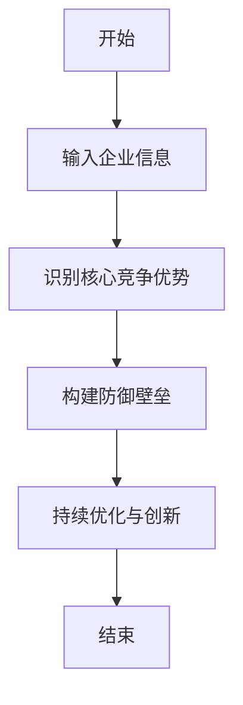
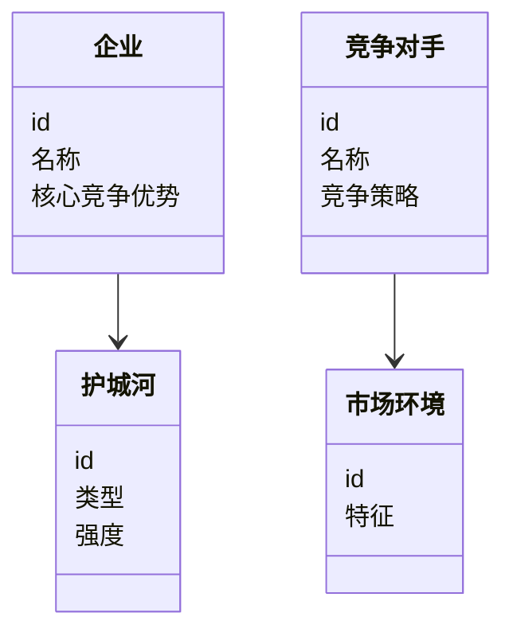
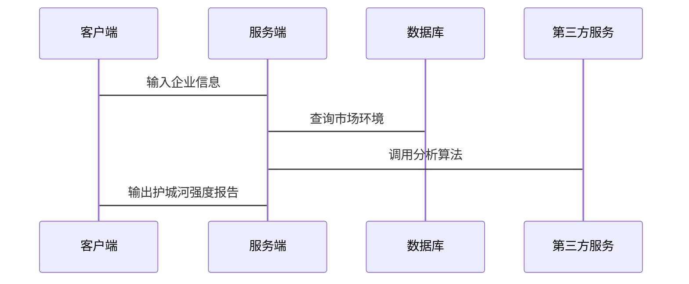

                 


# 巴菲特的经济护城河理论：平台经济时代的新定义

> 关键词：经济护城河，巴菲特，平台经济，竞争优势，可持续性

> 摘要：本文将深入探讨巴菲特的经济护城河理论，并分析其在平台经济时代的新定义和应用。通过详细分析经济护城河的核心概念、算法原理、系统架构和实际案例，本文将揭示如何在现代商业环境中构建和维护经济护城河。

---

# 第1章: 巴菲特的经济护城河理论概述

## 1.1 经济护城河的定义与核心要素

### 1.1.1 经济护城河的定义

经济护城河是巴菲特投资理论中的核心概念，指的是企业在市场中建立的持久竞争优势。这种竞争优势能够防止竞争对手轻易侵蚀企业的市场份额，从而为企业创造超额利润。

经济护城河可以通过多种方式体现，例如品牌忠诚度、成本优势、技术专利、网络效应等。这些因素共同构成了企业的防御机制，使其在竞争中立于不败之地。

### 1.1.2 经济护城河的核心要素

1. **品牌忠诚度**：强大的品牌能够吸引客户，并使其在面对竞争对手时更倾向于选择原品牌。
2. **成本优势**：企业通过规模效应或技术创新降低成本，使得竞争对手难以在价格上与其竞争。
3. **技术专利**：拥有独特的技术专利可以防止竞争对手快速复制企业的核心产品或服务。
4. **网络效应**：随着用户数量的增加，平台的价值也随之增长，形成正反馈循环，进一步巩固企业的市场地位。

### 1.1.3 经济护城河的边界与外延

经济护城河并非一成不变，其边界和外延会随着市场环境的变化而调整。例如，随着技术的进步，新的竞争对手可能会利用新兴技术削弱传统企业的护城河。因此，企业需要不断审视和优化其护城河策略，以应对市场的变化。

## 1.2 巴菲特投资理念与经济护城河

### 1.2.1 巴菲特的投资哲学

巴菲特的投资哲学强调长期价值，而非短期收益。他认为，投资的本质是寻找那些具有持续竞争优势的企业，这些企业能够在长期内为股东创造价值。

### 1.2.2 经济护城河在巴菲特投资中的地位

对于巴菲特来说，经济护城河是企业长期竞争优势的体现。他倾向于投资那些具有强大护城河的企业，因为这些企业能够在竞争中保持领先地位，并为股东带来稳定的回报。

### 1.2.3 巴菲特对经济护城河的实践案例

以可口可乐为例，巴菲特认为其强大的品牌忠诚度和全球分销网络构成了强大的护城河。这种护城河使得可口可乐能够在碳酸饮料市场中占据主导地位，并在面对新进入者时保持竞争优势。

## 1.3 平台经济时代的经济护城河新特征

### 1.3.1 平台经济的定义与特点

平台经济是指通过数字平台连接供需双方，提供撮合交易或信息服务的商业模式。其特点是去中介化、高效匹配和网络效应强。

### 1.3.2 平台经济与传统经济护城河的对比

与传统经济相比，平台经济的护城河具有以下新特征：

1. **网络效应**：用户数量的增加会增强平台的价值，形成正反馈循环。
2. **数据驱动**：平台通过收集和分析用户数据，优化服务并提升用户体验。
3. **快速迭代**：平台经济依赖于快速的技术迭代和创新能力，护城河需要不断更新以应对新的挑战。

### 1.3.3 平台经济时代经济护城河的新维度

在平台经济时代，经济护城河的维度发生了变化，主要包括：

1. **数据资产**：数据成为企业的重要资产，通过数据驱动的决策和创新构建护城河。
2. **技术平台**：强大的技术平台是企业护城河的核心，能够支持快速迭代和创新。
3. **用户粘性**：通过优质的服务和用户体验，增强用户粘性，形成强大的网络效应。

---

# 第2章: 经济护城河的核心概念与联系

## 2.1 经济护城河的核心概念原理

### 2.1.1 经济护城河的形成机制

经济护城河的形成机制包括以下几个步骤：

1. **识别核心竞争优势**：企业需要明确自身的竞争优势，例如品牌、技术、成本等。
2. **构建防御壁垒**：通过强化核心竞争优势，构建防御壁垒，防止竞争对手的侵蚀。
3. **持续优化与创新**：企业需要不断优化和创新，以应对市场的变化和技术的进步。

### 2.1.2 经济护城河的可持续性分析

经济护城河的可持续性取决于其核心竞争优势的强度和持续性。例如，强大的品牌忠诚度和网络效应可以为企业提供长期的防御能力，而单纯的成本优势可能容易被竞争对手复制。

### 2.1.3 经济护城河与企业竞争优势的关系

经济护城河是企业竞争优势的体现，同时也是企业长期盈利能力的保障。通过构建强大的护城河，企业可以巩固其市场地位，并在竞争中占据优势。

## 2.2 经济护城河的属性特征对比

### 2.2.1 经济护城河的属性分析

经济护城河的属性包括以下几点：

1. **持久性**：护城河需要能够长期存在，并在市场变化中保持其有效性。
2. **可扩展性**：护城河需要能够随着企业规模的扩大而扩展，并支持企业的增长。
3. **防御性**：护城河需要能够有效防御竞争对手的攻击，并降低企业的市场风险。

### 2.2.2 不同经济护城河类型的特征对比

以下是不同经济护城河类型的特征对比：

| 经济护城河类型 | 品牌忠诚度 | 成本优势 | 技术专利 | 网络效应 |
|----------------|------------|----------|-----------|----------|
| 麦当劳         | 高         | 中       | 无         | 高         |
| 苹果           | 高         | 中       | 高         | 中         |
| 微软           | 中         | 中       | 高         | 高         |

### 2.2.3 经济护城河属性特征的表格总结

通过上述对比可以看出，不同类型的经济护城河在品牌忠诚度、成本优势、技术专利和网络效应等方面的特征有所不同。企业需要根据自身的实际情况，选择最适合的护城河类型。

## 2.3 经济护城河的ER实体关系图

以下是经济护城河的ER实体关系图：

```mermaid
er
  entity(企业) {
    id
    名称
    核心竞争优势
    }
  entity(竞争对手) {
    id
    名称
    竞争策略
    }
  entity(市场环境) {
    id
    特征
    }
  entity(护城河) {
    id
    类型
    强度
    }
  relation(拥有) {
    企业 -> 护城河
    }
  relation(影响) {
    市场环境 -> 护城河
    }
  relation(对抗) {
    企业 -> 竞争对手
    }
```

---

# 第3章: 经济护城河的算法原理与数学模型

## 3.1 经济护城河的算法原理

### 3.1.1 经济护城河分析的算法框架

以下是经济护城河分析的算法框架：



### 3.1.2 算法的输入与输出

1. **输入**：企业信息，包括企业类型、核心竞争优势、市场环境等。
2. **输出**：护城河强度评估报告，包括护城河类型、强度和防御建议。

### 3.1.3 算法的实现步骤

1. **输入企业信息**：收集企业的核心竞争优势、市场环境等信息。
2. **识别核心竞争优势**：通过分析企业的品牌、技术、成本等，确定其核心竞争优势。
3. **构建防御壁垒**：根据核心竞争优势，构建相应的防御壁垒，例如品牌推广、技术创新等。
4. **持续优化与创新**：定期评估和优化护城河策略，确保其有效性。

## 3.2 经济护城河的数学模型与公式

### 3.2.1 经济护城河强度的数学公式

经济护城河强度的计算公式如下：

$$
\text{护城河强度} = \frac{\text{核心竞争优势}}{\text{市场风险}}
$$

其中，核心竞争优势包括品牌忠诚度、技术专利等，市场风险包括竞争环境、政策变化等。

### 3.2.2 经济护城河可持续性的数学模型

经济护城河可持续性的数学模型如下：

$$
\text{可持续性} = \text{核心竞争优势} \times \text{防御能力}
$$

其中，防御能力包括企业的技术壁垒、成本优势等。

### 3.2.3 公式的详细推导与解释

以护城河强度的公式为例：

$$
\text{护城河强度} = \frac{\text{核心竞争优势}}{\text{市场风险}}
$$

假设某企业的核心竞争优势为80，市场风险为40，则其护城河强度为：

$$
\text{护城河强度} = \frac{80}{40} = 2
$$

这意味着该企业的护城河强度较高，能够在市场中占据优势地位。

## 3.3 经济护城河算法的mermaid流程图

以下是经济护城河算法的mermaid流程图：


## 3.4 经济护城河算法的Python实现

以下是经济护城河强度的Python实现：

```python
def calculate_h护城河强度(core_competitiveness, market_risk):
    return core_competitiveness / market_risk

# 示例
core_competitiveness = 80
market_risk = 40
护城河强度 = calculate_h护城河强度(core_competitiveness, market_risk)
print("护城河强度:", 护城河强度)
```

---

# 第4章: 经济护城河的系统分析与架构设计方案

## 4.1 系统分析

### 4.1.1 问题场景介绍

在平台经济时代，企业需要构建强大的经济护城河以应对日益激烈的竞争。然而，许多企业在构建护城河时面临以下挑战：

1. **核心竞争优势不明确**：企业无法准确识别自身的核心竞争优势。
2. **防御壁垒不足**：企业的防御壁垒不够强大，难以抵御竞争对手的攻击。
3. **持续优化能力不足**：企业在面对市场变化时，无法及时优化护城河策略。

### 4.1.2 项目介绍

本项目旨在为企业提供经济护城河分析的系统解决方案，帮助企业识别核心竞争优势，构建防御壁垒，并持续优化护城河策略。

## 4.2 系统功能设计

### 4.2.1 领域模型mermaid类图

以下是经济护城河分析系统的领域模型类图：



### 4.2.2 系统架构设计mermaid架构图

以下是经济护城河分析系统的架构图：


### 4.2.3 系统接口设计

系统接口设计包括以下内容：

1. **输入接口**：接收企业的核心竞争优势、市场环境等信息。
2. **输出接口**：输出护城河强度评估报告，包括护城河类型、强度和防御建议。

### 4.2.4 系统交互mermaid序列图

以下是经济护城河分析系统的交互序列图：



---

# 第5章: 经济护城河的项目实战

## 5.1 环境安装

### 5.1.1 系统环境要求

1. Python 3.8及以上版本
2. Mermaid工具安装（用于流程图和类图绘制）
3. 必要的开发工具（如PyCharm、VS Code等）

### 5.1.2 安装步骤

1. 安装Python：
   ```bash
   # 在终端中运行以下命令
   python --version
   ```
2. 安装Mermaid：
   ```bash
   # 下载并安装Mermaid Desktop或在线使用
   ```
3. 安装必要的Python库：
   ```bash
   pip install mermaid
   ```

## 5.2 系统核心实现源代码

### 5.2.1 护城河强度计算代码

```python
def calculate_h护城河强度(core_competitiveness, market_risk):
    return core_competitiveness / market_risk

# 示例
core_competitiveness = 80
market_risk = 40
护城河强度 = calculate_h护城河强度(core_competitiveness, market_risk)
print("护城河强度:", 护城河强度)
```

### 5.2.2 数据分析代码

```python
import pandas as pd
import numpy as np

data = {
    '企业': ['企业A', '企业B', '企业C'],
    '核心竞争优势': [80, 70, 90],
    '市场风险': [40, 50, 30]
}

df = pd.DataFrame(data)
df['护城河强度'] = df.apply(lambda x: x['核心竞争优势'] / x['市场风险'], axis=1)
print(df)
```

## 5.3 代码应用解读与分析

### 5.3.1 护城河强度计算代码解读

上述代码通过输入企业的核心竞争优势和市场风险，计算出护城河强度。计算公式为：

$$
\text{护城河强度} = \frac{\text{核心竞争优势}}{\text{市场风险}}
$$

### 5.3.2 数据分析代码解读

上述代码使用Pandas库进行数据分析，计算出每个企业的护城河强度，并输出结果。通过数据可视化，企业可以更直观地了解其护城河强度。

## 5.4 案例分析与详细讲解剖析

### 5.4.1 案例分析

以某企业为例，假设其核心竞争优势为80，市场风险为40。根据上述代码，计算出其护城河强度为2。这意味着该企业的护城河强度较高，能够在市场中占据优势地位。

### 5.4.2 详细讲解

通过上述案例分析，我们可以得出以下结论：

1. **核心竞争优势是影响护城河强度的关键因素**：核心竞争优势越强，护城河强度越高。
2. **市场风险是护城河强度的重要影响因素**：市场风险越高，护城河强度越低。

## 5.5 项目小结

通过本项目，我们了解了如何利用Python代码计算经济护城河强度，并通过数据分析帮助企业优化护城河策略。这为企业在平台经济时代构建和维护经济护城河提供了有力的支持。

---

# 第6章: 经济护城河的最佳实践

## 6.1 最佳实践 tips

1. **持续优化护城河策略**：企业需要定期评估和优化其护城河策略，以应对市场的变化。
2. **数据驱动决策**：通过数据分析和挖掘，帮助企业制定科学的护城河策略。
3. **加强技术研发**：通过技术创新，构建技术壁垒，增强企业的护城河。

## 6.2 小结

经济护城河是企业在平台经济时代的重要竞争优势。通过构建强大的护城河，企业可以在竞争中立于不败之地，并为股东创造持续的價值。

## 6.3 注意事项

1. **避免过度依赖单一护城河类型**：企业需要综合考虑多种护城河类型，以构建全面的防御体系。
2. **关注市场变化**：企业需要密切关注市场变化，及时调整护城河策略。
3. **注重数据安全**：在平台经济时代，数据是企业的重要资产，企业需要注重数据安全，防止数据泄露和滥用。

## 6.4 拓展阅读

1. 《巴菲特的选股艺术》
2. 《平台经济：理论与实践》
3. 《竞争战略》

---

# 作者：AI天才研究院/AI Genius Institute & 禅与计算机程序设计艺术 /Zen And The Art of Computer Programming

