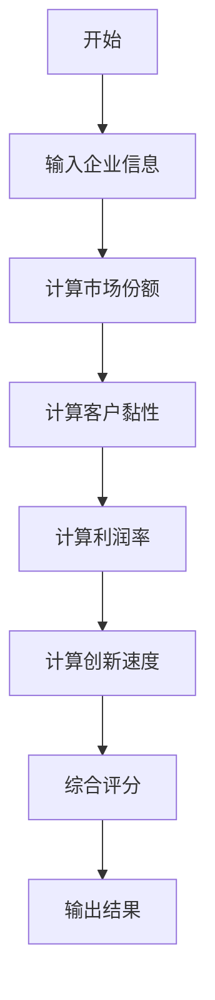
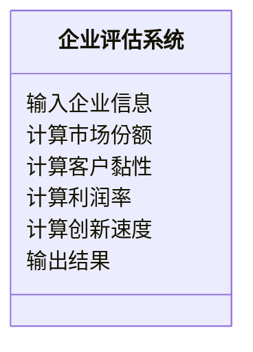
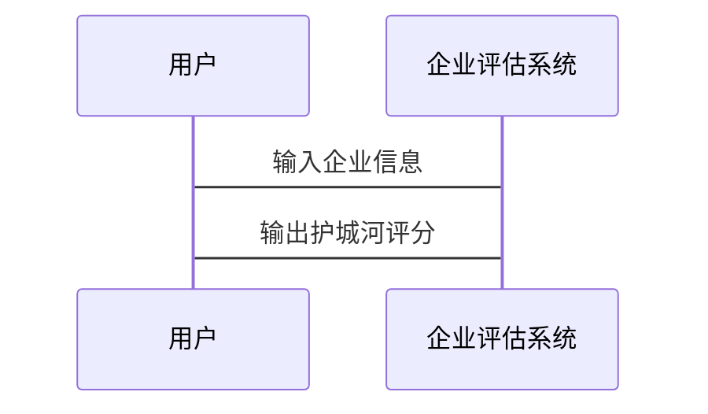

                 


# 巴菲特的经济护城河：持久竞争优势的重要性

> 关键词：经济护城河，竞争优势，巴菲特，商业策略，企业价值

> 摘要：本文深入探讨了巴菲特的经济护城河概念，分析了其核心原理、构建方法和实际应用。通过系统的分析和实例，展示了如何通过经济护城河实现持久竞争优势，为企业创造长期价值。

---

## 第一部分: 经济护城河的背景介绍

### 第1章: 经济护城河的核心概念

#### 1.1 经济护城河的定义与背景

- **什么是经济护城河？**  
  经济护城河是指企业在市场中建立的一种长期竞争优势，能够抵御竞争对手的侵蚀，保持市场份额和盈利能力。这种优势通常来源于企业的独特资源、技术壁垒、品牌影响力或成本优势等。

- **经济护城河的起源与演变**  
  巴菲特在其投资哲学中首次系统地提出经济护城河的概念。他认为，企业只有具备持续的竞争优势，才能在长期内为股东创造超额价值。随着时间的推移，经济护城河的内涵不断丰富，涵盖了品牌、技术、市场垄断等多个维度。

- **经济护城河的重要性**  
  在商业竞争中，经济护城河是企业长期生存和发展的关键。它不仅能够帮助企业抵御竞争对手的攻击，还能在市场变化中保持领先地位。对于投资者而言，识别和评估企业的经济护城河是判断其投资价值的重要依据。

---

#### 1.2 经济护城河的核心要素

| 核心要素       | 描述与特征                     |
|----------------|-------------------------------|
| 市场准入壁垒   | 企业通过专利、许可或规模经济等手段，限制竞争对手进入市场。 |
| 成本优势       | 企业通过技术创新或规模效应，降低生产成本，提高价格竞争力。 |
| 网络效应       | 用户数量的增加会增强产品的价值，形成正反馈效应，巩固企业的市场地位。 |
| 品牌忠诚度     | 强大的品牌影响力能够吸引并留住客户，形成客户黏性。 |

---

### 第2章: 经济护城河的构建与维护

#### 2.1 构建经济护城河的策略

- **品牌建设**  
  品牌是企业最持久的护城河之一。通过持续的品牌营销和优质产品，企业可以建立起客户的忠诚度和品牌认知度。

- **技术创新**  
  技术创新是构建技术驱动的经济护城河的核心。企业需要不断投入研发，保持技术领先，形成专利壁垒。

- **市场垄断**  
  通过收购、并购或战略合作，企业可以扩大市场份额，形成市场垄断，进一步巩固经济护城河。

- **成本控制**  
  成本优势是企业长期竞争力的基石。通过优化生产流程、采购管理和供应链管理，企业可以实现成本领先。

---

#### 2.2 维护经济护城河的挑战

- **技术变革的影响**  
  技术的快速迭代可能削弱企业的技术优势，需要持续创新以保持竞争力。

- **市场竞争的加剧**  
  竞争对手的模仿和创新可能削弱企业的市场壁垒，需要不断调整策略。

- **内部管理的问题**  
  企业内部管理不善可能导致经济护城河逐渐被侵蚀，需要加强内部管控。

---

## 第二部分: 经济护城河的核心概念与联系

### 第3章: 经济护城河的评估与分析

#### 3.1 经济护城河的评估指标

- **市场份额**  
  市场份额是衡量企业市场地位的重要指标，高市场份额通常意味着强大的市场垄断能力。

- **客户黏性**  
  客户黏性反映了客户对企业产品或服务的依赖程度，高客户黏性意味着品牌忠诚度强。

- **利润率**  
  高利润率通常表明企业在市场上具有较强的定价权，能够通过护城河实现利润最大化。

- **创新速度**  
  创新速度是技术驱动的经济护城河的重要指标，快速创新的企业更具竞争优势。

---

### 第4章: 经济护城河的动态变化

#### 4.1 经济护城河的动态分析

- **市场环境的变化**  
  经济护城河的有效性可能因市场环境的变化而改变。例如，政策变化、行业趋势和技术革新都可能影响护城河的强度。

- **竞争对手的应对策略**  
  竞争对手可能通过模仿、创新或合作来削弱企业的护城河，企业需要持续调整策略以应对挑战。

- **企业自身的调整**  
  企业需要定期评估和调整经济护城河，确保其在变化的市场环境中保持有效性。

---

## 第三部分: 经济护城河的算法与数学模型

### 第5章: 经济护城河的评估算法

#### 5.1 经济护城河评分模型



---

#### 5.2 经济护城河评分公式

经济护城河总评分 = Σ（各因素权重 × 各因素评分）

其中，权重可以根据具体行业和企业特点进行调整。例如：

$$
\text{总评分} = 0.4 \times \text{市场份额} + 0.3 \times \text{客户黏性} + 0.2 \times \text{利润率} + 0.1 \times \text{创新速度}
$$

---

### 第6章: 经济护城河的数学模型

#### 6.1 经济护城河强度模型

$$
\text{护城河强度} = \frac{\text{市场份额} \times \text{客户黏性} \times \text{利润率}}{\text{行业平均利润率} \times \text{市场增长率}}
$$

---

## 第四部分: 经济护城河的系统分析

### 第7章: 经济护城河的系统架构

#### 7.1 系统功能设计



---

#### 7.2 系统交互流程



---

## 第五部分: 经济护城河的项目实战

### 第8章: 经济护城河的评估工具

#### 8.1 项目实战环境

- **Python版本**：3.8及以上
- **依赖库**：pandas、numpy

---

#### 8.2 核心代码实现

```python
import pandas as pd
import numpy as np

def calculate_h Competitive_edge(enterprise_info):
    market_share = enterprise_info['market_share']
    customer_sticky = enterprise_info['customer_sticky']
    profit_margin = enterprise_info['profit_margin']
    innovation_speed = enterprise_info['innovation_speed']

    weights = {'market_share': 0.4, 'customer_sticky': 0.3, 'profit_margin': 0.2, 'innovation_speed': 0.1}
    
    total_score = (market_share * weights['market_share'] +
                   customer_sticky * weights['customer_sticky'] +
                   profit_margin * weights['profit_margin'] +
                   innovation_speed * weights['innovation_speed'])
    
    return total_score

enterprise_info = {
    'market_share': 0.7,
    'customer_sticky': 0.8,
    'profit_margin': 0.6,
    'innovation_speed': 0.5
}

result = calculate_h Competitive_edge(enterprise_info)
print(f"经济护城河总评分为：{result}")
```

---

## 第六部分: 经济护城河的最佳实践

### 第9章: 经济护城河的优化策略

#### 9.1 小结

- 经济护城河是企业长期竞争优势的核心。
- 构建和维护经济护城河需要多方面的努力，包括品牌建设、技术创新和成本控制。

#### 9.2 注意事项

- 定期评估护城河的强度和有效性。
- 根据市场变化调整护城河策略。
- 加强内部管理，确保护城河的有效实施。

#### 9.3 拓展阅读

- 巴菲特的《投资之道》
- 《竞争优势：如何建立和维护企业的核心竞争力》

---

## 作者

作者：AI天才研究院 & 禅与计算机程序设计艺术

---

通过以上分析，我们可以看到，巴菲特的经济护城河概念不仅适用于投资领域，也为企业提供了构建和维护竞争优势的重要策略。在实际应用中，企业需要结合自身特点，灵活运用经济护城河的构建方法，以应对复杂的市场环境。

