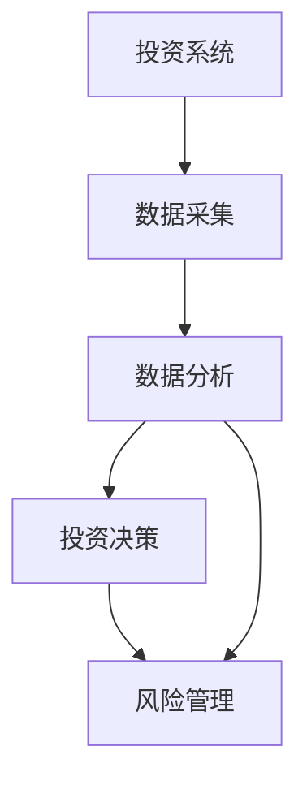

                 

# 巴菲特的股东信：投资智慧的结晶

> **关键词**：巴菲特、股东信、价值投资、投资智慧、投资策略、投资哲学、安全边际

> **摘要**：本文将深入分析巴菲特的股东信，揭示其投资智慧的核心理念、价值投资的哲学基础、安全边际的概念与应用，以及投资策略的系统分析。通过结合数学模型、系统架构设计和实战案例，我们将全面解读巴菲特的投资哲学，帮助读者理解如何通过股东信来实现长期稳健的投资回报。

---

## 第1章: 巴菲特投资理念的哲学基础

### 1.1 巴菲特的生平简介

沃伦·巴菲特（Warren Buffett），生于1934年，是全球最著名的职业投资者之一，被誉为“股神”。他通过长期的价值投资策略，积累了巨额财富，并在投资界树立了不可动摇的地位。巴菲特的投资理念不仅限于金融领域，更是一种哲学，他通过股东信的形式，向投资者分享了他对投资的理解和经验。

### 1.2 股东信的背景与意义

巴菲特从1951年开始撰写股东信，这些信件不仅是他对公司股东的年度报告，更是他投资哲学的集中体现。股东信中，巴菲特用简洁明了的语言，向股东解释公司的经营状况、投资策略以及他对市场的看法。这些信件不仅是投资者学习巴菲特投资理念的重要资料，也是金融史上的一份珍贵文献。

### 1.3 价值投资的哲学基础

价值投资的核心理念是购买低于其内在价值的资产。巴菲特认为，市场先生（Mr. Market）是不理性的，股票价格经常波动，但内在价值是长期稳定的。因此，投资者应该关注企业的基本面，而不是市场的短期波动。这种投资哲学强调长期、稳健的投资策略，而非短期的投机行为。

---

## 第2章: 价值投资的核心概念与数学模型

### 2.1 内在价值的计算

内在价值是价值投资的核心概念。巴菲特认为，股票的价值取决于其未来现金流的现值。计算内在价值的公式如下：

$$\text{内在价值} = \sum_{t=1}^{n} \frac{\text{现金流}_t}{(1 + r)^t}$$

其中，$r$ 是折现率，$n$ 是预测的年数。

### 2.2 安全边际的概念

安全边际是巴菲特投资策略中的另一个关键概念。它是指股票的市场价格低于其内在价值的部分。安全边际的存在可以降低投资的风险，因为当市场价格下跌时，内在价值仍然高于市场价格，从而为投资者提供了一定的缓冲空间。

$$\text{安全边际} = \text{内在价值} - \text{市场价格}$$

### 2.3 投资组合的优化

巴菲特的投资组合通常集中在少数几只股票上，他认为这种集中投资可以降低风险，因为投资者可以更好地理解其所投资的企业。然而，投资组合的优化需要在集中与分散之间找到平衡。

---

## 第3章: 投资策略的系统分析

### 3.1 长期投资与短期投资的对比

长期投资强调持有优质资产，等待其内在价值的实现。短期投资则关注市场的短期波动，试图通过买卖差价获利。巴菲特认为，长期投资是更为稳健的投资策略，因为短期市场的波动难以预测。

### 3.2 投资组合的构建与优化

投资组合的构建需要考虑多个因素，包括资产的流动性、风险、收益等。以下是投资组合构建的步骤：

1. 确定投资目标：明确投资的目的是追求收益还是降低风险。
2. 选择优质资产：选择那些具有强大竞争优势和良好管理团队的企业。
3. 分配资产：根据风险承受能力，将资产分配到不同的资产类别中。
4. 定期调整：定期审视投资组合，根据市场变化和个人目标进行调整。

### 3.3 投资组合的优化方法

投资组合的优化可以通过以下步骤实现：

1. 确定风险承受能力：评估自己能够承受的风险水平。
2. 选择合适资产：根据风险承受能力选择合适的资产。
3. 计算最优组合：使用数学模型计算最优的投资组合。
4. 定期再平衡：定期调整投资组合，以保持最优状态。

---

## 第4章: 巴菲特投资理念的实战应用

### 4.1 股东信的撰写与分析

巴菲特的股东信通常包括以下内容：

1. 公司的财务状况：包括收入、利润、现金流等。
2. 投资策略：包括对市场的看法、投资组合的调整等。
3. 风险提示：包括市场风险、企业风险等。

### 4.2 投资案例的分析与总结

以下是巴菲特投资可口可乐（Coca-Cola）的案例分析：

1. **投资背景**：可口可乐是一家具有强大竞争优势的企业，其品牌价值和市场地位使其成为巴菲特的长期投资目标。
2. **投资决策**：巴菲特在1988年买入可口可乐的股票，并长期持有。
3. **投资结果**：可口可乐的股价长期上涨，为巴菲特带来了巨大的收益。

---

## 第5章: 巴菲特投资理念的系统架构设计

### 5.1 投资系统的构成与功能

投资系统通常包括以下几个模块：

1. 数据采集模块：收集市场数据、公司财务数据等。
2. 数据分析模块：对数据进行处理和分析，计算内在价值、安全边际等。
3. 投资决策模块：根据分析结果，制定投资策略。
4. 风险管理模块：监控投资组合的风险，进行调整。

### 5.2 投资系统的架构设计

以下是投资系统的架构图：

### 5.3 投资系统的实现与应用

投资系统的实现需要结合多种技术和工具，包括数据挖掘、机器学习等。以下是投资系统实现的步骤：

1. 数据采集：通过网络爬虫、API等方式获取市场数据。
2. 数据分析：使用Python、R等工具进行数据分析和建模。
3. 投资决策：根据分析结果，制定投资策略。
4. 风险管理：监控投资组合的风险，进行调整。

---

## 第6章: 巴菲特投资理念的数学模型与公式

### 6.1 内在价值的计算公式

$$\text{内在价值} = \sum_{t=1}^{n} \frac{\text{现金流}_t}{(1 + r)^t}$$

### 6.2 安全边际的计算公式

$$\text{安全边际} = \text{内在价值} - \text{市场价格}$$

### 6.3 投资组合的优化模型

$$\text{最优组合} = \argmin_{w} \left( w^T \Sigma w \right)$$

其中，$w$ 是权重向量，$\Sigma$ 是协方差矩阵。

---

## 第7章: 巴菲特投资理念的总结与展望

### 7.1 投资的注意事项

1. 长期投资：避免短期市场的波动。
2. 优质资产：选择具有强大竞争优势的企业。
3. 风险管理：合理分散投资，降低风险。

### 7.2 未来展望

随着金融市场的不断发展，巴菲特的价值投资理念依然具有重要的指导意义。未来，投资者需要更加注重企业的基本面，选择那些具有长期竞争优势的企业。

---

**作者：AI天才研究院 & 禅与计算机程序设计艺术**

