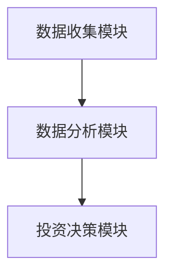

                 


# 巴菲特的读财报方法

> 关键词：财务报表分析，巴菲特投资方法，价值投资，内在价值，财务指标

> 摘要：本文详细探讨了巴菲特的财务报表分析方法，揭示了他如何通过阅读和解读财务报表来评估企业价值。文章从巴菲特的投资理念、财务报表的结构、关键财务指标的分析，到系统设计和实际案例分析，全面解析了巴菲特的读财报方法。通过本文，读者将能够掌握巴菲特的核心分析框架，学会如何通过财务报表数据来做出明智的投资决策。

---

## 第一章 巴菲特的投资理念与财报分析背景

### 1.1 巴菲特的投资理念

#### 1.1.1 价值投资的核心思想
价值投资的核心在于寻找那些被市场低估的企业，长期持有，等待其价值的回归。巴菲特认为，市场先生是情绪化的，而企业的真实价值可以通过财务报表分析来衡量。

#### 1.1.2 巴菲特的投资哲学
巴菲特的投资哲学可以总结为三点：
1. **长期投资**：买入并持有优质企业的股票，长期获得复利收益。
2. **安全边际**：在投资时，确保买入价格低于企业的内在价值。
3. **企业基本面**：企业的真实价值取决于其财务状况和盈利能力。

#### 1.1.3 财务报表分析的重要性
财务报表是企业经营状况的晴雨表，通过分析财务报表，巴菲特能够评估企业的盈利能力、财务健康状况以及未来的成长潜力。

---

### 1.2 财务报表分析的背景与意义

#### 1.2.1 财务报表的基本概念
财务报表主要包括三张表：资产负债表、利润表和现金流量表。

- **资产负债表**：反映企业在某一特定时点的资产、负债和所有者权益的状况。
- **利润表**：反映企业在一定会计期间内的收入、成本和利润情况。
- **现金流量表**：反映企业在一定会计期间内的现金流入和流出情况。

#### 1.2.2 财务报表分析的工具与方法
财务报表分析的工具包括：
1. **比率分析**：通过计算各项财务指标（如ROE、ROA等）来评估企业的财务状况。
2. **趋势分析**：通过比较不同会计期间的财务数据，分析企业的财务变化趋势。
3. **行业比较**：将企业的财务指标与行业平均水平进行对比，评估其竞争力。

#### 1.2.3 巴菲特如何利用财报做出投资决策
巴菲特通过分析财务报表，重点关注企业的盈利能力、财务健康状况和成长潜力。他特别关注企业的ROE（净资产收益率）和ROA（资产回报率）等指标。

---

### 1.3 巴菲特的分析框架

#### 1.3.1 财务报表的三张表结构
巴菲特的分析框架基于三张财务报表：
1. **资产负债表**：评估企业的资产质量、负债状况和所有者权益。
2. **利润表**：评估企业的盈利能力。
3. **现金流量表**：评估企业的现金流健康状况。

#### 1.3.2 财务指标的核心要素
巴菲特关注的核心财务指标包括：
1. **ROE（净资产收益率）**：衡量企业利用股东权益创造利润的能力。
2. **ROA（资产回报率）**：衡量企业利用资产创造利润的能力。
3. **净利润率**：衡量企业的盈利能力。
4. **资产负债率**：衡量企业的财务杠杆风险。

#### 1.3.3 巴菲特的估值方法
巴菲特的估值方法主要包括：
1. **内在价值计算**：通过DCF（Discounted Cash Flow）模型估算企业的内在价值。
2. **安全边际**：确保买入价格低于内在价值。

---

## 第二章 财务报表结构与关键指标

### 2.1 资产负债表

#### 2.1.1 资产、负债与所有者权益的定义
- **资产**：企业拥有的资源，包括现金、应收账款、存货、固定资产等。
- **负债**：企业欠款的债务，包括应付账款、短期借款、长期借款等。
- **所有者权益**：企业资产减去负债后的剩余价值，代表股东对企业净资产的权益。

#### 2.1.2 资产负债表的结构与重要性
资产负债表的结构如下：
```plaintext
资产 = 负债 + 所有者权益
```

#### 2.1.3 巴菲特如何解读资产负债表
巴菲特关注资产负债表中的关键指标：
1. **资产质量**：关注企业的核心资产是否具有持续的价值。
2. **负债结构**：关注企业的债务是否合理，是否存在偿债压力。
3. **所有者权益**：关注企业的净资产规模和增长情况。

---

### 2.2 利润表

#### 2.2.1 收入、成本与利润的关系
利润表的结构如下：
```plaintext
净利润 = 收入 - 成本 - 费用 - 税费
```

#### 2.2.2 利润表的结构与分析要点
利润表的分析要点包括：
1. **收入增长**：关注企业的收入是否持续增长。
2. **成本控制**：关注企业的成本是否合理。
3. **净利润率**：衡量企业的盈利能力。

#### 2.2.3 巴菲特对利润表的关注点
巴菲特关注利润表中的：
1. **净利润**：衡量企业的整体盈利能力。
2. **收入质量**：关注收入是否来自于主营业务，是否存在虚假收入。

---

### 2.3 现金流量表

#### 2.3.1 现金流入与流出的分类
现金流量表分为三部分：
1. **经营活动现金流**：反映企业日常经营活动中产生的现金流。
2. **投资活动现金流**：反映企业投资活动产生的现金流。
3. **筹资活动现金流**：反映企业筹资活动产生的现金流。

#### 2.3.2 现金流量表的结构与分析
现金流量表的分析要点包括：
1. **现金流健康状况**：关注企业的现金流是否为正。
2. **现金流来源**：关注现金流的主要来源是否稳定。

#### 2.3.3 巴菲特如何利用现金流分析企业健康状况
巴菲特认为，企业的现金流是衡量企业健康状况的重要指标。他关注：
1. **自由现金流**：企业经营活动产生的现金流是否能够支持未来的增长。
2. **现金流与利润匹配**：现金流与净利润是否匹配，是否存在虚增利润的情况。

---

## 第三章 巴菲特的财报分析框架与估值方法

### 3.1 巴菲特的分析框架

#### 3.1.1 财务报表分析的核心步骤
1. **分析资产负债表**：评估企业的资产质量、负债状况和所有者权益。
2. **分析利润表**：评估企业的盈利能力。
3. **分析现金流量表**：评估企业的现金流健康状况。
4. **计算关键财务指标**：如ROE、ROA、净利润率等。

#### 3.1.2 财务指标的权重
巴菲特认为，ROE（净资产收益率）和ROA（资产回报率）是衡量企业盈利能力的核心指标。他通常选择ROE超过15%的企业进行投资。

---

### 3.2 巴菲特的估值方法

#### 3.2.1 内在价值计算
巴菲特的估值方法基于内在价值计算。内在价值的计算公式如下：
$$
\text{内在价值} = \sum_{t=1}^{\infty} \frac{\text{自由现金流}_t}{(1 + r)^t}
$$
其中，r是折现率，通常使用企业的加权平均资本成本（WACC）。

#### 3.2.2 安全边际
巴菲特认为，安全边际是内在价值与市场价格之间的差距。他通常选择内在价值是市场价格的1.5倍以上的股票进行投资。

---

## 第四章 系统设计与数据收集

### 4.1 投资分析系统的构建

#### 4.1.1 数据收集模块
数据收集模块负责收集企业的财务报表数据，包括资产负债表、利润表和现金流量表。

#### 4.1.2 数据分析模块
数据分析模块负责计算企业的各项财务指标，如ROE、ROA、净利润率等。

#### 4.1.3 投资决策模块
投资决策模块根据分析结果，评估企业的内在价值和安全边际，做出投资决策。

---

### 4.2 系统架构设计

#### 4.2.1 模块之间的关系
系统架构图如下：



#### 4.2.2 数据流与交互
数据流如下：


---

## 第五章 项目实战：基于巴菲特方法的财务分析

### 5.1 案例分析：苹果公司

#### 5.1.1 数据收集
收集苹果公司的财务报表数据，包括资产负债表、利润表和现金流量表。

#### 5.1.2 关键指标计算
计算苹果公司的ROE和ROA：
$$
\text{ROE} = \frac{\text{净利润}}{\text{净资产}}
$$
$$
\text{ROA} = \frac{\text{净利润}}{\text{总资产}}
$$

#### 5.1.3 投资决策
根据计算结果，评估苹果公司的内在价值和安全边际，做出投资决策。

---

## 第六章 数学模型与公式

### 6.1 内在价值计算公式

#### 6.1.1 DCF模型
$$
\text{内在价值} = \sum_{t=1}^{\infty} \frac{\text{自由现金流}_t}{(1 + r)^t}
$$

#### 6.1.2 折现率的确定
折现率通常使用企业的加权平均资本成本（WACC）。

---

## 第七章 总结与建议

### 7.1 总结
巴菲特的读财报方法的核心在于通过分析财务报表，评估企业的盈利能力、财务健康状况和成长潜力。他特别关注ROE和ROA等关键指标，并通过内在价值计算和安全边际分析做出投资决策。

### 7.2 建议
1. **持续学习**：不断学习财务报表分析的方法和技巧。
2. **关注行业动态**：了解行业趋势和企业的竞争优势。
3. **实践操作**：通过实际案例分析，提高自己的财务分析能力。

---

## 作者：AI天才研究院/AI Genius Institute & 禅与计算机程序设计艺术 /Zen And The Art of Computer Programming

---

这篇文章从巴菲特的投资理念、财务报表分析方法到实际案例分析，全面解析了巴菲特的读财报方法。通过本文，读者可以掌握巴菲特的核心分析框架，并将其应用于实际投资分析中。

