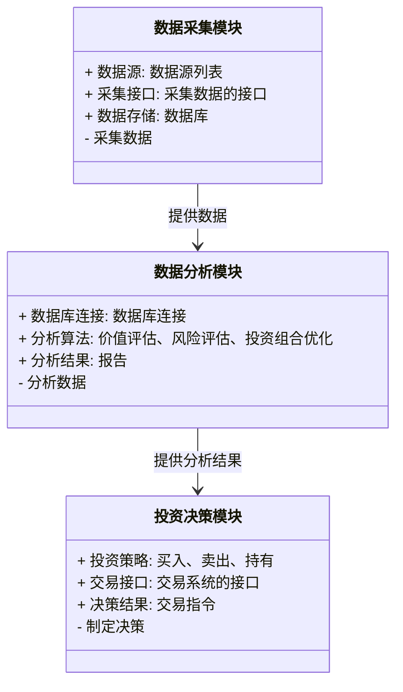
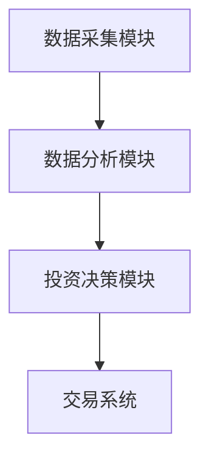
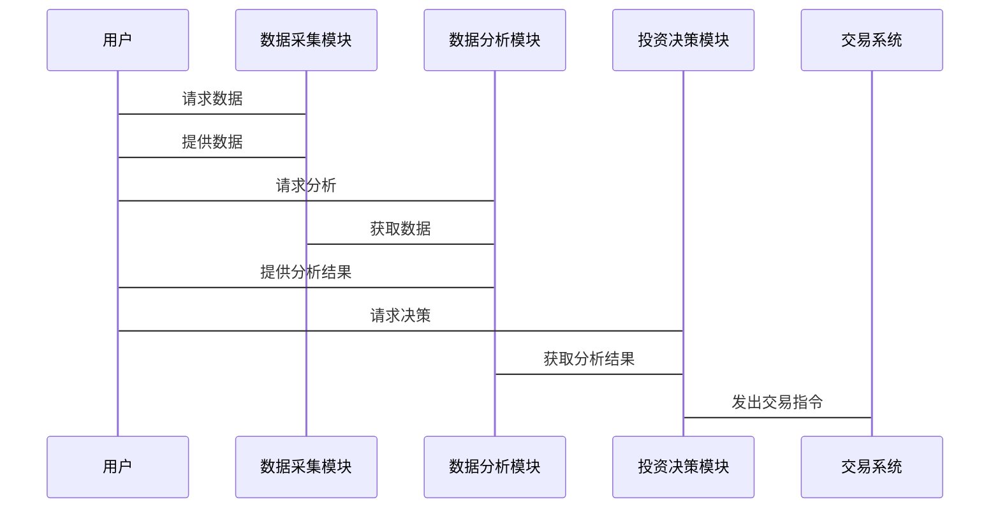
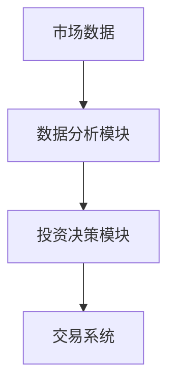

                 

<think>
好的，我将按照您的要求撰写《巴菲特的逆向投资思维》的技术博客文章。首先，我会先撰写文章标题、关键词和摘要部分，然后按照目录大纲逐步展开每一章节的内容。如果您有任何问题或需要调整的地方，请随时告诉我。

### 文章标题
《巴菲特的逆向投资思维》

### 文章关键词
- 巴菲特投资理念
- 逆向思维
- 价值评估
- 风险管理
- 投资策略
- 系统架构
- 投资模型

### 摘要
《巴菲特的逆向投资思维》这篇文章将带领读者深入了解巴菲特的投资理念及其核心思想。文章从逆向思维的基本概念入手，详细分析其在投资中的应用，结合实际案例和系统架构，探讨如何通过逆向思维找到市场低估的机会并制定有效的投资策略。文章还将介绍相关的数学模型和算法，帮助读者更好地理解如何在实际操作中应用这些理念。通过本文，读者将掌握逆向思维在投资中的精髓，为自己的投资决策提供有力的理论支持和实践指导。

---

### 正文

#### 第一部分：巴菲特投资理念概述

##### 第1章：巴菲特投资理念概述

###### 1.1 巴菲特投资理念的背景与核心思想

1.1.1 巴菲特投资理念的起源
沃伦·巴菲特（Warren Buffett）是全球最著名的投资者之一，他的投资理念起源于对价值投资的深刻理解。价值投资的核心在于寻找市场中被低估的股票，这种低估通常是由于市场的短期波动或投资者的非理性行为所导致的。巴菲特的理念强调长期投资、安全边际和企业基本面分析。

1.1.2 巴菲特投资理念的核心思想
巴菲特的投资理念可以总结为以下几点：
1. **安全边际**：买入价格低于内在价值的股票，以确保有足够的安全边际。
2. **长期投资**：关注企业的长期价值，而不是短期市场波动。
3. **企业基本面**：分析企业的财务状况、行业地位和竞争优势。

1.1.3 逆向思维在投资中的重要性
逆向思维在巴菲特的投资理念中占据重要地位。逆向思维是指在市场恐慌时寻找机会，而不是在市场繁荣时盲目跟风。这种思维方式帮助巴菲特在市场低谷时找到优质资产，从而在长期实现超额收益。

###### 1.2 逆向思维的基本概念

1.2.1 逆向思维的定义
逆向思维是一种与传统思维相反的思维方式，它强调在市场低迷时寻找机会，而不是在市场繁荣时追求高收益。逆向思维的核心在于识别市场中的低估机会，并在市场情绪消极时进行投资。

1.2.2 逆向思维与传统投资思维的区别
传统的投资思维通常基于市场趋势和情绪进行投资，而逆向思维则强调独立思考和理性分析。逆向思维更注重企业基本面分析，而不是市场的短期波动。

1.2.3 逆向思维在投资中的应用范围
逆向思维不仅适用于股票投资，还可以应用于其他资产类别，如债券、房地产等。无论是在牛市还是熊市，逆向思维都能帮助投资者找到潜在的机会。

###### 1.3 巴菲特投资理念的实践案例

1.3.1 巴菲特的经典投资案例分析
以巴菲特投资可口可乐（Coca-Cola）为例，他在1985年左右开始大量买入可口可乐的股票。当时，可口可乐的股价被市场低估，而公司的基本面表现强劲。巴菲特通过深入分析公司的财务状况、市场地位和竞争优势，判断可口可乐是一家具有长期增长潜力的公司。

1.3.2 逆向思维在案例中的具体体现
在可口可乐的投资案例中，逆向思维体现在巴菲特在市场低迷时买入股票，而不是在市场繁荣时追逐高价。他通过分析公司的基本面，识别出市场低估的机会，并在市场恐慌时进行投资。

1.3.3 巴菲特投资理念的总结与启示
巴菲特的投资理念告诉我们，成功的投资不仅仅依赖于市场趋势，更取决于对企业基本面的深入分析和对市场情绪的独立判断。逆向思维帮助投资者在市场低谷时找到优质资产，从而在长期实现超额收益。

---

#### 第二部分：逆向思维的核心原理

##### 第2章：逆向思维的策略与方法

###### 2.1 逆向思维的策略

2.1.1 寻找市场低估的机会
逆向思维的核心在于寻找市场中的低估机会。投资者需要通过对企业基本面的深入分析，识别出那些市场价格低于内在价值的股票。这通常发生在市场恐慌或经济低迷时期。

2.1.2 安全边际的概念与应用
安全边际是指买入价格与内在价值之间的差距。通过确保足够的安全边际，投资者可以在市场波动时降低风险，并为未来的增值提供空间。

2.1.3 逆向思维在市场周期中的应用
逆向思维在市场周期中的应用主要体现在以下几点：
- 在牛市中保持冷静，避免盲目跟风。
- 在熊市中寻找机会，买入优质资产。

###### 2.2 逆向思维的数学模型

2.2.1 价值评估模型
价值评估模型是逆向思维的核心工具之一。以下是价值评估模型的公式：
$$
\text{内在价值} = \frac{\text{未来现金流的现值}}{\text{折现率}}
$$
通过计算企业的内在价值，投资者可以判断其市场价格是否被低估。

2.2.2 风险评估模型
风险评估模型用于衡量投资的风险。常用的风险指标包括波动率、VaR（Value at Risk）和CVaR（Conditional Value at Risk）。以下是VaR的计算公式：
$$
\text{VaR} = \text{损失的金额在一定置信水平下的最大值}
$$

2.2.3 投资组合优化模型
投资组合优化模型用于确定最优的投资组合。常用的方法包括均值-方差优化和风险中性优化。以下是均值-方差优化的公式：
$$
\text{Minimize } \sigma^2 \text{ subject to } \mu \geq \text{目标收益}
$$

###### 2.3 逆向思维的算法实现

2.3.1 简单价值评估算法
以下是简单价值评估算法的步骤：
1. 收集企业的财务数据，包括收入、利润、现金流等。
2. 评估企业的未来现金流。
3. 计算企业的内在价值。
4. 比较市场价格与内在价值，判断是否存在低估。

2.3.2 风险调整的优化算法
风险调整的优化算法用于在考虑风险的情况下优化投资组合。以下是算法的步骤：
1. 计算各资产的风险和收益。
2. 确定风险约束（如最大VaR）。
3. 使用优化算法确定最优投资组合。

2.3.3 投资组合优化的数学公式
投资组合优化的数学公式可以表示为：
$$
\text{Minimize } \sum_{i=1}^{n} w_i \sigma_i^2 \text{ subject to } \sum_{i=1}^{n} w_i \mu_i = \text{目标收益}
$$
其中，$w_i$ 是第 $i$ 个资产的权重，$\sigma_i^2$ 是第 $i$ 个资产的波动率，$\mu_i$ 是第 $i$ 个资产的期望收益。

---

#### 第三部分：逆向思维的系统分析

##### 第3章：逆向思维的系统架构

###### 3.1 投资系统的模块划分

3.1.1 数据采集模块
数据采集模块负责收集市场数据，包括股票价格、财务报表、行业数据等。以下是数据采集模块的功能：
1. 从多个数据源获取实时数据。
2. 处理数据，确保数据的准确性和完整性。
3. 存储数据以便后续分析。

3.1.2 数据分析模块
数据分析模块负责对收集的数据进行分析，包括价值评估、风险评估和投资组合优化。以下是数据分析模块的功能：
1. 计算企业的内在价值。
2. 评估投资的风险。
3. 优化投资组合。

3.1.3 投资决策模块
投资决策模块根据分析结果做出投资决策，包括买入、卖出或持有。以下是投资决策模块的功能：
1. 根据分析结果制定投资策略。
2. 执行交易指令。
3. 监控投资组合的表现。

###### 3.2 系统架构设计

3.2.1 系统功能设计
系统功能设计包括数据采集、数据分析和投资决策三个主要功能模块。以下是系统功能设计的类图（使用 Mermaid）：

3.2.2 系统架构图（Mermaid）
以下是系统的架构图：

3.2.3 系统接口设计
系统接口设计包括数据采集接口、数据分析接口和交易接口。以下是接口设计的详细说明：
- 数据采集接口：从多个数据源（如Yahoo Finance、Google Finance）获取实时数据。
- 数据分析接口：调用分析算法进行价值评估、风险评估和投资组合优化。
- 交易接口：执行买入、卖出或持有的交易指令。

3.2.4 系统交互流程
以下是系统交互流程的序列图：

---

#### 第四部分：逆向思维的实战案例

##### 第4章：逆向思维的实战分析

###### 4.1 经典投资案例分析

4.1.1 巴菲特购买可口可乐的案例
以下是巴菲特购买可口可乐的案例分析：
- **背景**：20世纪80年代，可口可乐的股价被市场低估，而公司的基本面表现强劲。
- **分析**：巴菲特通过分析公司的财务状况、市场地位和竞争优势，判断可口可乐是一家具有长期增长潜力的公司。
- **决策**：巴菲特在市场低迷时买入可口可乐的股票，从而在市场回升时实现超额收益。

4.1.2 逆向思维在案例中的具体应用
在可口可乐的投资案例中，逆向思维体现在巴菲特在市场低迷时买入股票，而不是在市场繁荣时追逐高价。他通过分析公司的基本面，识别出市场低估的机会，并在市场恐慌时进行投资。

4.1.3 案例的总结与启示
巴菲特的成功在于他能够独立思考，识别市场低估的机会，并在市场恐慌时进行投资。这种逆向思维帮助他在长期实现超额收益。

4.1.4 投资策略与系统的结合
以下是可口可乐投资案例中投资策略与系统的结合：

---

#### 第五部分：逆向思维的最佳实践

##### 第5章：逆向思维的最佳实践

###### 5.1 投资策略与系统的结合
以下是逆向思维在投资策略与系统中的具体应用：
- 数据采集模块：实时获取市场数据，包括股票价格、财务报表等。
- 数据分析模块：通过价值评估模型计算企业的内在价值，识别市场低估的机会。
- 投资决策模块：根据分析结果制定投资策略，包括买入、卖出或持有。

###### 5.2 系统优化与维护
系统优化与维护包括以下几点：
- 数据源的优化：选择多个数据源，确保数据的准确性和完整性。
- 算法的优化：不断改进分析算法，提高分析的准确性和效率。
- 系统的维护：定期检查系统，确保系统的稳定性和安全性。

###### 5.3 小结与注意事项
逆向思维是一种有效的投资策略，但在实际操作中需要注意以下几点：
- 独立思考：避免受到市场情绪的影响，独立分析企业的基本面。
- 风险控制：确保投资组合的风险在可接受范围内。
- 系统维护：定期检查和优化投资系统，确保系统的稳定性和效率。

---

### 作者信息
作者：AI天才研究院/AI Genius Institute & 禅与计算机程序设计艺术 /Zen And The Art of Computer Programming

---

以上是《巴菲特的逆向投资思维》的技术博客文章的目录大纲和内容概要。如果您有具体章节的详细要求或需要进一步调整，请随时告知！

