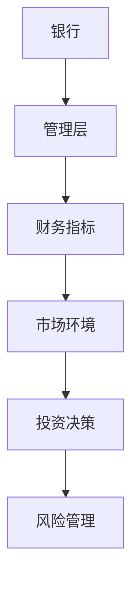
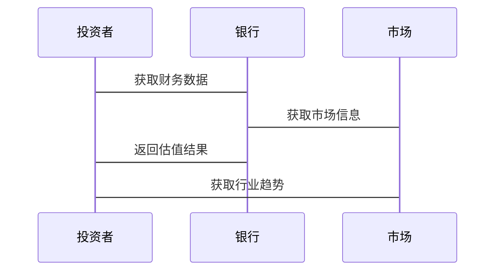

                 


# 巴菲特的银行业投资逻辑：金融科技挑战下的重新评估

## 关键词：
- 巴菲特
- 银行业投资
- 金融科技
- 数字化转型
- 价值投资

## 摘要：
本文深入分析了巴菲特在银行业投资的核心逻辑，探讨了他在金融科技快速发展的背景下如何调整投资策略。文章从巴菲特的价值投资理念出发，结合具体案例，分析了他对银行估值的关键指标、管理层信任和安全边际的重视。同时，文章详细探讨了金融科技对银行业的颠覆性影响，包括成本结构、客户体验和收入模式的变化，以及传统银行的数字化转型和金融科技企业的投资机会。最后，文章总结了巴菲特投资逻辑的调整策略，并给出了在金融科技时代的投资建议。

---

## 第一部分：引言

### 1.1 巴菲特投资理念概述
#### 1.1.1 价值投资的核心理念
巴菲特的价值投资理念强调购买具有持久竞争优势的企业，关注企业的内在价值，而非市场的短期波动。他主张以合理的价格投资于优秀的公司，长期持有，分享企业成长的成果。

#### 1.1.2 巴菲特投资风格的特点
- **注重企业基本面**：关注企业的盈利能力、财务状况和竞争优势。
- **长期持有**：避免频繁交易，降低交易成本。
- **安全边际**：买入价格低于内在价值，确保投资的安全性。

#### 1.1.3 本书的研究目标与意义
本文旨在探讨巴菲特在银行业投资的逻辑，分析他在金融科技挑战下的投资策略调整，并为现代投资者提供启示。

---

### 1.2 金融科技的崛起与银行业变革
#### 1.2.1 金融科技的定义与发展趋势
金融科技（Fintech）指的是利用技术手段创新金融服务模式，提高效率、降低成本、增强客户体验。近年来，随着人工智能、大数据、区块链等技术的发展，金融科技在银行业中的应用日益广泛。

#### 1.2.2 金融科技对银行业的颠覆性影响
- **成本结构**：金融科技降低了传统银行的运营成本，例如自动化服务和线上支付减少了物理网点的需求。
- **客户体验**：通过移动银行APP和智能客服，客户可以随时随地享受便捷的金融服务。
- **收入模式**：金融科技企业通过数据驱动的精准营销和创新金融产品，改变了传统的利息收入模式。

#### 1.2.3 传统银行与金融科技企业的竞争格局
传统银行面临金融科技企业的激烈竞争，尤其是在支付、借贷和财富管理领域。然而，传统银行在客户信任、品牌影响力和资本实力方面仍然具有优势。

---

## 第二部分：巴菲特的银行业投资逻辑

### 2.1 巴菲特的银行业投资背景
#### 2.1.1 美国银行业的发展历程
美国银行业经历了多次变革，从传统的存贷款业务到现在的综合金融服务。巴菲特在职业生涯中见证了银行业的变迁，并积累了丰富的投资经验。

#### 2.1.2 巴菲特早期的银行业投资案例
- **富国银行**：巴菲特在20世纪90年代投资富国银行，看重其强大的零售业务和管理团队。
- **美国运通**：他通过长期持有美国运通的股票，分享了该企业信用卡业务的快速增长。

#### 2.1.3 巴菲特对银行业的独特见解
巴菲特认为，银行的核心竞争力在于其客户基础、品牌价值和风险管理能力。他更倾向于投资那些具有强大护城河的银行。

---

### 2.2 巴菲特的银行业投资策略
#### 2.2.1 价值投资在银行业中的应用
- **关注ROE（净资产收益率）**：巴菲特认为，ROE是衡量银行盈利能力的重要指标，通常希望ROE保持在15%以上。
- **关注ROA（资产净利率）**：资产效率高的银行更能创造价值。
- **关注资本充足率**：资本充足率高的银行在风险控制方面更具优势。

#### 2.2.2 银行估值的关键指标分析
- **市净率（P/B）**：巴菲特通常寻找市净率低于1的银行，认为这些银行被市场低估。
- **股息率**：高股息率的银行股通常被视为稳定的收益来源。
- **贷款质量**：关注银行的不良贷款率和拨备覆盖率，评估其资产质量。

#### 2.2.3 巴菲特对银行管理层的信任与考量
巴菲特认为，优秀的管理层是企业成功的关键。他倾向于投资那些由值得信赖的管理层领导的银行，尤其是那些能够保持保守的财务政策和长期战略的企业。

---

### 2.3 巴菲特银行业投资的经典案例
#### 2.3.1 富国银行的投资故事
富国银行以其强大的零售网络和高效的管理团队著称。巴菲特在20世纪90年代买入富国银行的股票，长期持有，见证了该行的成长。

#### 2.3.2 某些中小银行的投资案例分析
巴菲特有时也会投资于一些区域性银行，这些银行在特定市场中具有竞争优势，且估值合理。

#### 2.3.3 案例中的经验与教训总结
- **长期持有**：巴菲特的成功部分归因于长期持有优质资产。
- **安全边际**：在买入时留有余地，避免市场波动带来的损失。

---

## 第三部分：金融科技挑战下的银行业投资逻辑调整

### 3.1 金融科技对银行业的影响分析
#### 3.1.1 金融科技对银行成本结构的改变
金融科技通过自动化和数字化减少了银行的运营成本，例如减少物理网点和柜员数量。

#### 3.1.2 金融科技对银行客户体验的提升
通过移动银行APP和智能客服，客户可以享受24/7的金融服务，提升了客户满意度。

#### 3.1.3 金融科技对银行收入模式的冲击
金融科技企业通过创新的金融产品和数据驱动的营销模式，改变了传统的利息收入模式。

---

### 3.2 传统银行的数字化转型与投资机会
#### 3.2.1 数字化转型的必要性与路径选择
传统银行需要通过数字化转型提升竞争力，例如引入人工智能技术优化客户服务和风险控制。

#### 3.2.2 新型金融科技企业的投资价值评估
金融科技企业如支付宝、PayPal等在支付和借贷领域具有强大的竞争力，但需要关注其盈利能力和风险管理能力。

#### 3.2.3 传统银行与金融科技企业的协同合作
传统银行与金融科技企业可以通过合作实现优势互补，例如联合推出创新型金融产品。

---

### 3.3 巴菲特投资逻辑的调整与应对策略
#### 3.3.1 价值投资在金融科技时代的适用性
尽管金融科技改变了银行业的竞争格局，但价值投资的核心理念仍然适用，即投资于具有强大竞争优势的企业。

#### 3.3.2 巴菲特对金融科技企业的看法
巴菲特对金融科技持开放态度，但他更倾向于投资那些具有稳定商业模式和强大护城河的企业。

#### 3.3.3 巴菲特对银行管理层的信任与考量
在选择投资对象时，巴菲特仍然重视管理层的诚信和能力，认为这是企业长期成功的关键。

---

## 第四部分：系统分析与架构设计方案

### 4.1 问题场景介绍
随着金融科技的发展，银行业的投资逻辑发生了变化。本文通过系统分析，探讨如何在金融科技时代调整投资策略。

### 4.2 系统功能设计
- **领域模型**：设计银行的财务指标、管理层能力和市场环境等核心要素。
- **系统架构**：构建一个包含银行估值、风险管理、投资决策等模块的系统。

### 4.3 系统架构设计


### 4.4 系统接口设计
- **银行估值接口**：计算银行的ROE、ROA等指标。
- **风险管理接口**：评估银行的不良贷款率和资本充足率。

### 4.5 系统交互设计


---

## 第五部分：项目实战

### 5.1 环境安装
- **工具**：Python、Mermaid、LaTeX
- **依赖**：安装必要的库，如numpy、pandas等。

### 5.2 核心实现源代码
```python
def calculate_roe(net_income, equity):
    return net_income / equity

def calculate_roa(net_income, total_assets):
    return net_income / total_assets

# 示例数据
net_income = 100
equity = 500
total_assets = 1000

roe = calculate_roe(net_income, equity)
roa = calculate_roa(net_income, total_assets)

print(f"ROE: {roe:.2f}%")
print(f"ROA: {roa:.2f}%")
```

### 5.3 代码解读与分析
- **函数定义**：`calculate_roe`和`calculate_roa`分别计算ROE和ROA。
- **示例数据**：假设计算某银行的ROE和ROA。
- **输出结果**：打印计算结果，帮助投资者评估银行的盈利能力。

### 5.4 实际案例分析
以富国银行为例，计算其ROE和ROA，并与行业平均水平对比。

### 5.5 项目小结
通过代码实现，投资者可以快速评估银行的财务指标，为投资决策提供数据支持。

---

## 第六部分：最佳实践 tips、小结、注意事项、拓展阅读

### 6.1 最佳实践 tips
- **长期持有**：投资银行需要耐心，避免短期波动影响判断。
- **关注管理层**：管理层的能力和诚信是投资的关键因素。
- **风险管理**：设置止损点，控制投资风险。

### 6.2 小结
本文详细探讨了巴菲特在银行业投资的逻辑，并分析了金融科技对银行业的深远影响。在金融科技时代，投资者需要灵活调整策略，但价值投资的核心理念仍然适用。

### 6.3 注意事项
- **数据准确性**：财务数据的准确性是投资决策的基础。
- **市场风险**：关注宏观经济和政策变化对银行的影响。
- **技术风险**：评估金融科技企业的技术优势和创新能力。

### 6.4 拓展阅读
- 巴菲特的《聪明的投资者》
- 金融科技领域的相关书籍和研究报告

---

## 结语
在金融科技快速发展的背景下，银行业投资的逻辑也在不断演变。巴菲特的投资理念为我们提供了宝贵的启示，但在实践中，投资者需要结合市场变化和技术趋势，灵活调整投资策略。

---

## 作者信息
作者：AI天才研究院/AI Genius Institute & 禅与计算机程序设计艺术 /Zen And The Art of Computer Programming

---

## 参考文献
1. 巴菲特《聪明的投资者》
2. 金融科技相关学术论文
3. 银行业研究报告

