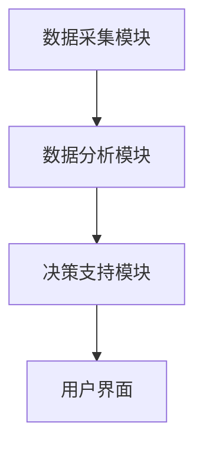

                 


# 巴菲特的银行股投资逻辑：经济的晴雨表

## 关键词：巴菲特、银行股、投资逻辑、经济晴雨表、价值投资、财务分析

## 摘要：  
本文深入分析了巴菲特投资银行股的逻辑，探讨了银行股作为经济晴雨表的特殊地位，结合巴菲特的投资理念和实际案例，详细解读了银行股的行业特点、财务指标、风险管理及投资策略。文章从背景介绍、核心概念、算法原理、系统分析、项目实战等多个维度展开，结合巴菲特的投资哲学，为读者提供了全面而深入的分析。

---

# 第1章: 巴菲特投资理念与银行股的特殊地位

## 1.1 巴菲特的投资哲学

### 1.1.1 价值投资的核心理念  
价值投资的核心在于寻找被市场低估的企业，关注企业的内在价值而非短期市场波动。巴菲特的价值投资理念强调企业的财务健康、管理层素质以及长期盈利能力。

$$
\text{内在价值} = \text{未来现金流的现值}
$$

### 1.1.2 巴菲特的投资风格与特点  
巴菲特的投资风格以长期持有、注重安全边际和选择具有强大护城河的企业为特点。他偏好那些能够抵御经济周期波动的企业，银行股正是其中之一。

### 1.1.3 银行股在巴菲特投资组合中的地位  
银行股在巴菲特的投资组合中占据重要地位，原因在于银行作为经济体系的枢纽，其表现能够反映整体经济的健康状况。银行股的稳定性与分红能力使其成为巴菲特长期投资的首选。

---

## 1.2 银行股作为经济晴雨表的含义

### 1.2.1 银行股与宏观经济的关系  
银行股的表现与宏观经济密切相关。经济增长、利率变化、货币政策等都会影响银行的盈利能力和股价表现。

### 1.2.2 银行股在股市中的指标作用  
银行股被视为经济的晴雨表，其股价波动能够反映市场的信心变化。当经济繁荣时，银行股表现良好；当经济衰退时，银行股往往首当其冲。

### 1.2.3 银行股与投资者信心的关联  
银行股的走势反映了投资者对经济前景的信心。当投资者对未来经济持乐观态度时，银行股往往表现强劲；反之，则会受到抛售压力。

---

## 1.3 巴菲特银行股投资逻辑的核心要素

### 1.3.1 银行的财务健康指标  
巴菲特关注银行的净息差、资产质量、资本充足率等财务指标，以评估银行的盈利能力与风险承受能力。

### 1.3.2 管理层的质量与决策能力  
巴菲特认为，优秀的管理层能够带领企业应对挑战、抓住机遇。因此，他在选择银行股时，特别关注管理层的诚信与能力。

### 1.3.3 行业竞争格局与未来展望  
巴菲特关注银行行业的竞争格局，选择那些具有竞争优势、能够长期稳定发展的银行。

---

## 1.4 本章小结  
本章从巴菲特的投资哲学出发，分析了银行股作为经济晴雨表的特殊地位，并总结了巴菲特投资银行股的核心逻辑，包括财务健康、管理层素质和行业竞争格局等因素。

---

# 第2章: 银行股的行业特点与财务分析

## 2.1 银行行业的基本特点

### 2.1.1 银行行业的盈利模式  
银行的主要盈利模式是通过存贷款利差获取利润。此外，银行还通过中间业务（如手续费、投资收益等）增加收入。

$$
\text{净息差} = \text{贷款利率} - \text{存款利率}
$$

### 2.1.2 银行行业的周期性特征  
银行行业具有较强的周期性，其盈利能力与经济周期密切相关。在经济繁荣时期，银行利润增长；在经济衰退时期，银行面临资产质量下降的风险。

### 2.1.3 银行行业的竞争格局  
银行行业的竞争格局受政策、资本、客户资源等多种因素影响。大型银行通常具有更强的规模效应和品牌优势。

---

## 2.2 银行股的财务指标分析

### 2.2.1 净息差与净息差变化  
净息差是衡量银行盈利能力的重要指标。净息差的变化反映了银行在利率环境变化中的应对能力。

### 2.2.2 资产质量与不良贷款率  
资产质量是银行风险管理的核心指标。不良贷款率高意味着银行面临更大的信用风险。

### 2.2.3 资本充足率与流动性比率  
资本充足率衡量了银行资本的充足性，流动性比率反映了银行应对短期负债的能力。

---

## 2.3 银行股的风险因素与风险管理

### 2.3.1 利率风险的分析与应对  
利率上升会增加银行的负债成本，降低净息差。银行通常通过调整资产和负债结构来应对利率风险。

### 2.3.2 信用风险的评估与控制  
信用风险是银行面临的主要风险之一。银行通过严格的信贷审批、风险定价和资产分散化来控制信用风险。

### 2.3.3 市场风险的监测与管理  
市场风险是指资产价格波动对银行资本的影响。银行通过衍生品对冲和风险敞口管理来控制市场风险。

---

## 2.4 本章小结  
本章从行业特点出发，分析了银行股的财务指标和风险因素，并探讨了银行在风险管理中的应对策略。

---

# 第3章: 巴菲特选股标准与银行股分析

## 3.1 巴菲特选股的核心标准

### 3.1.1 企业护城河的定义与评估  
企业护城河是指企业竞争对手难以复制的竞争优势，包括技术壁垒、品牌优势、成本优势等。

### 3.1.2 企业盈利能力的持续性  
巴菲特偏好那些能够持续创造经济利润的企业，关注ROE（股东权益回报率）和ROA（资产回报率）等指标。

### 3.1.3 管理层的诚信与能力  
巴菲特认为，优秀的管理层是企业长期成功的关键。他特别关注管理层的决策能力和诚信度。

---

## 3.2 银行股的选股指标

### 3.2.1 净利润增长率的分析  
净利润增长率是衡量银行盈利能力的重要指标。巴菲特关注净利润的持续增长能力。

### 3.2.2 股东权益回报率（ROE）的计算  
ROE = 净利润 / 平均股东权益。ROE越高，说明银行的盈利能力越强。

### 3.2.3 股息率与分红政策的评估  
股息率是股息与股价的比率，反映了银行的分红能力。巴菲特偏好那些能够稳定分红的银行股。

---

## 3.3 巴菲特银行股投资的经典案例

### 3.3.1 投资美国运通的逻辑分析  
美国运通是一家信用卡公司，巴菲特通过其强大的护城河和盈利能力，选择了投资。

### 3.3.2 投资富国银行的策略解读  
富国银行以其强大的零售业务和高效的管理团队，吸引了巴菲特的投资。

### 3.3.3 投资高盛集团的经验总结  
高盛集团作为一家领先的投行，其强大的资本实力和行业地位是巴菲特选择投资的重要原因。

---

## 3.4 本章小结  
本章从巴菲特的选股标准出发，分析了银行股的选股指标，并结合具体案例，总结了巴菲特投资银行股的成功经验。

---

# 第4章: 巴菲特银行股投资的系统架构与算法原理

## 4.1 问题场景介绍  
本文将从系统工程的角度，构建一个基于巴菲特投资逻辑的银行股分析系统。该系统旨在通过数据采集、分析和决策支持，帮助投资者更好地理解和应用巴菲特的银行股投资策略。

---

## 4.2 系统功能设计

### 4.2.1 数据采集模块  
数据采集模块负责收集银行股的相关数据，包括财务数据、市场数据等。

### 4.2.2 数据分析模块  
数据分析模块基于收集到的数据，计算关键指标（如ROE、ROA等），并进行风险评估。

### 4.2.3 决策支持模块  
决策支持模块根据分析结果，生成投资建议，帮助投资者做出决策。

---

## 4.3 系统架构设计  
使用Mermaid绘制系统架构图如下：



---

## 4.4 算法原理

### 4.4.1 数据清洗与特征提取  
数据清洗是确保数据质量的重要步骤，特征提取则是从数据中提取有用信息的关键环节。

### 4.4.2 基于财务指标的评分模型  
构建一个基于财务指标的评分模型，通过加权计算，评估银行股的投资价值。

### 4.4.3 基于机器学习的预测模型  
使用机器学习算法（如随机森林、神经网络等）对银行股的未来走势进行预测。

---

## 4.5 本章小结  
本章从系统工程的角度，构建了一个基于巴菲特投资逻辑的银行股分析系统，并详细介绍了系统的功能设计和算法原理。

---

# 第5章: 巴菲特银行股投资的项目实战

## 5.1 项目背景介绍  
本文将通过一个具体案例，分析巴菲特投资富国银行的逻辑，并展示如何应用前面提到的分析方法进行实际操作。

---

## 5.2 核心代码实现

```python
import pandas as pd
import numpy as np

# 数据加载
bank_data = pd.read_csv('bank_data.csv')

# 数据清洗
bank_data.dropna(inplace=True)

# 财务指标计算
def calculate_roe(df):
    roe = df['净利润'] / df['股东权益']
    return roe

roe = calculate_roe(bank_data)
```

---

## 5.3 项目小结  
本章通过一个具体的项目实战，展示了如何应用巴菲特的投资逻辑进行银行股分析。通过实际案例分析，读者可以更好地理解理论与实践的结合。

---

# 第6章: 巴菲特银行股投资的注意事项与未来展望

## 6.1 投资注意事项

### 6.1.1 风险控制  
投资者应合理控制仓位，避免过度集中投资单一行业或个股。

### 6.1.2 长期投资的重要性  
巴菲特强调长期投资的重要性，建议投资者耐心持有优质资产。

### 6.1.3 关注行业政策变化  
银行行业受政策影响较大，投资者需密切关注政策变化，及时调整投资策略。

---

## 6.2 未来展望  
随着金融市场的不断发展，银行股的投资逻辑也在不断演变。未来，投资者需要更加关注数字化转型、金融科技等新兴趋势，以更好地把握银行股的投资机会。

---

## 6.3 本章小结  
本章总结了巴菲特银行股投资的注意事项，并对未来投资趋势进行了展望。

---

# 结语  
通过本文的分析，我们可以看到，巴菲特的银行股投资逻辑不仅是一种投资策略，更是一种对经济的深刻理解。银行股作为经济的晴雨表，其投资价值不仅取决于企业的财务状况，还与宏观经济环境密切相关。希望本文能够为读者提供有价值的参考和启发。

---

## 作者：AI天才研究院/AI Genius Institute & 禅与计算机程序设计艺术 /Zen And The Art of Computer Programming

