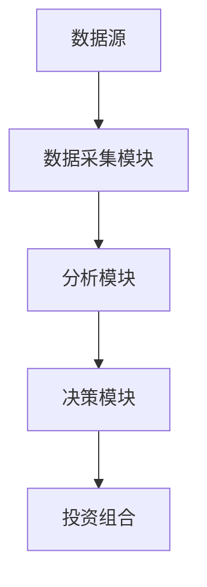

                 

# 巴菲特的集中投资理念：下重注于最佳机会

> 关键词：巴菲特，集中投资，投资理念，投资策略，投资组合，投资哲学，投资分析

> 摘要：本文将深入探讨巴菲特的集中投资理念，分析其核心思想、数学模型、系统架构及实战案例。通过结合技术语言和专业分析，本文将帮助读者理解如何在投资领域实现长期稳定的收益。

---

## 第一部分：巴菲特投资理念的背景与基础

### 第1章：巴菲特投资理念概述

#### 1.1 巴菲特的生平与投资哲学

- **1.1.1 巴菲特的生平简介**
  - 巴菲特于1934年出生，被誉为“股神”，是价值投资的代表人物。
  - 他的投资哲学强调长期价值，而非短期波动。

- **1.1.2 巴菲特的投资哲学与价值观**
  - 价值投资的核心：寻找市场先生的错误定价。
  - 巴菲特的“护城河”理论：选择具有强大竞争优势的企业。

- **1.1.3 巴菲特的成功秘诀与启示**
  - 长期专注，避免短期市场的干扰。
  - 以合理价格买入优秀企业，长期持有。

#### 1.2 集中投资理念的起源与发展

- **1.2.1 集中投资理念的定义与核心要素**
  - 集中投资：将大部分资金投入到少数优质企业中。
  - 核心要素：企业质量、行业地位、财务健康。

- **1.2.2 巴菲特集中投资理念的历史背景**
  - 受其导师本·格雷厄姆的影响，强调安全边际。
  - 集中投资在20世纪的发展与演变。

- **1.2.3 集中投资理念在现代投资中的地位**
  - 与现代投资组合理论的对比。
  - 集中投资在风险控制中的作用。

---

### 第2章：集中投资理念的核心概念

#### 2.1 集中投资的核心要素

- **2.1.1 集中投资的核心要素分析**
  - 选择少数优质企业，避免分散风险。
  - 重点分析企业的竞争优势和长期盈利能力。

- **2.1.2 集中投资与分散投资的对比**
  - 效益：集中投资可能带来更高的收益，但也伴随更高的风险。
  - 风险：分散投资降低风险，但可能错过大额收益。

- **2.1.3 集中投资的风险与收益分析**
  - 风险：市场波动可能导致重大损失。
  - 收益：长期来看，优质企业的复利效应显著。

#### 2.2 集中投资的理论基础

- **2.2.1 投资组合理论**
  - 马科维茨的有效前沿理论：如何构建最优投资组合。
  - 投资组合的期望收益与方差计算。

- **2.2.2 资产定价模型**
  - CAPM模型：资本资产定价模型。
  - 如何评估资产的预期收益。

- **2.2.3 集中投资与现代投资组合理论的结合**
  - 如何在集中投资中应用现代投资组合理论。

---

### 第3章：集中投资理念的数学模型与公式

#### 3.1 投资组合的数学模型

- **3.1.1 投资组合的期望收益与方差计算**
  - 期望收益公式：$$E(r_p) = \sum w_i E(r_i)$$
  - 方差公式：$$Var(r_p) = \sum w_i^2 Var(r_i) + 2\sum w_i w_j Cov(r_i, r_j)$$

- **3.1.2 马科维茨的有效前沿理论**
  - 有效前沿：在给定风险下，收益最大的组合；或在给定收益下，风险最小的组合。

- **3.1.3 集中投资对风险收益的影响**
  - 集中投资的夏普比率：$$\text{夏普比率} = \frac{E(r_p) - r_f}{\sigma_p}$$

#### 3.2 巴菲特集中投资理念的数学公式

- **3.2.1 投资组合的夏普比率计算**
  - 如何通过夏普比率评估投资组合的风险调整后收益。

- **3.2.2 集中投资的风险调整后收益模型**
  - 如何计算集中投资的预期收益与风险。

- **3.2.3 长期投资收益的复利公式**
  - 复利公式：$$A = P(1 + r)^n$$

---

### 第4章：集中投资的系统分析与架构设计

#### 4.1 投资系统的总体架构

- **4.1.1 投资系统的功能模块划分**
  - 数据采集模块：收集市场数据。
  - 分析模块：评估企业价值。
  - 决策模块：制定投资策略。

- **4.1.2 投资系统的数据流分析**
  - 数据流图：从数据源到决策输出的流程。

- **4.1.3 投资系统的系统架构图（Mermaid）**

#### 4.2 投资组合的构建与优化

- **4.2.1 投资组合的目标设定**
  - 确定风险承受能力与收益目标。

- **4.2.2 投资组合的优化算法**
  - 使用数学优化方法（如凸优化）构建最优投资组合。

- **4.2.3 投资组合的风险控制策略**
  - 如何通过集中投资降低风险。

---

### 第5章：集中投资的实战案例分析

#### 5.1 巴菲特的经典投资案例

- **5.1.1 可口可乐的投资案例分析**
  - 长期持有可口可乐的逻辑。
  - 企业的竞争优势与长期盈利能力。

- **5.1.2 伯克希尔 Hathaway 的投资策略**
  - 伯克希尔的投资组合构成。
  - 集中投资的实际应用。

- **5.1.3 高通与 IBM 的投资决策**
  - 选择具有强大护城河的企业。

#### 5.2 投资组合的实际操作步骤

- **5.2.1 投资目标的设定与分析**
  - 明确投资目标与风险偏好。

- **5.2.2 投资标的的选择与评估**
  - 选择优质企业，评估其财务健康与行业地位。

- **5.2.3 投资组合的构建与调整**
  - 根据市场变化调整投资组合。

---

### 第6章：集中投资的

--- 

作者：AI天才研究院/AI Genius Institute & 禅与计算机程序设计艺术 /Zen And The Art of Computer Programming

