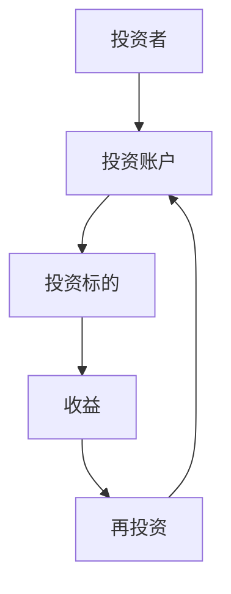

                 


# 巴菲特的雪球理论：复利效应在投资中的应用

> 关键词：巴菲特，雪球理论，复利效应，投资策略，长期投资

> 摘要：本文深入探讨了巴菲特的雪球理论及其在投资中的应用。通过分析复利效应的数学模型、雪球效应的形成机制以及长期投资策略，本文为读者提供了从理论到实践的全面指导。结合实际案例和系统设计，帮助投资者理解如何通过雪球效应实现财富的指数级增长。

---

## 第一部分：雪球理论的背景与基础

### 第1章：雪球理论的起源与巴菲特的投资理念

#### 1.1 雪球理论的起源

雪球理论由投资大师巴菲特提出，核心理念是通过长期持有优质资产，利用复利效应实现财富的指数级增长。这种投资策略强调选择具有持续竞争优势和良好管理的公司，逐步增加投资规模，从而形成滚雪球效应。

**关键术语说明：**
- **雪球理论**：通过长期投资优质资产，利用复利效应实现财富的指数级增长。
- **复利效应**：收益的再投资带来的指数级增长。

**问题背景：**
传统投资方法通常关注短期收益，而雪球理论则强调长期稳健增长。在金融市场中，许多投资者倾向于频繁交易，试图通过短期波动获利，但这种方法往往风险较高且难以实现稳定增长。

**问题解决：**
雪球理论通过选择优质资产和长期持有，降低投资风险，同时利用复利效应放大收益。这种方法特别适合那些希望实现财富稳步增长的投资者。

**边界与外延：**
雪球理论适用于长期投资，但不适用于短期投机。其外延包括价值投资、风险管理等投资策略。

**核心要素：**
- 投资标的：优质企业。
- 投资期限：长期持有。
- 收益放大：复利效应。

---

#### 1.2 复利效应的基本概念

复利效应是指在投资中将获得的收益再投资，从而在每个时间段内获得更多的收益。这种效应随着时间的推移呈指数级增长，是雪球理论的核心驱动力。

**公式：$$A = P(1 + r)^n$$**
- **A**：最终金额。
- **P**：初始本金。
- **r**：年化收益率。
- **n**：投资年数。

**特征对比：**
| 特性 | 单利 | 复利 |
|------|------|------|
| 计算方式 | 每年只计算本金的利息 | 每年计算本金及累计利息的利息 |
| 增长速度 | 线性增长 | 指数增长 |
| 适用场景 | 短期投资 | 长期投资 |

**ER实体关系图：**
```mermaid
er
actor Investor
concept Investment
concept Return
rule 复利计算
rule 利息再投资
```

---

#### 1.3 投资中的雪球效应

雪球效应是指投资收益随着时间推移呈指数级增长的现象。它依赖于优质资产的选择和长期持有。

**区别与联系：**
| 方面 | 复利效应 | 雪球效应 |
|------|---------|---------|
| 核心 | 利息再投资 | 资产增值 |
| 适用 | 适用于所有投资 | 适用于优质资产 |

**形成机制：**
1. **选择优质资产**：投资于具有持续竞争优势的企业。
2. **长期持有**：避免频繁交易，享受复利效应。
3. **收益再投资**：将收益用于购买更多资产，放大收益。

---

## 第二部分：雪球理论的核心概念与数学模型

### 第2章：复利效应的数学模型与公式

#### 2.1 复利计算的基本公式

**复利公式：$$A = P(1 + r)^n$$**
- 例如：初始投资100元，年化收益率10%，投资10年，最终金额为$$100(1 + 0.1)^{10} ≈ 259.37$$元。

**年金公式：$$A = P \times \frac{(1 + r)^n - 1}{r}$$**
- 适用于定期定额投资。

---

#### 2.2 雪球效应的数学模型

**累积公式：$$A = P \times (1 + r)^n$$**
- 雪球效应通过复利公式实现，强调长期投资。

**指数增长模型：$$A = P \times e^{rt}$$**
- 在收益率和时间固定的条件下，雪球效应的表现。

---

## 第三部分：雪球效应在投资中的应用

### 第3章：雪球效应在股票投资中的应用

#### 3.1 股票投资中的雪球效应

**步骤：**
1. **选择优质企业**：关注ROE、ROA等财务指标。
2. **长期持有**：避免短期波动影响。
3. **定期定额投资**：通过复利效应积累财富。

**案例分析：**
- 初始投资10000元，年化收益率8%，投资30年，最终金额为$$10000(1 + 0.08)^{30} ≈ 115889.16$$元。

---

## 第四部分：系统分析与架构设计

### 第4章：雪球效应的投资模型

#### 4.1 系统架构设计



---

## 第五部分：项目实战

### 第5章：雪球效应的实际应用

#### 5.1 环境安装

- **工具**：Python、Jupyter Notebook。
- **数据源**：历史股价数据。

---

#### 5.2 核心实现代码

```python
import numpy as np
import matplotlib.pyplot as plt

# 初始投资
P = 10000
# 年化收益率
r = 0.1
# 投资时间
n = 30

# 计算最终金额
A = P * (1 + r) ** n
print(f"最终金额：{A:.2f}元")

# 可视化
years = np.arange(0, n+1)
values = P * (1 + r) ** years
plt.plot(years, values)
plt.xlabel('年数')
plt.ylabel('金额')
plt.title('复利效应的可视化')
plt.show()
```

---

## 第六部分：最佳实践

### 第6章：雪球效应的实践技巧

#### 6.1 小结

雪球效应通过复利效应实现财富的指数级增长，关键在于选择优质资产和长期持有。

---

## 作者

作者：AI天才研究院 & 禅与计算机程序设计艺术

---

通过本文的详细讲解，读者可以深入了解巴菲特的雪球理论，并通过实际案例和系统设计掌握其在投资中的应用。

