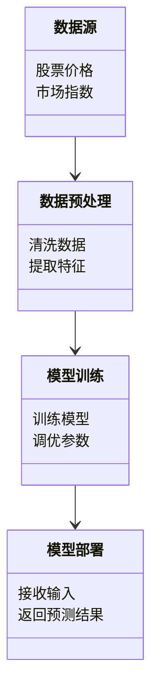
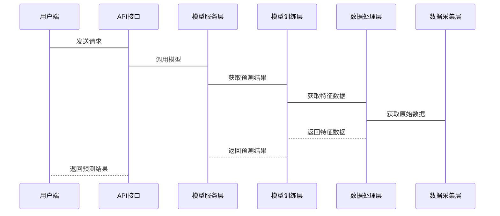

                 


# 市场趋势预测模型

> 关键词：市场趋势预测模型, 数据分析, 机器学习, 时间序列, LSTM, Transformer, 系统架构

> 摘要：本文将详细探讨市场趋势预测模型的构建与应用，从数据分析到特征工程，从机器学习算法到深度学习模型，从系统架构设计到项目实战，最后到模型优化与部署，全面解析市场趋势预测的核心技术与实践方法。

---

# 第一部分: 市场趋势预测模型的背景与概述

## 第1章: 市场趋势预测模型概述

### 1.1 市场趋势预测模型的背景与重要性

#### 1.1.1 市场趋势预测的定义与作用
市场趋势预测是指通过分析历史数据和市场动态，预测未来市场变化方向和幅度的过程。其作用在于帮助企业做出更科学的决策，优化资源配置，降低市场风险。

#### 1.1.2 市场趋势预测的核心问题
- 数据的不确定性：市场数据往往受到多种因素影响，具有随机性和波动性。
- 数据的时序性：市场趋势通常具有时间依赖性，需要考虑时间序列的影响。
- 模型的可解释性：在实际应用中，模型的可解释性对于决策者来说至关重要。

#### 1.1.3 市场趋势预测的边界与外延
- 边界：市场趋势预测通常关注短期到中期的市场变化，长周期预测的准确性较低。
- 外延：市场趋势预测可以应用于股票、商品、房地产等多个领域。

### 1.2 市场趋势预测模型的基本概念

#### 1.2.1 数据驱动与模型驱动的预测方法
- 数据驱动：基于历史数据，通过统计方法或机器学习模型进行预测。
- 模型驱动：基于理论或假设，构建数学模型进行预测。

#### 1.2.2 市场趋势预测模型的分类
- 时间序列模型：ARIMA、LSTM等。
- 机器学习模型：线性回归、随机森林、支持向量机等。
- 深度学习模型：Transformer、GRU等。

#### 1.2.3 市场趋势预测模型的核心要素
- 数据：高质量、相关性高的数据是模型准确性的基础。
- 模型：选择合适的算法和模型结构。
- 参数：模型参数的优化与调整。

### 1.3 市场趋势预测的方法论

#### 1.3.1 定性分析与定量分析的区别
- 定性分析：基于经验和市场洞察，进行定性判断。
- 定量分析：基于数据和模型，进行定量预测。

#### 1.3.2 数据分析在市场趋势预测中的作用
- 数据清洗与预处理：确保数据质量。
- 特征提取：发现数据中的关键特征。
- 模型训练：基于特征进行预测。

#### 1.3.3 市场趋势预测的步骤与流程
1. 数据收集：获取相关的市场数据。
2. 数据预处理：清洗、标准化、特征提取。
3. 模型选择：根据数据特点选择合适的算法。
4. 模型训练：训练模型并调整参数。
5. 模型评估：验证模型的准确性和稳定性。
6. 预测与应用：基于模型进行市场趋势预测，并应用于实际业务。

## 第2章: 数据分析与特征工程

### 2.1 数据预处理与特征提取

#### 2.1.1 数据清洗的基本方法
- 去除重复数据。
- 填充缺失值：均值、中位数、插值法。
- 处理异常值：过滤法、归一化法。

#### 2.1.2 数据标准化与归一化的区别
- 标准化：将数据按比例缩放到均值为0，标准差为1。
- 归一化：将数据缩放到0-1范围。

#### 2.1.3 数据特征的提取与选择
- 时间序列特征：均值、方差、趋势、周期性。
- 技术指标：移动平均线（MA）、相对强弱指数（RSI）、MACD等。

### 2.2 时间序列数据分析

#### 2.2.1 时间序列数据的特性
- 趋势性：数据整体呈上升或下降趋势。
- 季节性：数据在固定周期内呈现规律性波动。
- 随机性：数据无明显规律的波动。

#### 2.2.2 常见的时间序列分析方法
- 描述性分析：均值、标准差、趋势分析。
- 图形分析：折线图、柱状图、箱线图。

#### 2.2.3 时间序列数据的可视化
- 使用Matplotlib绘制时间序列图。
- 使用Pandas进行数据处理。
- 使用Seaborn进行数据可视化。

### 2.3 数据特征的降维与分析

#### 2.3.1 主成分分析（PCA）的基本原理
- PCA是一种无监督学习方法，用于降维。
- 原理：找到数据的主要成分，提取特征。

#### 2.3.2 独立成分分析（ICA）的应用
- ICA用于将混合信号分离成独立的成分。

#### 2.3.3 特征重要性评估与选择
- 使用特征重要性评分（如随机森林的feature importance）选择关键特征。

---

# 第二部分: 机器学习与深度学习模型

## 第3章: 传统机器学习模型

### 3.1 线性回归模型

#### 3.1.1 线性回归的数学公式
$$y = \beta_0 + \beta_1 x + \epsilon$$

#### 3.1.2 线性回归的应用
- 预测房价：根据面积、位置等特征预测房价。
- 预测销售额：根据历史销售数据预测未来销售额。

### 3.2 支持向量机（SVM）

#### 3.2.1 SVM的基本原理
- SVM通过构建超平面将数据分为不同类别。
- 使用核函数进行非线性分类。

### 3.3 随机森林与梯度提升树

#### 3.3.1 随机森林的原理
- 随机森林是一种基于决策树的集成学习方法。

#### 3.3.2 梯度提升树的原理
- 使用梯度提升算法构建多个决策树，提升模型性能。

## 第4章: 时间序列预测的深度学习模型

### 4.1 长短期记忆网络（LSTM）

#### 4.1.1 LSTM的基本结构
- 细胞状态（Cell State）：记忆单元。
- 输入门（Input Gate）：控制信息流入。
- 遗忘门（Forget Gate）：控制信息遗忘。
- 输出门（Output Gate）：控制信息输出。

#### 4.1.2 LSTM在时间序列预测中的应用
- 股票价格预测。
- 汇率预测。

### 4.2 Transformer模型

#### 4.2.1 Transformer的基本原理
- 基于自注意力机制（Self-Attention）。
- 包含编码器和解码器两个部分。

#### 4.2.2 Transformer在时间序列预测中的优势
- 能够捕捉长距离依赖关系。
- 并行计算效率高。

---

# 第三部分: 系统架构与实现

## 第5章: 系统架构设计

### 5.1 问题场景介绍
- 数据源：股票价格、市场指数等。
- 数据处理：清洗、特征提取。
- 模型训练：选择合适的算法，训练模型。
- 模型部署：将模型部署到生产环境。

### 5.2 系统功能设计

#### 5.2.1 领域模型


### 5.3 系统架构设计


### 5.4 系统接口设计

#### 5.4.1 数据接口
- 输入：时间序列数据。
- 输出：预处理后的数据。

#### 5.4.2 模型接口
- 输入：特征向量。
- 输出：预测结果。

### 5.5 系统交互设计



---

# 第四部分: 项目实战

## 第6章: 项目实战与案例分析

### 6.1 项目背景
- 数据来源：某股票的历史价格数据。
- 数据预处理：清洗、特征提取。
- 模型选择：LSTM。

### 6.2 环境安装
```python
# 安装依赖
pip install numpy pandas matplotlib keras tensorflow
```

### 6.3 核心实现

#### 6.3.1 数据预处理
```python
import pandas as pd
import numpy as np

# 读取数据
data = pd.read_csv('stock_price.csv')

# 清洗数据
data = data.dropna()

# 特征提取
data['log_return'] = np.log(data['close'] / data['open'])
```

#### 6.3.2 模型训练
```python
from keras.models import Sequential
from keras.layers import LSTM, Dense

# 构建模型
model = Sequential()
model.add(LSTM(64, input_shape=(timesteps, features)))
model.add(Dense(1))
model.compile(loss='mean_squared_error', optimizer='adam')

# 训练模型
model.fit(X_train, y_train, epochs=100, batch_size=32)
```

### 6.4 案例分析
- 数据准备：获取某股票的历史价格数据。
- 模型训练：使用LSTM模型进行训练。
- 结果分析：对比实际值与预测值，评估模型性能。

---

# 第五部分: 模型优化与部署

## 第7章: 模型优化与部署

### 7.1 模型优化策略

#### 7.1.1 超参数调优
- 调整学习率、批量大小、 epochs 等参数。

#### 7.1.2 特征选择
- 使用特征重要性评分选择关键特征。

### 7.2 模型的实时部署

#### 7.2.1 使用Flask部署API
```python
from flask import Flask, request, jsonify

app = Flask(__name__)
model = load_model('model.h5')

@app.route('/predict', methods=['POST'])
def predict():
    data = request.json['data']
    prediction = model.predict(np.array(data).reshape(1, -1))
    return jsonify({'prediction': float(prediction[0][0])})
```

#### 7.2.2 模型的实时监控
- 监控模型的预测误差。
- 定期重新训练模型，更新参数。

---

# 小结

本文详细探讨了市场趋势预测模型的构建与应用，从数据分析到特征工程，从机器学习算法到深度学习模型，从系统架构设计到项目实战，最后到模型优化与部署，全面解析了市场趋势预测的核心技术与实践方法。通过本文的学习，读者可以掌握市场趋势预测的基本原理和实际应用技巧，为后续的深入研究和实践打下坚实基础。

---

作者：AI天才研究院/AI Genius Institute & 禅与计算机程序设计艺术 /Zen And The Art of Computer Programming

