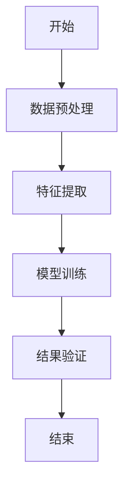
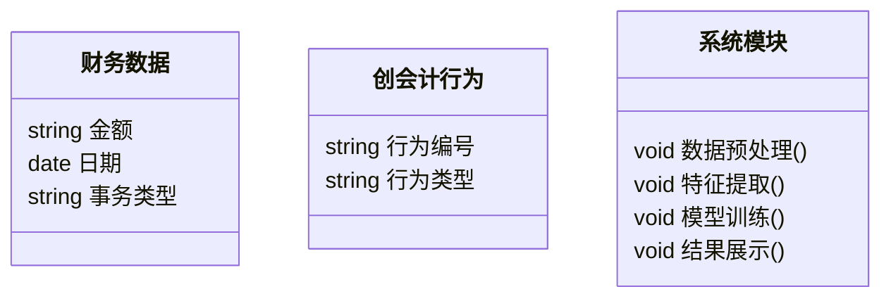
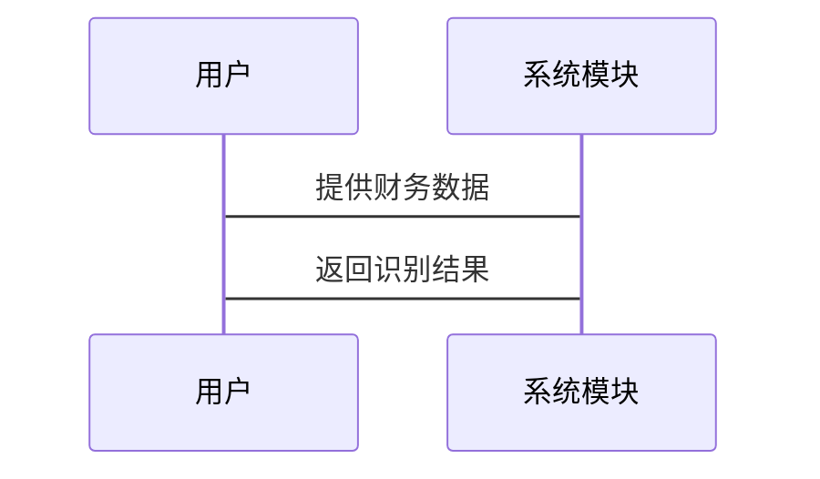

                 


# 布鲁斯·格林沃尔德的创造性会计识别方法

> 关键词：创造性会计、识别方法、算法原理、系统架构、项目实战

> 摘要：本文深入探讨了布鲁斯·格林沃尔德提出的创造性会计识别方法，从理论基础、算法实现、系统架构到实际项目案例，全面分析了该方法的原理和应用。通过详细的技术分析和实例解读，本文为读者提供了从理论到实践的完整指南，帮助读者理解并掌握这一创新性的会计识别技术。

---

# 第一部分: 创造性会计识别方法的背景与核心概念

## 第1章: 创造性会计识别方法的背景介绍

### 1.1 创造性会计识别的定义与问题背景
#### 1.1.1 创造性会计的定义
创造性会计是一种通过创造性地运用会计准则和方法，以达到特定财务目标的行为。它可能涉及对会计政策的灵活运用、数据的重新解释或特定会计处理的创新，以实现财务报表的优化或隐藏某些事实。

#### 1.1.2 创造性会计识别的必要性
随着企业复杂性的增加，财务报表的准确性变得至关重要。创造性会计行为可能导致财务报表失真，影响投资者、债权人和其他利益相关者的决策。因此，识别创造性会计行为是确保财务透明性和合规性的关键。

#### 1.1.3 创造性会计识别的边界与外延
创造性会计识别的边界在于区分合法的会计创新与不当的会计 manipulation。其外延包括对财务数据的分析、对会计政策的审查以及对财务报表的验证。

### 1.2 创造性会计识别的核心要素
#### 1.2.1 会计信息的完整性与真实性
完整性与真实性是财务报表质量的基石。创造性会计识别方法需要确保财务数据的完整性和真实性。

#### 1.2.2 创造性会计行为的特征分析
创造性会计行为通常具有以下特征：
- 数据的非线性关系
- 行为的隐蔽性
- 方法的创新性

#### 1.2.3 创造性会计识别的逻辑框架
识别创造性会计行为需要结合会计知识、数据分析技术和逻辑推理，构建一个多层次的识别框架。

### 1.3 创造性会计识别的理论基础
#### 1.3.1 会计学基础理论
会计学的理论基础包括资产、负债、所有者权益、收入和费用等基本概念，为创造性会计识别提供了理论依据。

#### 1.3.2 创造性会计行为的经济学分析
从经济学的角度，创造性会计行为可能是企业为了实现特定经济目标而采取的策略。

#### 1.3.3 创造性会计识别的法律框架
法律对会计行为有明确的规定，识别创造性会计行为需要结合相关法律法规。

### 1.4 创造性会计识别的实际案例
#### 1.4.1 典型创造性会计行为案例分析
通过具体案例分析，揭示创造性会计行为的表现形式和潜在风险。

#### 1.4.2 创造性会计识别的现实意义
说明创造性会计识别在实际中的应用价值和必要性。

#### 1.4.3 创造性会计识别的未来趋势
预测创造性会计识别技术的发展方向和潜在挑战。

### 1.5 本章小结
本章从背景、定义、必要性、特征、理论基础和实际案例等方面，全面介绍了创造性会计识别方法的背景知识。

---

## 第2章: 创造性会计识别的核心概念与联系

### 2.1 创造性会计识别的核心原理
#### 2.1.1 创造性会计识别的逻辑模型
通过逻辑模型，展示创造性会计识别的基本流程和关键步骤。

#### 2.1.2 创造性会计识别的关键步骤
包括数据收集、特征提取、模型训练和结果验证等步骤。

#### 2.1.3 创造性会计识别的数学模型
介绍数学模型，如决策树、随机森林等，用于分类和预测。

### 2.2 创造性会计识别的核心概念对比
#### 2.2.1 创造性会计与传统会计的对比
分析两者的异同点，突出创造性会计的独特性。

#### 2.2.2 创造性会计识别与财务审计的对比
比较两者的侧重点和方法，说明创造性会计识别的独特优势。

#### 2.2.3 创造性会计识别与其他反舞弊方法的对比
通过对比，突出创造性会计识别方法的创新性和适用性。

### 2.3 创造性会计识别的ER实体关系图
```mermaid
erDiagram
    actor 财务人员 {
        key string 账号
        string 姓名
        string 权限
    }
    actor 审计人员 {
        key string 审计编号
        string 姓名
        string 审计报告
    }
    entity 会计信息 {
        key string 会计科目
        string 金额
        date 日期
        string 事务类型
    }
    entity 创造性会计行为 {
        key string 行为编号
        string 行为类型
        date 发生时间
        string 关联人员
    }
    财务人员 --> 会计信息 : 记录
    财务人员 --> 创造性会计行为 : 发现
    审计人员 --> 会计信息 :
```

---

## 第3章: 创造性会计识别的算法原理

### 3.1 算法选择与原理
#### 3.1.1 算法选择
选择适合的算法，如决策树、随机森林等，用于分类和预测。

#### 3.1.2 算法原理
通过mermaid流程图展示算法的步骤和逻辑。

### 3.2 算法实现
#### 3.2.1 算法流程图


#### 3.2.2 Python代码实现
```python
import pandas as pd
from sklearn.tree import DecisionTreeClassifier
from sklearn.model_selection import train_test_split
from sklearn.metrics import accuracy_score

# 加载数据
data = pd.read_csv('creative_accounting.csv')

# 数据预处理
X = data.drop('label', axis=1)
y = data['label']

# 划分训练集和测试集
X_train, X_test, y_train, y_test = train_test_split(X, y, test_size=0.2)

# 训练模型
model = DecisionTreeClassifier()
model.fit(X_train, y_train)

# 预测和评估
y_pred = model.predict(X_test)
print("Accuracy:", accuracy_score(y_test, y_pred))
```

### 3.3 算法的数学模型
#### 3.3.1 决策树模型
决策树是一种常见的分类算法，其数学模型可以用树状图表示，每个节点表示一个特征，每个分支表示一个决策。

#### 3.3.2 随机森林模型
随机森林是一种基于决策树的集成学习方法，通过多个决策树的投票结果进行预测。

---

## 第4章: 创造性会计识别的系统分析与架构设计

### 4.1 系统分析
#### 4.1.1 问题场景介绍
描述系统需要解决的问题和目标。

#### 4.1.2 系统功能设计
包括数据输入、特征提取、模型训练和结果展示等功能。

### 4.2 系统架构设计
#### 4.2.1 领域模型设计


#### 4.2.2 系统架构图


### 4.3 接口与交互设计
#### 4.3.1 系统接口设计
定义系统与外部交互的接口，如数据输入接口、结果输出接口等。

#### 4.3.2 系统交互图


---

## 第5章: 创造性会计识别的项目实战

### 5.1 环境安装与配置
#### 5.1.1 环境搭建
安装必要的开发工具和库，如Python、Pandas、Scikit-learn等。

### 5.2 系统核心实现
#### 5.2.1 核心代码实现
```python
# 加载数据
data = pd.read_csv('creative_accounting.csv')

# 数据预处理
X = data.drop('label', axis=1)
y = data['label']

# 划分训练集和测试集
X_train, X_test, y_train, y_test = train_test_split(X, y, test_size=0.2)

# 训练模型
model = DecisionTreeClassifier()
model.fit(X_train, y_train)

# 预测和评估
y_pred = model.predict(X_test)
print("Accuracy:", accuracy_score(y_test, y_pred))
```

#### 5.2.2 代码解读与分析
解释代码的功能和实现逻辑，说明每一步的作用。

### 5.3 实际案例分析
#### 5.3.1 案例背景
介绍具体案例的背景和数据来源。

#### 5.3.2 数据分析与结果展示
通过数据分析和结果展示，验证模型的有效性。

### 5.4 项目小结
总结项目实施的过程和成果，分析可能的改进方向。

---

## 第6章: 创造性会计识别的最佳实践、小结与注意事项

### 6.1 最佳实践
#### 6.1.1 数据预处理的技巧
分享数据预处理的关键技巧，如数据清洗、特征选择等。

#### 6.1.2 模型优化的建议
提供模型优化的建议，如参数调优、模型集成等。

### 6.2 小结
总结全文内容，强调创造性会计识别方法的重要性和应用价值。

### 6.3 注意事项
提醒读者在实际应用中需要注意的问题，如数据隐私、模型泛化能力等。

---

## 第7章: 总结与展望

### 7.1 总结
回顾全文，总结创造性会计识别方法的核心内容和技术要点。

### 7.2 展望
展望未来的研究方向，如更高级的算法、更复杂的模型等。

---

# 作者：AI天才研究院/AI Genius Institute & 禅与计算机程序设计艺术 /Zen And The Art of Computer Programming

