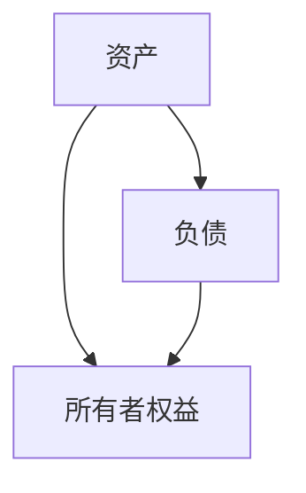
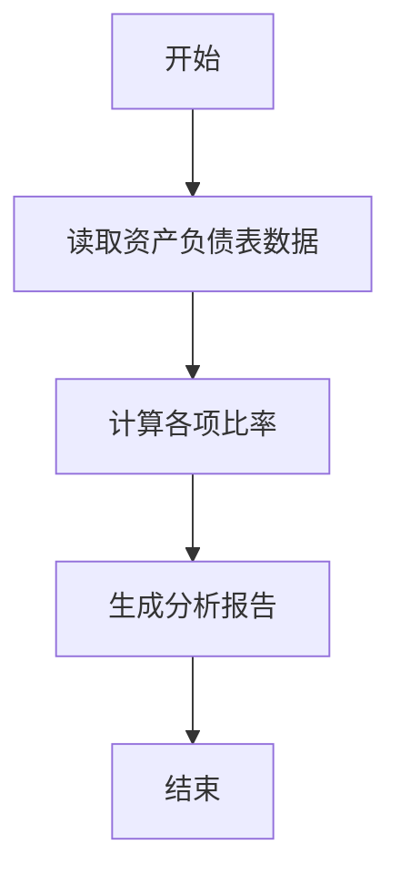
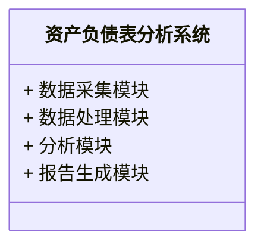

                 


# 布鲁斯·格林沃尔德的资产负债表深度分析

## 关键词：资产负债表分析，财务报表，资产、负债、所有者权益，财务比率，ROE，系统架构设计

## 摘要

本文深入分析了布鲁斯·格林沃尔德关于资产负债表的核心观点，从基础概念到高级分析方法，结合实际案例，探讨了如何通过资产负债表进行有效的财务分析和决策支持。文章内容涵盖了资产负债表的核心要素、分析框架、算法原理、系统架构设计以及项目实战，帮助读者全面理解并掌握资产负债表的深度分析方法。

---

## 目录大纲

1. **引言与背景**
   - 1.1 本书的目的与范围
   - 1.2 财务报表分析的背景
   - 1.3 资产负债表的重要性

2. **资产负债表基础**
   - 2.1 资产负债表的基本概念
   - 2.2 资产负债表的核心要素

3. **核心概念与分析框架**
   - 3.1 资产、负债、所有者权益的定义与分类
   - 3.2 资产负债表的核心概念联系
   - 3.3 资产负债表的分析框架

4. **算法原理与数学模型**
   - 4.1 资产负债表分析的算法原理
   - 4.2 财务比率分析方法
   - 4.3 ROE（净资产收益率）的计算与实现

5. **系统分析与架构设计**
   - 5.1 系统功能设计
   - 5.2 系统架构设计
   - 5.3 接口设计与交互流程

6. **项目实战与代码实现**
   - 6.1 环境安装与配置
   - 6.2 核心功能实现
   - 6.3 实际案例分析

7. **总结与最佳实践**
   - 7.1 核心内容回顾
   - 7.2 最佳实践与注意事项
   - 7.3 拓展阅读与学习方向

---

## 正文

### 第一部分：引言与背景

#### 1.1 本书的目的与范围

- **目的**：本篇文章旨在深入分析布鲁斯·格林沃尔德的资产负债表分析方法，帮助读者理解其核心观点和实际应用。
- **范围**：文章涵盖了从基础概念到高级分析方法的全过程，适合财务分析人员、程序员及技术管理人士阅读。

#### 1.2 财务报表分析的背景

- **背景介绍**：财务报表是企业财务健康状况的晴雨表，资产负债表作为三大报表之一，是分析企业财务状况的核心工具。
- **问题描述**：如何通过资产负债表进行有效的财务分析和决策支持？

### 第二部分：资产负债表基础

#### 2.1 资产负债表的基本概念

- **定义**：资产负债表是企业在某一特定日期的资产、负债和所有者权益的全面反映。
- **结构**：资产 = 负债 + 所有者权益。

#### 2.2 资产负债表的核心要素

- **资产**：企业拥有的资源，分为流动资产和非流动资产。
- **负债**：企业承担的债务，分为流动负债和非流动负债。
- **所有者权益**：企业的净资产，等于资产减去负债。

### 第三部分：核心概念与分析框架

#### 3.1 资产、负债、所有者权益的定义与分类

- **资产**：
  - 流动资产：现金、应收账款、存货等。
  - 非流动资产：固定资产、无形资产等。
- **负债**：
  - 流动负债：短期借款、应付账款等。
  - 非流动负债：长期借款、应付债券等。
- **所有者权益**：包括股本、资本公积、盈余公积等。

#### 3.2 资产负债表的核心概念联系



### 第四部分：算法原理与数学模型

#### 4.1 资产负债表分析的算法原理

- **流程图**：


#### 4.2 财务比率分析方法

- **ROE（净资产收益率）**：
  - 公式：ROE = 净利润 / 所有者权益
  - 代码实现：
    ```python
    def calculate_roe(net_profit, equity):
        return net_profit / equity
    ```
    ```mermaid
    graph TD
        A[净利润] --> B[所有者权益]
        B --> C[ROE]
    ```

### 第五部分：系统分析与架构设计

#### 5.1 系统功能设计

- **功能模块**：
  - 数据采集模块
  - 数据处理模块
  - 分析模块
  - 报告生成模块



### 第六部分：项目实战与代码实现

#### 6.1 环境安装与配置

- **安装Python**：使用Anaconda或Pyenv安装所需版本。
- **安装库**：安装pandas、numpy、matplotlib等。

#### 6.2 核心功能实现

- **数据处理代码**：
  ```python
  import pandas as pd

  # 读取资产负债表数据
  df = pd.read_csv('balance_sheet.csv')
  ```

- **分析代码**：
  ```python
  def calculate_ratio(df):
      roe = calculate_roe(df['净利润'], df['所有者权益'])
      return roe
  ```

### 第七部分：总结与最佳实践

#### 7.1 核心内容回顾

- 通过资产负债表分析，掌握企业的财务健康状况。
- 学习并应用ROE等财务比率，辅助决策。

#### 7.2 最佳实践与注意事项

- 定期更新数据，保持分析的时效性。
- 注意数据的准确性和完整性。

#### 7.3 拓展阅读与学习方向

- 进一步学习其他财务报表分析方法。
- 研究高级数据分析技术，如机器学习在财务分析中的应用。

---

## 作者：AI天才研究院 & 禅与计算机程序设计艺术

---

以上是文章的完整目录和大致内容，您可以根据具体需求进一步补充细节。

