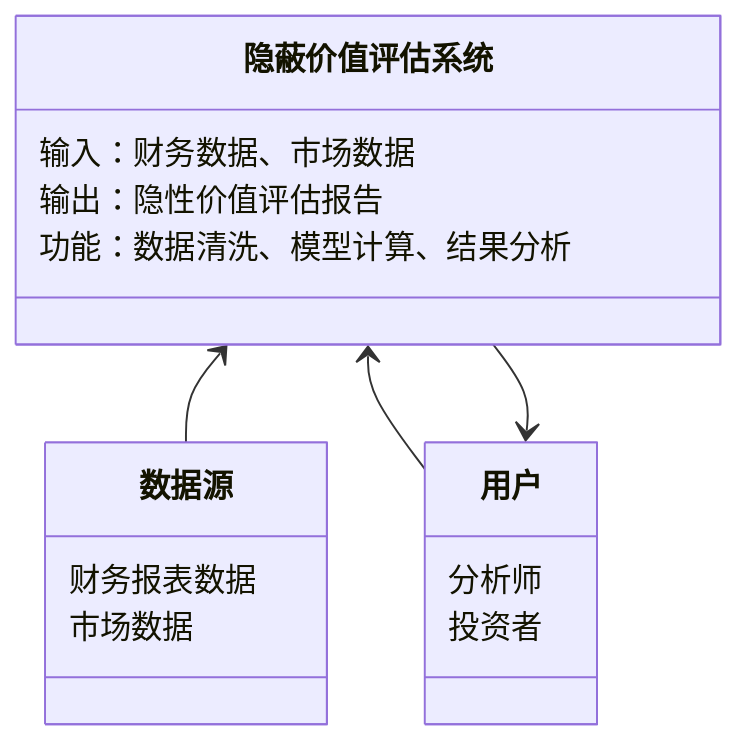

                 


# 布鲁斯·格林沃尔德的隐蔽价值：发掘资产负债表中的秘密

## 关键词：隐蔽价值、资产负债表、企业价值、布鲁斯·格林沃尔德、财务分析、价值评估

## 摘要：  
在企业价值评估中，资产负债表是最重要的财务报表之一，但其中隐藏的价值往往被忽视。本文将深入探讨布鲁斯·格林沃尔德的隐蔽价值理论，分析其在资产负债表中的体现，以及如何通过系统化的方法挖掘这些价值。通过案例分析和数学模型，我们将揭示隐藏在资产负债表中的秘密，帮助企业更好地进行价值评估和决策。

---

# 第一部分：隐蔽价值的背景与概念

## 第1章：隐蔽价值的定义与背景

### 1.1 隐蔽价值的定义  
- 隐蔽价值是指企业资产负债表中未直接列示，但对企业整体价值有重要影响的无形资产或潜在价值。  
- 这些价值通常体现在企业商誉、客户关系、品牌价值、人力资源等方面。  

### 1.2 隐蔽价值的来源  
| 来源类型 | 描述 | 示例 |
|----------|------|------|
| 商誉     | 企业并购中形成的溢价价值 | 收购价格高于账面价值的部分 |
| 客户关系 | 与客户建立的长期关系和信任 | 高客户忠诚度和复购率 |
| 品牌价值 | 品牌的知名度和美誉度 | 强大品牌带来的溢价能力 |
| 人力资源 | 核心团队的能力和凝聚力 | 高效团队带来的创新和效率提升 |

### 1.3 隐蔽价值的分类  
- **内在价值**：与企业内部资源和能力相关的价值，如技术专利、研发能力。  
- **外在价值**：与企业外部市场和环境相关的价值，如市场份额、客户基础。  
- **动态价值**：随时间和市场变化而波动的价值，如品牌影响力、行业趋势。  

---

## 第2章：隐蔽价值的核心概念

### 2.1 隐蔽价值的属性特征对比  
| 属性         | 隐蔽价值 | 其他资产类别 |
|--------------|----------|--------------|
| 可量性       | 部分可量化 | 完全可量化    |
| 可持久性     | 较高     | 较低         |
| 可转换性     | 低       | 高           |
| 风险敏感性   | 高       | 中           |

### 2.2 隐蔽价值的实体关系图  
```mermaid
erDiagram
    actor 顾客
    actor 供应商
    actor 竞争对手
    actor 股东
    entity 隐蔽价值
    entity 财务报表
    entity 企业价值
    隐蔽价值 --> 企业价值 : 影响
    隐蔽价值 --> 财务报表 : 反映
    顾客 --> 隐蔽价值 : 依赖
    供应商 --> 隐蔽价值 : 依赖
    竞争对手 --> 隐蔽价值 : 竞争
    股东 --> 隐蔽价值 : 依赖
```

---

# 第二部分：隐蔽价值的评估方法

## 第3章：隐蔽价值的理论基础

### 3.1 价值评估的基本原理  
- **现金流折现法（DCF模型）**：通过预测未来现金流并折现至现值，评估企业整体价值。  
  $$ V = \sum_{t=1}^{n} \frac{CF_t}{(1 + r)^t} $$
- **相对估值法**：通过与可比企业或行业平均水平的对比，估算企业价值。  

### 3.2 布鲁斯·格林沃尔德的理论框架  
- **三重价值模型**：  
  1. **市场价值**：基于市场交易的公允价值。  
  2. **内在价值**：基于企业未来现金流的现值。  
  3. **战略价值**：基于企业长期战略目标和竞争优势。  

### 3.3 隐蔽价值的数学模型  
- **隐含价值计算公式**：  
  $$ V_{\text{隐含}} = V_{\text{显性}} + V_{\text{隐性}} $$
  其中，$V_{\text{显性}}$为企业显性资产的公允价值，$V_{\text{隐性}}$为隐性资产的价值。  

---

## 第4章：隐蔽价值的评估工具与方法

### 4.1 财务比率分析  
- **关键财务比率**：  
  - ROE（净资产收益率）：$$ \text{ROE} = \frac{\text{净利润}}{\text{股东权益}} $$
  - ROA（资产净利率）：$$ \text{ROA} = \frac{\text{净利润}}{\text{总资产}} $$
  - 市盈率（P/E）：$$ \text{P/E} = \frac{\text{股价}}{\text{每股收益}} $$  

### 4.2 现金流分析  
- **现金流折现模型**：  
  $$ V = \sum_{t=1}^{n} \frac{CF_t}{(1 + r)^t} + \frac{TV}{(1 + r)^n} $$
  其中，$CF_t$为第t年的现金流，$r$为折现率，$TV$为终值。  

### 4.3 市场法评估  
- **可比企业分析**：通过与同行业企业的对比，估算隐性价值。  
- **溢价分析**：分析企业并购中的溢价部分，判断隐性价值的存在。  

---

# 第三部分：系统分析与架构设计

## 第5章：系统分析与架构设计

### 5.1 问题场景介绍  
- 隐蔽价值评估的常见问题：  
  - 数据不完整或不准确。  
  - 隐性价值难以量化。  
  - 市场波动对隐性价值的影响。  

### 5.2 系统功能设计  


### 5.3 系统架构设计  
```mermaid
container 容器 {
    class 数据采集模块 {
        输入接口：CSV、Excel
        数据清洗：去除异常值
    }
    class 模型计算模块 {
        DCF模型计算
        市场法计算
    }
    class 结果展示模块 {
        可视化报告
        数据仪表盘
    }
}
```

---

## 第6章：项目实战

### 6.1 案例分析  
- **背景**：某科技公司，账面价值为10亿元，但市场估值为20亿元。  
- **分析**：隐性价值主要体现在技术创新和客户关系。  
- **结论**：隐性价值约为10亿元，占总价值的50%。  

### 6.2 代码实现  
```python
import pandas as pd
import numpy as np

def calculate隐性价值(财务数据, 市场数据):
    # 数据清洗
    财务数据 = 财务数据.dropna()
    市场数据 = 市场数据.dropna()
    
    # DCF模型计算
    现金流 = 财务数据['现金流']
    折现率 = 0.1
    现值 = sum(现金流 / (1 + 折现率)**t for t in range(len(现金流)))
    
    # 市场法计算
    可比企业平均P/E = 市场数据['P/E'].mean()
    隐性价值 = 现值 * 可比企业平均P/E
    
    return 隐性价值

# 示例
财务数据 = pd.DataFrame({'现金流': [100, 150, 200]})
市场数据 = pd.DataFrame({'P/E': [15, 20, 25]})
隐性价值 = calculate隐性价值(财务数据, 市场数据)
print(f"隐性价值：{隐性价值}")
```

---

## 第7章：总结与展望

### 7.1 总结  
- 隐蔽价值是企业价值的重要组成部分，通常隐藏在资产负债表中。  
- 通过系统化的方法和工具，可以有效挖掘和评估这些隐性价值。  

### 7.2 最佳实践  
- 数据收集要全面，确保隐性价值的准确性。  
- 结合多种方法（如DCF和市场法）进行交叉验证。  
- 定期更新模型，适应市场变化。  

### 7.3 未来展望  
- 人工智能和大数据技术将进一步提升隐性价值的评估精度。  
- 更多行业和应用场景将被探索和实践。  

---

作者：AI天才研究院/AI Genius Institute & 禅与计算机程序设计艺术 /Zen And The Art of Computer Programming

