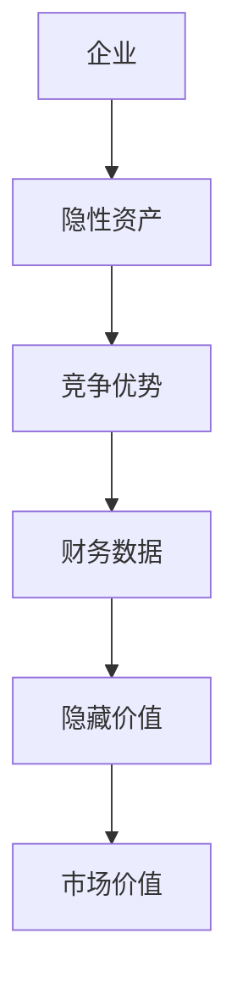
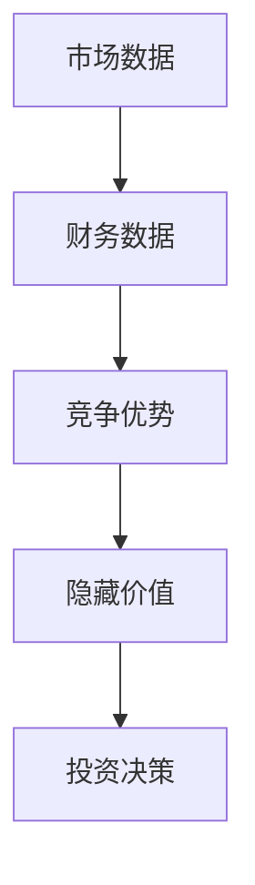
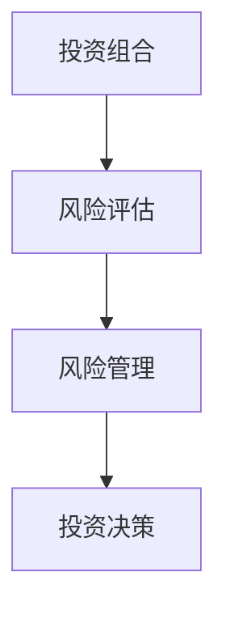
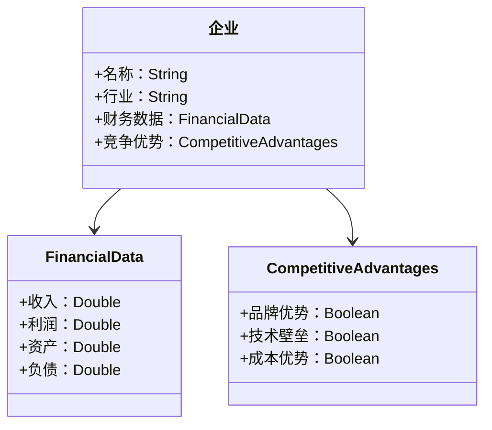
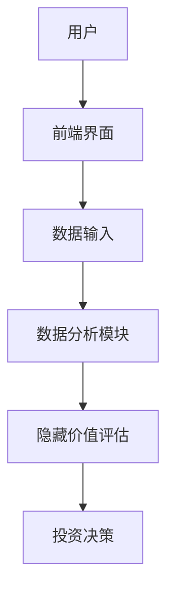
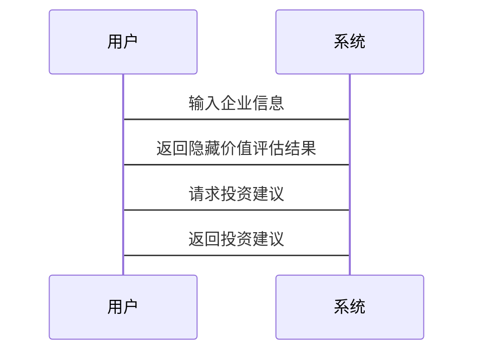

                 


# 布鲁斯·格林沃尔德的隐藏价值投资法

> 关键词：隐藏价值投资法，布鲁斯·格林沃尔德，投资策略，价值发现，风险管理

> 摘要：本文深入探讨了布鲁斯·格林沃尔德的隐藏价值投资法，从其核心概念、理论基础、策略体系到实际应用，结合数学模型和案例分析，全面解析了隐藏价值投资法的内在逻辑和实际操作方法。通过本文，读者将能够理解隐藏价值投资法的独特视角，掌握其在实际投资中的应用技巧，并能够通过数学模型和公式进行量化分析。

---

## 第一部分: 隐藏价值投资法的背景与核心概念

### 第1章: 隐藏价值投资法的起源与背景

#### 1.1 隐藏价值投资法的定义与核心要素

**1.1.1 隐藏价值的定义**

隐藏价值是指在市场中未被充分认知或低估的资产或企业的真实价值。这种价值可能源于企业的隐性资产、竞争优势、市场地位或其他未被市场定价的因素。隐藏价值的核心在于其“隐藏”性质，即市场参与者尚未充分认识到其价值。

$$\text{隐藏价值} = \text{真实价值} - \text{市场定价}$$

**1.1.2 隐藏价值投资法的核心要素**

- **价值发现**：通过分析企业的财务数据、行业地位和竞争优势，识别其隐藏价值。
- **价值低估**：找到市场中被低估的资产或企业。
- **价值实现**：通过投资行为，使市场认识到企业的隐藏价值，从而实现收益。

**1.1.3 隐藏价值与传统投资方法的区别**

| 对比维度 | 传统投资法 | 隐藏价值投资法 |
|----------|-------------|-----------------|
| 投资目标 | 追求市场平均收益 | 寻找被低估的隐藏价值 |
| 分析重点 | 市场趋势、宏观经济 | 企业基本面、竞争优势 |
| 风险承受 | 中等风险 | 较高风险，但潜在回报更高 |

#### 1.2 隐藏价值投资法的理论基础

**1.2.1 价值投资的基本原理**

价值投资的核心在于寻找市场价格低于内在价值的资产。格林沃尔德的隐藏价值投资法在此基础上进一步细化，强调寻找那些未被市场充分认知的内在价值。

**1.2.2 隐藏价值投资法的独特视角**

隐藏价值投资法认为，市场并不总是理性且高效。很多时候，市场未能充分反映某些企业的真正价值，这为企业提供了投资机会。

**1.2.3 隐藏价值投资法的哲学基础**

格林沃尔德的隐藏价值投资法深受哲学中“存在即合理”的影响，认为每一家企业都有其存在的价值，只是需要通过深入分析才能发现。

#### 1.3 隐藏价值投资法的适用场景

**1.3.1 隐藏价值投资法的适用市场环境**

- **市场波动性高**：市场波动为发现隐藏价值提供了机会。
- **信息不对称**：信息不对称可能导致某些资产被低估。
- **经济周期低谷**：经济低迷时期，企业的真实价值可能被低估。

**1.3.2 隐藏价值投资法的目标资产类型**

- **未被关注的小企业**：这些企业可能因为规模小或市场关注度低而被低估。
- **具有竞争优势的中型企业**：竞争优势未被市场充分反映的企业。
- **周期性行业中的企业**：周期性行业的低谷期可能隐藏投资机会。

**1.3.3 隐藏价值投资法的限制与边界**

- **信息获取成本**：获取企业隐藏价值的信息可能需要较高的成本。
- **市场效率**：如果市场效率较高，隐藏价值可能较难发现。
- **企业自身问题**：企业内部管理问题可能影响隐藏价值的实现。

### 第2章: 隐藏价值投资法的核心概念与联系

#### 2.1 隐藏价值投资法的核心概念

**2.1.1 隐藏价值的衡量标准**

隐藏价值的衡量标准包括：

1. **财务指标**：如ROE（净资产收益率）、ROA（资产回报率）等。
2. **市场指标**：如市盈率、市净率等。
3. **竞争优势**：如专利、品牌、技术壁垒等。

**2.1.2 隐藏价值的发现过程**

1. **识别隐性资产**：如未被市场充分估值的土地、专利等。
2. **评估竞争优势**：如品牌优势、成本优势等。
3. **分析财务数据**：通过财务报表分析企业的真实价值。

**2.1.3 隐藏价值的实现路径**

1. **买入低估资产**：在市场低估时买入。
2. **长期持有**：等待市场重新发现其价值。
3. **价值实现**：通过企业自身发展或市场变化，使价值得以实现。

#### 2.2 隐藏价值投资法的核心概念对比

**2.2.1 隐藏价值与内在价值的对比**

| 对比维度 | 隐藏价值 | 内在价值 |
|----------|-----------|----------|
| 定义 | 未被市场充分认知的真实价值 | 企业未来现金流的现值 |
| 计算 | 需要识别隐性因素 | 通过DCF模型计算 |
| 应用 | 寻找被低估的机会 | 寻找价值被低估的企业 |

**2.2.2 隐藏价值与市场价值的对比**

| 对比维度 | 隐藏价值 | 市场价值 |
|----------|-----------|----------|
| 计算方式 | 需要识别隐性因素 | 市场定价 |
| 关系 | 可能低于市场价值 | 反映市场参与者对企业的认知 |
| 应用 | 寻找低估机会 | 作为买卖决策参考 |

**2.2.3 隐藏价值与账面价值的对比**

| 对比维度 | 隐藏价值 | 账面价值 |
|----------|-----------|----------|
| 计算方式 | 需要识别隐性因素 | 财务报表中的数值 |
| 关系 | 可能高于或低于 | 反映企业资产的实际价值 |
| 应用 | 寻找低估机会 | 作为财务分析的基础 |

#### 2.3 隐藏价值投资法的实体关系图



---

## 第三部分: 隐藏价值投资法的策略与方法

### 第3章: 隐藏价值投资法的策略体系

#### 3.1 隐藏价值投资法的基本策略

**3.1.1 价值发现策略**

1. **识别隐性资产**：通过分析企业的财务报表，识别未被市场充分估值的资产。
2. **评估竞争优势**：分析企业的竞争优势，如品牌、技术、成本优势等。
3. **分析财务数据**：通过分析企业的财务数据，寻找那些市场价格低于内在价值的企业。

**3.1.2 价值低估策略**

1. **寻找被低估的企业**：通过比较市盈率、市净率等指标，寻找市场价格低于内在价值的企业。
2. **分析行业地位**：选择行业地位稳固但市场关注度低的企业。
3. **关注周期性低谷**：在经济周期的低谷期寻找那些具有竞争优势的企业。

**3.1.3 价值实现策略**

1. **长期持有**：等待市场重新发现企业的价值。
2. **价值实现机制**：通过企业自身发展或市场变化，使隐藏价值得以实现。
3. **动态调整**：根据市场变化和企业情况，动态调整投资组合。

#### 3.2 隐藏价值投资法的高级策略

**3.2.1 隐性资产价值挖掘策略**

1. **识别未被市场发现的资产**：如未被市场充分估值的土地、专利等。
2. **评估隐性资产的价值**：通过专业的评估方法，计算隐性资产的真正价值。
3. **寻找具有隐性资产的企业**：选择那些具有隐性资产且市场关注度低的企业进行投资。

**3.2.2 隐性负债优化策略**

1. **识别隐性负债**：如或有负债、未记录的负债等。
2. **评估隐性负债的影响**：分析隐性负债对企业财务状况和市场价值的影响。
3. **优化企业负债结构**：通过优化负债结构，降低隐性负债对企业价值的影响。

**3.2.3 隐性竞争优势放大策略**

1. **识别隐性竞争优势**：如独特的商业模式、技术壁垒等。
2. **放大竞争优势**：通过进一步投资或优化管理，放大企业的竞争优势。
3. **寻找具有隐性竞争优势的企业**：选择那些具有隐性竞争优势且市场关注度低的企业进行投资。

#### 3.3 隐藏价值投资法的策略组合

**3.3.1 策略组合的构建原则**

1. **分散投资**：通过分散投资，降低风险。
2. **长期持有**：隐藏价值投资需要时间来实现，因此需要长期持有。
3. **动态调整**：根据市场变化和企业情况，动态调整投资组合。

**3.3.2 策略组合的风险管理**

1. **风险分散**：通过投资不同行业、不同规模的企业，分散风险。
2. **风险管理模型**：使用VaR（在险价值）模型等工具，评估和管理投资组合的风险。
3. **止损策略**：设置止损点，避免重大损失。

**3.3.3 策略组合的动态调整**

1. **定期评估**：定期评估投资组合的表现，调整投资策略。
2. **市场变化应对**：根据市场变化，及时调整投资策略。
3. **企业变化应对**：根据企业情况的变化，及时调整投资策略。

### 第4章: 隐藏价值投资法的数学模型与公式

#### 4.1 隐藏价值的量化评估模型

**4.1.1 隐藏价值的计算公式**

$$\text{隐藏价值} = \sum_{i=1}^{n} w_i \cdot v_i$$

其中：
- $w_i$ 是第 $i$ 个因素的权重。
- $v_i$ 是第 $i$ 个因素的值。

**4.1.2 隐藏价值的评估指标**

1. **ROE（净资产收益率）**：$$\text{ROE} = \frac{\text{净利润}}{\text{净资产}}$$
2. **ROA（资产回报率）**：$$\text{ROA} = \frac{\text{净利润}}{\text{总资产}}$$
3. **市盈率（P/E）**：$$\text{P/E} = \frac{\text{股价}}{\text{每股收益}}$$
4. **市净率（P/B）**：$$\text{P/B} = \frac{\text{股价}}{\text{每股净资产}}$$

#### 4.2 隐藏价值投资法的数学模型

**4.2.1 隐藏价值投资法的决策模型**



**4.2.2 隐藏价值投资法的风险管理模型**



---

## 第四部分: 隐藏价值投资法的实际应用

### 第5章: 隐藏价值投资法的系统分析与架构设计方案

#### 5.1 系统功能设计

**5.1.1 领域模型**



**5.1.2 系统架构设计**



**5.1.3 系统接口设计**

1. **输入接口**：接收企业的财务数据、竞争优势等信息。
2. **输出接口**：输出隐藏价值评估结果、投资建议等。

**5.1.4 系统交互设计**



### 第6章: 隐藏价值投资法的项目实战

#### 6.1 项目环境安装

1. **安装Python**：用于数据分析和建模。
2. **安装数据分析库**：如Pandas、NumPy、Matplotlib等。
3. **安装可视化工具**：如Tableau、Power BI等。

#### 6.2 系统核心实现源代码

```python
import pandas as pd
import numpy as np
import matplotlib.pyplot as plt

def calculate_hidden_value(financial_data, competitive_advantages):
    # 计算内在价值
    intrinsic_value = financial_data['收入'] * 0.8 + financial_data['利润'] * 0.2
    # 调整竞争优势
    if competitive_advantages['品牌优势']:
        intrinsic_value *= 1.1
    if competitive_advantages['技术壁垒']:
        intrinsic_value *= 1.1
    return intrinsic_value

# 示例数据
financial_data = {
    '收入': 100,
    '利润': 20,
    '资产': 50,
    '负债': 30
}
competitive_advantages = {
    '品牌优势': True,
    '技术壁垒': True,
    '成本优势': False
}

# 计算隐藏价值
hidden_value = calculate_hidden_value(financial_data, competitive_advantages)
print(f"隐藏价值：{hidden_value}")
```

#### 6.3 代码应用解读与分析

1. **代码功能**：该代码用于计算企业的隐藏价值。首先计算企业的内在价值，然后根据企业的竞争优势进行调整，最终得到隐藏价值。
2. **代码实现细节**：
   - 使用Python进行数据分析和计算。
   - 通过调整权重，反映竞争优势对内在价值的影响。

#### 6.4 实际案例分析

**6.4.1 案例背景**

假设我们发现一家小企业，其财务数据如下：

- 收入：100
- 利润：20
- 资产：50
- 负债：30

竞争优势如下：

- 品牌优势：True
- 技术壁垒：True
- 成本优势：False

**6.4.2 案例分析**

通过上述代码计算，隐藏价值为：

$$\text{隐藏价值} = 100 \times 0.8 + 20 \times 0.2 = 80 + 4 = 84$$

由于企业具有品牌优势和技术壁垒，内在价值进一步调整为：

$$\text{最终隐藏价值} = 84 \times 1.1 \times 1.1 = 96.04$$

**6.4.3 案例结论**

通过分析，该企业的隐藏价值为96.04，而市场价格可能低于这个价值，因此可以考虑买入。

### 第7章: 隐藏价值投资法的小结与展望

#### 7.1 小结

隐藏价值投资法是一种通过识别市场中未被充分认知的资产或企业的真实价值，从而实现超额收益的投资方法。其核心在于寻找那些市场价格低于内在价值的企业，并通过长期持有实现价值。

#### 7.2 展望

随着市场的发展和技术的进步，隐藏价值投资法将更加依赖于数据分析和量化方法。未来，投资者可以通过更加精确的模型和工具，发现更多的隐藏价值，实现更好的投资回报。

---

## 作者：AI天才研究院/AI Genius Institute & 禅与计算机程序设计艺术 /Zen And The Art of Computer Programming

