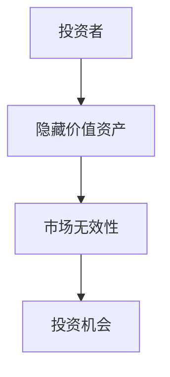

                 

# 隐藏价值投资策略：布鲁斯·格林沃尔德的理论与实践

> **关键词**：价值投资，隐藏价值，格林沃尔德，投资策略，市场分析，财务模型

> **摘要**：本文深入探讨了布鲁斯·格林沃尔德的隐藏价值投资策略，从理论基础到实际应用，详细分析了隐藏价值的定义、计算方法以及如何在投资中应用这一策略。文章结合数学模型、算法流程图和实际案例，帮助读者理解并掌握这一投资方法。

---

# 第一部分：隐藏价值投资策略的背景与基础

## 第1章：价值投资与隐藏价值策略概述

### 1.1 价值投资的基本原理

#### 1.1.1 价值投资的核心概念
价值投资是一种基于对公司内在价值评估的投资策略，核心在于寻找市场价格低于其内在价值的资产。这种策略强调长期持有和价值发现，而非短期市场波动。

#### 1.1.2 价值投资的历史发展
价值投资的理论基础可追溯至本杰明·格雷厄姆和戴维·多德的贡献。他们提出的“安全边际”概念为后来的价值投资策略奠定了基础。现代价值投资在格林沃尔德的理论中得到了进一步发展，特别是在隐藏价值领域的应用。

#### 1.1.3 隐藏价值投资的定义与特点
隐藏价值投资是指识别市场中未被充分认知的、具有潜在高回报的价值洼地。其特点是基于深入的财务分析和对公司基本面的透彻理解，寻找那些被市场低估的机会。

---

### 1.2 布鲁斯·格林沃尔德的理论基础

#### 1.2.1 布鲁斯·格林沃尔德的学术背景
格林沃尔德是哥伦比亚大学商学院的教授，专注于价值投资和企业财务研究。他的理论结合了金融学、经济学和会计学，提出了一套系统化的隐藏价值评估方法。

#### 1.2.2 价值投资的现代发展
随着市场的复杂化，传统价值投资面临新的挑战。格林沃尔德的理论引入了更多的数据分析和模型构建，使价值投资更加科学化和系统化。

#### 1.2.3 隐藏价值投资的理论框架
格林沃尔德的隐藏价值投资框架强调对企业基本面的深入分析，包括财务报表分析、现金流预测和行业趋势研究。这种方法帮助投资者识别那些具有长期竞争优势和可持续增长潜力的企业。

---

### 1.3 隐藏价值投资的市场背景

#### 1.3.1 当前市场环境分析
当前市场环境中，信息不对称和市场无效性为隐藏价值投资提供了机会。尤其是在新兴市场或行业，许多优质企业因市场关注不足而被低估。

#### 1.3.2 隐藏价值投资的机会与挑战
机会在于发现未被市场充分认知的企业，挑战则包括信息获取的难度和竞争的加剧。投资者需要具备敏锐的洞察力和扎实的分析能力。

#### 1.3.3 投资者行为与市场无效性
投资者的行为偏差（如过度反应）导致市场定价的不准确，为隐藏价值投资提供了空间。理解这些行为有助于投资者识别市场错位。

---

## 第2章：隐藏价值投资的核心概念与联系

### 2.1 隐藏价值投资的原理

#### 2.1.1 市场无效性与投资机会
市场无效性是指市场价格未能反映其真实价值的情况。这种无效性为投资者提供了以低于内在价值的价格买入资产的机会。

#### 2.1.2 价值发现的三要素
- **财务健康状况**：企业的盈利能力、资产负债情况和现金流状况。
- **行业地位**：企业在行业中的竞争力和市场份额。
- **未来增长潜力**：企业的创新能力和扩展能力。

#### 2.1.3 隐藏价值的衡量标准
隐藏价值 = 内在价值 - 市场价格。内在价值通过DCF模型等方法计算得出。

---

### 2.2 核心概念对比分析

#### 2.2.1 隐藏价值与账面价值的对比
| 比较维度 | 隐藏价值 | 账面价值 |
|----------|-----------|-----------|
| 定义     | 内在价值与市场价格的差额 | 资产负债表上的价值 |
| 计算方式 | DCF模型等 | 直接从财务报表获取 |
| 用途     | 寻找被低估资产 | 评估资产重估价值 |

#### 2.2.2 隐藏价值与内在价值的对比
| 比较维度 | 隐藏价值 | 内在价值 |
|----------|-----------|-----------|
| 计算基础 | DCF模型等 | DCF模型等 |
| 关系     | HV = IV - MV | 理论上的公平价值 |
| 用途     | 寻找低估资产 | 作为定价基准 |

#### 2.2.3 隐藏价值与市场价值的对比
| 比较维度 | 隐藏价值 | 市场价值 |
|----------|-----------|-----------|
| 定义     | 内在价值与市场价格的差额 | 市场交易形成的资产价格 |
| 计算方式 | DCF模型等 | 市场交易数据 |
| 用途     | 寻找低估资产 | 作为交易基准 |

---

### 2.3 实体关系图

---

### 2.4 本章小结

---

接下来的章节将详细介绍隐藏价值投资的算法原理、系统分析、项目实战和最佳实践。通过系统化的分析和实际案例，读者将能够掌握隐藏价值投资的核心方法，并在实际投资中应用这些策略。

--- 

**作者**：AI天才研究院/AI Genius Institute & 禅与计算机程序设计艺术 /Zen And The Art of Computer Programming

