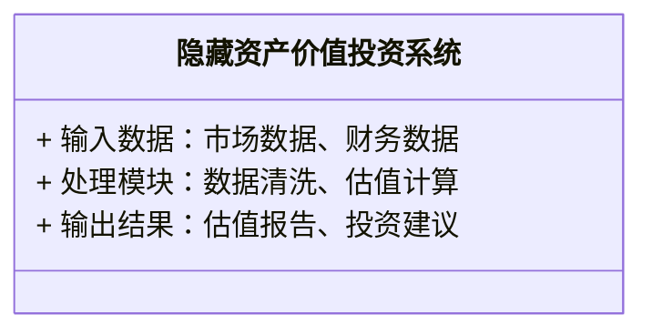
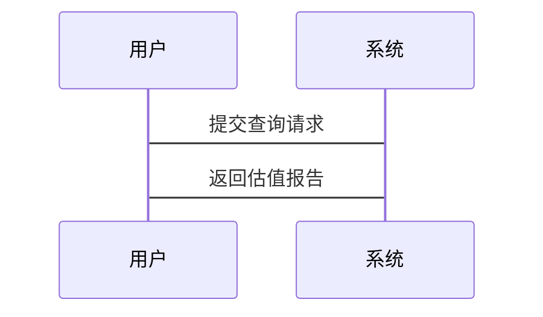

                 


# 布鲁斯·格林沃尔德的隐藏资产价值投资：发掘被低估的资产

**关键词**：隐藏资产，价值投资，资产评估，投资策略，市场分析，定价模型

**摘要**：  
本文深入探讨隐藏资产的价值投资方法，分析如何识别和评估被低估的资产。通过结合市场分析、定价模型和投资策略，文章为投资者提供了系统化的视角，帮助其发现潜在的投资机会。本文结合实际案例，详细讲解了隐藏资产的定义、分类、评估方法以及投资策略，并通过数学模型和算法原理，为读者提供了理论支持和实践指导。

---

# 第1章: 隐藏资产的定义与分类

## 1.1 隐藏资产的定义与特征

隐藏资产是指那些在公开市场中被忽视或低估的资产类别。它们通常具有较高的内在价值，但由于市场信息不对称、流动性不足或投资者认知偏差等原因，其价值未被充分反映。  

**1.1.1 隐藏资产的定义**  
隐藏资产可以是企业、房地产、知识产权或其他金融资产。其核心特征在于其价值未被市场充分认知，存在较大的低估空间。

**1.1.2 隐藏资产的特征**  
- **低估性**：市场价格低于其真实价值。  
- **隐蔽性**：资产信息不透明，难以被普通投资者发现。  
- **潜力性**：具备较高的增长潜力或重组价值。  

---

## 1.2 隐藏资产的分类与类型

隐藏资产可以分为多种类型，每种类型都有其独特的特点和投资价值。  

**1.2.1 隐藏资产的分类**  
1. **企业资产**：未被充分估值的企业股权。  
2. **房地产资产**：地理位置优越但未被发现的房地产项目。  
3. **知识产权**：未被市场充分认可的专利或版权。  
4. **金融资产**：低估值的股票、债券或其他金融工具。  

**1.2.2 隐藏资产的类型对比**  

| 类型          | 核心特征                     | 投资价值       |
|---------------|------------------------------|----------------|
| 企业资产      | 高收益潜力，估值被低估       | 高             |
| 房地产资产    | 地理位置优越，市场流动性低   | 中高           |
| 知识产权      | 技术领先，市场认知不足       | 高             |
| 金融资产      | 市场价格低于内在价值         | 中             |

---

## 1.3 隐藏资产与传统资产的区别

**1.3.1 隐藏资产与传统资产的主要区别**  

| 特性          | 隐藏资产                | 传统资产                |
|---------------|-------------------------|-------------------------|
| 市场认知       | 未被充分认知             | 已被充分认知             |
| 估值准确性     | 常常被低估               | 估值较为准确             |
| 投资门槛       | 较高，信息获取困难         | 较低，信息透明度高         |
| 投资回报       | 高，具备潜力             | 中等，较为稳定             |

---

## 1.4 隐藏资产的价值评估方法

**1.4.1 隐藏资产的价值评估指标**  
- **市盈率（P/E）**：评估企业估值的常用指标。  
- **市净率（P/B）**：衡量资产的账面价值与市场价格的关系。  
- **股息率**：评估资产的收益能力。  

**1.4.2 隐藏资产的市场比较法**  
通过比较同类资产的市场价，找出价格差异较大的资产作为投资目标。  

**1.4.3 隐藏资产的收益法与成本法**  
- **收益法**：基于未来现金流折现的估值方法。  
- **成本法**：基于资产重置成本的估值方法。  

---

## 1.5 本章小结

本章详细介绍了隐藏资产的定义、分类及其与传统资产的区别。通过分析隐藏资产的价值评估方法，读者可以更好地识别和评估这些被低估的资产。

---

# 第2章: 隐藏资产的价值发现与投资策略

## 2.1 隐藏资产的价值发现方法

**2.1.1 市场分析法**  
通过分析市场趋势和行业动态，发现隐藏资产的投资机会。  

**2.1.2 财务分析法**  
通过分析企业的财务报表，识别低估的资产。  

**2.1.3 行业分析法**  
研究特定行业的竞争格局，发现未被充分估值的企业或项目。  

---

## 2.2 隐藏资产的投资策略

**2.2.1 价值导向投资策略**  
基于资产的内在价值进行投资，寻找市场价格低于内在价值的资产。  

**2.2.2 风险导向投资策略**  
通过分散投资降低风险，同时关注高潜力的隐藏资产。  

**2.2.3 组合投资策略**  
将隐藏资产与其他资产类别结合，构建多元化投资组合。  

---

## 2.3 隐藏资产的投资风险与控制

**2.3.1 隐藏资产的主要风险来源**  
- **信息不对称**：难以获取资产的真实信息。  
- **流动性风险**：部分隐藏资产流动性较低。  
- **市场波动风险**：市场变化可能导致资产价格波动。  

**2.3.2 风险评估与管理方法**  
- **分散投资**：通过多样化降低风险。  
- **定期评估**：持续监控资产价值和市场变化。  

---

## 2.4 本章小结

本章重点介绍了隐藏资产的价值发现方法和投资策略，同时分析了相关风险及控制措施。投资者可以通过这些方法和策略，更有效地识别和投资隐藏资产。

---

# 第3章: 隐藏资产的市场分析与定价模型

## 3.1 隐藏资产的市场分析方法

**3.1.1 市场需求分析**  
分析市场对隐藏资产的需求，预测未来价格走势。  

**3.1.2 竞争分析**  
研究市场中同类资产的竞争力，评估资产的市场地位。  

---

## 3.2 隐藏资产的定价模型

**3.2.1 贴现现金流模型（DCF）**  
基于未来现金流的折现值计算资产的内在价值。  

$$\text{DCF} = \sum_{t=1}^{n} \frac{\text{现金流}}{(1 + r)^t}$$  

**3.2.2 市盈率模型（P/E）**  
通过比较资产的市盈率与行业平均水平，评估资产的估值是否合理。  

$$\text{市盈率} = \frac{\text{股价}}{\text{每股收益}}$$  

---

## 3.3 隐藏资产的定价策略

**3.3.1 相对估值法**  
通过比较同类资产的市场价格，确定资产的合理估值。  

**3.3.2 绝对估值法**  
基于资产的内在价值进行定价，忽略市场短期波动。  

---

## 3.4 本章小结

本章通过分析隐藏资产的市场特征，详细介绍了贴现现金流模型和市盈率模型等定价方法，并探讨了定价策略的选择与应用。

---

# 第4章: 隐藏资产的价值投资系统设计

## 4.1 系统功能设计

**4.1.1 领域模型**  
通过Mermaid类图展示隐藏资产价值投资系统的功能模块。  



---

## 4.2 系统架构设计

**4.2.1 系统架构图**  
通过Mermaid架构图展示系统的整体架构。  


---

## 4.3 系统接口设计

**4.3.1 系统接口设计**  
- 数据接口：与市场数据源对接。  
- 报告接口：输出估值报告和投资建议。  

---

## 4.4 系统交互设计

**4.4.1 系统交互流程图**  
通过Mermaid序列图展示系统交互流程。  



---

## 4.5 本章小结

本章通过系统设计的方法，详细介绍了隐藏资产价值投资系统的功能模块、架构设计和交互流程，为投资者提供了一套完整的解决方案。

---

# 第5章: 项目实战——隐藏资产投资案例分析

## 5.1 项目环境安装

**5.1.1 安装Python环境**  
使用Anaconda安装Python和相关库。  

**5.1.2 安装依赖库**  
安装Pandas、NumPy、Matplotlib等数据分析库。  

---

## 5.2 系统核心实现

**5.2.1 核心代码实现**  
以下是一个隐藏资产估值的Python代码示例：  

```python
import pandas as pd
import numpy as np

# 假设我们有一个包含资产数据的DataFrame
df = pd.DataFrame({
    '资产名称': ['A', 'B', 'C'],
    '市场价格': [10, 15, 20],
    '内在价值': [12, 18, 22]
})

# 计算低估幅度
df['低估幅度'] = (df['内在价值'] - df['市场价格']) / df['市场价格']

print(df)
```

---

## 5.3 代码解读与分析

**5.3.1 代码功能解读**  
上述代码通过计算资产的内在价值与市场价格的差异，识别低估的资产。  

**5.3.2 代码运行结果**  
输出包含资产名称、市场价格、内在价值及低估幅度的DataFrame。  

---

## 5.4 实际案例分析

**5.4.1 案例背景**  
某企业A的市场价格为10，内在价值为12，具备低估潜力。  

**5.4.2 案例分析**  
通过代码计算，企业A的低估幅度为20%。  

---

## 5.5 项目小结

本章通过实际案例分析，展示了如何使用Python代码识别隐藏资产，并计算其低估幅度。投资者可以通过这种方法，快速发现潜在的投资机会。

---

# 第6章: 隐藏资产投资的最佳实践与小结

## 6.1 投资策略总结

**6.1.1 价值导向策略**  
优先选择市场价格低于内在价值的资产。  

**6.1.2 分散投资策略**  
通过多元化投资降低风险。  

---

## 6.2 投资中的注意事项

**6.2.1 风险控制**  
定期评估资产价值，及时调整投资组合。  

**6.2.2 信息获取**  
通过多种渠道获取资产信息，降低信息不对称风险。  

---

## 6.3 拓展阅读

推荐阅读以下书籍和文章：  
- 《价值投资：发现隐藏的财富》  
- 《隐藏资产的定价与风险管理》  

---

# 小结

通过本文的系统分析和实战案例，读者可以深入了解隐藏资产的价值投资方法。从定义到分类，从市场分析到系统设计，再到实际操作，本文为投资者提供了一套完整的解决方案。希望本文能帮助读者在复杂的市场环境中，发现并投资于那些被低估的隐藏资产。

---

**作者：AI天才研究院/AI Genius Institute & 禅与计算机程序设计艺术/Zen And The Art of Computer Programming**

