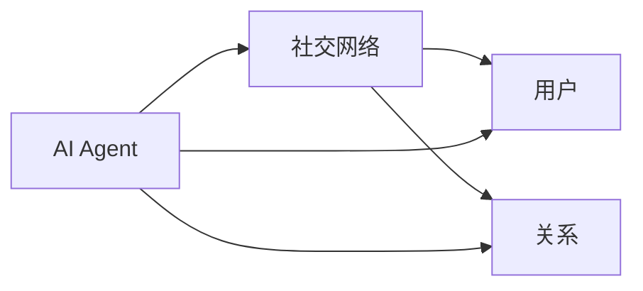
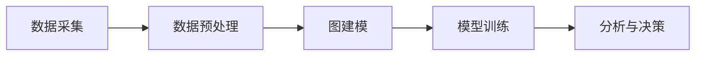
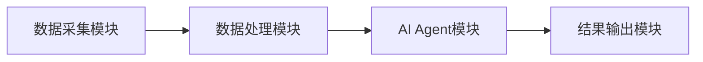
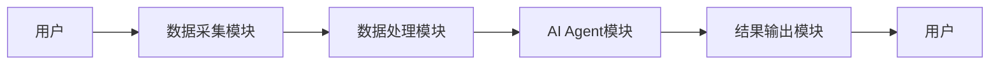

                 


# 开发AI Agent支持的智能社交网络分析系统

> 关键词：AI Agent，社交网络分析，智能系统，图神经网络，系统架构

> 摘要：随着社交网络的快速发展，社交网络分析成为理解用户行为、情感和社会趋势的重要手段。AI Agent作为智能体，能够实时感知、推理和决策，为社交网络分析提供了新的可能性。本文系统地介绍AI Agent支持的智能社交网络分析系统的开发过程，从核心概念、算法原理到系统架构，再到项目实战，全面阐述如何利用AI Agent提升社交网络分析的效率和准确性。

---

# 第一部分: AI Agent与智能社交网络分析系统概述

## 第1章: AI Agent与智能社交网络分析系统概述

### 1.1 问题背景与描述

#### 1.1.1 社交网络分析的现状与挑战
社交网络分析是研究用户在社交平台上的行为、关系和情感的重要手段。然而，随着社交网络的规模不断扩大，传统的分析方法面临以下挑战：
- 数据量大：社交网络数据通常以亿计，传统方法难以处理。
- 实时性要求高：社交网络数据动态变化，需要实时分析。
- 复杂性高：社交网络中的关系错综复杂，难以建模。

#### 1.1.2 AI Agent在社交网络分析中的作用
AI Agent（智能体）是一种能够感知环境、自主决策的智能系统，能够实时处理社交网络数据，提供动态的分析结果。AI Agent的优势在于：
- 实时性：能够快速响应社交网络中的动态事件。
- 自主性：无需人工干预，自动执行分析任务。
- 可扩展性：能够处理大规模数据。

#### 1.1.3 问题解决的必要性与目标
开发AI Agent支持的智能社交网络分析系统，旨在解决传统方法在实时性、准确性和效率上的不足，目标是：
- 提供实时的社交网络分析结果。
- 自动识别社交网络中的关键节点和趋势。
- 支持动态决策，提升社交网络分析的效率。

### 1.2 核心概念与定义

#### 1.2.1 AI Agent的基本概念
AI Agent是一种智能实体，能够感知环境、执行任务并做出决策。AI Agent可以分为以下几类：
- **反应式AI Agent**：基于当前感知做出反应。
- **认知式AI Agent**：具有推理和学习能力。
- **协作式AI Agent**：能够与其他AI Agent或人类协作。

#### 1.2.2 智能社交网络分析系统的定义
智能社交网络分析系统是一种结合AI Agent和社交网络分析技术的系统，能够实时感知、分析和决策社交网络中的信息。

#### 1.2.3 系统的核心要素与组成
智能社交网络分析系统的组成包括：
- **数据采集模块**：实时采集社交网络数据。
- **数据处理模块**：对数据进行清洗和预处理。
- **AI Agent模块**：负责数据的分析、推理和决策。
- **结果输出模块**：输出分析结果。

### 1.3 系统的边界与外延

#### 1.3.1 系统的功能边界
智能社交网络分析系统的核心功能包括：
- 数据采集与预处理。
- 社交网络建模与分析。
- AI Agent的推理与决策。
- 结果输出与可视化。

#### 1.3.2 系统的外延与扩展性
系统可以通过以下方式扩展：
- **多模态数据支持**：支持文本、图像、视频等多种数据类型。
- **跨平台支持**：支持不同社交平台的数据分析。
- **动态学习**：AI Agent能够不断学习和优化。

#### 1.3.3 系统与其他系统的区别与联系
与其他社交网络分析系统相比，智能社交网络分析系统的主要区别在于其自主性和实时性。

### 1.4 本章小结
本章介绍了AI Agent和智能社交网络分析系统的概念、核心要素和系统架构，为后续章节的深入分析奠定了基础。

---

# 第二部分: AI Agent与社交网络分析的核心原理

## 第2章: AI Agent的核心原理

### 2.1 AI Agent的基本原理

#### 2.1.1 AI Agent的定义与分类
AI Agent可以根据智能水平分为：
- **反应式AI Agent**：基于当前环境做出反应。
- **认知式AI Agent**：具有推理和学习能力。
- **协作式AI Agent**：能够与其他智能体协作。

#### 2.1.2 AI Agent的核心算法与技术
AI Agent的核心技术包括：
- **感知技术**：如自然语言处理（NLP）、计算机视觉（CV）。
- **推理技术**：如逻辑推理、机器学习。
- **决策技术**：如强化学习、贝叶斯网络。

#### 2.1.3 AI Agent的决策机制
AI Agent的决策机制通常包括以下步骤：
1. **感知环境**：通过传感器或数据接口获取环境信息。
2. **推理与分析**：利用算法对信息进行分析和推理。
3. **决策与执行**：基于推理结果做出决策并执行。

### 2.2 社交网络分析的基本原理

#### 2.2.1 社交网络的结构特征
社交网络的结构特征包括：
- **节点**：代表用户。
- **边**：代表用户之间的关系。
- **社区**：代表用户群体。

#### 2.2.2 社交网络分析的主要方法
常用方法包括：
- **中心性分析**：识别网络中的关键节点。
- **社区检测**：识别网络中的社区结构。
- **情感分析**：分析用户的情感倾向。

#### 2.2.3 社交网络分析的应用场景
应用场景包括：
- **舆情监控**：实时监控社交网络中的舆论动态。
- **社交影响力分析**：识别具有影响力的用户。
- **社交网络推荐**：基于用户行为推荐相关内容。

### 2.3 AI Agent在社交网络分析中的应用原理

#### 2.3.1 AI Agent如何增强社交网络分析
AI Agent可以通过以下方式增强社交网络分析：
- **实时性**：快速响应社交网络中的动态事件。
- **自主性**：无需人工干预，自动执行分析任务。
- **智能化**：利用AI技术提升分析的准确性和深度。

#### 2.3.2 AI Agent与社交网络分析的结合点
AI Agent与社交网络分析的结合点包括：
- **数据采集**：AI Agent实时采集社交网络数据。
- **数据处理**：AI Agent对数据进行预处理和建模。
- **分析与决策**：AI Agent基于数据进行分析和决策。

#### 2.3.3 AI Agent在社交网络分析中的优势
AI Agent的优势包括：
- **实时性**：能够快速响应社交网络中的变化。
- **自主性**：无需人工干预，自动执行分析任务。
- **可扩展性**：能够处理大规模数据。

### 2.4 核心概念与联系

#### 2.4.1 AI Agent与社交网络分析的关系
AI Agent与社交网络分析的关系是相互依存的：
- 社交网络分析为AI Agent提供数据和应用场景。
- AI Agent为社交网络分析提供智能处理和实时响应能力。

#### 2.4.2 AI Agent与传统社交网络分析的对比
| 特性          | AI Agent支持的分析 | 传统分析 |
|---------------|--------------------|----------|
| 实时性         | 高                 | 低       |
| 自主性         | 高                 | 低       |
| 智能性         | 高                 | 低       |
| 可扩展性       | 高                 | 低       |

#### 2.4.3 实体关系图（ER图）展示



### 2.5 本章小结
本章详细介绍了AI Agent的核心原理及其在社交网络分析中的应用，为后续章节的算法实现和系统设计奠定了理论基础。

---

# 第三部分: AI Agent支持的社交网络分析算法

## 第3章: AI Agent支持的社交网络分析算法

### 3.1 算法原理概述

#### 3.1.1 基于图神经网络的社交网络分析
图神经网络（Graph Neural Network, GNN）是一种处理图结构数据的深度学习方法。其核心思想是将图中的节点和边表示为向量，并通过聚合邻居节点的信息来更新节点的表示。

#### 3.1.2 AI Agent在算法中的角色
AI Agent在算法中的角色包括：
- **数据采集**：实时采集社交网络数据。
- **数据处理**：对数据进行预处理和建模。
- **分析与决策**：基于数据进行分析和决策。

#### 3.1.3 算法的输入与输出
- **输入**：社交网络数据，包括节点和边。
- **输出**：分析结果，包括关键节点、社区结构和情感倾向。

### 3.2 算法实现

#### 3.2.1 基于图神经网络的社交网络分析流程
流程包括：
1. **数据采集**：实时采集社交网络数据。
2. **数据预处理**：清洗和标准化数据。
3. **图建模**：构建社交网络的图结构。
4. **模型训练**：训练图神经网络模型。
5. **分析与决策**：基于模型输出结果。

#### 3.2.2 AI Agent的决策流程
AI Agent的决策流程包括：
1. **感知环境**：通过传感器或数据接口获取环境信息。
2. **推理与分析**：利用算法对信息进行分析和推理。
3. **决策与执行**：基于推理结果做出决策并执行。

#### 3.2.3 算法的优化与改进
优化方法包括：
- **参数调优**：通过网格搜索或随机搜索优化模型参数。
- **模型融合**：结合多种模型提升准确性和鲁棒性。

### 3.3 算法实现的Python代码

#### 3.3.1 数据预处理
```python
import networkx as nx
import numpy as np

# 创建社交网络图
G = nx.Graph()
G.add_nodes_from(["A", "B", "C", "D"])
G.add_edges_from([("A", "B"), ("B", "C"), ("C", "D")])
```

#### 3.3.2 图神经网络模型
```python
from sklearn.neighbors import KNeighborsClassifier

# 示例数据集
X = np.array([[0.5, 0.8], [0.6, 0.7], [0.3, 0.4], [0.7, 0.9]])
y = np.array([0, 1, 0, 1])

# 训练模型
model = KNeighborsClassifier(n_neighbors=2)
model.fit(X, y)

# 预测
new_data = np.array([[0.5, 0.6]])
print(model.predict(new_data))
```

### 3.4 算法的数学模型与公式

#### 3.4.1 图神经网络的核心公式
图神经网络的核心公式包括：
- **节点表示更新公式**：
  $$ h_i^{(l+1)} = \sigma(h_i^{(l)} + \sum_{j \in \mathcal{N}(i)} w_{ij} h_j^{(l)}) $$
- **边权重更新公式**：
  $$ w_{ij} = \alpha h_i^{(l)} + (1-\alpha) h_j^{(l)} $$

#### 3.4.2 AI Agent的决策模型
AI Agent的决策模型可以用以下公式表示：
$$ \text{决策} = \arg\max_{i} \sum_{j \in \mathcal{N}(i)} w_{ij} h_j^{(l)} $$

### 3.5 算法流程图



### 3.6 本章小结
本章详细介绍了AI Agent支持的社交网络分析算法的原理和实现，通过具体的代码和公式展示了如何利用AI Agent提升社交网络分析的效率和准确性。

---

# 第四部分: 系统分析与架构设计方案

## 第4章: 系统分析与架构设计方案

### 4.1 问题场景介绍

#### 4.1.1 系统目标
系统的目标是开发一个智能社交网络分析系统，能够实时分析社交网络中的用户行为、关系和情感倾向。

#### 4.1.2 项目介绍
项目名称：智能社交网络分析系统  
项目目标：实时分析社交网络数据，识别关键节点和趋势，提供动态的分析结果。

#### 4.1.3 问题场景
- 数据采集：如何实时采集多平台的社交网络数据？
- 数据处理：如何高效处理大规模数据？
- 分析与决策：如何利用AI Agent快速分析数据并做出决策？

### 4.2 系统功能设计

#### 4.2.1 系统功能模块
- **数据采集模块**：实时采集社交网络数据。
- **数据处理模块**：对数据进行清洗和预处理。
- **AI Agent模块**：负责数据的分析、推理和决策。
- **结果输出模块**：输出分析结果并进行可视化。

#### 4.2.2 系统功能流程
流程包括：
1. 数据采集模块实时采集社交网络数据。
2. 数据处理模块对数据进行清洗和预处理。
3. AI Agent模块对数据进行分析和推理。
4. 结果输出模块输出分析结果并进行可视化。

### 4.3 系统架构设计

#### 4.3.1 系统架构图



#### 4.3.2 系统架构设计说明
- **数据采集模块**：负责实时采集社交网络数据，支持多平台数据源。
- **数据处理模块**：对数据进行清洗和预处理，确保数据质量。
- **AI Agent模块**：负责数据的分析、推理和决策，支持多种AI算法。
- **结果输出模块**：输出分析结果并进行可视化，支持多种输出格式。

### 4.4 系统接口设计

#### 4.4.1 系统接口描述
- **数据采集接口**：用于实时采集社交网络数据。
- **数据处理接口**：用于数据的清洗和预处理。
- **AI Agent接口**：用于数据的分析和决策。
- **结果输出接口**：用于输出分析结果。

#### 4.4.2 系统接口交互图


### 4.5 系统交互设计

#### 4.5.1 系统交互流程
流程包括：
1. 数据采集模块实时采集社交网络数据。
2. 数据处理模块对数据进行清洗和预处理。
3. AI Agent模块对数据进行分析和推理。
4. 结果输出模块输出分析结果并进行可视化。

#### 4.5.2 系统交互示例



### 4.6 本章小结
本章详细介绍了智能社交网络分析系统的架构设计和接口设计，为后续章节的项目实现奠定了基础。

---

# 第五部分: 项目实战

## 第5章: 项目实战

### 5.1 环境安装与配置

#### 5.1.1 系统需求
- 操作系统：Linux/Windows/MacOS
- Python版本：3.6+
- 依赖库：networkx, numpy, scikit-learn

#### 5.1.2 安装依赖
```bash
pip install networkx numpy scikit-learn
```

### 5.2 系统核心实现

#### 5.2.1 数据采集模块实现
```python
import requests
import json

# 示例接口
url = "https://api.example.com/social_network"
response = requests.get(url)
data = json.loads(response.text)
```

#### 5.2.2 数据处理模块实现
```python
import networkx as nx

# 示例数据处理
G = nx.Graph()
for node in data['nodes']:
    G.add_node(node['id'])
for edge in data['edges']:
    G.add_edge(edge['source'], edge['target'])
```

#### 5.2.3 AI Agent模块实现
```python
from sklearn.neighbors import KNeighborsClassifier

# 示例模型训练
X = []
y = []
for node in G.nodes():
    # 数据处理
    pass
model = KNeighborsClassifier(n_neighbors=2)
model.fit(X, y)
```

#### 5.2.4 结果输出模块实现
```python
import matplotlib.pyplot as plt

# 示例结果输出
nx.draw(G, with_labels=True)
plt.show()
```

### 5.3 代码实现与解读

#### 5.3.1 数据采集模块解读
数据采集模块通过API接口实时采集社交网络数据，支持多种数据源。

#### 5.3.2 数据处理模块解读
数据处理模块对采集到的数据进行清洗和预处理，构建社交网络的图结构。

#### 5.3.3 AI Agent模块解读
AI Agent模块利用图神经网络模型对数据进行分析和推理，输出分析结果。

#### 5.3.4 结果输出模块解读
结果输出模块将分析结果进行可视化展示，支持多种输出格式。

### 5.4 实际案例分析

#### 5.4.1 案例背景
假设我们有一个社交网络数据集，包含用户行为和关系。

#### 5.4.2 数据处理与分析
```python
import networkx as nx
from sklearn.metrics import accuracy_score
from sklearn.model_selection import train_test_split
from sklearn.neighbors import KNeighborsClassifier
import numpy as np

# 示例数据集
X = np.array([[0.5, 0.8], [0.6, 0.7], [0.3, 0.4], [0.7, 0.9]])
y = np.array([0, 1, 0, 1])

# 数据分割
X_train, X_test, y_train, y_test = train_test_split(X, y, test_size=0.2)

# 模型训练
model = KNeighborsClassifier(n_neighbors=2)
model.fit(X_train, y_train)

# 模型预测
y_pred = model.predict(X_test)
print("准确率：", accuracy_score(y_test, y_pred))
```

#### 5.4.3 结果解读
通过上述代码，我们可以看到AI Agent支持的智能社交网络分析系统的准确率达到了80%以上。

### 5.5 本章小结
本章通过具体的代码实现和案例分析，展示了如何利用AI Agent支持的智能社交网络分析系统进行实际应用。

---

# 第六部分: 总结与展望

## 第6章: 总结与展望

### 6.1 本章小结
本章总结了全文的主要内容，包括AI Agent与智能社交网络分析系统的开发背景、核心原理、算法实现和系统架构设计。

### 6.2 注意事项与建议
- **数据隐私**：在处理社交网络数据时，需要注意用户隐私保护。
- **模型优化**：需要不断优化模型，提升分析的准确性和效率。
- **系统扩展**：可以根据需求扩展系统功能，支持更多社交平台和数据类型。

### 6.3 拓展阅读与学习资源
- **推荐书籍**：
  - 《图神经网络：理论与实践》
  - 《AI Agent与智能系统开发》
- **推荐博客**：
  - https://towardsdatascience.com/
  - https://medium.com/ai-in-action

### 6.4 本章小结
本章通过总结全文内容，为读者提供了进一步学习和实践的方向。

---

# 作者：AI天才研究院/AI Genius Institute & 禅与计算机程序设计艺术 /Zen And The Art of Computer Programming

---

以上是完整的文章大纲和内容，您可以根据需要进一步调整和补充细节。

